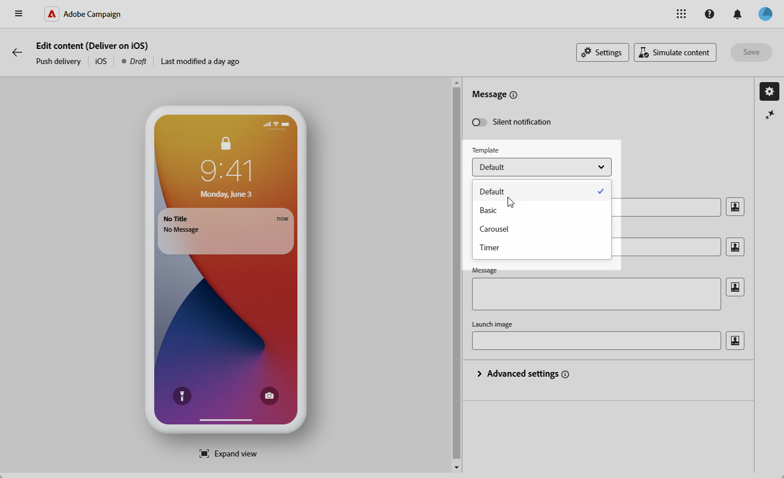
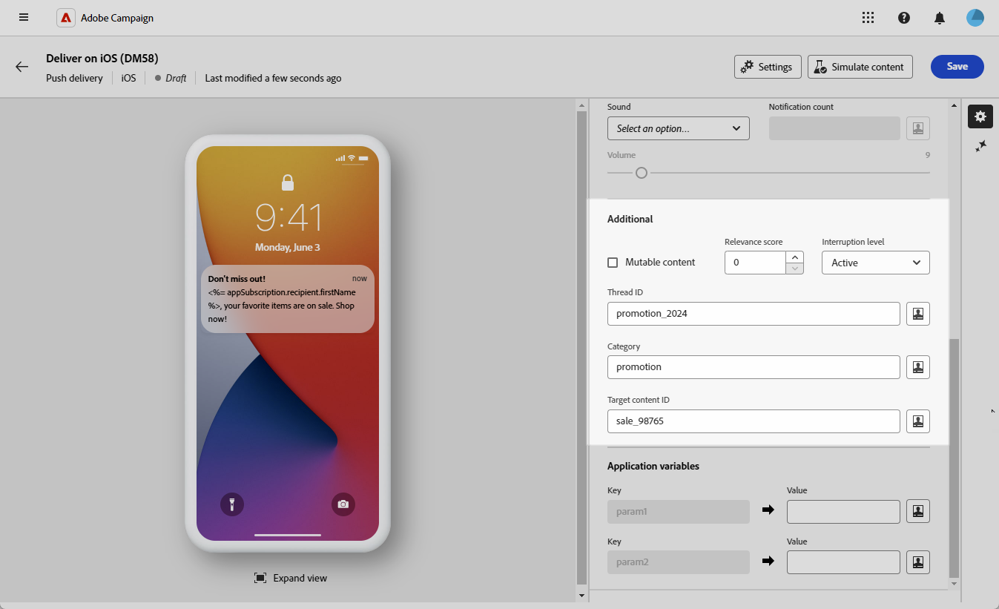
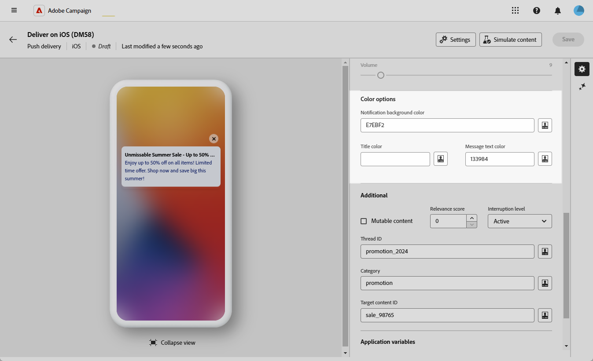
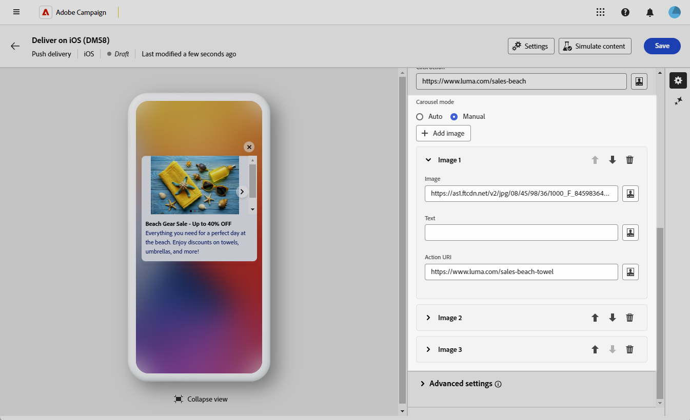

# Diseño de un envío push enriquecido para iOS {#rich-push}

>[!IMPORTANT]
>
>Antes de diseñar una notificación push enriquecida, primero debe configurar el conector V2. Consulte [esta página](https://experienceleague.adobe.com/en/docs/campaign-classic/using/sending-messages/sending-push-notifications/configure-the-mobile-app/configuring-the-mobile-application) para ver el procedimiento detallado.

## Definición del contenido de la notificación {#push-message}

Una vez creado el envío push, puede definir su contenido con una de las siguientes plantillas:

* **Predeterminado** le permite enviar notificaciones con un icono simple y una imagen adjunta.

* **Básico** puede incluir texto, imágenes y botones en las notificaciones.

* **Carrusel** le permite enviar notificaciones con texto e imágenes múltiples que los usuarios pueden deslizar.

* **Timer** incluye un temporizador de cuenta atrás activo en tus notificaciones.

Desplácese por las pestañas siguientes para obtener más información sobre cómo personalizar estas plantillas.

>[!BEGINTABS]

>[!TAB Predeterminado]

1. En la lista desplegable **[!UICONTROL Plantilla]**, seleccione **[!UICONTROL Predeterminada]**.

   

1. En el campo **[!UICONTROL Título]**, escriba la etiqueta del título que desea que aparezca en la lista de notificaciones disponibles en el centro de notificaciones.

   Este campo permite definir el valor del parámetro **title** de la carga útil de notificación de iOS.

1. Opcionalmente, agregue **[!UICONTROL Subtitle]**, que corresponde al parámetro **subtitle** de la carga útil de notificaciones de iOS.

1. Escriba el contenido del mensaje en el campo **[!UICONTROL Mensaje]**.

1. Utilice el Editor de expresiones para definir contenido, personalizar datos y agregar contenido dinámico. [Más información](../personalization/personalize.md)

   

1. Para personalizar aún más la notificación push, puede elegir una URL de **[!UICONTROL imagen de Launch]** para agregarla a la notificación push.

1. En el menú desplegable **[!UICONTROL Configuración avanzada]**, vaya a la pestaña **[!UICONTROL Sonido e insignia]** para personalizar configuraciones adicionales, como opciones de sonido e insignias para las notificaciones. [Más información](#sound-badge)

   

1. Para seguir personalizando, explora las **[!UICONTROL opciones adicionales]** disponibles para tus notificaciones push. [Más información](#push-advanced)

   

1. Desde el menú **[!UICONTROL Variables de aplicación]**, sus **[!UICONTROL Variables de aplicación]** se agregan automáticamente. Permiten definir el comportamiento de las notificaciones: por ejemplo, se puede configurar una pantalla específica de la aplicación que aparece cuando el usuario activa la notificación.

Una vez definido el contenido del mensaje, puede utilizar los suscriptores de prueba para previsualizar y probar el mensaje.

>[!TAB Básico]

1. En la lista desplegable **[!UICONTROL Plantilla]**, seleccione **[!UICONTROL Básico]**.

   

1. Para redactar el mensaje, escribe el texto en los campos **[!UICONTROL Título]**, **[!UICONTROL Título ampliado]**, **[!UICONTROL Mensaje]** y **[!UICONTROL Mensaje ampliado]**.

   El texto **[!UICONTROL Message]** aparece en la vista contraída mientras que el **[!UICONTROL mensaje expandido]** se muestra cuando se expande la notificación.

   

1. Utilice el Editor de expresiones para definir contenido, personalizar datos y agregar contenido dinámico. [Más información](../personalization/personalize.md)

1. Opcionalmente, agregue **[!UICONTROL Subtitle]**, que corresponde al parámetro **subtitle** de la carga útil de notificaciones de iOS.

1. Agregue la URL que define la **[!UICONTROL acción de clic]** asociada con un clic del usuario en su notificación. Determina el comportamiento cuando el usuario interactúa con la notificación, como abrir una pantalla específica o realizar una acción específica en la aplicación.

1. Para personalizar aún más la notificación push, puede elegir una URL de **[!UICONTROL imagen de Launch]** para agregarla a la notificación push.

1. En el menú desplegable **[!UICONTROL Configuración avanzada]**, vaya a la pestaña **[!UICONTROL Sonido e insignia]** para personalizar configuraciones adicionales, como opciones de sonido e insignias para las notificaciones. [Más información](#sound-badge)

   

1. En el menú **[!UICONTROL Opciones de color]**, escriba códigos de color hexadecimales para **[!UICONTROL Color de fondo de notificación]**, **[!UICONTROL Color de fondo de notificación]** y **[!UICONTROL Color de texto del mensaje]**.

   

1. Para seguir personalizando, explora las **[!UICONTROL opciones adicionales]** disponibles para tus notificaciones push. [Más información](#push-advanced)

1. Desde el menú **[!UICONTROL Variables de aplicación]**, sus **[!UICONTROL Variables de aplicación]** se agregan automáticamente. Permiten definir el comportamiento de las notificaciones: por ejemplo, se puede configurar una pantalla específica de la aplicación que aparece cuando el usuario activa la notificación.

Una vez definido el contenido del mensaje, puede utilizar los suscriptores de prueba para previsualizar y probar el mensaje.

>[!TAB Carrusel]

1. En la lista desplegable **[!UICONTROL Plantilla]**, seleccione **[!UICONTROL Carrusel]**.

   

1. Para redactar el mensaje, escribe el texto en los campos **[!UICONTROL Título]**, **[!UICONTROL Título ampliado]**, **[!UICONTROL Mensaje]** y **[!UICONTROL Mensaje ampliado]**.

   El texto **[!UICONTROL Message]** aparece en la vista contraída mientras que el **[!UICONTROL mensaje expandido]** se muestra cuando se expande la notificación.

   

1. Utilice el Editor de expresiones para definir contenido, personalizar datos y agregar contenido dinámico. [Más información](../personalization/personalize.md)

1. Opcionalmente, agregue **[!UICONTROL Subtitle]**, que corresponde al parámetro **subtitle** de la carga útil de notificaciones de iOS.

1. Agregue la URL que define la **[!UICONTROL acción de clic]** asociada con un clic del usuario en su notificación. Determina el comportamiento cuando el usuario interactúa con la notificación, como abrir una pantalla específica o realizar una acción específica en la aplicación.

1. Elija cómo funciona **[!UICONTROL Carrusel]**:

   * **[!UICONTROL Automático]**: recorre automáticamente las imágenes como diapositivas, realizando una transición a intervalos predefinidos.
   * **[!UICONTROL Manual]**: permite a los usuarios deslizarse manualmente entre las diapositivas para navegar por las imágenes.

1. Haga clic en **[!UICONTROL Agregar imagen]** e introduzca la URL **[!UICONTROL Imagen]**, el **[!UICONTROL Texto]** y el **[!UICONTROL URI de acción]**.

   Asegúrese de incluir un mínimo de tres imágenes y un máximo de cinco.

   

1. Controle el orden de las imágenes con las flechas Abajo y Arriba.

1. En el menú desplegable **[!UICONTROL Configuración avanzada]**, vaya a la pestaña **[!UICONTROL Sonido e insignia]** para personalizar configuraciones adicionales, como opciones de sonido e insignias para las notificaciones. [Más información](#sound-badge)

1. En el menú **[!UICONTROL Opciones de color]**, escriba códigos de color hexadecimales para **[!UICONTROL Color de fondo de notificación]**, **[!UICONTROL Color de fondo de notificación]** y **[!UICONTROL Color de texto del mensaje]**.

   

1. Para seguir personalizando, explora las **[!UICONTROL opciones adicionales]** disponibles para tus notificaciones push. [Más información](#push-advanced)

1. Desde el menú **[!UICONTROL Variables de aplicación]**, sus **[!UICONTROL Variables de aplicación]** se agregan automáticamente. Permiten definir el comportamiento de las notificaciones: por ejemplo, se puede configurar una pantalla específica de la aplicación que aparece cuando el usuario activa la notificación.

Una vez definido el contenido del mensaje, puede utilizar los suscriptores de prueba para previsualizar y probar el mensaje.

>[!TAB Temporizador]

1. En el menú desplegable **[!UICONTROL Tipo de notificación]**, seleccione **[!UICONTROL Temporizador]**.

   

1. Para redactar el mensaje, escribe el texto en los campos **[!UICONTROL Título]**, **[!UICONTROL Título ampliado]**, **[!UICONTROL Mensaje]** y **[!UICONTROL Mensaje ampliado]**.

   El texto **[!UICONTROL Message]** aparece en la vista contraída mientras que el **[!UICONTROL mensaje expandido]** se muestra cuando se expande la notificación.

   

1. Utilice el Editor de expresiones para definir contenido, personalizar datos y agregar contenido dinámico. [Más información](../personalization/personalize.md)

1. Opcionalmente, agregue **[!UICONTROL Subtitle]**, que corresponde al parámetro **subtitle** de la carga útil de notificaciones de iOS.

1. Agregue la URL que define la **[!UICONTROL acción de clic]** asociada con un clic del usuario en su notificación. Determina el comportamiento cuando el usuario interactúa con la notificación, como abrir una pantalla específica o realizar una acción específica en la aplicación.

1. Para personalizar aún más la notificación push, puede elegir una URL de **[!UICONTROL imagen de Launch]** para agregarla a la notificación push.

1. Establezca su **[!UICONTROL Duración del temporizador]** en segundos o la **[!UICONTROL Marca de tiempo de fin del temporizador]** en una marca de tiempo de época específica.

   

1. Escriba el texto y la imagen que se mostrarán después de que caduque el temporizador en los campos **[!UICONTROL Título alternativo]**, **[!UICONTROL Mensaje alternativo]** y **[!UICONTROL Imagen de inicio alternativa]**.

   

1. En el menú desplegable **[!UICONTROL Configuración avanzada]**, vaya a la pestaña **[!UICONTROL Sonido e insignia]** para personalizar configuraciones adicionales, como opciones de sonido e insignias para las notificaciones. [Más información](#sound-badge)

1. En el menú **[!UICONTROL Opciones de color]**, escriba códigos de color hexadecimales para **[!UICONTROL Color de fondo de notificación]**, **[!UICONTROL Color de fondo de notificación]** y **[!UICONTROL Color de texto del mensaje]**.

1. Para seguir personalizando, explora las **[!UICONTROL opciones adicionales]** disponibles para tus notificaciones push. [Más información](#push-advanced)

1. Desde el menú **[!UICONTROL Variables de aplicación]**, sus **[!UICONTROL Variables de aplicación]** se agregan automáticamente. Permiten definir el comportamiento de las notificaciones: por ejemplo, se puede configurar una pantalla específica de la aplicación que aparece cuando el usuario activa la notificación.

Una vez definido el contenido del mensaje, puede utilizar los suscriptores de prueba para previsualizar y probar el mensaje.

>[!ENDTABS]

## Configuración avanzada de notificación push {#push-advanced}

### Opciones de sonido e insignia {#sound-badge}

| Parámetro | Descripción |
|---------|---------|
| **[!UICONTROL Modo de alerta crítica]** | Active esta opción para agregar sonido a la notificación, incluso si el teléfono del usuario está activado o si el iPhone está silenciado. |
| **[!UICONTROL Limpiar insignia]** | Active estas opciones para actualizar el valor del distintivo. |
| **[!UICONTROL Sonido]** | Configure el sonido para que se reproduzca cuando el dispositivo reciba la notificación. |
| **[!UICONTROL Recuento de notificaciones]** | Establezca un número que se utilizará para mostrar directamente en el icono de la aplicación la cantidad de información nueva no leída. |
| **[!UICONTROL Volumen]** | Establece el volumen del sonido de 0 a 100. Los sonidos deben incluirse en la aplicación y definirse cuando se cree el servicio. |

### Opciones de color {#color}

| Parámetro | Descripción |
|---------|---------|
| **[!UICONTROL Color de fondo de notificación]** | Establece el color de tu fondo de notificación con tus códigos de color hexadecimales. |
| **[!UICONTROL Color del título]** | Establece el color de tu Título con tus códigos de color hexadecimales. |
| **[!UICONTROL Color del texto del mensaje]** | Establece el color de tu texto con tus códigos de color hexadecimales. |

### Opciones avanzadas {#notification-options}

| Parámetro | Descripción |
|---------|---------|
| **[!UICONTROL Contenido mutable]** | Active esta opción para permitir que la aplicación móvil descargue contenido multimedia. |
| **[!UICONTROL Puntuación de relevancia]** | Establezca una puntuación de relevancia de 0 a 100. El sistema utiliza esto para ordenar las notificaciones en el resumen de notificaciones. |
| **[!UICONTROL Nivel de interrupción]** | <ul><li>Activo: de forma predeterminada, el sistema presenta la notificación inmediatamente, ilumina la pantalla y puede reproducir un sonido. Las notificaciones no rompen los modos de Enfoque.</li><li>Pasivo: el sistema añade la notificación a la lista de notificaciones sin iluminar la pantalla ni reproducir un sonido. Las notificaciones no rompen los modos de Enfoque.</li><li> Con distinción de tiempo: el sistema presenta la notificación inmediatamente, enciende la pantalla, puede reproducir un sonido y atravesar los modos de Enfoque. Este nivel no requiere un permiso especial de Apple.</li><li>Esencial: el sistema presenta la notificación inmediatamente, enciende la pantalla y evita el interruptor silencioso o los modos de enfoque. Tenga en cuenta que este nivel requiere un permiso especial de Apple.</li></ul> |
| **[!UICONTROL Id. de subproceso]** | Establezca el identificador utilizado para agrupar las notificaciones relacionadas. |
| **[!UICONTROL Categoría]** | Establezca el nombre de su ID de categoría, que mostrará botones de acción. Estas notificaciones proporcionan al usuario una forma más rápida de realizar distintas tareas en respuesta a una notificación sin necesidad de abrir ni navegar por la aplicación. |
| **[!UICONTROL Id. de contenido de destino]** | Establezca un identificador utilizado para destinar la ventana de aplicación que se reenvía cuando se abre la notificación. |
