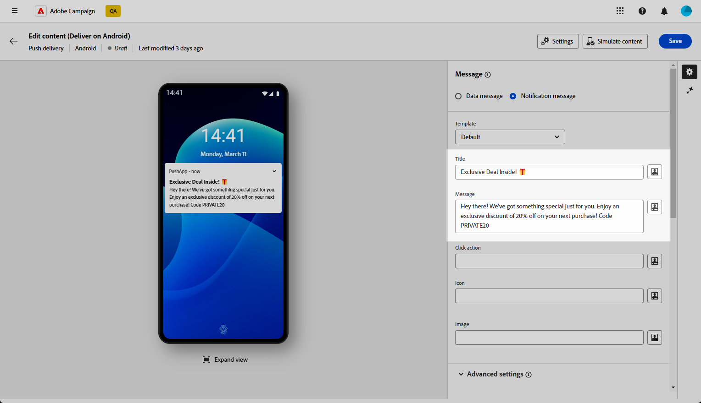

# Diseño de un envío push enriquecido para Android {#rich-push}

>[!CONTEXTUALHELP]
>id="acw_deliveries_push_remind_later"
>title="Botón Recordar más tarde"
>abstract="El **Recordar más tarde** proporciona la opción de programar un recordatorio. El campo Marca de tiempo requiere un valor que represente la época en segundos."

Con Firebase Cloud Messaging, puede elegir entre dos tipos de mensajes:

* El **[!UICONTROL Mensaje de datos]** es gestionado por la aplicación del cliente. Estos mensajes se envían directamente a la aplicación móvil, que genera y muestra una notificación de Android en el dispositivo. Los mensajes de datos solo contienen las variables de aplicación personalizadas.

* El **[!UICONTROL Mensaje de notificación]**, gestionado automáticamente por el SDK de FCM. FCM muestra automáticamente el mensaje en los dispositivos de los usuarios en nombre de la aplicación del cliente. Los mensajes de notificación contienen un conjunto predefinido de parámetros y opciones, pero pueden personalizarse aún más con las variables de aplicación personalizadas.

{zoomable=&quot;yes&quot;}

## Definición del contenido de la notificación {#push-message}

Una vez creado el envío push, puede definir su contenido. Hay tres plantillas disponibles:

* **Plantilla predeterminada** permite enviar notificaciones con un icono simple y una imagen adjunta.

* **Plantilla básica** Puede incluir texto, imágenes y botones en las notificaciones.

* **Plantilla de carrusel** le permite enviar notificaciones con texto e imágenes múltiples que los usuarios pueden deslizar.

Desplácese por las pestañas siguientes para obtener más información sobre cómo personalizar estas plantillas.

>[!BEGINTABS]

>[!TAB Plantilla predeterminada]

1. Desde el **[!UICONTROL Plantilla]** menú desplegable, seleccione **[!UICONTROL Predeterminado]**.

   

1. Para redactar el mensaje, escriba el texto en la **[!UICONTROL Título]** y **[!UICONTROL Mensaje]** campos.

   

1. Utilice el Editor de expresiones para definir contenido, personalizar datos y agregar contenido dinámico. [Más información](../personalization/personalize.md)

1. Defina el **[!UICONTROL Acción de clic]** asociado con un clic del usuario en su notificación. Determina el comportamiento cuando el usuario interactúa con la notificación, como abrir una pantalla específica o realizar una acción específica en la aplicación.

1. Para personalizar aún más la notificación push, puede elegir una **[!UICONTROL Imagen]** URL para añadir a la notificación push y al **[!UICONTROL Icono]** para mostrarlos en los dispositivos de sus perfiles.

   

1. Configure las variables **[!UICONTROL Configuración avanzada]** de la notificación push. [Más información](#push-advanced)

Una vez definido el contenido del mensaje, puede utilizar los suscriptores de prueba para previsualizar y probar el mensaje.

>[!TAB Plantilla básica]

1. Desde el **[!UICONTROL Plantilla]** menú desplegable, seleccione **[!UICONTROL Básico]**.

   

1. Para redactar el mensaje, escriba el texto en la **[!UICONTROL Título]**, **[!UICONTROL Mensaje]** y **[!UICONTROL Mensaje ampliado]** campos.

   El **[!UICONTROL Mensaje]** el texto aparece en la vista contraída mientras que la variable **[!UICONTROL Mensaje ampliado]** se muestra cuando se expande la notificación.

   

1. Utilice el Editor de expresiones para definir contenido, personalizar datos y agregar contenido dinámico. [Más información](../personalization/personalize.md)

1. Añada la dirección URL que define la variable **[!UICONTROL Acción de clic]** asociado con un clic del usuario en su notificación. Determina el comportamiento cuando el usuario interactúa con la notificación, como abrir una pantalla específica o realizar una acción específica en la aplicación.

1. Seleccione el **[!UICONTROL Tipo de vínculo]** de la URL agregada al **[!UICONTROL Acción de clic]** campo:

   * **[!UICONTROL URL web]**: las URL web dirigen a los usuarios al contenido en línea. Al hacer clic en, se solicita al explorador web predeterminado del dispositivo que abra y navegue hasta la dirección URL designada.

   * **[!UICONTROL Vínculo profundo]**: los vínculos profundos son direcciones URL que guían a los usuarios a secciones específicas de una aplicación aunque esta esté cerrada. Al hacer clic en él, puede aparecer un cuadro de diálogo que permite a los usuarios elegir entre varias aplicaciones capaces de gestionar el vínculo.

   * **[!UICONTROL Abrir aplicación]**: Las direcciones URL de aplicaciones abiertas le permiten conectarse directamente al contenido de una aplicación. Permite a la aplicación establecerse como controlador predeterminado para un tipo específico de vínculo, omitiendo el cuadro de diálogo de desambiguación.

   Para obtener más información sobre cómo gestionar vínculos de aplicaciones Android, consulte [Documentación para desarrolladores de Android](https://developer.android.com/training/app-links).

   

1. Para personalizar aún más la notificación push, puede elegir una **[!UICONTROL Imagen]** URL para añadir a la notificación push y al **[!UICONTROL Icono]** para mostrarlos en los dispositivos de sus perfiles.

1. Clic **[!UICONTROL Botón Añadir]** y rellene los campos siguientes:

   * **[!UICONTROL Etiqueta]**: texto mostrado en el botón.
   * **[!UICONTROL URI de vínculo]**: especifique el URI que se ejecutará al hacer clic en el botón.
   * **[!UICONTROL Tipo de vínculo]**: Tipo de vínculo **[!UICONTROL URL web]**, **[!UICONTROL Vínculo profundo]**, o **[!UICONTROL Abrir aplicación]**.

   Tiene la opción de incluir hasta tres botones en la notificación push. Si opta por el **[!UICONTROL Botón Recordar más tarde]**, solo puede incluir un máximo de dos botones.

   

1. Clic **[!UICONTROL Agregar recordatorio más tarde]** para añadir una opción Recordármelo más tarde a su notificación de inserción. Introduzca una **[!UICONTROL Etiqueta]** y **[!UICONTROL Marca de tiempo]**.

   El campo Marca de tiempo espera un valor que represente la época en segundos.

   

1. Configure las variables **[!UICONTROL Configuración avanzada]** de la notificación push. [Más información](#push-advanced)

Una vez definido el contenido del mensaje, puede utilizar los suscriptores de prueba para previsualizar y probar el mensaje.

>[!TAB Plantilla de carrusel]

1. Desde el **[!UICONTROL Plantilla]** menú desplegable, seleccione **[!UICONTROL Carrusel]**.

   

1. Para redactar el mensaje, escriba el texto en la **[!UICONTROL Título]**, **[!UICONTROL Mensaje]** y **[!UICONTROL Mensaje ampliado]** campos.

   El **[!UICONTROL Mensaje]** el texto aparece en la vista contraída mientras que la variable **[!UICONTROL Mensaje ampliado]** se muestra cuando se expande la notificación.

   

1. Utilice el Editor de expresiones para definir contenido, personalizar datos y agregar contenido dinámico. [Más información](../personalization/personalize.md)

1. Añada la dirección URL que define la variable **[!UICONTROL Acción de clic]** asociado con un clic del usuario en su notificación. Determina el comportamiento cuando el usuario interactúa con la notificación, como abrir una pantalla específica o realizar una acción específica en la aplicación.

1. Seleccione el **[!UICONTROL Tipo de vínculo]** de la URL agregada al **[!UICONTROL Acción de clic]** campo:

   * **[!UICONTROL URL web]**L: Las direcciones URL web dirigen a los usuarios al contenido en línea. Al hacer clic en, se solicita al explorador web predeterminado del dispositivo que abra y navegue hasta la dirección URL designada.

   * **[!UICONTROL Vínculo profundo]**: los vínculos profundos son direcciones URL que guían a los usuarios a secciones específicas de una aplicación aunque esta esté cerrada. Al hacer clic en él, puede aparecer un cuadro de diálogo que permite a los usuarios elegir entre varias aplicaciones capaces de gestionar el vínculo.

   * **[!UICONTROL Abrir aplicación]**: Las direcciones URL de aplicaciones abiertas le permiten conectarse directamente al contenido de una aplicación. Permite a la aplicación establecerse como controlador predeterminado para un tipo específico de vínculo, omitiendo el cuadro de diálogo de desambiguación.

   Para obtener más información sobre cómo gestionar vínculos de aplicaciones Android, consulte [Documentación para desarrolladores de Android](https://developer.android.com/training/app-links).

   

1. Para personalizar aún más la notificación push, puede elegir la **[!UICONTROL Icono]** para mostrarlos en los dispositivos de sus perfiles.

1. Elija cómo se usa el **[!UICONTROL carrusel]** funciona:

   * **[!UICONTROL Automático]**: recorre automáticamente las imágenes como diapositivas, en transición a intervalos predefinidos.
   * **[!UICONTROL Manual]**: permite a los usuarios deslizar manualmente entre diapositivas para navegar por las imágenes.

     Habilite la **[!UICONTROL Filmstrip]** para incluir vistas previas de las imágenes anterior y siguiente junto con la diapositiva principal.

1. Clic **[!UICONTROL Añadir imagen]** e introduzca la dirección URL y el texto de la imagen.

   Asegúrese de incluir un mínimo de tres imágenes y un máximo de cinco.

   

1. Controle el orden de las imágenes con las flechas Abajo y Arriba.

1. Configure las variables **[!UICONTROL Configuración avanzada]** de la notificación push. [Más información](#push-advanced)

Una vez definido el contenido del mensaje, puede utilizar los suscriptores de prueba para previsualizar y probar el mensaje.

>[!ENDTABS]

## Configuración avanzada de notificación push {#push-advanced}

{zoomable=&quot;yes&quot;}

| Parámetro | Descripción |
|---------|---------|
| **[!UICONTROL Color del icono]** | Establece el color de tu icono con tus códigos de color hexadecimales. |
| **[!UICONTROL Color del título]** | Establece el color de tu Título con tus códigos de color hexadecimales. |
| **[!UICONTROL Color del texto del mensaje]** | Defina el color del texto del mensaje con sus códigos de color hexadecimales. |
| **[!UICONTROL Color de fondo de notificación]** | Establece el color de tu fondo de notificación con tus códigos de color hexadecimales. |
| **[!UICONTROL Sonido]** | Configure el sonido para que se reproduzca cuando el dispositivo reciba la notificación. |
| **[!UICONTROL Recuento de notificaciones]** | Configure el número de información nueva no leída que se mostrará directamente en el icono de la aplicación. Esto permite al usuario ver rápidamente el número de notificaciones pendientes. |
| **[!UICONTROL ID de canal]** | Establezca el ID de canal de la notificación. La aplicación debe crear un canal con este ID de canal antes de recibir cualquier notificación. |
| **[!UICONTROL Etiqueta]** | Establezca un identificador utilizado para reemplazar las notificaciones existentes en el cajón de notificaciones. Esto ayuda a evitar la acumulación de varias notificaciones y garantiza que solo se muestre la notificación relevante más reciente. |
| **[!UICONTROL Prioridad]** | Defina el nivel de prioridad de la notificación, que puede ser predeterminado, mínimo, bajo o alto. El nivel de prioridad determina la importancia y la urgencia de la notificación, lo que influye en cómo se muestra y si puede omitir determinada configuración del sistema. Para más información, consulte la [documentación de FCM](https://firebase.google.com/docs/reference/fcm/rest/v1/projects.messages#notificationpriority). |
| **[!UICONTROL Visibilidad]** | Defina el nivel de visibilidad de la notificación, que puede ser pública, privada o secreta. El nivel de visibilidad determina la cantidad de contenido de la notificación que se muestra en la pantalla de bloqueo y en otras áreas confidenciales. Para obtener más información, consulte la [Documentación de FCM](https://firebase.google.com/docs/reference/fcm/rest/v1/projects.messages#visibility). |
| **[!UICONTROL Notificación fija]** | Cuando se activa, la notificación permanece visible incluso después de que el usuario haga clic en ella.  Si se desactiva, la notificación se descarta automáticamente cuando el usuario interactúa con ella. El comportamiento adhesivo permite que las notificaciones importantes persistan en la pantalla durante períodos más largos. |
| **[!UICONTROL Variables de aplicación]** | Permite definir el comportamiento de las notificaciones. Estas variables son totalmente personalizables y se incluyen, ya que una parte de la carga útil de mensajes se envía al dispositivo móvil. |
