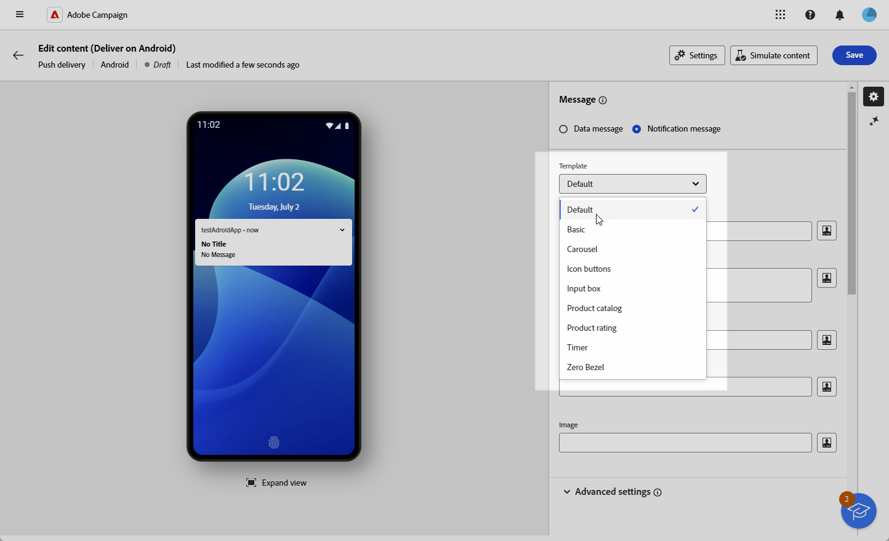
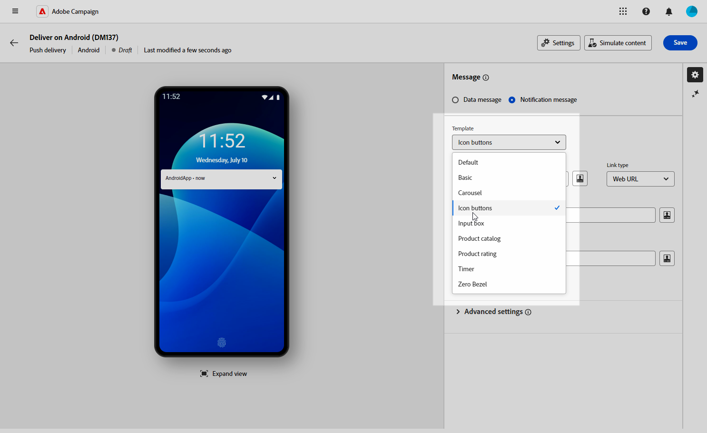
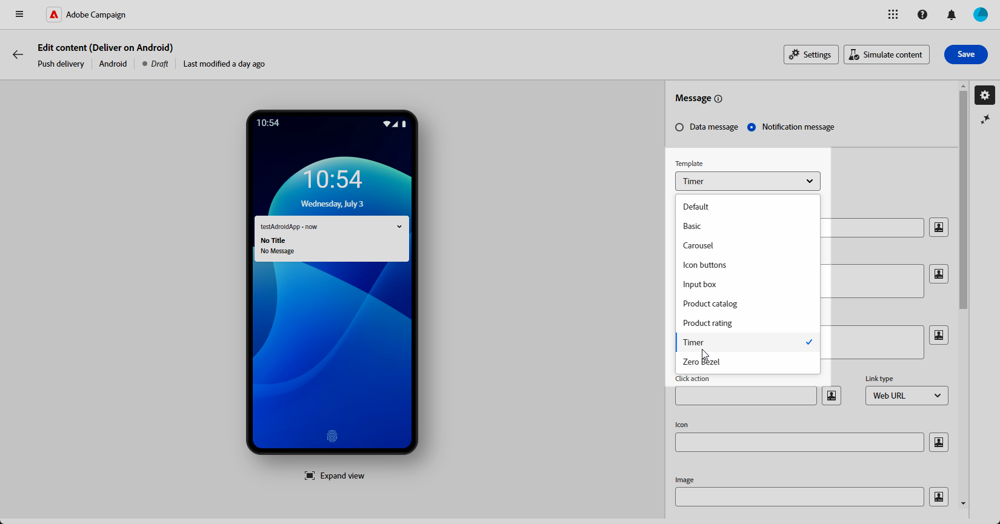
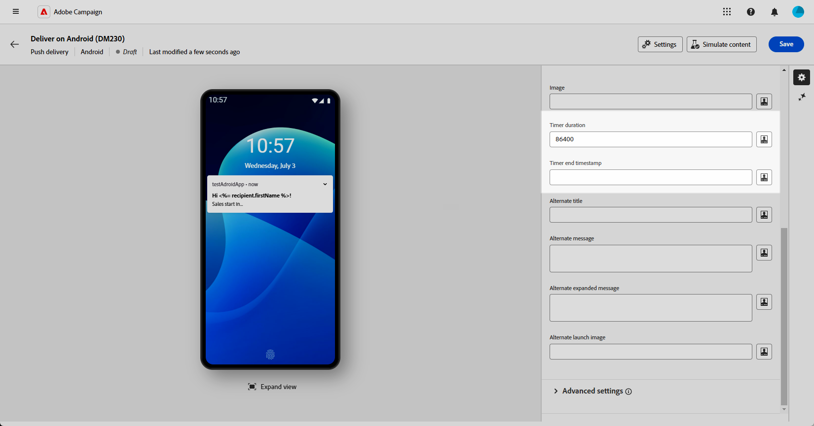

# Diseño de un envío push enriquecido para Android {#rich-push}

>[!CONTEXTUALHELP]
>id="acw_deliveries_push_remind_later"
>title="Botón Recordar más tarde"
>abstract="El botón **Recordar más tarde** proporciona la opción de programar un recordatorio. El campo Marca de tiempo requiere un valor que represente la época en segundos."

>[!IMPORTANT]
>
>* Esta capacidad requiere una actualización a la versión 8.6.3 de Campaign<!--or v8.7.2-->. Obtenga más información en las [Notas de la versión](https://experienceleague.adobe.com/es/docs/campaign/campaign-v8/releases/release-notes){target="_blank"} de la consola del cliente de la versión 8 de Campaign.
>
>* Antes de diseñar una notificación push enriquecida, primero debe configurar el conector V2. Consulte [esta página](https://experienceleague.adobe.com/en/docs/campaign-classic/using/sending-messages/sending-push-notifications/configure-the-mobile-app/configuring-the-mobile-application-android#configuring-external-account-android){target="_blank"} para ver el procedimiento detallado.

Con Firebase Cloud Messaging, puede elegir entre dos tipos de mensajes:

* La aplicación cliente administra el **[!UICONTROL mensaje de datos]**. Estos mensajes se envían directamente a la aplicación móvil, que genera y muestra una notificación de Android en el dispositivo. Los mensajes de datos solo contienen las variables de aplicación personalizadas.

* El **[!UICONTROL mensaje de notificación]**, gestionado automáticamente por FCM SDK. FCM muestra automáticamente el mensaje en los dispositivos de los usuarios en nombre de la aplicación del cliente. Los mensajes de notificación contienen un conjunto predefinido de parámetros y opciones, pero pueden personalizarse aún más con las variables de aplicación personalizadas.

{zoomable="yes"}

## Definición del contenido de la notificación {#push-message}

Una vez creado el envío push, puede definir su contenido con una de las siguientes plantillas:

* **Predeterminado** le permite enviar notificaciones con un icono simple y una imagen adjunta.

* **Básico** puede incluir texto, imágenes y botones en las notificaciones.

* **Carrusel** le permite enviar notificaciones con texto e imágenes múltiples que los usuarios pueden deslizar.

* **Botones de icono** le permite enviar notificaciones con un icono y una imagen correspondiente.

* **Cuadro de entrada** recopila datos proporcionados por el usuario y comentarios directamente a través de la notificación.

* **El catálogo de productos** muestra una variedad de imágenes de productos.

* **Clasificación del producto** permite que los usuarios proporcionen comentarios y valoren los productos.

* **Timer** incluye un temporizador de cuenta atrás activo en tus notificaciones.

* **Bisel cero** usa toda la superficie de fondo para una imagen, con texto superpuesto sin problemas.

Desplácese por las pestañas siguientes para obtener más información sobre cómo personalizar estas plantillas.

>[!BEGINTABS]

>[!TAB Predeterminado]

1. En la lista desplegable **[!UICONTROL Plantilla]**, seleccione **[!UICONTROL Predeterminada]**.

   

1. Para redactar el mensaje, escribe el texto en los campos **[!UICONTROL Título]** y **[!UICONTROL Mensaje]**.

   

1. Utilice el Editor de expresiones para definir contenido, personalizar datos y agregar contenido dinámico. [Más información](../personalization/personalize.md)

1. Defina la **[!UICONTROL acción de clic]** asociada con un clic del usuario en su notificación. Determina el comportamiento cuando el usuario interactúa con la notificación, como abrir una pantalla específica o realizar una acción específica en la aplicación.

1. Para personalizar aún más la notificación push, puede elegir una URL de **[!UICONTROL Image]** para agregarla a la notificación push y el **[!UICONTROL icono]** de la notificación para mostrarla en los dispositivos de sus perfiles.

   

1. Configure **[!UICONTROL Advanced settings]** de su notificación push. [Más información](#push-advanced)

Una vez definido el contenido del mensaje, puede utilizar los suscriptores de prueba para previsualizar y probar el mensaje.

>[!TAB Básico]

1. En la lista desplegable **[!UICONTROL Plantilla]**, seleccione **[!UICONTROL Básico]**.

   

1. Para redactar el mensaje, escribe el texto en los campos **[!UICONTROL Título]**, **[!UICONTROL Mensaje]** y **[!UICONTROL Mensaje ampliado]**.

   El texto **[!UICONTROL Message]** aparece en la vista contraída mientras que el **[!UICONTROL mensaje expandido]** se muestra cuando se expande la notificación.

   

1. Utilice el Editor de expresiones para definir contenido, personalizar datos y agregar contenido dinámico. [Más información](../personalization/personalize.md)

1. Agregue la URL que define la **[!UICONTROL acción de clic]** asociada con un clic del usuario en su notificación. Determina el comportamiento cuando el usuario interactúa con la notificación, como abrir una pantalla específica o realizar una acción específica en la aplicación.

1. Seleccione el **[!UICONTROL tipo de vínculo]** de la dirección URL que agregó al campo **[!UICONTROL Acción de clic]**:

   * **[!UICONTROL URL web]**: Las URL web dirigen a los usuarios al contenido en línea. Al hacer clic en, se solicita al explorador web predeterminado del dispositivo que abra y navegue hasta la dirección URL designada.

   * **[!UICONTROL Vínculo profundo]**: Los vínculos profundos son direcciones URL que guían a los usuarios a secciones específicas de una aplicación, incluso si esta está cerrada. Al hacer clic en él, puede aparecer un cuadro de diálogo que permite a los usuarios elegir entre varias aplicaciones capaces de gestionar el vínculo.

   * **[!UICONTROL Abrir aplicación]**: Las direcciones URL de Abrir aplicación permiten conectarse directamente al contenido de una aplicación. Permite a la aplicación establecerse como controlador predeterminado para un tipo específico de vínculo, omitiendo el cuadro de diálogo de desambiguación.

   Para obtener más información sobre cómo administrar los vínculos de la aplicación de Android, consulte [Documentación para desarrolladores de Android](https://developer.android.com/training/app-links).

   

1. Para personalizar aún más la notificación push, puede elegir una URL de **[!UICONTROL Image]** para agregarla a la notificación push y el **[!UICONTROL icono]** de la notificación para mostrarla en los dispositivos de sus perfiles.

1. Haga clic en **[!UICONTROL Agregar botón]** y rellene los campos siguientes:

   * **[!UICONTROL Etiqueta]**: texto mostrado en el botón.
   * **[!UICONTROL URI de vínculo]**: especifique el URI que se ejecutará al hacer clic en el botón.
   * **[!UICONTROL Tipo de vínculo]**: el tipo de vínculo es **[!UICONTROL URL web]**, **[!UICONTROL Vínculo profundo]** o **[!UICONTROL Abrir aplicación]**.

   Tiene la opción de incluir hasta tres botones en la notificación push. Si opta por el botón **[!UICONTROL Recordar más tarde]**, solo puede incluir un máximo de dos botones.

   

1. Haga clic en **[!UICONTROL Agregar recordatorio más tarde]** para agregar una opción Recordármelo más tarde a la notificación de inserción. Escriba una **[!UICONTROL Etiqueta]** y **[!UICONTROL Marca de tiempo]**.

   El campo Marca de tiempo espera un valor que represente la época en segundos.

   

1. Configure **[!UICONTROL Advanced settings]** de su notificación push. [Más información](#push-advanced)

Una vez definido el contenido del mensaje, puede utilizar los suscriptores de prueba para previsualizar y probar el mensaje.

>[!TAB Carrusel]

1. En la lista desplegable **[!UICONTROL Plantilla]**, seleccione **[!UICONTROL Carrusel]**.

   

1. Para redactar el mensaje, escribe el texto en los campos **[!UICONTROL Título]**, **[!UICONTROL Mensaje]** y **[!UICONTROL Mensaje ampliado]**.

   El texto **[!UICONTROL Message]** aparece en la vista contraída mientras que el **[!UICONTROL mensaje expandido]** se muestra cuando se expande la notificación.

   

1. Utilice el Editor de expresiones para definir contenido, personalizar datos y agregar contenido dinámico. [Más información](../personalization/personalize.md)

1. Agregue la URL que define la **[!UICONTROL acción de clic]** asociada con un clic del usuario en su notificación. Determina el comportamiento cuando el usuario interactúa con la notificación, como abrir una pantalla específica o realizar una acción específica en la aplicación.

1. Seleccione el **[!UICONTROL tipo de vínculo]** de la dirección URL que agregó al campo **[!UICONTROL Acción de clic]**:

   * **[!UICONTROL URL web]**&#x200B;L: Las URL web dirigen a los usuarios al contenido en línea. Al hacer clic en, se solicita al explorador web predeterminado del dispositivo que abra y navegue hasta la dirección URL designada.

   * **[!UICONTROL Vínculo profundo]**: Los vínculos profundos son direcciones URL que guían a los usuarios a secciones específicas de una aplicación, incluso si esta está cerrada. Al hacer clic en él, puede aparecer un cuadro de diálogo que permite a los usuarios elegir entre varias aplicaciones capaces de gestionar el vínculo.

   * **[!UICONTROL Abrir aplicación]**: Las direcciones URL de Abrir aplicación permiten conectarse directamente al contenido de una aplicación. Permite a la aplicación establecerse como controlador predeterminado para un tipo específico de vínculo, omitiendo el cuadro de diálogo de desambiguación.

   Para obtener más información sobre cómo administrar los vínculos de la aplicación de Android, consulte [Documentación para desarrolladores de Android](https://developer.android.com/training/app-links).

   

1. Para personalizar aún más la notificación push, puede elegir el **[!UICONTROL icono]** de la notificación para que se muestre en los dispositivos de sus perfiles.

1. Elija cómo funciona **[!UICONTROL Carrusel]**:

   * **[!UICONTROL Automático]**: recorre automáticamente las imágenes como diapositivas, realizando una transición a intervalos predefinidos.
   * **[!UICONTROL Manual]**: permite a los usuarios deslizarse manualmente entre las diapositivas para navegar por las imágenes.

     Habilite la opción **[!UICONTROL Filmstrip]** para incluir vistas previas de las imágenes anterior y siguiente junto a la diapositiva principal.

1. Haz clic en **[!UICONTROL Agregar imagen]** e introduce la URL y el texto de la imagen.

   Asegúrese de incluir un mínimo de tres imágenes y un máximo de cinco.

   

1. Controle el orden de las imágenes con las flechas Abajo y Arriba.

1. Configure **[!UICONTROL Advanced settings]** de su notificación push. [Más información](#push-advanced)

Una vez definido el contenido del mensaje, puede utilizar los suscriptores de prueba para previsualizar y probar el mensaje.

>[!TAB Botones de icono]

1. En la lista desplegable **[!UICONTROL Plantilla]**, seleccione **[!UICONTROL botones de icono]**.

   

1. Agregue la URL que define la **[!UICONTROL acción de clic]** asociada con un clic del usuario en su notificación. Determina el comportamiento cuando el usuario interactúa con la notificación, como abrir una pantalla específica o realizar una acción específica en la aplicación.

1. Seleccione el **[!UICONTROL tipo de vínculo]** de la dirección URL que agregó al campo **[!UICONTROL Acción de clic]**:

   * **[!UICONTROL URL web]**: Las URL web dirigen a los usuarios al contenido en línea. Al hacer clic en, se solicita al explorador web predeterminado del dispositivo que abra y navegue hasta la dirección URL designada.

   * **[!UICONTROL Vínculo profundo]**: Los vínculos profundos son direcciones URL que guían a los usuarios a secciones específicas de una aplicación, incluso si esta está cerrada. Al hacer clic en él, puede aparecer un cuadro de diálogo que permite a los usuarios elegir entre varias aplicaciones capaces de gestionar el vínculo.

   * **[!UICONTROL Abrir aplicación]**: Las direcciones URL de Abrir aplicación permiten conectarse directamente al contenido de una aplicación. Permite a la aplicación establecerse como controlador predeterminado para un tipo específico de vínculo, omitiendo el cuadro de diálogo de desambiguación.

   Para obtener más información sobre cómo administrar los vínculos de la aplicación de Android, consulte [Documentación para desarrolladores de Android](https://developer.android.com/training/app-links).

   

1. Para personalizar aún más la notificación push, puede elegir el **[!UICONTROL icono]** de la notificación para que se muestre en los dispositivos de sus perfiles.

1. Agrega la URL de tu **[!UICONTROL imagen del botón Cancelar]**.

1. Haga clic en **[!UICONTROL Agregar icono]** e introduzca su **URL de imagen**, **[!UICONTROL URI de vínculo]** y elija su **[!UICONTROL tipo de vínculo]**.

   Asegúrese de incluir un mínimo de tres iconos y un máximo de cinco.

   

1. Controle el orden de las imágenes con las flechas Abajo y Arriba.

1. Configure **[!UICONTROL Advanced settings]** de su notificación push. [Más información](#push-advanced)

   

Una vez definido el contenido del mensaje, puede utilizar los suscriptores de prueba para previsualizar y probar el mensaje.

>[!TAB Cuadro de entrada]

1. En la lista desplegable **[!UICONTROL Tipo de notificación]**, seleccione **[!UICONTROL Cuadro de entrada]**.

   

1. Para redactar el mensaje, escribe el texto en los campos **[!UICONTROL Título]**, **[!UICONTROL Mensaje]** y **[!UICONTROL Mensaje ampliado]**.

   El texto **[!UICONTROL Message]** aparece en la vista contraída mientras que el **[!UICONTROL mensaje expandido]** se muestra cuando se expande la notificación.

   

1. Utilice campos de personalización dinámicos para definir contenido, personalizar datos y agregar contenido dinámico. [Más información](../personalization/personalize.md)

1. Agregue la URL que define la **[!UICONTROL acción de clic]** asociada con un clic del usuario en su notificación. Determina el comportamiento cuando el usuario interactúa con la notificación, como abrir una pantalla específica o realizar una acción específica en la aplicación.

1. Seleccione el **[!UICONTROL tipo de vínculo]** de la dirección URL que agregó al campo **[!UICONTROL Acción de clic]**:

   * **[!UICONTROL URL web]**: Las URL web dirigen a los usuarios al contenido en línea. Al hacer clic en, se solicita al explorador web predeterminado del dispositivo que abra y navegue hasta la dirección URL designada.

   * **[!UICONTROL Vínculo profundo]**: Los vínculos profundos son direcciones URL que guían a los usuarios a secciones específicas de una aplicación, incluso si esta está cerrada. Al hacer clic en él, puede aparecer un cuadro de diálogo que permite a los usuarios elegir entre varias aplicaciones capaces de gestionar el vínculo.

   * **[!UICONTROL Abrir aplicación]**: Las direcciones URL de Abrir aplicación permiten conectarse directamente al contenido de una aplicación. Permite a la aplicación establecerse como controlador predeterminado para un tipo específico de vínculo, omitiendo el cuadro de diálogo de desambiguación.

   Para obtener más información sobre cómo administrar los vínculos de la aplicación de Android, consulte [Documentación para desarrolladores de Android](https://developer.android.com/training/app-links).

1. Para personalizar aún más la notificación push, puede elegir una URL de **[!UICONTROL Image]** para agregarla a la notificación push y el **[!UICONTROL icono]** de la notificación para mostrarla en los dispositivos de sus perfiles.

1. Complete las siguientes opciones para su **cuadro de entrada**:

   * **[!UICONTROL Nombre del receptor de entrada]**: escriba el nombre o identificador del receptor de la entrada.
   * **[!UICONTROL Texto de entrada]**: escriba el texto para el **cuadro de entrada**.
   * **[!UICONTROL Texto de comentarios]**: escriba el texto que se mostrará tras la respuesta.
   * **[!UICONTROL Imagen de comentarios]**: agrega la dirección URL de la imagen mostrada después de una respuesta.

   

1. Configure **[!UICONTROL Advanced settings]** de su notificación push. [Más información](#push-advanced)

Una vez definido el contenido del mensaje, puede utilizar los suscriptores de prueba para previsualizar y probar el mensaje.

>[!TAB Catálogo de productos]

1. En el menú desplegable **[!UICONTROL Tipo de notificación]**, seleccione **[!UICONTROL Catálogo de productos]**.

   

1. Para redactar el mensaje, escribe el texto en los campos **[!UICONTROL Título]** y **[!UICONTROL Mensaje]**.

   

1. Utilice campos de personalización dinámicos para definir contenido, personalizar datos y agregar contenido dinámico. [Más información](../personalization/personalize.md)

1. Agregue la URL que define la **[!UICONTROL acción de clic]** asociada con un clic del usuario en su notificación. Determina el comportamiento cuando el usuario interactúa con la notificación, como abrir una pantalla específica o realizar una acción específica en la aplicación.

1. Seleccione el **[!UICONTROL tipo de vínculo]** de la dirección URL que agregó al campo **[!UICONTROL Acción de clic]**:

   * **[!UICONTROL URL web]**: Las URL web dirigen a los usuarios al contenido en línea. Al hacer clic en, se solicita al explorador web predeterminado del dispositivo que abra y navegue hasta la dirección URL designada.

   * **[!UICONTROL Vínculo profundo]**: Los vínculos profundos son direcciones URL que guían a los usuarios a secciones específicas de una aplicación, incluso si esta está cerrada. Al hacer clic en él, puede aparecer un cuadro de diálogo que permite a los usuarios elegir entre varias aplicaciones capaces de gestionar el vínculo.

   * **[!UICONTROL Abrir aplicación]**: Las direcciones URL de Abrir aplicación permiten conectarse directamente al contenido de una aplicación. Permite a la aplicación establecerse como controlador predeterminado para un tipo específico de vínculo, omitiendo el cuadro de diálogo de desambiguación.

   Para obtener más información sobre cómo administrar los vínculos de la aplicación de Android, consulte [Documentación para desarrolladores de Android](https://developer.android.com/training/app-links).

1. Para personalizar aún más la notificación push, puede elegir el **[!UICONTROL icono]** de la notificación para que se muestre en los dispositivos de sus perfiles.

1. Escriba su **texto para hacer clic en la acción** y **imagen**.

1. Elija su **[!UICONTROL tipo de presentación]** entre Horizontal o Vertical.

1. Rellene la información de **[!UICONTROL elementos del catálogo]**.

   Asegúrese de incluir un mínimo de tres elementos y un máximo de cinco.

   

1. Controle el orden de las imágenes con las flechas Abajo y Arriba.

1. Configure **[!UICONTROL Advanced settings]** de su notificación push. [Más información](#push-advanced)

Una vez definido el contenido del mensaje, puede utilizar los suscriptores de prueba para previsualizar y probar el mensaje.

>[!TAB Clasificación del producto]

1. En el menú desplegable **[!UICONTROL Tipo de notificación]**, seleccione **[!UICONTROL Clasificación del producto]**.

   

1. Para redactar el mensaje, escribe el texto en los campos **[!UICONTROL Título]**, **[!UICONTROL Mensaje]** y **[!UICONTROL Mensaje ampliado]**.

   El texto **[!UICONTROL Message]** aparece en la vista contraída mientras que el **[!UICONTROL mensaje expandido]** se muestra cuando se expande la notificación.

   

1. Agregue la URL que define la **[!UICONTROL acción de clic]** asociada con un clic del usuario en su notificación. Determina el comportamiento cuando el usuario interactúa con la notificación, como abrir una pantalla específica o realizar una acción específica en la aplicación.

1. Seleccione el **[!UICONTROL tipo de vínculo]** de la dirección URL que agregó al campo **[!UICONTROL Acción de clic]**:

   * **[!UICONTROL URL web]**: Las URL web dirigen a los usuarios al contenido en línea. Al hacer clic en, se solicita al explorador web predeterminado del dispositivo que abra y navegue hasta la dirección URL designada.

   * **[!UICONTROL Vínculo profundo]**: Los vínculos profundos son direcciones URL que guían a los usuarios a secciones específicas de una aplicación, incluso si esta está cerrada. Al hacer clic en él, puede aparecer un cuadro de diálogo que permite a los usuarios elegir entre varias aplicaciones capaces de gestionar el vínculo.

   * **[!UICONTROL Abrir aplicación]**: Las direcciones URL de Abrir aplicación permiten conectarse directamente al contenido de una aplicación. Permite a la aplicación establecerse como controlador predeterminado para un tipo específico de vínculo, omitiendo el cuadro de diálogo de desambiguación.

   Para obtener más información sobre cómo administrar los vínculos de la aplicación de Android, consulte [Documentación para desarrolladores de Android](https://developer.android.com/training/app-links).

1. Para personalizar aún más la notificación push, puede elegir una URL de **[!UICONTROL Image]** para agregarla a la notificación push y el **[!UICONTROL icono]** de la notificación para mostrarla en los dispositivos de sus perfiles.

1. Agregue su **[!UICONTROL icono de clasificación en estado no seleccionado]** y el **[!UICONTROL icono de clasificación en estado seleccionado]** direcciones URL.

   

1. Haga clic en **[!UICONTROL Agregar clasificación]** e introduzca su **[!UICONTROL URI de vínculo]** y **[!UICONTROL tipo de vínculo]**.

   Asegúrese de incluir un mínimo de tres clasificaciones y un máximo de cinco clasificaciones.

   

1. Controle el orden de las imágenes con las flechas Abajo y Arriba.

1. Configure **[!UICONTROL Advanced settings]** de su notificación push. [Más información](#push-advanced)

Una vez definido el contenido del mensaje, puede utilizar los suscriptores de prueba para previsualizar y probar el mensaje.

>[!TAB Temporizador]

1. En el menú desplegable **[!UICONTROL Tipo de notificación]**, seleccione **[!UICONTROL Temporizador]**.

   

1. Para redactar el mensaje, escribe el texto en los campos **[!UICONTROL Título]** y **[!UICONTROL Mensaje]**.

   Utilice campos de personalización dinámicos para definir contenido, personalizar datos y agregar contenido dinámico. [Más información](../personalization/personalize.md)

   

1. Agregue la URL que define la **[!UICONTROL acción de clic]** asociada con un clic del usuario en su notificación. Determina el comportamiento cuando el usuario interactúa con la notificación, como abrir una pantalla específica o realizar una acción específica en la aplicación.

1. Seleccione el **[!UICONTROL tipo de vínculo]** de la dirección URL que agregó al campo **[!UICONTROL Acción de clic]**:

   * **[!UICONTROL URL web]**: Las URL web dirigen a los usuarios al contenido en línea. Al hacer clic en, se solicita al explorador web predeterminado del dispositivo que abra y navegue hasta la dirección URL designada.

   * **[!UICONTROL Vínculo profundo]**: Los vínculos profundos son direcciones URL que guían a los usuarios a secciones específicas de una aplicación, incluso si esta está cerrada. Al hacer clic en él, puede aparecer un cuadro de diálogo que permite a los usuarios elegir entre varias aplicaciones capaces de gestionar el vínculo.

   * **[!UICONTROL Abrir aplicación]**: Las direcciones URL de Abrir aplicación permiten conectarse directamente al contenido de una aplicación. Permite a la aplicación establecerse como controlador predeterminado para un tipo específico de vínculo, omitiendo el cuadro de diálogo de desambiguación.

   Para obtener más información sobre cómo administrar los vínculos de la aplicación de Android, consulte [Documentación para desarrolladores de Android](https://developer.android.com/training/app-links).

   

1. Para personalizar aún más la notificación push, puede elegir una URL de **[!UICONTROL Image]** para agregarla a la notificación push y el **[!UICONTROL icono]** de la notificación para mostrarla en los dispositivos de sus perfiles.

1. Establezca su **[!UICONTROL Duración del temporizador]** en segundos o la **[!UICONTROL Marca de tiempo de fin del temporizador]** en una marca de tiempo de época específica.

   

1. Escriba el texto y la imagen que se mostrarán después de que caduque el temporizador en los campos **[!UICONTROL Título alternativo]**, **[!UICONTROL Mensaje alternativo]**, **[!UICONTROL Mensaje expandido alternativo]** y **[!UICONTROL Imagen de lanzamiento alternativa]**.

   

1. Configure **[!UICONTROL Advanced settings]** de su notificación push. [Más información](#push-advanced)

Una vez definido el contenido del mensaje, puede utilizar los suscriptores de prueba para previsualizar y probar el mensaje.

>[!TAB Sin bisel]

1. En la lista desplegable **[!UICONTROL Tipo de notificación]**, seleccione **[!UICONTROL Cero carcasa]**.

   

1. Para redactar el mensaje, escribe el texto en los campos **[!UICONTROL Título]**, **[!UICONTROL Mensaje]** y **[!UICONTROL Mensaje ampliado]**.

   El texto **[!UICONTROL Message]** aparece en la vista contraída mientras que el **[!UICONTROL mensaje expandido]** se muestra cuando se expande la notificación.

   

1. Utilice campos de personalización dinámicos para definir contenido, personalizar datos y agregar contenido dinámico. [Más información](../personalization/personalize.md)

1. Agregue la URL que define la **[!UICONTROL acción de clic]** asociada con un clic del usuario en su notificación. Determina el comportamiento cuando el usuario interactúa con la notificación, como abrir una pantalla específica o realizar una acción específica en la aplicación.

1. Seleccione el **[!UICONTROL tipo de vínculo]** de la dirección URL que agregó al campo **[!UICONTROL Acción de clic]**:

   * **[!UICONTROL URL web]**: Las URL web dirigen a los usuarios al contenido en línea. Al hacer clic en, se solicita al explorador web predeterminado del dispositivo que abra y navegue hasta la dirección URL designada.

   * **[!UICONTROL Vínculo profundo]**: Los vínculos profundos son direcciones URL que guían a los usuarios a secciones específicas de una aplicación, incluso si esta está cerrada. Al hacer clic en él, puede aparecer un cuadro de diálogo que permite a los usuarios elegir entre varias aplicaciones capaces de gestionar el vínculo.

   * **[!UICONTROL Abrir aplicación]**: Las direcciones URL de Abrir aplicación permiten conectarse directamente al contenido de una aplicación. Permite a la aplicación establecerse como controlador predeterminado para un tipo específico de vínculo, omitiendo el cuadro de diálogo de desambiguación.

   Para obtener más información sobre cómo administrar los vínculos de la aplicación de Android, consulte [Documentación para desarrolladores de Android](https://developer.android.com/training/app-links).

1. Para personalizar aún más la notificación push, puede elegir una URL de **[!UICONTROL Image]** para agregarla a la notificación push y el **[!UICONTROL icono]** de la notificación para mostrarla en los dispositivos de sus perfiles.

   

1. Elija su **[!UICONTROL estilo de notificación contraído]** para la notificación, ya sea que la notificación muestre principalmente una imagen o texto.

1. Configure **[!UICONTROL Advanced settings]** de su notificación push. [Más información](#push-advanced)

Una vez definido el contenido del mensaje, puede utilizar los suscriptores de prueba para previsualizar y probar el mensaje.

>[!ENDTABS]

## Configuración avanzada de notificación push {#push-advanced}

{zoomable="yes"}

| Parámetro | Descripción |
|---------|---------|
| **[!UICONTROL Color del icono]** | Establece el color de tu icono con tus códigos de color hexadecimales. |
| **[!UICONTROL Color del título]** | Establece el color de tu Título con tus códigos de color hexadecimales. |
| **[!UICONTROL Color del texto del mensaje]** | Defina el color del texto del mensaje con sus códigos de color hexadecimales. |
| **[!UICONTROL Color del temporizador]** | Configure el color de su Timer con sus códigos de color hexadecimales. |
| **[!UICONTROL Color de fondo de notificación]** | Establece el color de tu fondo de notificación con tus códigos de color hexadecimales. |
| **[!UICONTROL Sonido]** | Configure el sonido para que se reproduzca cuando el dispositivo reciba la notificación. |
| **[!UICONTROL Recuento de notificaciones]** | Configure el número de información nueva no leída que se mostrará directamente en el icono de la aplicación. Esto permite al usuario ver rápidamente el número de notificaciones pendientes. |
| **[!UICONTROL ID de canal]** | Establezca el ID de canal de la notificación. La aplicación debe crear un canal con este ID de canal antes de recibir cualquier notificación. |
| **[!UICONTROL Etiqueta]** | Establezca un identificador utilizado para reemplazar las notificaciones existentes en el cajón de notificaciones. Esto ayuda a evitar la acumulación de varias notificaciones y garantiza que solo se muestre la notificación relevante más reciente. |
| **[!UICONTROL Prioridad]** | Defina el nivel de prioridad de la notificación, que puede ser predeterminado, mínimo, bajo o alto. El nivel de prioridad determina la importancia y la urgencia de la notificación, lo que influye en cómo se muestra y si puede omitir determinada configuración del sistema. Para más información, consulte la [documentación de FCM](https://firebase.google.com/docs/reference/fcm/rest/v1/projects.messages#notificationpriority). |
| **[!UICONTROL Visibilidad]** | Defina el nivel de visibilidad de la notificación, que puede ser pública, privada o secreta. El nivel de visibilidad determina la cantidad de contenido de la notificación que se muestra en la pantalla de bloqueo y en otras áreas confidenciales. Para obtener más información, consulte la [documentación de FCM](https://firebase.google.com/docs/reference/fcm/rest/v1/projects.messages#visibility). |
| **[!UICONTROL Notificación fija]** | Cuando se activa, la notificación permanece visible incluso después de que el usuario haga clic en ella.  Si está desactivada, la notificación se descarta automáticamente cuando el usuario interactúa con ella. El comportamiento adhesivo permite que las notificaciones importantes persistan en la pantalla durante períodos más largos. |
| **[!UICONTROL Variables de aplicación]** | Permite definir el comportamiento de las notificaciones. Estas variables son totalmente personalizables y se incluyen, ya que una parte de la carga útil de mensajes se envía al dispositivo móvil. |