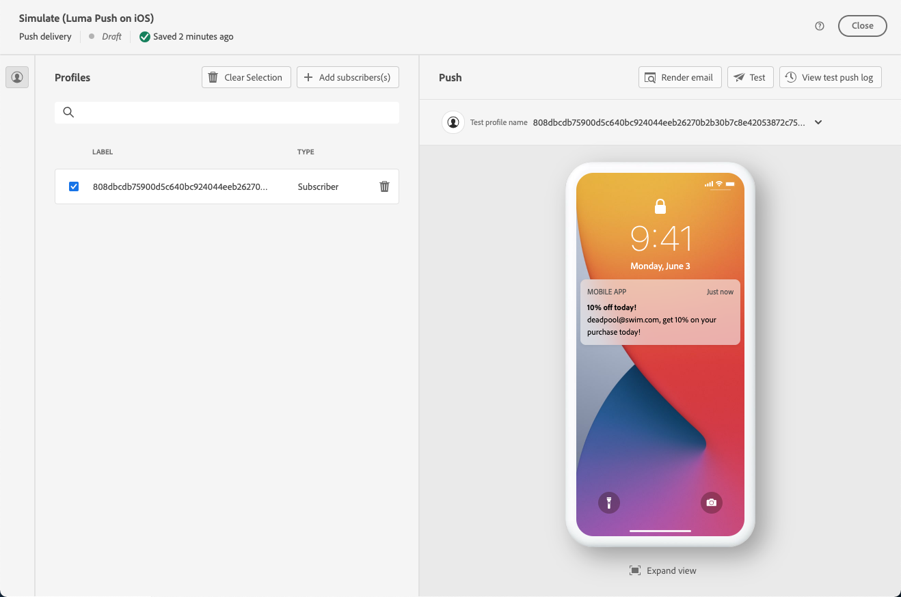

# Previsualización y envío de un envío de notificación push {#send-push-delivery}

## Previsualización del envío de notificaciones push {#preview-push}

Una vez definido el contenido del mensaje, puede utilizar los suscriptores de prueba para previsualizar y probar el mensaje. Si ha incluido contenido personalizado, puede examinar cómo se muestra este en el mensaje utilizando datos de perfil de prueba. Esto le permite asegurarse de que el mensaje se está representando correctamente y de que los elementos personalizados se están incorporando correctamente.

Los pasos principales para previsualizar su envío de SMS son los siguientes. Encontrará más detalles sobre cómo previsualizar las entregas en [esta sección](../preview-test/preview-content.md).

1. En la página de contenido de la entrega, utilice **[!UICONTROL Simular contenido]** para previsualizar el contenido personalizado.

   

1. Clic **[!UICONTROL Añadir suscriptores]** para seleccionar uno o varios perfiles con el fin de previsualizar sus datos en el contenido de las notificaciones push.

   <!--Once your test subscribers are selected, click **[!UICONTROL Select]**.
    -->

1. En el panel derecho, encontrará una vista previa de la notificación push, donde los elementos personalizados se sustituyen dinámicamente por datos del perfil seleccionado.

   

Ahora puede revisar y enviar la notificación push a su audiencia.

## Prueba de la entrega de notificaciones push {#test-push}

Uso de **Adobe Campaign**, tiene la capacidad de probar las notificaciones push antes de enviarlas a su audiencia principal. Este paso es importante para validar el envío e identificar cualquier problema.
Los destinatarios de la prueba pueden revisar elementos como vínculos, imágenes y configuraciones de personalización, lo que garantiza un rendimiento óptimo y permite detectar cualquier error. Este proceso le ayuda a refinar y optimizar sus notificaciones push antes de llegar a su audiencia principal.

 Obtenga información sobre cómo enviar notificaciones push de prueba en [esta sección](../preview-test/test-deliveries.md#subscribers).

## Realización del envío de notificaciones push {#send-push}

1. Después de personalizar el contenido de las notificaciones push, haga clic en **[!UICONTROL Revisar y enviar]** de su **[!UICONTROL Envío]** página.

   

1. Haga clic en **[!UICONTROL Preparar]** y supervisar el progreso y las estadísticas proporcionadas.

   Si se produce algún error, consulte el menú Registros para obtener información detallada sobre el error.

   

1. Envíe los mensajes haciendo clic en **[!UICONTROL Enviar]** para continuar con el proceso de envío final.

1. Confirme la acción de envío haciendo clic en **[!UICONTROL Enviar]** o **[!UICONTROL Enviar como está programado]** botón.

   

Una vez entregado el envío, puede realizar un seguimiento de los datos de KPI (Indicador de rendimiento clave) de su página de envío y de los datos de **[!UICONTROL Registros]** menú.

Ahora puede empezar a medir el impacto del mensaje con informes integrados. [Más información](../reporting/push-report.md)
