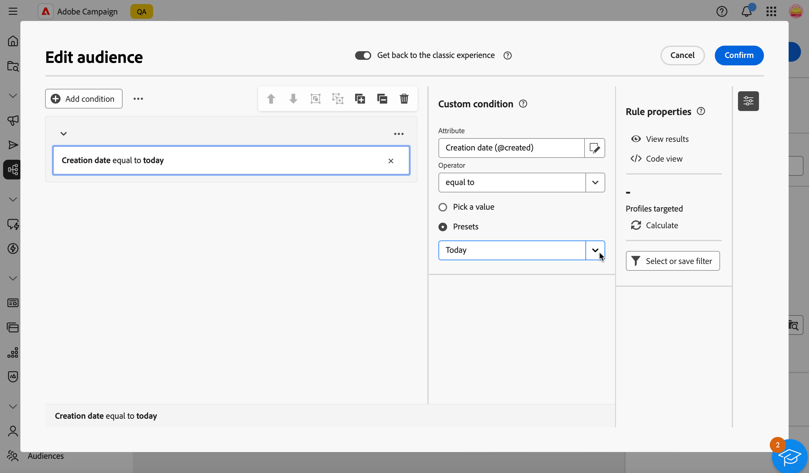
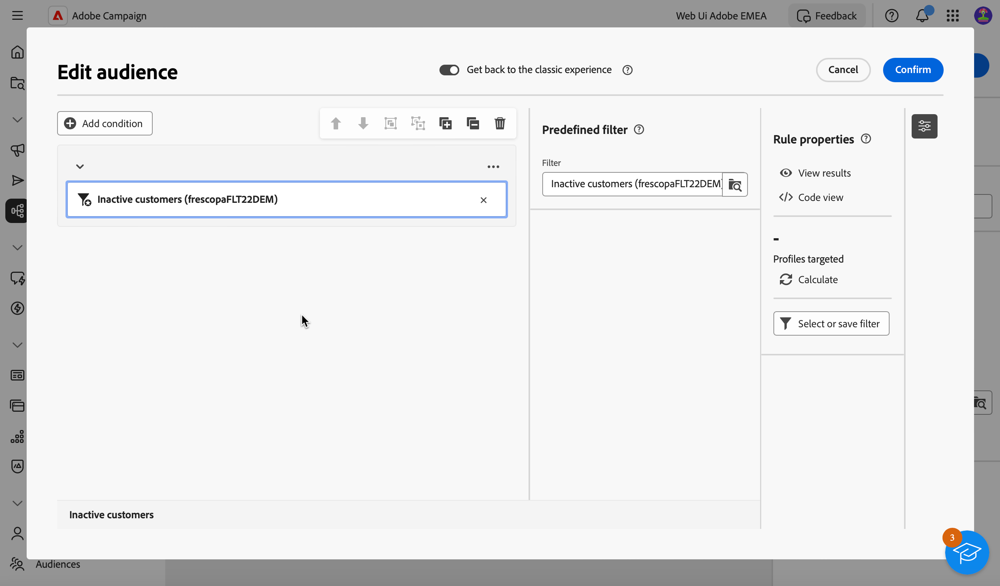

# Genere su primera consulta {#build-query}

Para empezar a crear una consulta, acceda al modelador de consultas desde la ubicación que elija, según la acción que desee realizar. El modelador de consultas se abre con un lienzo en blanco. Haga clic en el botón **+** para configurar el primer nodo de la consulta.

>[!IMPORTANT]
>
>Hay disponible una interfaz completamente nueva para el modelador de consultas. El nuevo generador de reglas le permite crear la consulta con mayor facilidad gracias a su interfaz simplificada. Para cambiar a esta experiencia, pulse el botón de alternancia en la esquina superior derecha. Puede volver al modelador de consultas clásico en cualquier momento simplemente pulsando la tecla de retroceso para desactivar la nueva interfaz. Puede aplicar los mismos principios que el modelador de consultas en esta nueva interfaz.
>{zoomable="yes"}

Se pueden añadir dos tipos de elementos:

* Los **componentes de filtrado** (condición personalizada, Seleccionar audiencia, Filtro predefinido) le permiten crear sus propias reglas, seleccionar una audiencia o utilizar un filtro predefinido para restringir la consulta. Se añaden al principio de la consulta y en transiciones punteadas. [Aprenda a trabajar con los componentes de filtrado](#filtering)

  Ejemplo: *Destinatarios que se suscribieron al boletín &#39;Deportes&#39;*, *Destinatarios que viven en Nueva York*, *Destinatarios que viven en San Francisco*

>[!BEGINTABS]

>[!TAB Modelador de consultas clásico]

{zoomable="yes"}

>[!TAB Nuevo generador de reglas]

{zoomable="yes"}

>[!ENDTABS]

* **Los operadores de grupo** (AND, OR, EXCEPT) le permiten agrupar los componentes de filtrado en el diagrama. Se añaden a las transiciones existentes antes de un componente de filtrado. [Aprenda a trabajar con operadores](#filtering)

  Ejemplo: * Destinatarios que son Super VIP **AND** VIP para recompensar la demostración de VIP **OR**, **EXCEPTO** destinatarios menores de 21 años y mayores de 45.

>[!BEGINTABS]

>[!TAB Modelador de consultas clásico]

{zoomable="yes"}

>[!TAB Nuevo generador de reglas]

{zoomable="yes"}

>[!ENDTABS]

## Distribución de valores en una consulta {#distribution-values-query}

La distribución de valores muestra el porcentaje de cada valor de un campo dentro de una tabla, según los parámetros de consulta actuales. Conocer la distribución de valores dentro de una consulta ayuda a refinar la segmentación.

Para acceder a esta opción, en la consulta, haga clic en el botón de selección de atributos como se muestra a continuación. A continuación, haga clic en el icono **[!UICONTROL Información]** que se encuentra junto al atributo seleccionado. Puede acceder al botón **[!UICONTROL Distribución de valores]**.

{zoomable="yes"}

>[!NOTE]
>
>* Para los campos con muchos valores, solo se muestran los veinte primeros valores. En estos casos, una notificación **[!UICONTROL Carga parcial]** le advierte.
>* La opción **[!UICONTROL Distribution of values]** es accesible en todos los selectores de atributos. [Aprenda a seleccionar atributos](../get-started/attributes.md)
>* Puede agregar condiciones a los resultados usando los **[!Afiltros avanzados]**. [Más información aquí](../get-started/work-with-folders.md#filter-the-values).

## Adición de componentes de filtrado {#filtering}

Los componentes de filtrado le permiten refinar la consulta utilizando:

* **[Condiciones personalizadas](#custom-condition)**: filtre la consulta creando su propia condición con atributos de la base de datos y expresiones avanzadas.
* **[Audiencias](#audiences)**: filtre la consulta usando una audiencia existente.
* **[Filtro predefinido](#predefined-filters)**: filtre la consulta utilizando filtros predefinidos existentes.

### Configuración de una condición personalizada {#custom-condition}

>[!CONTEXTUALHELP]
>id="acw_orchestration_querymodeler_customcondition"
>title="Condición personalizada"
>abstract="Las condiciones personalizadas son componentes de filtrado que le permiten filtrar la consulta creando su propia condición con atributos de la base de datos y expresiones avanzadas."

Para filtrar la consulta mediante una condición personalizada, siga estos pasos:

1. Haga clic en el botón **+** del nodo deseado y seleccione **[!UICONTROL Condición personalizada]**. El panel de propiedades de condición personalizada se abre en el lado derecho.

1. En el campo **Atributo**, seleccione el atributo de la base de datos que desee utilizar para crear la condición. La lista de atributos incluye todos los atributos de la base de datos de Campaign, incluidos los atributos de las tablas vinculadas. [Aprenda a seleccionar atributos y agregarlos a favoritos](../get-started/attributes.md)

   {zoomable="yes"}

   >[!NOTE]
   >
   >El botón **Edit expression** le permite utilizar el editor de expresiones web de Campaign para definir manualmente una expresión mediante campos de la base de datos y funciones de ayuda. [Obtenga información sobre cómo editar expresiones](expression-editor.md)

1. Seleccione el operador que desee aplicar en la lista desplegable. Hay varios operadores disponibles. Tenga en cuenta que los operadores disponibles en la lista desplegable dependen del tipo de datos del atributo.

   +++Lista de operadores disponibles

   | Operador | Objetivo | Ejemplo |
   |---|---|---|
   | Igual a | Devuelve un resultado idéntico a los datos introducidos en la segunda columna Valor. | Apellido (@lastName) igual a &quot;Jones&quot; solo devuelve como resultado los destinatarios cuyo apellido sea Jones. |
   | No igual a | El resultado son todos los valores que no son idénticos al valor ingresado. | Idioma (@language) distinto de &quot;inglés&quot;. |
   | Mayor que | El resultado es un valor mayor que el valor introducido. | Edad (@age) mayor que 50 devuelve como resultado todos los valores mayores que 50, como 51 o 52. |
   | Menor que | El resultado es un valor menor que el valor introducido. | Fecha de creación (@created) antes de &quot;DaysAgo(100)&quot; devuelve como resultado todos los destinatarios creados hace menos de 100 días. |
   | Mayor o igual que | El resultado son todos los valores iguales o mayores que el valor introducido. | Edad (@age) mayor o igual que &quot;30&quot; devuelve como resultado todos los destinatarios de 30 años o más. |
   | Menor o igual que | El resultado son todos los valores iguales o inferiores al valor introducido. | Edad (@age) menor o igual que &quot;60&quot; devuelve como resultado todos los destinatarios de 60 años o menos. |
   | Incluido en | Devuelve los resultados incluidos entre los valores indicados. Estos valores deben separarse con una coma. | Fecha de nacimiento (@birthDate) incluida en &quot;12/10/1979,12/10/1984&quot; devuelve como resultado los destinatarios que nacieran entre esas fechas. |
   | No en | Funciona como el operador Is included in. En este caso, los destinatarios se excluyen según los valores introducidos. | Fecha de nacimiento (@birthDate) no incluida en &quot;12/10/1979,12/10/1984&quot;. Los destinatarios nacidos dentro de estas fechas no se devolverán. |
   | Is empty | Devuelve los resultados que coinciden con un valor vacío en la segunda columna Valor. | Móvil (@mobilePhone) está vacío devuelve todos los destinatarios que no tienen número de móvil. |
   | Is not empty | Funciona de forma inversa al operador Is empty. No es necesario introducir datos en la segunda columna Valor. | Correo electrónico (@email) no está vacío. |
   | Comienza con | Devuelve los resultados que comienzan con el valor ingresado. | N.º cuenta (@account) comienza con “32010”. |
   | No empieza con | Devuelve los resultados que no comienzan con el valor introducido. | N.º cuenta (@account) no comienza con &quot;20&quot;. |
   | Contiene | Devuelve los resultados que contienen al menos el valor introducido. | Dominio de correo electrónico (@domain) contiene &quot;mail&quot; devuelve todos los nombres de dominio que contienen &quot;mail&quot;, como &quot;gmail.com&quot;. |
   | Does not contain | Devuelve los resultados que no contienen el valor introducido. | Email domain (@domain) no contiene &quot;vo&quot;. Los nombres de dominio que contengan &quot;vo&quot;, como &quot;voila.fr&quot;, no aparecerán en los resultados. |
   | Como | De forma similar al operador Contains, permite insertar un carácter comodín % en el valor. | Apellido (@lastName) como &quot;Jon%s&quot;. El carácter comodín actúa como un &quot;joker&quot; para encontrar nombres como &quot;Jones&quot;. |
   | Not like | De forma similar al operador Contains, permite insertar un carácter comodín % en el valor. | Apellido (@lastName) como &quot;Smi%h&quot;. Los destinatarios cuyo apellido sea &quot;Smith&quot; no se devolverán. |

+++

1. En el campo **Value**, defina el valor esperado. También puede utilizar el editor de expresiones web de Campaign para definir manualmente una expresión utilizando los campos de la base de datos y las funciones de ayuda. Para ello, haga clic en el botón **Editar expresión**. [Obtenga información sobre cómo editar expresiones](expression-editor.md)

   *Ejemplo de consulta que devuelve todos los perfiles de 21 años o más:*

>[!BEGINTABS]

>[!TAB Modelador de consultas clásico]

{zoomable="yes"}

>[!TAB Nuevo generador de reglas]

{zoomable="yes"}

>[!ENDTABS]

Para los atributos de tipo fecha, hay valores predefinidos disponibles mediante la opción **[!UICONTROL Ajustes preestablecidos]**.

>[!BEGINTABS]

>[!TAB Modelador de consultas clásico]

{zoomable="yes"}

>[!TAB Nuevo generador de reglas]

{zoomable="yes"}

>[!ENDTABS]

#### Condiciones personalizadas en las tablas vinculadas (vínculos 1-1 y 1-N){#links}

Las condiciones personalizadas permiten consultar tablas vinculadas a la tabla que utiliza actualmente la regla. Esto incluye tablas con un vínculo de cardinalidad 1-1 o tablas de recopilación (vínculo 1-N).

Para un vínculo **1-1**, vaya a la tabla vinculada, seleccione el atributo deseado y defina el valor esperado.

También puede seleccionar directamente un vínculo de tabla en el selector **Value** y confirmar. En ese caso, los valores disponibles para la tabla seleccionada deben seleccionarse mediante un selector dedicado, como se muestra en el ejemplo siguiente.

+++Ejemplo de consulta

En este caso, la consulta está dirigida a marcas cuya etiqueta está &quot;en ejecución&quot;.

1. Vaya dentro de la tabla **Brand** y seleccione el atributo **Label**.

   {zoomable="yes"}{width="85%" align="center"}

1. Defina el valor esperado para el atributo.

   {zoomable="yes"}{width="85%" align="center"}

Este es un ejemplo de consulta en el que se ha seleccionado directamente un vínculo de tabla. Los valores disponibles para esta tabla deben seleccionarse de un selector específico.

{zoomable="yes"}{width="85%" align="center"}

+++

Para un vínculo **1-N**, puede definir subcondiciones para restringir la consulta, como se muestra en el ejemplo siguiente.

+++Ejemplo de consulta

En este caso, la consulta está dirigida a destinatarios que han realizado compras relacionadas con el producto BrewMaster, por un importe total de al menos 100 $.

1. Seleccione la tabla **Purchases** y confirme.

   {zoomable="yes"}{width="50%" align="center"}

1. Se añade una transición saliente, que le permite crear subcondiciones.

   {zoomable="yes"}{width="85%" align="center"}

1. Seleccione el atributo **Price** y el destino de compras de 1000$ o más

   {zoomable="yes"}{width="85%" align="center"}

1. Añada subcondiciones para adaptarlas a sus necesidades. Aquí hemos agregado una condición a los perfiles de destino que compraron un producto BrewMaster.

   {zoomable="yes"}{width="85%" align="center"}

+++

#### Trabajo con datos agregados {#aggregate}

Las condiciones personalizadas le permiten realizar operaciones acumuladas. Para ello, debe seleccionar directamente un atributo de una tabla de recopilación:

1. Desplácese dentro de la tabla de recopilación deseada y seleccione el atributo en el que desea realizar una operación de acumulado.

   {zoomable="yes"}{width="85%" align="center"}

1. En el panel de propiedades, active la opción **Agregar datos** y seleccione la función de agregado que desee.

>[!BEGINTABS]

>[!TAB Modelador de consultas clásico]

{zoomable="yes"}{width="85%" align="center"}

>[!TAB Nuevo generador de reglas]

{zoomable="yes"}{width="85%" align="center"}

>[!ENDTABS]

### Selección de un público {#audiences}

>[!CONTEXTUALHELP]
>id="acw_orchestration_querymodeler_selectaudience"
>title="Seleccionar el público"
>abstract="Mediante la opción **Seleccionar público**, puede elegir el público que desea utilizar para filtrar la consulta."

Para filtrar la consulta utilizando una audiencia existente, siga estos pasos:

>[!BEGINTABS]

>[!TAB Modelador de consultas clásico]

1. Haga clic en el botón **+** del nodo deseado y elija **[!UICONTROL Seleccionar audiencia]**.

1. El panel de propiedades **Seleccionar audiencia** se abre en el lado derecho. Elija la audiencia que desee utilizar para filtrar la consulta.

   *Ejemplo de consulta que devuelve todos los perfiles pertenecientes a la audiencia &quot;Visitantes del festival&quot;:*

   {zoomable="yes"}

>[!TAB Nuevo generador de reglas]

1. Haga clic en el botón **Expandir** junto al botón **[!UICONTROL Agregar condición]** y elija **[!UICONTROL Seleccionar audiencia]**.

1. El panel de propiedades **Seleccionar audiencia** se abre en el lado derecho. Elija la audiencia que desee utilizar para filtrar la consulta.

   *Ejemplo de consulta que devuelve todos los perfiles pertenecientes a la audiencia &quot;Coffee Works&quot;:*

   {zoomable="yes"}

>[!ENDTABS]

### Uso de un filtro predefinido {#predefined-filters}

>[!CONTEXTUALHELP]
>id="acw_orchestration_querymodeler_predefinedfilter"
>title="Filtro predefinido"
>abstract="Mediante la opción **Filtro predefinido**, puede seleccionar un filtro predefinido de la lista de filtros personalizados o de favoritos."

Para filtrar la consulta utilizando un filtro predefinido, siga estos pasos:

>[!BEGINTABS]

>[!TAB Modelador de consultas clásico]

1. Haga clic en el botón **+** del nodo deseado y seleccione **[!UICONTROL Filtro predefinido]**.

1. El panel de propiedades **Filtro predefinido** se abre en el lado derecho. Seleccione un filtro predefinido de la lista de filtros personalizados o de favoritos.

   *Ejemplo de consulta que devuelve todos los perfiles correspondientes al filtro predefinido &quot;Clientes inactivos&quot;:*

   {zoomable="yes"}

>[!TAB Nuevo generador de reglas]

1. Haga clic en el botón **Expandir** junto al botón **[!UICONTROL Agregar condición]** y seleccione **[!UICONTROL Filtro predefinido]**.

1. El panel de propiedades **Filtro predefinido** se abre en el lado derecho. Seleccione un filtro predefinido de la lista de filtros personalizados o de favoritos.

   *Ejemplo de consulta que devuelve todos los perfiles correspondientes al filtro predefinido &quot;Clientes inactivos&quot;:*

   {zoomable="yes"}

>[!ENDTABS]

### Copiar y pegar componentes {#copy}

El modelador de consultas permite copiar uno o varios componentes de filtrado y pegarlos al final de una transición. Esta operación se puede ejecutar dentro del lienzo de consulta actual o en cualquier lienzo de la instancia.

>[!NOTE]
>
>La selección copiada se conserva mientras esté trabajando en la instancia. Si cierra la sesión y vuelve a iniciarla, la selección ya no estará disponible para pegar.

>[!IMPORTANT]
>
>Actualmente es imposible copiar y pegar componentes en la experiencia del nuevo generador de reglas. Para seguir estos pasos, haga clic en el botón de alternancia **[!UICONTROL Volver a la experiencia clásica]** en la parte superior para usar el modelador de consultas clásico.

Para copiar y pegar componentes de filtrado, siga estos pasos:

1. Seleccione el componente de filtrado que desea copiar haciendo clic en él en el lienzo de la consulta. Para seleccionar varios componentes, utilice la herramienta de selección múltiple disponible en la barra de herramientas situada en la esquina superior derecha del lienzo.

1. Haga clic en el botón **[!UICONTROL Copiar]** del panel de propiedades del componente o en la cinta azul de la parte inferior de la pantalla si ha seleccionado varios componentes.

   | Copiar un solo componente | Copiar varios componentes |
   |  ---  |  ---  |
   | {zoomable="yes"}{width="200" align="center" zoomable="yes"} | {zoomable="yes"}{width="200" align="center" zoomable="yes"} |

1. Para pegar los componentes, haga clic en el botón + al final de la transición deseada y seleccione **Pegar n elementos**.

   {zoomable="yes"}

## Combinación de componentes de filtrado con operadores {#operators}

>[!CONTEXTUALHELP]
>id="acw_orchestration_querymodeler_group"
>title="Grupo"
>abstract="En este panel, puede cambiar el operador que se utiliza para vincular las condiciones de filtrado."

Cada vez que agrega un nuevo componente de filtrado a la consulta, un operador **AND** lo vincula automáticamente al otro componente. Esto significa que los resultados de los dos componentes de filtrado se combinan.

En este ejemplo, se han añadido nuevos componentes de filtrado de tipo audiencia en la segunda transición. El componente está vinculado a la condición de filtro predefinida con un operador **AND**, lo que significa que los resultados de la consulta incluyen destinatarios dirigidos por el filtro predefinido &quot;Suscriptores de newsletter - MADRID&quot; Y que pertenecen a la audiencia &quot;Compradores (todo el tiempo)&quot;.

>[!BEGINTABS]

>[!TAB Modelador de consultas clásico]

{zoomable="yes"}

Para cambiar el operador usado para vincular las condiciones de filtrado, haga clic en él y seleccione el operador deseado en el panel **Grupo** que se abre en el lado derecho.

Los operadores disponibles son:

* **AND (intersección)**: combina los resultados que coinciden con todos los componentes de filtrado en las transiciones salientes.
* **OR (Union)**: incluye resultados que coinciden con al menos uno de los componentes de filtrado en las transiciones salientes.
* **EXCEPT (Exclusion)**: Excluye los resultados que coinciden con todos los componentes de filtrado de la transición saliente.

{zoomable="yes"}

Además, puede crear grupos intermedios de componentes agrupando componentes en un mismo grupo y vinculándolos juntos. De este modo, el operador AND se coloca de forma predeterminada, y puede cambiarlo al operador deseado.

>[!TAB Nuevo generador de reglas]

{zoomable="yes"}

Para cambiar el operador utilizado para vincular las condiciones de filtrado, haga clic en él, cambiará a OR, EXCEPT y luego vuelva a AND, y seleccione el operador deseado.

Los operadores disponibles son:

* **AND (intersección)**: combina los resultados que coinciden con todos los componentes de filtrado en las transiciones salientes.
* **OR (Union)**: incluye resultados que coinciden con al menos uno de los componentes de filtrado en las transiciones salientes.
* **EXCEPT (Exclusion)**: Excluye los resultados que coinciden con todos los componentes de filtrado de la transición saliente.

{zoomable="yes"}

>[!ENDTABS]

En el ejemplo siguiente, hemos creado un grupo intermedio para incluir los resultados de las audiencias &quot;VIP to recompensa&quot; o &quot;Super VIP&quot;.

>[!BEGINTABS]

>[!TAB Modelador de consultas clásico]

{zoomable="yes"}

>[!TAB Nuevo generador de reglas]

{zoomable="yes"}

>[!ENDTABS]

## Compruebe y valide la consulta

>[!CONTEXTUALHELP]
>id="acw_orchestration_querymodeler_ruleproperties"
>title="Propiedades de la regla"
>abstract="Una vez que haya creado la consulta en el lienzo, puede comprobarla con el panel **Propiedades de regla** situado en el lado derecho. Este panel permite mostrar los datos resultantes, recuperar una versión de código SQL de la consulta y comprobar el número de registros de destino. Utilice el botón **Seleccionar o guardar filtro** para guardar la consulta como un filtro predefinido o reemplazar el contenido del lienzo con un filtro existente."

Una vez que haya creado la consulta en el lienzo, puede comprobarla con el panel **Propiedades de regla** situado en el lado derecho. Este panel se muestra al crear una consulta para crear una audiencia. Las operaciones disponibles son:

* **Ver resultados:** Muestra los datos resultantes de la consulta.
* **Vista de código**: muestra una versión basada en código de la consulta en SQL.
* **Calcular**: actualiza y muestra el número de registros dirigidos por la consulta.
* **Seleccione o guarde el filtro**: elija un filtro predefinido existente para utilizarlo en el lienzo o guarde la consulta como un filtro predefinido para reutilizarlo en el futuro. [Aprenda a trabajar con filtros predefinidos](../get-started/predefined-filters.md)

  >[!IMPORTANT]
  >
  >Seleccione un filtro predefinido en el panel de propiedades de la regla para reemplazar la consulta que se ha creado en el lienzo por el filtro seleccionado.

Cuando la consulta esté lista, haga clic en el botón **[!UICONTROL Confirmar]** en la esquina superior derecha para guardarla.

>[!BEGINTABS]

>[!TAB Modelador de consultas clásico]

Puede modificar la consulta en cualquier momento abriéndola. Tenga en cuenta que al abrir una consulta existente, se muestra en una vista simplificada sin la visibilidad de **+** botones. Para agregar nuevos elementos a la consulta, seleccione un componente u operador en el lienzo para mostrar los botones **+**.

{zoomable="yes"}

>[!TAB Nuevo generador de reglas]

Puede modificar la consulta en cualquier momento abriéndola. Para ello, haga clic en el botón **[!UICONTROL Agregar condición]** en la esquina superior izquierda.

{zoomable="yes"}

>[!ENDTABS]
