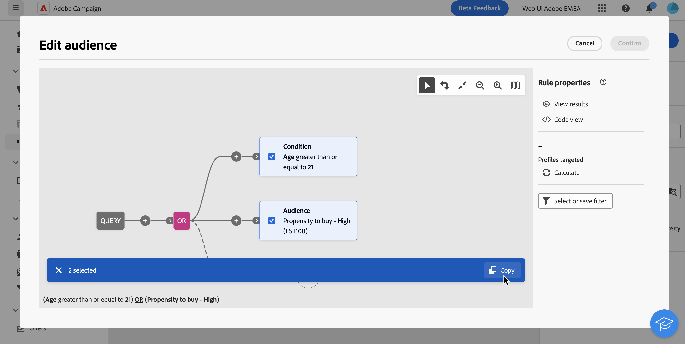

# Genere su primera consulta {#build-query}

Para inicio la creación de una consulta, acceda al modelador de consulta desde la ubicación que elija, dependiendo de la acción que desee realizar. El modelador consulta se abre con un lienzo en blanco. Haga clic en la **botón +** para configurar la primera nodo del consulta.

Puede añadir dos tipos de elementos:

* **Los componentes** de filtrado (Condición personalizada, Seleccionar audiencia, Filtro predefinido) le permiten versión sus propias reglas, seleccionar una audiencia o utilizar un filtro predefinido para restringir el consulta. Se agregan al inicio del consulta y en las transiciones de puntos. [Aprenda a trabajar con el filtrado de componentes](#filtering)

  Ejemplo: *destinatarios que se suscribieron al boletín* informativo &quot;Deportes&quot;, *destinatarios que viven en Nuevo York*, *destinatarios que viven en San Francisco*

  {zoomable="yes"}

* **Los operadores** de grupo (AND, OR, EXCEPT) permiten grupo componentes de filtrado en el diagrama. Se añaden en las transiciones existentes antes de un componente de filtrado. [Aprenda a trabajar con operadores](#filtering)

  Ejemplo: *destinatarios que se suscribieron al boletín informativo **&quot;Deportes&quot; Y**que viven en Nuevo York **O**San Francisco*.

  {zoomable="yes"}

## Distribución de valores en una consulta {#distribution-values-query}

La distribución de valores muestra el porcentaje de cada valor de un campo dentro de una tabla, en función de los parámetros consulta actuales. Conocer la distribución de valores dentro de una consulta ayuda a refinar segmentación.

Para acceder a esta opción, en su consulta, haga clic en el botón de selección de atributos como se muestra a continuación. Luego, haga clic en el **[!UICONTROL icono Información]** junto al atributo seleccionado. Puede acceder al **[!UICONTROL botón Distribución de valores]** .

{zoomable="yes"}

>[!NOTE]
>
>* Para los campos con muchos valores, solo se muestran los veinte primeros valores. En tales casos, una carga ]**parcial de notificación**[!UICONTROL  le avisará.
>* La opción **[!UICONTROL Distribution of values]** es accesible en todos los selectores de atributos. [Aprenda a seleccionar atributos](../get-started/attributes.md)
>* Puede agregar condiciones a los resultados usando los **[!Afiltros avanzados]**. [Más información aquí](../get-started/work-with-folders.md#filter-the-values).

## Adición de componentes de filtrado {#filtering}

Los componentes de filtrado le permiten refinar la consulta utilizando:

* **[Condiciones personalizadas](#custom-condition)**: filtre la consulta creando su propia condición con atributos de la base de datos y expresiones avanzadas.
* **[Audiencias](#audiences)**: filtre la consulta usando una audiencia existente.
* **[Filtro predefinido](#predefined-filters)**: filtre la consulta utilizando filtros predefinidos existentes.

### Configuración de una condición personalizada {#custom-condition}

>[!CONTEXTUALHELP]
>id="acw_orchestration_querymodeler_customcondition"
>title="Condición personalizada"
>abstract="Las condiciones personalizadas son componentes de filtrado que le permiten filtrar la consulta creando su propia condición con atributos de la base de datos y expresiones avanzadas."

Para filtrar los consulta con una condición personalizada, seguir estos pasos:

1. Haga clic en el **botón +** en el nodo deseado y seleccione **[!UICONTROL Condición]** personalizada. El panel de propiedades de condición personalizada se abre en el lado derecho.

1. En el **campo Atributo** , seleccione el atributo de la base de datos que desee utilizar para crear la condición. El lista de atributos incluye todos los atributos de la base de datos campaña, incluidos los atributos de las tablas vinculadas. [Aprenda a seleccionar atributos y agregarlos a favoritos](../get-started/attributes.md)

   {zoomable="yes"}

   >[!NOTE]
   >
   >El botón **Edit expression** le permite utilizar el editor de expresiones web de Campaign para definir manualmente una expresión mediante campos de la base de datos y funciones de ayuda. [Obtenga información sobre cómo editar expresiones](expression-editor.md)

1. Seleccione el operador que desea aplicar en la lista desplegable. Hay varios operadores disponibles para su uso. Tenga en cuenta que los operadores disponibles en la lista desplegable dependen del tipo de datos del atributo.

   +++Lista de operadores disponibles

   | Operador | Objetivo | Ejemplo |
   |---|---|---|
   | Igual a | Devuelve un resultado idéntico a los datos introducidos en la segunda columna Valor. | Apellido (@lastName) igual a &quot;Jones&quot; devolverá solo destinatarios cuyo apellido sea Jones. |
   | No es igual a | El resultado son todos los valores que no son idénticos al valor ingresado. | Idioma (@language) no es igual a &quot;Inglés&quot;. |
   | Mayor que | El resultado es un valor mayor que el valor introducido. | Una edad (@age) mayor que 50 devuelve todos los valores superiores a &#39;50&#39;, como &#39;51&#39;, &#39;52&#39;. |
   | Menor que | El resultado es un valor menor que el valor introducido. | La fecha de creación (@created) anterior a &#39;DaysAgo(100)&#39; devolverá todos los destinatarios creados hace menos de 100 días. |
   | Mayor o igual que | El resultado son todos los valores iguales o mayores que el valor introducido. | Si la edad (@age) es mayor o igual que &#39;30&#39;, se devolverán todos los destinatarios mayores de 30 años. |
   | Menor o igual que | El resultado son todos los valores iguales o inferiores al valor introducido. | Edad (@age) inferior o igual a &#39;60&#39; se devolverán todos los destinatarios de 60 años o menos. |
   | Incluido en | Devuelve los resultados incluidos entre los valores indicados. Estos valores deben separarse con una coma. | La fecha de nacimiento (@birthDate) está incluida en &#39;12/10/1979,12/10/1984&#39; devolverá los destinatarios nacidos entre estas fechas. |
   | No en | Funciona gustar el operador Se incluye en. En este caso, los destinatarios se excluyen según los valores introducidos. | La fecha de nacimiento (@birthDate) no está incluida en &#39;12/10/1979,12/10/1984&#39;. No se devolverán los destinatarios nacidos entre estas fechas. |
   | Está vacío | Devuelve resultados que coinciden con un valor vacío de la segunda Valor columna. | Móvil (@mobilePhone) está vacío Devuelve todos los destinatarios que no tienen un número de móvil. |
   | No está vacío | Funciona de forma inversa al operador Is empty. No es necesario introducir datos en la segunda columna Valor. | Correo electrónico (@correo electrónico) no está vacío. |
   | Comienza con | Devuelve los resultados que comienzan con el valor ingresado. | N.º cuenta (@account) comienza con “32010”. |
   | No inicio con | Devuelve los resultados que no empiezan con el valor introducido. | N.º cuenta (@account) no comienza con &quot;20&quot;. |
   | Contiene | Devuelve los resultados que contienen al menos el valor introducido. | Dominio de correo electrónico (@domain) contiene &quot;mail&quot; devuelve todos los nombres de dominio que contienen &quot;mail&quot;, como &quot;gmail.com&quot;. |
   | Does not contain | Devuelve los resultados que no contienen el valor introducido. | Email domain (@domain) no contiene &quot;vo&quot;. Los nombres de dominio que contengan &quot;vo&quot;, como &quot;voila.fr&quot;, no aparecerán en los resultados. |
   | Como | De forma similar al operador Contains, permite insertar un carácter comodín % en el valor. | Apellido (@lastName) como &quot;Jon%s&quot;. El carácter comodín actúa como un &quot;joker&quot; para encontrar nombres como &quot;Jones&quot;. |
   | No gustar | De forma similar al operador Contiene, permite insertar un carácter comodín % en el valor. | Apellido (@lastName) no gustar &quot;Smi%h&quot;. No se devolverán los destinatarios cuyo apellido sea &quot;Smith&quot;. |

+++

1. En el **campo Valor** , defina el valor esperado. También puede utilizar la editor expresión web de Campaign para definir manualmente un expresión mediante campos de la base de datos y funciones auxiliares. Para ello, haga clic en la botón de expresión **** Editar. [Obtenga información sobre cómo editar expresiones](expression-editor.md)

   *Ejemplo de consulta que devuelve todos los perfiles de 21 años o más:*

   {zoomable="yes"}

   Para los atributos de tipo fecha, hay valores predefinidos disponibles mediante la opción **[!UICONTROL Ajustes preestablecidos]**.

   {zoomable="yes"}

#### Condiciones personalizadas en las tablas vinculadas (vínculos 1-1 y 1-N){#links}

Las condiciones personalizadas permiten consultar tablas vinculadas a la tabla que utiliza actualmente la regla. Esto incluye tablas con un vínculo de cardinalidad 1-1 o tablas de recopilación (vínculo 1-N).

Para un vínculo **1-1**, vaya a la tabla vinculada, seleccione el atributo deseado y defina el valor esperado.

También puede seleccionar directamente un vínculo de tabla en el selector **Value** y confirmar. En ese caso, los valores disponibles para la tabla seleccionada deben seleccionarse mediante un selector dedicado, como se muestra en el ejemplo siguiente.

+++Ejemplo de consulta

Aquí, el consulta es direccionamiento marcas cuya etiqueta es &quot;running&quot;.

1. Desplácese dentro de la **tabla Marca** y seleccione el atributo Etiquetar ****.

   {zoomable="yes"}{width="85%" align="center"}

1. Defina el valor esperado para el atributo.

   {zoomable="yes"}{width="85%" align="center"}

Este es un ejemplo consulta en el que se ha seleccionado directamente un vincular de tabla. Los valores disponibles para esta tabla deben seleccionarse de un selector específico.

{zoomable="yes"}{width="85%" align="center"}

+++

Para una **vincular** 1-N, puede definir subcondiciones para restringir la consulta, como se muestra en el ejemplo siguiente.

+++Ejemplo de consulta

Aquí, el consulta es direccionamiento destinatarios que realizaron compras relacionadas con el producto BrewMaster, por un monto total de al menos 100 $.

1. Seleccione la **tabla Compras** y confirme.

   {zoomable="yes"}{width="50%" align="center"}

1. Se agrega una transición saliente, lo que permite crear subcondiciones.

   {zoomable="yes"}{width="85%" align="center"}

1. Seleccione el **atributo Precio** y destino compras de 1000$ o más

   {zoomable="yes"}{width="85%" align="center"}

1. añadir subcondiciones que se adapten a sus necesidades. Aquí hemos agregado una condición a destino perfiles que compraron un producto BrewMaster.

   {zoomable="yes"}{width="85%" align="center"}

+++

#### Trabajar con datos agregado {#aggregate}

Las condiciones personalizadas permiten realizar operaciones agregado. Para ello, debe seleccionar directamente un atributo de una tabla de colección:

1. Desplácese dentro de la tabla de colección deseada y seleccione el atributo en el que desea realizar una operación de agregado.

   {zoomable="yes"}{width="85%" align="center"}

1. En el panel de propiedades, active la **opción Agregar datos** y seleccione la función agregado deseada.

   {zoomable="yes"}{width="85%" align="center"}

### Selección de un público {#audiences}

>[!CONTEXTUALHELP]
>id="acw_orchestration_querymodeler_selectaudience"
>title="Seleccionar el público"
>abstract="Mediante la opción **Seleccionar público**, puede elegir el público que desea utilizar para filtrar la consulta."

Para filtrar su consulta con un audiencia existente, seguir estos pasos:

1. Haga clic en la **botón +** del nodo deseado y elija **[!UICONTROL Seleccionar audiencia]**.

1. El **panel Seleccionar propiedades audiencia** se abre en el lado derecho. Elija la audiencia que desea usar para filtrar los consulta.

   *Ejemplo de consulta que devuelve todos los perfiles pertenecientes al audiencia&quot;:*

   {zoomable="yes"}

### Uso de un filtro predefinido {#predefined-filters}

>[!CONTEXTUALHELP]
>id="acw_orchestration_querymodeler_predefinedfilter"
>title="Filtro predefinido"
>abstract="Mediante la opción **Filtro predefinido**, puede seleccionar un filtro predefinido de la lista de filtros personalizados o de favoritos."

Para filtrar la consulta utilizando un filtro predefinido, siga estos pasos:

1. Haga clic en el botón **+** del nodo deseado y seleccione **[!UICONTROL Filtro predefinido]**.

1. El panel de propiedades **Filtro predefinido** se abre en el lado derecho. Seleccione un filtro predefinido de la lista de filtros personalizados o de favoritos.

   *Ejemplo de consulta que devuelve todos los perfiles correspondientes al filtro predefinido &quot;Clientes inactivos&quot;:*

   {zoomable="yes"}

### Componentes de copia y pegado {#copy}

El modelador de consulta le permite copiar uno o varios componentes de filtrado y pegarlos al final de un transición. Esta operación se puede ejecutar dentro del lienzo del consulta actual o en cualquier lienzo del instancia.

>[!NOTE]
>
>La selección copiada se conserva mientras esté trabajando en su instancia. Si cierra la sesión y vuelve a iniciarla, su selección ya no estará disponible para pegar.

Para copiar y pegar componentes de filtrado, seguir estos pasos:

1. Seleccione el componente de filtrado que desea copiar haciendo clic en él en el lienzo de consulta. Para seleccionar varios componentes, utilice los herramienta de selección múltiple disponibles en la barra de herramientas ubicada en la esquina superior derecha del lienzo.

1. Haga clic en el **[!UICONTROL botón Copiar]** en el panel de propiedades del componente o en la cinta azul de la parte inferior de la pantalla si ha seleccionado varios componentes.

   | Copiar un solo componente | Copiar varios componentes |
   |  ---  |  ---  |
   | {zoomable="yes"}{width="200" align="center" zoomable="yes"} | {zoomable="yes"}{width="200" align="center" zoomable="yes"} |

1. Para pegar los componentes, haga clic en el botón + al final de la transición deseada y seleccione **Pegar n elementos**.

   {zoomable="yes"}

## Combinación de componentes de filtrado con operadores {#operators}

>[!CONTEXTUALHELP]
>id="acw_orchestration_querymodeler_group"
>title="Grupo"
>abstract="En este panel, puede cambiar el operador que se utiliza para vincular las condiciones de filtrado."

Cada vez que agrega un nuevo componente de filtrado a la consulta, un operador **AND** lo vincula automáticamente al otro componente. Esto significa que los resultados de los dos componentes de filtrado se combinan.

En este ejemplo, se han añadido nuevos componentes de filtrado de tipo audiencia en la segunda transición. El componente está vinculado a la condición de filtro predefinida con un operador **AND**, lo que significa que los resultados de la consulta incluyen destinatarios dirigidos por el filtro predefinido &quot;Madridians&quot; Y que pertenecen a la audiencia &quot;Discount hunters&quot;.

{zoomable="yes"}

Para cambiar el operador utilizado para vincular condiciones de filtrado juntas, haga clic en él y seleccione el operador deseado en el **panel Grupo** que se abre en el lado derecho.

Los operadores disponibles son:

* **Y (intersección):** combina resultados que coinciden con todos los componentes de filtrado en las transiciones salientes.
* **O (Unión):** Incluye resultados que coinciden con al menos uno de los componentes del filtrado en las transiciones salientes.
* **EXCEPT (Exclusión):** excluye los resultados que coincidan con todos los componentes de filtrado de la transición saliente.

{zoomable="yes"}

Además, puede crear grupos intermedios de componentes haciendo clic en el **signo +** botón de un transición. Esto le permite agregar un operador en esta ubicación específica para agrupar varios componentes y refinar la consulta.

En el siguiente ejemplo, hemos creado un grupo intermedio para incluir los resultados de las audiencias &quot;VIP para recompensar&quot; o &quot;Super VIP&quot;.

{zoomable="yes"}

## Compruebe y valide la consulta

>[!CONTEXTUALHELP]
>id="acw_orchestration_querymodeler_ruleproperties"
>title="Propiedades de la regla"
>abstract="Una vez que haya creado la consulta en el lienzo, puede comprobarla con el panel **Propiedades de regla** situado en el lado derecho. Este panel permite mostrar los datos resultantes, recuperar una versión de código SQL de la consulta y comprobar el número de registros de destino. Utilice el botón **Seleccionar o guardar filtro** para guardar la consulta como un filtro predefinido o reemplazar el contenido del lienzo con un filtro existente."

Una vez que haya creado su consulta en el lienzo, puede verificarlo usando el panel Propiedades **de la** regla ubicado en el lado derecho. Este panel se muestra cuando se crea una consulta para crear una audiencia. Las operaciones disponibles son:

* **Ver resultados:** muestra los datos resultantes de su consulta.
* **Vista de código**: muestra una versión basada en código del consulta en SQL.
* **Calcular**: actualiza y muestra el número de registros objetivo del consulta.
* **Seleccionar o guardar filtro**: elija un filtro predefinido existente para usar en el lienzo o guarde su consulta como filtro predefinido para su reutilización futura. [Aprenda a trabajar con filtros predefinidos](../get-started/predefined-filters.md)

  >[!IMPORTANT]
  >
  >Seleccione un filtro predefinido en el panel Propiedades de la regla Reemplaza el consulta generado en el lienzo por el filtro seleccionado.

Cuando tu consulta esté lista, haz clic en la **[!UICONTROL botón Confirmar]** en la esquina superior derecha para guardarla.

Puede modificar la consulta en cualquier momento abriéndola. Tenga en cuenta que al abrir una consulta existente, se muestra de forma vista simplificada sin la visibilidad de  **los botones +** . Para agregar nuevos elementos al consulta, seleccione un componente u operador en el lienzo para mostrar los **botones +** .

{zoomable="yes"}

