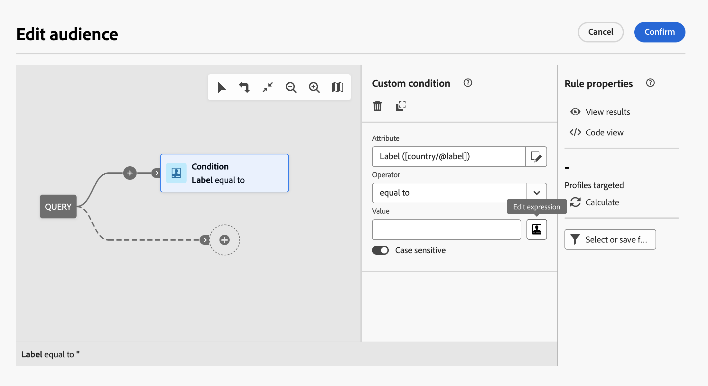

# Edición de expresiones {#expression}

La edición de una expresión implica la introducción manual de condiciones para formar una regla. Este modo le permite utilizar funciones avanzadas. Estas funciones le permiten manipular los valores utilizados para llevar a cabo consultas específicas, como la manipulación de fechas, cadenas, campos numéricos, clasificación, etc.

Estas operaciones están disponibles en el botón Editar expresión del modelador de consultas, disponible para los campos Atributo y Valor al configurar una condición personalizada.



El editor de expresiones proporciona lo siguiente:

* Campo de entrada en el que se define la expresión.
* La lista de campos disponibles que pueden utilizarse en la expresión y que corresponden a la dimensión de segmentación de la consulta.
* La lista de funciones disponibles, ordenadas por categoría.

Edite la expresión introduciendo una expresión directamente en el campo de entrada o utilizando las listas de campos y funciones disponibles. Para ello, coloque el cursor en la inexpresión donde desee añadir el elemento y haga doble clic en el campo o expresión deseados.

Es posible utilizar variables de eventos de flujos de trabajo para crear una expresión. Para obtener más información, consulte xxxx.

## Sintaxis de expresión {#expression-syntax}

### Sintaxis estándar {#standard-syntax}

Las expresiones estándar están formadas por una o varias condiciones que respetan los siguientes elementos de sintaxis:

* Cada condición adopta la forma de **&lt;value1> &lt;comparison operator> &lt;value2>** mediante la cual:

   * **&lt;value1>** es un campo o una función. Por ejemplo, **@created** para la fecha en la que se creó un perfil o **Year(@created)** para el año en el que se creó un perfil.
   * **&lt;comparison operator=&quot;&quot;>** es uno de los operadores enumerados en la sección Operadores de comparación. Este operador define el método de comparación entre **&lt;value1>** y **&lt;value2>**.
   * **&lt;value2>** es un campo, una función o un valor introducido manualmente.

  >[!NOTE]
  >
  >Los datos de tipo **&lt;value1>** y **&lt;value2>** deben ser idénticos. Por ejemplo, si **&lt;value1>** es una fecha, entonces **&lt;value2>** también debe ser una fecha.

* Si desea usar varias condiciones, se pueden combinar con operadores lógicos.

   * **[!UICONTROL Y]**: se intersectan dos condiciones.
   * **[!UICONTROL O]**: se combinan dos condiciones.

Por ejemplo:

```
Year(@created) = Year(GetDate()) AND Month(@created) = Month(GetDate())
```

En este ejemplo, los perfiles cuya fecha de creación está en el mes y año actuales están segmentados.

### Sintaxis de JavaScript {#javascript-syntax}

Al definir las condiciones de visibilidad de un bloque de tipo de texto del editor de contenido HTML, debe utilizar una expresión con sintaxis de tipo JavaScript.

Las expresiones de JavaScript están formadas por una o varias condiciones y utilizan los siguientes elementos de sintaxis:

* Cada condición adopta la forma de **&lt;context> &lt;comparison operator> &lt;value2>** mediante la cual:

   * **&lt;context>** es un campo o una función que le permite especificar el contexto. Por ejemplo, **context.profile.@email** para la dirección de correo electrónico de un perfil o **context.profile.firstName.length()** para el número de caracteres del nombre de un perfil.
   * **&lt;comparison operator=&quot;&quot;>** es uno de los operadores enumerados en la sección Operadores de comparación. Este operador define el método de comparación entre **&lt;context>** y **&lt;value2>**.
   * **&lt;value2>** es un campo, una función o un valor introducido manualmente.

  >[!NOTE]
  >
  Los datos de tipo **&lt;context>** y **&lt;value2>** deben ser idénticos. Por ejemplo, si **&lt;context>** es una fecha, entonces **&lt;value2>** también debe ser una fecha.

* Si desea usar varias condiciones, se pueden combinar con operadores lógicos.

   * **[!UICONTROL &amp;&amp;]**: se intersectan dos condiciones.
   * **[!UICONTROL ||]**: se combinan dos condiciones.

Por ejemplo:

```
context.profile.age > 21 && context.profile.firstName.length() > 0
```

En este ejemplo, perfiles mayores de 21 años y cuyo nombre se ha proporcionado (simbolizado por el hecho de que el campo **firstName** contiene al menos un carácter).

## Operadores de comparación {#comparison-operators}

Para algunas reglas, el editor de consultas le permite elegir un valor para definir la condición.

Las condiciones deben vincularse a los valores mediante uno de los siguientes operadores.

<table> 
 <thead> 
  <tr> 
   <th> Operador<br /> </th> 
   <th> Sintaxis estándar<br /> </th> 
   <th> Sintaxis de JavaScript<br /> </th> 
   <th> Descripción<br /> </th> 
   <th> Ejemplo<br /> </th> 
  </tr> 
 </thead> 
 <tbody> 
  <tr> 
   <td> <span class="uicontrol">Equal to</span> <br /> </td> 
   <td> =<br /> </td> 
   <td> ==<br /> </td> 
   <td> El primer valor debe ser completamente idéntico al segundo valor.<br /> </td> 
   <td> <strong>@lastName = Martin</strong> recupera perfiles cuyo apellido es “Martin”, con solo estos caracteres idénticos.<br /> </td> 
  </tr> 
  <tr> 
   <td> <span class="uicontrol">Greater than</span> <br /> </td> 
   <td> &gt;<br /> </td> 
   <td> &gt;<br /> </td> 
   <td> El primer valor debe ser categóricamente mayor que el segundo valor.<br /> </td> 
   <td> <strong>@age &gt; 50</strong> recupera perfiles mayores a “50”, por ejemplo, “51”, “52”, etc.<br /> </td> 
  </tr> 
  <tr> 
   <td> <span class="uicontrol">Less than</span> <br /> </td> 
   <td> &lt;<br /> </td> 
   <td> &lt;<br /> </td> 
   <td> El primer valor debe ser categóricamente menor que el segundo valor.<br /> </td> 
   <td> <strong>@created &lt; DaysAgo(100)</strong> recupera todos los perfiles creados en la base de datos hace menos de 100 días.<br /> </td> 
  </tr> 
  <tr> 
   <td> <span class="uicontrol">Greater than or equal to</span> <br /> </td> 
   <td> &gt;=<br /> </td> 
   <td> &gt;=<br /> </td> 
   <td> El primer valor debe ser mayor o igual que el segundo valor.<br /> </td> 
   <td> <strong>@age &gt;= 30</strong> recupera perfiles de 30 años o más.<br /> </td> 
  </tr> 
  <tr> 
   <td> <span class="uicontrol">Less than or equal to</span> <br /> </td> 
   <td> &lt;=<br /> </td> 
   <td> &lt;=<br /> </td> 
   <td> El primer valor debe ser menor o igual que el segundo valor.<br /> </td> 
   <td> <strong>@age &lt;= 60</strong> recupera perfiles de 60 años o menos.<br /> </td> 
  </tr> 
  <tr> 
   <td> <span class="uicontrol">Different </span> <br /> </td> 
   <td> !=<br /> </td> 
   <td> !=<br /> </td> 
   <td> El primer valor debe ser diferente del segundo valor.<br /> </td> 
   <td> <strong>@language != English</strong> recupera perfiles que no se han definido como de habla inglesa.<br /> </td> 
  </tr> 
  <tr> 
   <td> <span class="uicontrol">Contains</span> <br /> </td> 
   <td> IN<br /> </td> 
   <td> N/A<br /> </td> 
   <td> El primer valor debe contener el segundo valor.<br /> </td> 
   <td> <strong>@domain IN mail</strong>. Aquí, se devuelven en el resultado todos los nombres de dominio con el valor “mail”. En consecuencia, el nombre de dominio “gmail.com” formará parte de los resultados devueltos.<br /> </td> 
  </tr> 
  <tr> 
   <td> <span class="uicontrol">Like</span> <br /> </td> 
   <td> LIKE<br /> </td> 
   <td> N/A<br /> </td> 
   <td> <span class="uicontrol">Like</span> es muy similar al operador <span class="uicontrol">Contains</span>. Permite insertar un carácter comodín <span class="uicontrol">%</span> en el valor que se está buscando.<br /> </td> 
   <td> <strong>@lastName LIKE Mart%n</strong>. Aquí, el carácter de sustitución <strong>%</strong> sirve como “joker” para encontrar el nombre “Martin” en el caso hipotético de que no se haya escrito correctamente.<br /> </td> 
  </tr> 
  <tr> 
   <td> <span class="uicontrol">Not like</span> <br /> </td> 
   <td> NOT<br /> </td> 
   <td> N/A<br /> </td> 
   <td> Es similar a <span class="uicontrol">Like</span> . Le permite no recuperar el valor introducido. En este caso, el valor introducido debe contener el carácter comodín <span class="uicontrol">%</span>.<br /> </td> 
   <td> <strong>@lastName NOT Smi%h</strong>. Aquí, los destinatarios corresponden al nombre “Smi%h” (por lo tanto, Smith, etc.) no se devuelven como resultado.<br /> </td> 
  </tr> 
  <tr> 
   <td> <span class="uicontrol">Is empty</span> <br /> </td> 
   <td> IS NULL<br /> </td> 
   <td> N/A<br /> </td> 
   <td> El primer valor debe corresponder a un valor vacío.<br /> </td> 
   <td> <strong>@mobilePhone IS NULL</strong> recupera todos los perfiles cuyo número de teléfono móvil no se ha proporcionado.<br /> </td> 
  </tr> 
 </tbody> 
</table>