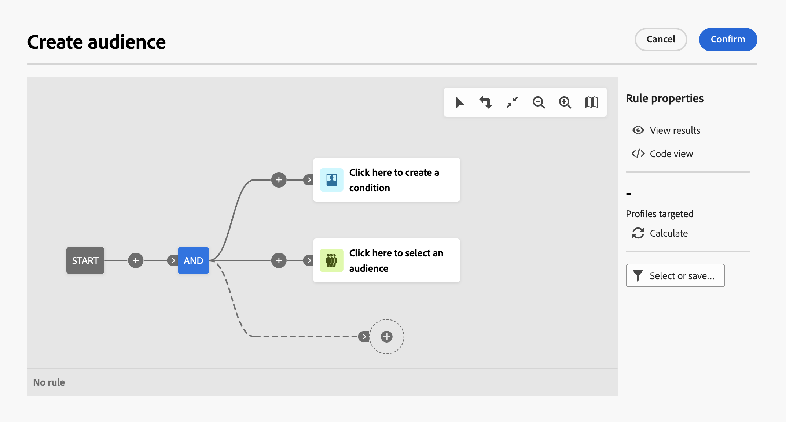

# Uso del modelador de consultas {#segment-builder}

>[!CONTEXTUALHELP]
>id="acw_homepage_learning_card5"
>title="Nuevo modelador de consultas"
>abstract="Adobe Campaign Web incluye un modelador de consultas que simplifica el proceso de filtrado de bases de datos para seleccionar destinos específicos según diversos criterios. Incluye el uso de operadores y expresiones avanzados. El modelador de consultas está disponible en todos los contextos en los que necesite definir reglas para filtrar datos."

<!--TO REMOVE BELOW-->
>[!CONTEXTUALHELP]
>id="acw_homepage_card5"
>title="Nuevo modelador de consultas"
>abstract="Adobe Campaign Web incluye un modelador de consultas que simplifica el proceso de filtrado de bases de datos para seleccionar destinos específicos según diversos criterios. Incluye el uso de operadores y expresiones avanzados. El modelador de consultas está disponible en todos los contextos en los que necesite definir reglas para filtrar datos."

<!--TO REMOVE ABOVE-->

>[!CONTEXTUALHELP]
>id="acw_orchestration_querymodeler_querymessage"
>title="Modelador de consultas"
>abstract="Defina criterios de filtrado para destinatarios o cualquier otra dimensión de segmentación de la base de datos. Aproveche el público de Adobe Experience Platform para detallar aún más el público destinatario y maximizar el impacto de su campaña."

Adobe Campaign Web incluye un modelador de consultas que simplifica el proceso de filtrado de bases de datos para seleccionar destinos específicos según diversos criterios. Esto incluye el uso de expresiones avanzadas y operadores.

## Acceso al modelador de consultas

El modelador de consultas está disponible en todos los contextos en los que necesite definir reglas para filtrar datos.

| Uso | Ejemplo |
|  ---  |  ---  |
| **Definir audiencias**: especifique la población a la que desea dirigirse en los mensajes o flujos de trabajo y cree nuevas audiencias adaptadas a sus necesidades sin esfuerzo. | {width="200" align="center" zoomable="yes"} |
| **Personalizar actividades de flujo de trabajo**: aplique reglas dentro de las actividades de flujo de trabajo, como División y Reconciliación, para alinearse con los requisitos específicos. | {width="200" align="center" zoomable="yes"} |
| **Filtros predefinidos**: Cree filtros predefinidos que sirvan de accesos directos durante varias operaciones de filtrado, tanto si trabaja con listas de datos como si forma la audiencia para una entrega. | {width="200" align="center" zoomable="yes"} |
| **Filtrado de datos de informes**: Añada una regla para filtrar los datos mostrados en los informes. | {width="200" align="center" zoomable="yes"} |
| **Personalización de listas**: Cree reglas personalizadas para filtrar los datos mostrados en listas como destinatarios, envíos, listas, etc. | {width="200" align="center" zoomable="yes"} |

<!--**Dynamize content**: make your content dynamic by creating conditions that define which content should be displayed to different recipients, ensuring personalized and relevant messaging.

+++Example

 +++
-->

## Interfaz del modelador de consultas {#interface}

El modelador de consultas proporciona un lienzo central en el que generar la consulta y un panel derecho que proporciona información sobre la misma.

### El lienzo central {#canvas}

El lienzo central del modelador de consultas es donde se agregan y combinan los diferentes componentes de la creación de la consulta. [Obtenga información sobre cómo crear una consulta](build-query.md)

La barra de herramientas situada en la esquina superior derecha del lienzo proporciona opciones para manipular fácilmente los componentes de la consulta y desplazarse por el lienzo:

* **Modo de selección múltiple**: seleccione varios componentes de filtrado para copiarlos y pegarlos en la ubicación que desee.
* **Rotar**: cambie el lienzo verticalmente.
* **Ajustar a pantalla**: adapte el nivel de zoom del lienzo a la pantalla.
* **Alejar** / **Ampliar**: Aleje o en el lienzo.
* **Mostrar mapa**: abre una instantánea del lienzo en el que se muestra que se encuentra.

### El panel Propiedades de la regla {#rule-properties}

En el lado derecho, la **[!UICONTROL Propiedades de regla]** Este panel proporciona información sobre la consulta. Permite realizar varias operaciones para comprobar la consulta y asegurarse de que se adapta a sus necesidades. [Obtenga información sobre cómo comprobar y validar la consulta](build-query.md#check-and-validate-your-query)
