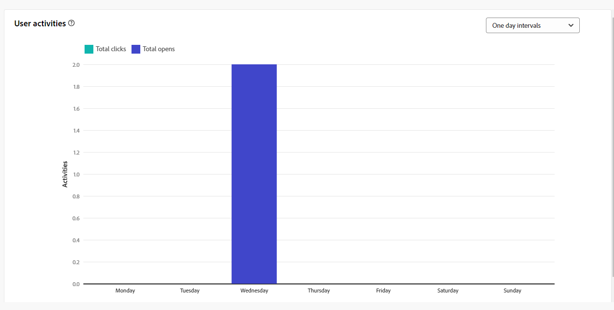

# Informes de campaña para el canal de correo electrónico {#campaign-reports-email-channel}

Cada informe de campaña se divide en diferentes widgets que detallan el éxito y los errores de la campaña. A continuación se describen los informes y las métricas del canal de correo electrónico. Obtenga información sobre cómo acceder a sus informes de campaña en [esta página](campaign-reports.md).

## Resumen de envíos {#delivery-summary-email}

>[!CONTEXTUALHELP]
>id="acw_campaign_reporting_deliveries_overview"
>title="Información general sobre el envío"
>abstract="La **información general sobre el envío** proporciona indicadores clave de rendimiento (KPI) que ofrecen información detallada sobre cómo los visitantes interactúan con el envío de correo electrónico."

### Información general sobre el envío {#delivery-summary-email-ovv}

El **[!UICONTROL informe de información general]** de entrega proporciona indicadores clave de rendimiento (KPI) que proporcionan información detallada sobre cómo interactúan los visitantes con su correo electrónico envío. Las métricas se detallan a continuación.

{zoomable="yes"}

+++Más información sobre el correo electrónico campaña métricas de informes.

* **[!UICONTROL Mensajes que se van a enviar]**: número total de mensajes procesados durante la preparación del envío.

* **[!UICONTROL Entregados: número de mensajes enviados correctamente, en relación con el número total de mensajes enviados]**.

* **[!UICONTROL Devoluciones]**: total de errores acumulados durante el procesamiento de envío y devolución automática en relación con el número total de mensajes enviados.

* **[!UICONTROL Aperturas totales]**: número total de destinatarios objetivo que abrieron un mensaje al menos una vez.

* **[!UICONTROL Clics totales]**: número total de destinatarios distintos que hicieron clic en un envío al menos una vez.

+++

### Estadísticas de público destinatario inicial {#delivery-summary-email-initial-target}

>[!CONTEXTUALHELP]
>id="acw_campaign_reporting_deliveries_target"
>title="Estadísticas de público destinatario inicial"
>abstract="La tabla Estadísticas del público destinatario muestra los datos relativos a los destinatarios."

La **[!UICONTROL destino inicial audiencia tabla de estadísticas]** muestra los datos relativos a los destinatarios. Las métricas se detallan a continuación.

{zoomable="yes"}

+++Más información sobre el correo electrónico campaña métricas de informes.

* **[!UICONTROL audiencia]** inicial: número total de destinatarios objetivo.

* **[!UICONTROL Enviar mensaje que se va a enviar]**: número total de mensajes que deben entregarse después de envío preparación.

* **[!UICONTROL rechazado por reglas]**: Número total de direcciones ignoradas durante el análisis al aplicar reglas: dirección faltante, en cuarentena, en lista de denegación, etc.

+++

### Estadísticas de ejecución {#delivery-summary-email-exec-stats}

>[!CONTEXTUALHELP]
>id="acw_campaign_reporting_email_exec_stats"
>title="Estadísticas de ejecución"
>abstract="La tabla **Estadísticas de ejecución** detalla el éxito de su envío: mensajes para entregar, éxitos, errores y nuevas cuarentenas."

La **[!UICONTROL tabla de estadísticas]** de ejecución detalla el éxito de su envío. Las métricas se detallan a continuación.

{zoomable="yes"}

+++Más información sobre el correo electrónico campaña métricas de informes.

* **[!UICONTROL Enviar mensaje que se va a enviar]**: número total de mensajes que deben entregarse después de envío preparación.

* **[!UICONTROL Éxito]**: número de mensajes procesados correctamente en relación con el número de mensajes que se van a enviar.

* **[!UICONTROL Errores]**: número total de errores acumulados durante los envíos y el procesamiento automático de rechazos en relación con el número de mensajes que se van a enviar.

* **[!UICONTROL Nuevo cuarentenas]**: número total de direcciones en cuarentena después de un envío fallido (usuario desconocido, dominio inválido) en relación con el número de mensajes que se van a enviar.

  Los tipos de error de correo electrónico se enumeran en la documentación](https://experienceleague.adobe.com/docs/campaign/campaign-v8/send/failures/delivery-failures.html#email-error-types){target="_blank"} de Adobe Campaign v8 (consola de [cliente).

+++

### Estadísticas de reacción {#delivery-summary-email-reaction-stats}

>[!CONTEXTUALHELP]
>id="acw_campaign_reporting_email_reaction_stats"
>title="Estadísticas de reacción"
>abstract="La tabla **Estadísticas de reacción** muestra los datos disponibles de la actividad de destinatario para el envío: número de aperturas, suscripciones, bajas, clic en el vínculo de la página espejo."

La tabla **[!UICONTROL Estadísticas de reacción]** contiene los datos disponibles para la actividad del destinatario de su envío. Las métricas se detallan a continuación.

{zoomable="yes"}

+++Obtenga más información sobre las métricas de informes de campañas de correo electrónico.

* **[!UICONTROL Aperturas únicas]**: Número total de destinatarios objetivo que abrieron un mensaje al menos una vez.

* **[!UICONTROL Aperturas totales]**: número de destinatarios objetivo diferentes para este dominio que han abierto un mensaje al menos una vez.

* **[!UICONTROL Bajas]**: número de destinatarios que hicieron clic en las bajas de suscripción durante el periodo correspondiente.

* **[!UICONTROL Página]** espejo: número de destinatarios que hicieron clic en el vincular de página espejo.

* **[!UICONTROL Reenvíos]**: número de destinatarios que hicieron clic y que reenviaron el correo electrónico.
+++

### Flujos de clics generados {#delivery-summary-email-click-streams}

>[!CONTEXTUALHELP]
>id="acw_campaign_reporting_email_click_streams"
>title="Flujos de clics generados"
>abstract="La tabla **Flujos de clics generados** muestra los datos disponibles en relación con la interacción de los destinatarios con el envío."

La **[!UICONTROL tabla Flujos de clics generados muestra datos relativos a la forma en que los destinatarios]** interactuaron con los envío. Las métricas se detallan a continuación.

{zoomable="yes"}

+++Más información sobre el correo electrónico campaña métricas de informes.

* **[!UICONTROL Clics únicos]**: número total de destinatarios únicos que hicieron clic en un envío al menos una vez.

* **[!UICONTROL Clics totales]**: Número total de clics en los vínculos de los envíos.

* **[!UICONTROL Reactividad]**: la proporción del número de destinatarios objetivo que han hecho clic en una entrega en relación con el número estimado de destinatarios objetivo que han abierto una entrega.

+++

## Envíos que no se pueden entregar {#non-deliverables-email}

### Desglose de errores por tipo {#delivery-summary-email-breakdown-per-type}

>[!CONTEXTUALHELP]
>id="acw_campaign_reporting_error_type"
>title="Desglose de errores por tipo"
>abstract="La tabla y el gráfico **Desglose de errores por tipo** contienen los datos disponibles para cada tipo de error encontrado: usuario desconocido, buzón lleno, dominio inválido y mucho más."

La tabla y el gráfico **[!UICONTROL Desglose de errores por tipo]** contienen los datos disponibles para los posibles errores encontrados para cada tipo de dominio. Las métricas se detallan a continuación.

Los errores que se muestran en este informe activan el proceso de cuarentena. Para obtener más información sobre la administración de cuarentena, consulte la [documentación de Campaign v8 (consola de cliente)](https://experienceleague.adobe.com/docs/campaign/campaign-v8/campaigns/send/failures/delivery-failures.html){target="_blank"}.

{zoomable="yes"}

+++Obtenga más información sobre las métricas de informes de campañas de correo electrónico.

* **[!UICONTROL Usuario desconocido]**: Error tipo generado durante la envío para indicar que la dirección correo electrónico es no válido.

* **[!UICONTROL Dominio]** no válido: Error tipo generado al enviar un envío para indicar que el dominio de la dirección del correo electrónico es incorrecto o no existe.

* **[!UICONTROL Buzón lleno]**: Error tipo generado después de cinco envío intenta indicar que la bandeja de entrada de los destinatarios contiene demasiados mensajes.

* **[!UICONTROL Cuenta desactivada]**: Error tipo generado al enviar una envío para indicar que la dirección ya no existe.

* **[!UICONTROL Rechazado]**: Error tipo generado cuando una dirección es rechazada por el IAP (Internet Access Provider), para instancia siguiendo el aplicación de un regla de seguridad (software antispam).

* **[!UICONTROL Inaccesible]**: Error tipo que aparece en la cadena de distribución de mensajes: problema en el relé SMTP, dominio temporalmente inaccesible, etc

* **[!UICONTROL sin conexión]**: Error tipo para indicar que el teléfono móvil de los destinatarios está apagado o desconectado de la red en el momento del envío.

+++

### Desglose de errores por dominio {#delivery-summary-email-breakdown-per-domain}

>[!CONTEXTUALHELP]
>id="acw_campaign_reporting_error_domain"
>title="Desglose de errores por dominio"
>abstract="La tabla y el gráfico **Desglose de errores por dominio** muestran los datos disponibles para cada tipo de error encontrado según cada dominio."

La **[!UICONTROL tabla y el gráfico Desglose de errores por dominio]** contienen los datos disponibles de posibles errores encontrados con cada dominio. Las métricas son comunes con la tabla y el **[!UICONTROL gráfico Desglose de errores por tipo]** detallados anteriormente.

## Indicadores de seguimiento {#tracking-indicators-email}

### Estadísticas de envío {#delivery-summary-email-statistics}

>[!CONTEXTUALHELP]
>id="acw_delivery_campaign_delivery_statistics_summary"
>title="Estadísticas de envío"
>abstract="El gráfico **Estadísticas de envío** detalla el éxito de su envío y los errores que se han producido."

Las **[!UICONTROL métricas de estadísticas]** de entrega proporcionan indicadores clave de rendimiento (KPI) que proporcionan información detallada sobre los datos disponibles para los correos electrónicos enviados. Las métricas se detallan a continuación.

{zoomable="yes"}

+++Más información sobre el correo electrónico campaña métricas de informes.

* **[!UICONTROL Enviar mensaje que se van a enviar]**: número de mensajes procesados correctamente en relación con el número de mensajes que se van a enviar.

* **[!UICONTROL Aperturas únicas]**: número total de destinatarios objetivo que abrieron un mensaje al menos una vez.

* **[!UICONTROL Aperturas totales]**: número de destinatarios objetivo diferentes para este dominio que han abierto un mensaje al menos una vez.

* **[!UICONTROL Clics en el vínculo de no participación]**: número de clics en el vincular baja.

* **[!UICONTROL Clics en el vincular]** espejo: número de clics en el vincular al página espejo.

* **[!UICONTROL Estimación de reenvíos]**: Estimación del número de correos electrónicos reenviados por los destinatarios objetivo.
+++

### Tasa de clics y de aperturas {#delivery-summary-open-rate}

>[!CONTEXTUALHELP]
>id="acw_campaign_reporting_open_clickthrough"
>title="Tasa de clics y de aperturas"
>abstract="La tabla **Tasa de clics y de aperturas** muestra datos relativos ao engajamento dos recipients com a entrega."

La **[!UICONTROL tabla de tasas]** de apertura y de clics muestra datos relativos a los destinatarios. Las métricas se detallan a continuación.

{zoomable="yes"}

+++ Obtenga más información sobre las métricas de informes de campaña correo electrónico.

* **[!UICONTROL Enviados]**: número total de mensajes enviados.

* **[!UICONTROL Quejas]**: número y porcentaje de mensajes para este dominio que han sido reportados como indeseables por el destinatario.

* **[!UICONTROL Aperturas únicas]**: número y porcentaje de destinatarios objetivo distintos para este dominio que han abierto un mensaje al menos una vez.

* **[!UICONTROL Clics únicos]**: número y porcentaje de destinatarios objetivo diferentes que hicieron clic en el mismo envío al menos una vez.

* **[!UICONTROL Reacciones]** sin procesar: porcentaje del número de destinatario que hicieron clic en un envío al menos una vez en comparación con el número de destinatarios que abrieron un envío al menos una vez.

+++

## URL y flujos de clics {#url-email}

>[!CONTEXTUALHELP]
>id="acw_campaign_reporting_urls_clickstreams"
>title="URL y flujos de clics"
>abstract="El informe de **URL y flujos de clics** proporciona indicadores clave de rendimiento (KPI) que proporcionan información detallada sobre las direcciones URL en las que se hizo clic con mayor frecuencia durante un envío."

El **[!UICONTROL informe de direcciones URL y secuencias de clics proporciona indicadores clave]** de rendimiento (KPI) que proporcionan información detallada sobre las direcciones URL en las que más se hizo clic durante un envío. Las métricas se detallan a continuación.

{zoomable="yes"}

+++ Obtenga más información sobre las métricas de informes de campaña correo electrónico.

* **[!UICONTROL Reactividad]**: Proporción del número de destinatarios objetivo que han hecho clic en un envío, en relación con el número estimado de destinatarios objetivo que han abierto un envío.

* **[!UICONTROL Clics únicos]**: número total de destinatarios distintos que hicieron clic en un envío al menos una vez.

* **[!UICONTROL Total de clics: número total de clics en los vínculos de los envíos]**.

* **[!UICONTROL Platform promedio]**: Esta tasa promedio, que se muestra debajo de cada tasa (reactividad, clics distintos y clics acumulados), se calcula para las entregas enviadas durante los seis meses anteriores. Solo se tienen en cuenta los envíos con la misma tipología y en el mismo canal. Se excluyen las pruebas.

+++

### Los 10 vínculos más visitados {#top10-campaign-report-email}

>[!CONTEXTUALHELP]
>id="acw_campaign_reporting_urls_clickstreams_top10"
>title="Los 10 vínculos más visitados"
>abstract="El gráfico y la tabla **Los 10 vínculos más visitados** contienen los datos disponibles sobre el comportamiento del destinatario por vínculo."

El gráfico y la tabla **[!UICONTROL Los 10 vínculos más visitados]** contienen los datos disponibles sobre el comportamiento del destinatario por vínculo. Las métricas se detallan a continuación.

{zoomable="yes"}

+++Obtenga más información sobre las métricas de informes de campañas de correo electrónico.

* **[!UICONTROL Clics: número total de clics en los vínculos de los envíos]**.

* **[!UICONTROL Porcentaje]**: Porcentaje de usuarios que interactuaron con el envío.

+++

### Desglose de los clics con el tiempo {#campaign-report-email-breakdown-clicks}

>[!CONTEXTUALHELP]
>id="acw_delivery_campaign_urls_click_breakdown"
>title="Desglose de los clics con el tiempo"
>abstract="El gráfico **Desglose de clics a lo largo del tiempo** muestra los datos disponibles del comportamiento del destinatario por vínculo."

El gráfico **[!UICONTROL Desglose de clics a lo largo del tiempo]** contiene los datos disponibles del comportamiento del destinatario por vínculo.

{zoomable="yes"}

## Actividades del usuario {#user-activities-email}

>[!CONTEXTUALHELP]
>id="acw_campaign_reporting_user_activities"
>title="Actividades del usuario"
>abstract="El gráfico **Actividades del usuario** muestra el desglose de aperturas y clics en forma de gráfico."

El **[!UICONTROL informe Actividades del usuario]** muestra la desglose de aperturas y clics en forma de gráfico. Las métricas de este informe se describen a continuación.

{zoomable="yes"}{align="center"}

+++Obtenga más información sobre las métricas de informes de envío correo electrónico.

* **[!UICONTROL Clics: número total de clics en los vínculos de los envíos]**.

* **[!UICONTROL Aperturas]**: número de destinatarios objetivo diferentes para este dominio que han abierto un mensaje al menos una vez.

+++