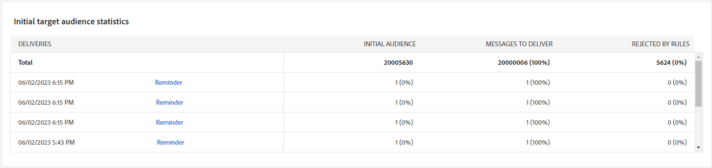

# Informes de campaña para el canal de correo electrónico {#campaign-reports-email-channel}

Cada informe de campaña se divide en diferentes widgets que detallan el éxito y los errores de la campaña. A continuación se describen los informes y las métricas del canal de correo electrónico. Obtenga información sobre cómo acceder a sus informes de campaña en [esta página](campaign-reports.md).

## Resumen de envíos {#delivery-summary-email}

>[!CONTEXTUALHELP]
>id="acw_campaign_reporting_deliveries_overview"
>title="Información general del envío"
>abstract="El **Resumen de entrega** proporciona indicadores clave de rendimiento (KPI) que proporcionan información detallada sobre cómo los visitantes interactúan con el envío de correo electrónico."

### Información general del envío {#delivery-summary-email-ovv}

El **[!UICONTROL Resumen de entrega]** Este informe proporciona indicadores clave de rendimiento (KPI) que proporcionan información detallada sobre cómo los visitantes interactúan con el envío de correo electrónico. Las métricas se detallan a continuación.

+++Obtenga más información sobre las métricas de informes de campañas de correo electrónico.

* **[!UICONTROL Total enviado]**: Número total de mensajes procesados durante la preparación de la entrega.

* **[!UICONTROL Entregado]**: Número de mensajes enviados correctamente en relación con el número total de mensajes enviados.

* **[!UICONTROL Devoluciones]**: Total de errores acumulados durante el envío y el procesamiento automático de devoluciones en relación con el número total de mensajes enviados.

* **[!UICONTROL Aperturas distintas]**: Número total de destinatarios objetivo que abrieron un mensaje al menos una vez.

* **[!UICONTROL Clics distintos]**: Número total de destinatarios diferentes que hicieron clic en una entrega al menos una vez.

+++

### Estadísticas del público inicial {#delivery-summary-email-initial-target}

>[!CONTEXTUALHELP]
>id="acw_campaign_reporting_deliveries_target"
>title="Estadísticas del público inicial"
>abstract="La tabla Initial target audience statistics muestra los datos relativos a los destinatarios"

El **[!UICONTROL Estadísticas de audiencia de destinatario inicial]** La tabla muestra datos relativos a los destinatarios. Las métricas se detallan a continuación.

+++Obtenga más información sobre las métricas de informes de campañas de correo electrónico.

* **[!UICONTROL Audiencia inicial]**: Número total de destinatarios objetivo.

* **[!UICONTROL Mensaje para enviar]**: Número total de mensajes que desea enviar después de la preparación de la entrega.

* **[!UICONTROL Rechazado por reglas]**: Número total de direcciones ignoradas durante el análisis al aplicar las reglas: direcciones faltantes, en cuarentena, en la lista de bloqueados, etc.

+++

### Estadísticas de ejecución {#delivery-summary-email-exec-stats}

>[!CONTEXTUALHELP]
>id="acw_campaign_reporting_email_exec_stats"
>title="Estadísticas de ejecución"
>abstract="El **Estadísticas de ejecución** Esta tabla detalla el éxito de su entrega: mensajes para entregar, éxito, errores y nuevas cuarentenas."

El **[!UICONTROL Estadísticas de ejecución]** La tabla detalla el éxito de su envío. Las métricas se detallan a continuación.

+++Obtenga más información sobre las métricas de informes de campañas de correo electrónico.

* **[!UICONTROL Mensaje para enviar]**: Número total de mensajes que desea enviar después de la preparación de la entrega.

* **[!UICONTROL Correcto]**: Número de mensajes procesados correctamente en relación con el número de mensajes que se van a enviar.

* **[!UICONTROL Errores]**: Número total de errores acumulados durante los envíos y el procesamiento automático de los rechazos en relación con el número de mensajes que se desea enviar.

* **[!UICONTROL Nuevas cuarentenas]**: Número total de direcciones en cuarentena después de un envío fallido (usuario desconocido, dominio no válido) en relación con el número de mensajes que se van a enviar.

+++

### Estadísticas de reacción {#delivery-summary-email-reaction-stats}

>[!CONTEXTUALHELP]
>id="acw_campaign_reporting_email_reaction_stats"
>title="Estadísticas de reacción"
>abstract="El **Estadísticas de reacción** La tabla muestra los datos disponibles de la actividad de destinatario para la entrega: número de aperturas, suscripciones, bajas, clic en el vínculo de la página espejo."

El **[!UICONTROL Estadísticas de reacción]** contiene los datos disponibles de la actividad de destinatario de su envío. Las métricas se detallan a continuación.

+++Obtenga más información sobre las métricas de informes de campañas de correo electrónico.

* **[!UICONTROL Aperturas distintas]**: Número total de destinatarios objetivo que abrieron un mensaje al menos una vez.

* **[!UICONTROL Opens]** : número de destinatarios objetivo diferentes para este dominio que han abierto un mensaje al menos una vez.

* **[!UICONTROL Baja de suscripciones]**: Número de destinatarios que hicieron clic en las bajas de suscripción durante el periodo correspondiente.

* **[!UICONTROL Página espejo]**: número de destinatarios que hicieron clic en el vínculo de la página espejo.

* **[!UICONTROL Reenvíos]**: número de destinatarios que hicieron clic y que reenviaron el correo electrónico.
+++

### Flujos de clics generados {#delivery-summary-email-click-streams}

>[!CONTEXTUALHELP]
>id="acw_campaign_reporting_email_click_streams"
>title="Flujos de clics generados"
>abstract="El **Flujos de clics generados** La tabla muestra los datos disponibles en relación con la interacción de los destinatarios con el envío."

El **[!UICONTROL Flujos de clics generados]** La tabla muestra datos relativos a la interacción de los destinatarios con el envío. Las métricas se detallan a continuación.

+++Obtenga más información sobre las métricas de informes de campañas de correo electrónico.

* **[!UICONTROL Clics distintos]**: Número total de destinatarios diferentes que hicieron clic en una entrega al menos una vez.

* **[!UICONTROL Hacer clic]**: Número total de clics en los vínculos de las entregas.

* **[!UICONTROL Reactivity]** : la proporción del número de destinatarios objetivo que han hecho clic en una entrega en relación con el número estimado de destinatarios objetivo que han abierto una entrega.

+++

## Envíos que no se pueden entregar {#non-deliverables-email}

### Desglose de errores por tipo {#delivery-summary-email-breakdown-per-type}

>[!CONTEXTUALHELP]
>id="acw_campaign_reporting_error_type"
>title="Desglose de errores por tipo"
>abstract="El **Desglose de errores por tipo** La tabla y el gráfico contienen los datos disponibles para cada tipo de error encontrado: usuario desconocido, buzón lleno, dominio no válido y más."

El **[!UICONTROL Desglose de errores por tipo]** tabla y gráfico contienen los datos disponibles para los posibles errores encontrados para cada tipo de dominio. Las métricas se detallan a continuación.

Los errores que se muestran en este informe activan el proceso de cuarentena. Para obtener más información sobre la administración de cuarentena, consulte [Documentación de Campaign v8 (consola de cliente)](https://experienceleague.adobe.com/docs/campaign/campaign-v8/campaigns/send/failures/delivery-failures.html?lang=es){target="_blank"}.

+++Obtenga más información sobre las métricas de informes de campañas de correo electrónico.

* **[!UICONTROL Usuario desconocido]**: Tipo de error generado durante la entrega para indicar que la dirección de correo electrónico no es válida.

* **[!UICONTROL Dominio no válido]**: Tipo de error generado al realizar una entrega para indicar que el dominio de la dirección de correo electrónico es incorrecto o no existe.

* **[!UICONTROL Buzón lleno]**: Tipo de error generado después de cinco intentos de entrega para indicar que la bandeja de entrada de los destinatarios contiene demasiados mensajes.

* **[!UICONTROL Cuenta deshabilitada]**: Tipo de error generado al realizar una entrega para indicar que la dirección ya no existe.

* **[!UICONTROL Rechazado]**: Tipo de error generado cuando el IAP (Proveedor de acceso a Internet) rechaza una dirección, por ejemplo, al aplicar una regla de seguridad (software antispam).

* **[!UICONTROL Inalcanzable]**: Tipo de error que se produce en la cadena de distribución de mensajes: incidencia en la retransmisión SMTP, dominio temporalmente inaccesible, etc.

* **[!UICONTROL No conectado]**: Tipo de error que indica que el teléfono móvil de los destinatarios está apagado o desconectado de la red en el momento de la entrega.

+++

### Desglose de errores por dominio {#delivery-summary-email-breakdown-per-domain}

>[!CONTEXTUALHELP]
>id="acw_campaign_reporting_error_domain"
>title="Desglose de errores por dominio"
>abstract="El **Desglose de errores por dominio** La tabla y el gráfico muestran los datos disponibles para cada tipo de error encontrado según cada dominio."

El **[!UICONTROL Desglose de errores por dominio]** La tabla y el gráfico contienen los datos disponibles para los posibles errores encontrados con cada dominio. Las métricas son comunes en **[!UICONTROL Desglose de errores por tipo]** tabla y gráfico detallados anteriormente.

## Indicadores de seguimiento {#tracking-indicators-email}

### Estadísticas de entrega {#delivery-summary-email-statistics}

>[!CONTEXTUALHELP]
>id="acw_delivery_campaign_delivery_statistics_summary"
>title="Estadísticas de entrega"
>abstract="El **Estadísticas de envío** El gráfico detalla el éxito de su envío y los errores que se han producido."

El **[!UICONTROL Estadísticas de envío]** Las métricas de proporcionan indicadores clave de rendimiento (KPI) que proporcionan información detallada sobre los datos disponibles para los correos electrónicos enviados. Las métricas se detallan a continuación.

+++Obtenga más información sobre las métricas de informes de campañas de correo electrónico.

* **[!UICONTROL Correcto]**: Número de mensajes procesados correctamente en relación con el número de mensajes que se van a enviar.

* **[!UICONTROL Aperturas distintas]**: Número total de destinatarios objetivo que abrieron un mensaje al menos una vez.

* **[!UICONTROL Opens]** : número de destinatarios objetivo diferentes para este dominio que han abierto un mensaje al menos una vez.

* **[!UICONTROL Clics en el vínculo de no participación]**: Número de clics en el vínculo de baja de suscripción.

* **[!UICONTROL Clicks on the mirror link]** : número de clics en el vínculo a la página espejo.

* **[!UICONTROL Estimation of forwards]** : estimación del número de correos electrónicos reenviados por los destinatarios objetivo.
+++

### Tasa de apertura y clics {#delivery-summary-open-rate}

>[!CONTEXTUALHELP]
>id="acw_campaign_reporting_open_clickthrough"
>title="Tasa de clics y de apertura"
>abstract="El **Tasa de apertura y clics** La tabla muestra datos relativos a la participación de los destinatarios en el envío."

El **[!UICONTROL Tasa de apertura y clics]** La tabla muestra datos relativos a los destinatarios. Las métricas se detallan a continuación.

+++Obtenga más información sobre las métricas de informes de campañas de correo electrónico.

* **[!UICONTROL Enviado]**: Número total de mensajes enviados.

* **[!UICONTROL Complaints]** : número de mensajes de este dominio que el destinatario ha notificado como no deseados.

* **[!UICONTROL Opens]** : número de destinatarios objetivo diferentes para este dominio que han abierto un mensaje al menos una vez.

* **[!UICONTROL Clicks]** : número de destinatarios objetivo diferentes que hicieron clic en el mismo entrega al menos una vez.

* **[!UICONTROL Raw reactivity]** : porcentaje del número de destinatarios que hicieron clic en una entrega al menos una vez comparado con el número de destinatarios que abrieron una entrega al menos una vez.
+++

## URL y flujos de clics {#url-email}

>[!CONTEXTUALHELP]
>id="acw_campaign_reporting_urls_clickstreams"
>title="URL y flujos de clics"
>abstract="El **URL y flujos de clics** Este informe proporciona indicadores clave de rendimiento (KPI) que proporcionan información detallada sobre las direcciones URL en las que se hizo clic con mayor frecuencia durante una entrega."

El **[!UICONTROL URL y flujos de clics]** Este informe proporciona indicadores clave de rendimiento (KPI) que proporcionan información detallada sobre las direcciones URL en las que se hizo clic con mayor frecuencia durante una entrega. Las métricas se detallan a continuación.

+++Obtenga más información sobre las métricas de informes de campañas de correo electrónico.

* **[!UICONTROL Reactivity]** : la proporción del número de destinatarios objetivo que han hecho clic en una entrega en relación con el número estimado de destinatarios objetivo que han abierto una entrega.

* **[!UICONTROL Clics distintos]**: Número total de destinatarios diferentes que hicieron clic en una entrega al menos una vez.

* **[!UICONTROL Hacer clic]**: Número total de clics en los vínculos de las entregas.

* **[!UICONTROL Platform average]** : la tasa promedio, mostrada debajo de cada tasa (reacción, distintos clics y clics acumulados), se calcula para los envíos realizados durante los seis meses anteriores. Solo se tienen en cuenta los envíos con la misma tipología y en el mismo canal. Se excluyen las pruebas.
+++

### Los 10 vínculos más visitados {#top10-campaign-report-email}

>[!CONTEXTUALHELP]
>id="acw_campaign_reporting_urls_clickstreams_top10"
>title="Los 10 vínculos más visitados"
>abstract="El **Los 10 vínculos más visitados** El gráfico y la tabla contienen los datos disponibles sobre el comportamiento del destinatario por vínculo."

El **[!UICONTROL Los 10 vínculos más visitados]** el gráfico y la tabla contienen los datos disponibles sobre el comportamiento del destinatario por vínculo. Las métricas se detallan a continuación.

+++Obtenga más información sobre las métricas de informes de campañas de correo electrónico.

* **[!UICONTROL Hacer clic]**: Número total de clics en los vínculos de las entregas.

* **[!UICONTROL Porcentaje]**: porcentaje de usuarios que interactuaron con el envío.

+++

### Desglose de clics a lo largo del tiempo {#campaign-report-email-breakdown-clicks}

>[!CONTEXTUALHELP]
>id="acw_delivery_campaign_urls_clickstreams_breakdown"
>title="Desglose de clics a lo largo del tiempo"
>abstract="El **Desglose de los clics a lo largo del tiempo** el gráfico muestra los datos disponibles del comportamiento del destinatario por vínculo."

el **[!UICONTROL Desglose de los clics a lo largo del tiempo]** El gráfico contiene los datos disponibles sobre el comportamiento del destinatario por vínculo.

## Actividades de usuario {#user-activities-email}

>[!CONTEXTUALHELP]
>id="acw_campaign_reporting_user_activities"
>title="Actividades del usuario"
>abstract="El **Actividades de usuario** El gráfico muestra el desglose de aperturas y clics en forma de gráfico."

El **[!UICONTROL Actividades de usuario]** Este informe muestra el desglose de aperturas y clics en forma de gráfico. Las métricas de este informe se detallan a continuación.

{align="center"}

+++ Obtenga más información sobre las métricas de informes de envío de correo electrónico.

* **[!UICONTROL Hacer clic]**: Número total de clics en los vínculos de las entregas.

* **[!UICONTROL Opens]** : número de destinatarios objetivo diferentes para este dominio que han abierto un mensaje al menos una vez.

+++
