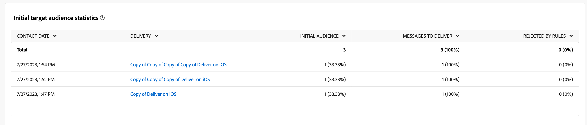
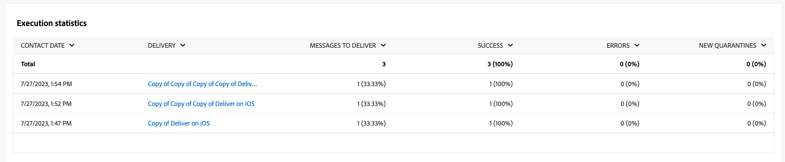

# Informes de campaña para el canal push {#campaign-reports-push-channel}

Cada informe de campaña se divide en diferentes widgets que detallan el éxito y los errores de la campaña. A continuación se describen los informes y las métricas del canal push. Obtenga información sobre cómo acceder a sus informes de campaña en [esta página](campaign-reports.md).

## Resumen de envíos {#delivery-summary-push}

>[!CONTEXTUALHELP]
>id="acw_campaign_reporting_push_deliveries_overview"
>title="Información general del envío"
>abstract="El **Resumen de entrega** Este informe proporciona indicadores clave de rendimiento (KPI) que proporcionan información detallada sobre cómo los visitantes interactúan con el envío de notificaciones push."

El **[!UICONTROL Resumen de entrega]** Este informe proporciona indicadores clave de rendimiento (KPI) que proporcionan información detallada sobre cómo los visitantes interactúan con el envío de notificaciones push. Las métricas se detallan a continuación.

+++Obtenga más información sobre las métricas de informes de campañas push.

* **[!UICONTROL Total enviado]**: Número total de mensajes procesados durante la preparación de la entrega.

* **[!UICONTROL Entregado]**: Número de mensajes enviados correctamente en relación con el número total de mensajes enviados.

* **[!UICONTROL Errores]**: Total de errores acumulados durante el envío y el procesamiento automático de devoluciones en relación con el número total de mensajes enviados.

* **[!UICONTROL Clics totales]**: Número total de destinatarios diferentes que hicieron clic en una entrega al menos una vez.

+++

### Estadísticas del público inicial {#delivery-summary-push-initial-target}

>[!CONTEXTUALHELP]
>id="acw_campaign_reporting_push_target"
>title="Estadísticas del público inicial"
>abstract="El **Estadísticas de audiencia de destinatario inicial** La tabla muestra datos relativos a los destinatarios"

El **[!UICONTROL Estadísticas de audiencia de destinatario inicial]** La tabla muestra datos relativos a los destinatarios. Las métricas se detallan a continuación.

+++Obtenga más información sobre las métricas de informes de campañas push.

* **[!UICONTROL Audiencia inicial]**: Número total de destinatarios objetivo.

* **[!UICONTROL Mensaje para enviar]**: Número total de mensajes que desea enviar después de la preparación de la entrega.

* **[!UICONTROL Rechazado por reglas]**: Número total de direcciones ignoradas durante el análisis al aplicar las reglas: direcciones faltantes, en cuarentena, en la lista de bloqueados, etc.

+++

### Estadísticas de ejecución {#delivery-summary-push-exec-stats}

>[!CONTEXTUALHELP]
>id="acw_campaign_reporting_push_exec_stats"
>title="Estadísticas de ejecución"
>abstract="El **Estadísticas de ejecución** Esta tabla detalla el éxito de su entrega: mensajes para entregar, éxito, errores y nuevas cuarentenas."

El **[!UICONTROL Estadísticas de ejecución]** La tabla detalla el éxito de su envío. Las métricas se detallan a continuación.

+++Obtenga más información sobre las métricas de informes de campañas push.

* **[!UICONTROL Mensaje para enviar]**: Número total de mensajes que desea enviar después de la preparación de la entrega.

* **[!UICONTROL Correcto]**: Número de mensajes procesados correctamente en relación con el número de mensajes que se van a enviar.

* **[!UICONTROL Errores]**: Número total de errores acumulados durante los envíos y el procesamiento automático de los rechazos en relación con el número de mensajes que se desea enviar.

* **[!UICONTROL Nuevas cuarentenas]**: Número total de direcciones en cuarentena después de una entrega fallido (registro no válido, rechazo de mensaje, error de carga útil, por ejemplo). en relación con el número de mensajes que se van a enviar.

  Los tipos de error de notificaciones push se enumeran en [Documentación de Adobe Campaign v8 (consola de cliente)](https://experienceleague.adobe.com/docs/campaign/campaign-v8/send/failures/delivery-failures.html#push-error-types){target="_blank"}.

+++

### Flujos de clics generados {#delivery-summary-push-click-streams}

>[!CONTEXTUALHELP]
>id="acw_campaign_reporting_push_click_streams"
>title="Flujos de clics generados"
>abstract="El **Flujos de clics generados** La tabla muestra los datos disponibles en relación con la interacción de los destinatarios con el envío."

El **[!UICONTROL Flujos de clics generados]** La tabla muestra datos relativos a la interacción de los destinatarios con el envío. Las métricas se detallan a continuación.

+++Obtenga más información sobre las métricas de informes de campañas push.

* **[!UICONTROL Clics únicos]**: Número total de destinatarios diferentes que hicieron clic en una entrega al menos una vez.

* **[!UICONTROL Clics totales]**: Número total de clics en los vínculos de los envíos.

* **[!UICONTROL Reactivity]** : la proporción del número de destinatarios objetivo que han hecho clic en una entrega en relación con el número estimado de destinatarios objetivo que han abierto una entrega.

+++
