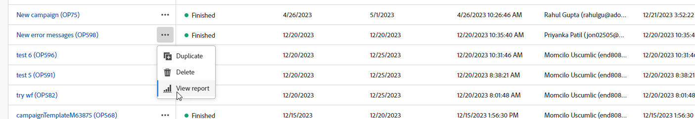

# Introducción a los informes de campaña {#campaign-reports}

Los **informes de campaña** ofrecen una descripción general completa de la **campaña**, que incluye toda la información pertinente sobre los distintos envíos incluidos. Estos informes ofrecen un análisis exhaustivo del rendimiento de cada envío por canal: tasa de éxito, participación del público y otras métricas esenciales. Le permiten evaluar la eficacia y el impacto generales de la campaña.

La lista completa de informes y las métricas asociadas para cada canal están disponibles en las siguientes páginas:

* [Canal de campaña de correo electrónico](campaign-reports-email.md)
* [Canal de campaña de SMS](campaign-reports-sms.md)
* [Canal de campaña push](campaign-reports-push.md)
* [Canal de campaña de correo directo](campaign-reports-direct-mail.md)

## Administrar el tablero de informes {#manage-reports}

Para acceder y administrar los informes de campaña, siga estos pasos:

1. Vaya al menú **[!UICONTROL Campañas]**. Haga clic en el botón **Informes** del panel de campañas.

   {zoomable="yes"}

   También puede usar el botón de tres puntos **Más acciones** junto al nombre de la campaña en la lista de campañas y seleccionar **[!UICONTROL Ver informe]**.

   {zoomable="yes"}

1. En el menú de la izquierda, seleccione un informe de la lista y navegue por la pestaña para mostrar los datos de cada canal.

   {zoomable="yes"}

1. En el tablero, haga clic en **[!UICONTROL Seleccionar entregas]** si desea segmentar una entrega específica incluida en la campaña.

1. En el menú **[!UICONTROL Rendimiento de entrega]**, elija un **Inicio** y **[!UICONTROL Hora de finalización]** para segmentar datos específicos.

   {zoomable="yes"}

1. En el campo **[!UICONTROL Seleccionar carpeta]**, seleccione si desea segmentar envíos o campañas desde una carpeta específica.

   También puede seleccionar **[!UICONTROL Agregar reglas]** para empezar a crear consultas y filtrar mejor los datos de informes. [Aprenda a utilizar el modelador de consultas](../query/query-modeler-overview.md)

   {zoomable="yes"}

1. Entre las **[!UICONTROL URL y los flujos de clics]**, también puedes elegir los **[!UICONTROL vínculos más visitados]** o el **[!UICONTROL período de tiempo]**.

   Las opciones de **[!UICONTROL Ver por]** le permiten filtrar por direcciones URL, etiquetas o categorías.
