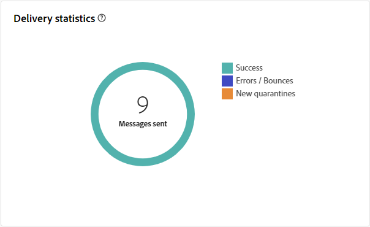

# Informe del envío externo {#direct-mail-report}

El **informe de envío externo** proporciona información y datos completos específicos de su envío externo. Incluye información detallada sobre el rendimiento, la eficacia y los resultados de los envíos individuales, y ofrece una visión general completa.

El siguiente informe se describe en el contexto del correo postal. También está disponible para el centro de llamadas y para canales externos personalizados.

## Resumen de envíos {#delivery-summary-direct-mail}

### Información general sobre el envío {#delivery-overview-direct-mail}

>[!CONTEXTUALHELP]
>id="acw_delivery_reporting_delivery_overview_direct_mail"
>title="Información general sobre el envío"
>abstract="La **Información general de entrega** presenta métricas clave de rendimiento (KPI) que ofrecen información exhaustiva sobre la interacción de los visitantes con cada envío de correo directo. Las métricas se describen a continuación."

La **[!UICONTROL descripción general de la entrega]** proporciona información detallada sobre las interacciones de los visitantes con cada entrega de correo directo, mostrando las métricas clave de rendimiento (KPI) esenciales. Las métricas se describen a continuación.

{zoomable="yes"}{align="center"}

+++Más información sobre las Métricas de información general de entrega.

* **[!UICONTROL Mensajes para entregar]**: Número total de mensajes procesados durante la preparación de la entrega.
* **[!UICONTROL Segmentado]**: número de perfiles de usuario que se califican como perfiles de destino para los mensajes de correo postal.
* **[!UICONTROL Para excluir]**: número de perfiles de usuario excluidos de los perfiles de destino que no recibirán mensajes de correo postal.
+++

### Población de público destinatario inicial {#direct-mail-delivery-targeted-population}

>[!CONTEXTUALHELP]
>id="acw_delivery_reporting_initial_target_direct_mail"
>title="Población de público destinatario inicial"
>abstract="El gráfico **Población de público destinatario inicial** muestra datos relativos a los destinatarios y los mensajes, en función de los resultados de la preparación de envíos."

El gráfico **[!UICONTROL Población de destinatarios iniciales]** muestra datos relacionados con los destinatarios. Las métricas se calculan durante la preparación de la entrega e incluyen la audiencia inicial, el número de mensajes que se van a enviar y el número de destinatarios excluidos.

{zoomable="yes"}

Pase el ratón sobre una parte del gráfico para ver el número exacto.

{zoomable="yes"}

+++Obtenga más información sobre las métricas de informes de envío de correo directo.

* **[!UICONTROL Audiencia inicial]**: Número total de destinatarios objetivo.
* **[!UICONTROL Para entregar]**: Número total de mensajes que se enviarán después de la preparación de la entrega.
* **[!UICONTROL Exclusión]**: número total de destinatarios excluidos de la población objetivo.
+++

### Estadísticas de envío {#direct-mail-delivery-stats}

>[!CONTEXTUALHELP]
>id="acw_delivery_reporting_delivery_statistics_summary_direct_mail"
>title="Estadísticas de envío"
>abstract="El gráfico **Estadísticas de envío** detalla el éxito de su envío de correo directo y los errores que se han producido."

El gráfico de **[!UICONTROL estadísticas de envío]** proporciona una descripción general del rendimiento del envío y métricas detalladas para medir el éxito y la eficacia.

{zoomable="yes"}

+++Obtenga más información sobre las métricas de informes de campañas de correo directo.

* **[!UICONTROL Mensaje enviado]**: Número total de mensajes que se enviarán después de la preparación del envío.
* **[!UICONTROL Éxito]**: número de mensajes procesados correctamente comparado con el número de mensajes que se van a enviar.
* **[!UICONTROL Errores]**: Número total de errores acumulados durante las entregas y el procesamiento automático de los rechazos en comparación con el número de mensajes que se van a enviar.
* **[!UICONTROL Nuevas cuarentenas]**: Número total de direcciones en cuarentena después de una entrega fallido (por ejemplo, usuario desconocido, dominio no válido) comparado con el número de mensajes que se van a enviar.
+++

### Causas de exclusión {#direct-mail-delivery-exclusions}

>[!CONTEXTUALHELP]
>id="acw_delivery_reporting_causes_exclusion_direct_mail"
>title="Causas de exclusión de entrega"
>abstract="El gráfico **Causas de exclusión** ilustra la distribución de mensajes rechazados durante la preparación de la entrega, clasificados por cada regla."

El gráfico **[!UICONTROL Causas de exclusión]** proporciona un desglose de los motivos del rechazo del mensaje durante la preparación de la entrega. Este desglose está organizado por varias reglas, lo que ofrece una vista detallada de los factores que contribuyen a la exclusión de mensajes. Las reglas de exclusión se detallan en la [documentación de Campaign v8 (consola)](https://experienceleague.adobe.com/docs/campaign/campaign-v8/send/failures/delivery-failures.html?lang=es#email-error-types){_blank}.

{zoomable="yes"}{align="center" zoomable="yes"}

+++Más información sobre las Causas de las métricas de exclusión.

* **[!UICONTROL Dirección en cuarentena]**: Tipo de error generado cuando una dirección se pone en cuarentena.
* **[!UICONTROL Dirección no especificada]**: Tipo de error generado cuando una dirección no existe.
* **[!UICONTROL Dirección de mala calidad]**: Tipo de error generado cuando la clasificación de calidad de la dirección postal es demasiado baja.
* **[!UICONTROL Dirección Incluir en la lista de bloqueados incluida en la lista de bloqueados]**: Tipo de error generado cuando el destinatario se durante la entrega.
* **[!UICONTROL Double]**: Tipo de error generado cuando se excluyó al destinatario debido a valores de clave no únicos.
* **[!UICONTROL Grupo de control]**: la dirección del destinatario forma parte del grupo de control.
* **[!UICONTROL Destino de tamaño limitado]**: Se alcanzó el tamaño máximo de envío para el destinatario.
+++

### Exclusiones {#direct-mail-exclusions}

>[!CONTEXTUALHELP]
>id="acw_delivery_reporting_exclusions_direct_mail"
>title="Exclusiones"
>abstract="El gráfico **[!UICONTROL Exclusiones]** muestra un desglose detallado, por regla, de los mensajes rechazados durante el proceso de preparación de la entrega."

La tabla **[!UICONTROL Exclusions]** proporciona un desglose detallado, clasificado por reglas específicas, de los mensajes rechazados durante la preparación de la entrega. Este desglose ofrece una comprensión clara de los motivos que subyacen a las exclusiones de mensajes.

{zoomable="yes"}{align="center" zoomable="yes"}

Las métricas disponibles son las mismas que para las [causas de exclusión](#direct-mail-delivery-exclusions) descritas anteriormente.