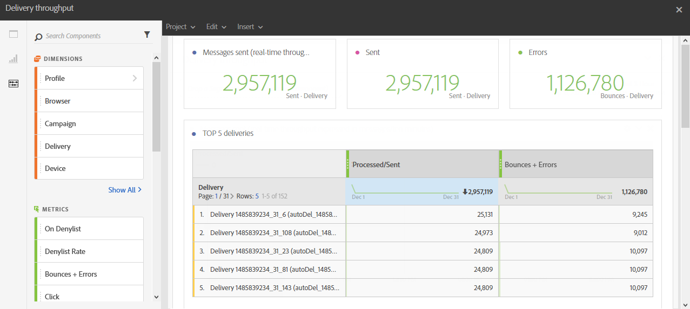

# Rendimiento del envío{#delivery-throughput}

Este informe contiene datos relacionados con el rendimiento de entrega de un envío o de varios envíos. Proporciona lo siguiente:

* Número de mensajes procesados por hora
* La tabla **[!UICONTROL Principales 5 envíos]** y los números de resumen complementarios que muestran los cinco envíos con la mejor ganancia en reintentos.

>[!NOTE]
>
>La página **[!UICONTROL Delivery throughput]** muestra la velocidad de rendimiento para el reenvío de sus mensajes desde Campaign hasta el MTA mejorado de Adobe Campaign (Agente de transferencia de mensajes).
