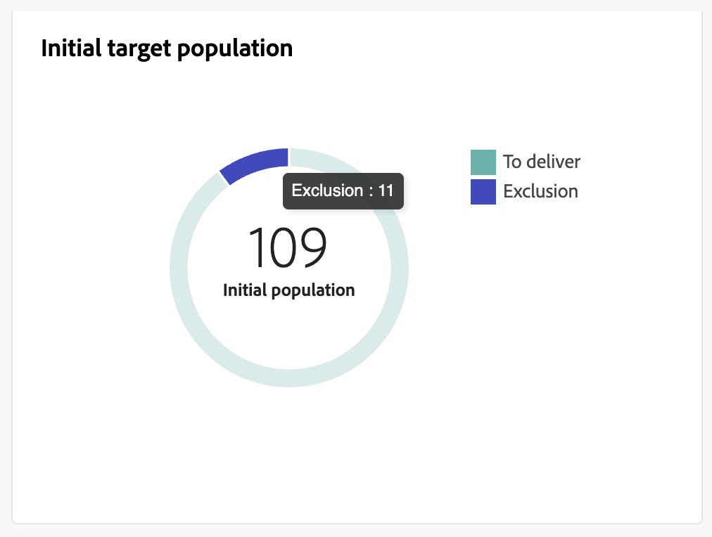
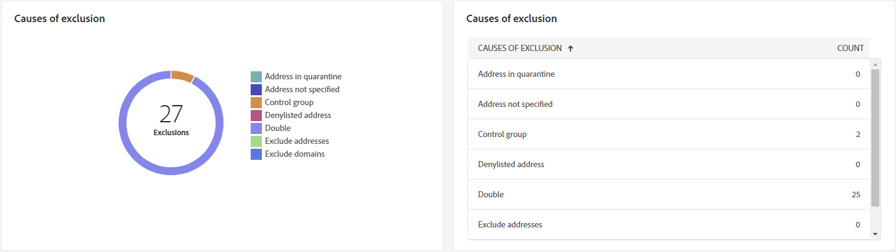
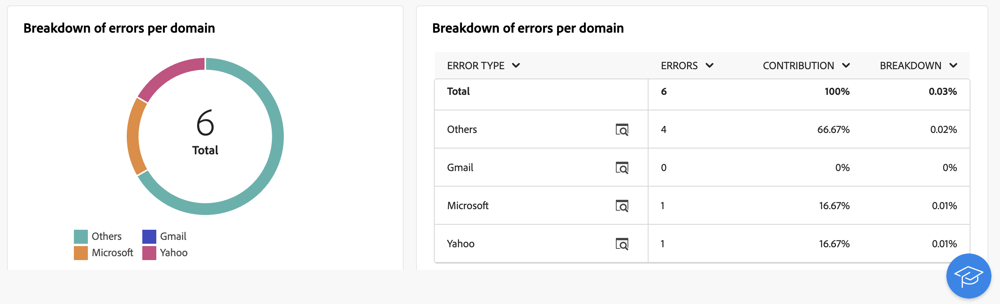
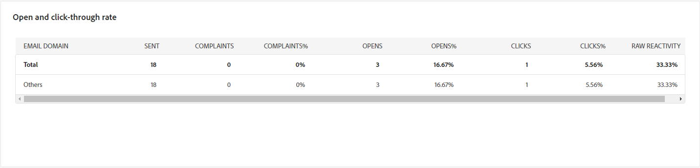
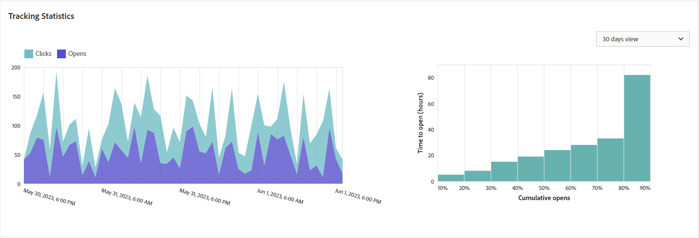

# Informe de envío de correo electrónico {#email-report}

El **Informe de envío de correo electrónico** ofrece información y datos completos específicos del canal de correo electrónico. Proporciona información detallada sobre el rendimiento, la eficacia y los resultados de sus envíos individuales, lo que le proporciona una visión general completa.

## Resumen de envíos {#delivery-summary-email}

>[!CONTEXTUALHELP]
>id="acw_delivery_reporting_sending_email"
>title="Envío de creación de informes"
>abstract="La pestaña **Envío** dentro del informe proporciona una perspectiva detallada de las interacciones de los visitantes con los envíos y cualquier posible error que hayan encontrado."

### Población de público destinatario inicial {#email-delivery-targeted-population}

>[!CONTEXTUALHELP]
>id="acw_delivery_reporting_initial_target"
>title="Población de público destinatario inicial"
>abstract="El gráfico **Población de público destinatario inicial** muestra datos relativos a los destinatarios y los mensajes, en función de los resultados de la preparación de envíos."

El **[!UICONTROL Población de destinatarios iniciales]** El gráfico muestra datos relativos a los destinatarios. Las métricas se calculan durante la preparación de la entrega y muestran: la audiencia inicial, el número de mensajes que se van a enviar y el número de destinatarios excluidos.

{zoomable="yes"}

Pase el ratón sobre una parte del gráfico para ver el número exacto.

{zoomable="yes"}

+++ Obtenga más información sobre las métricas de informes de envío de correo electrónico.

* **[!UICONTROL Audiencia inicial]**: Número total de destinatarios objetivo.

* **[!UICONTROL Para enviar]**: Número total de mensajes que desea enviar después de la preparación de la entrega.

* **[!UICONTROL Exclusión]**: Número total de destinatarios excluidos de la población objetivo.
+++

### Estadísticas de envío {#email-delivery-stats}

>[!CONTEXTUALHELP]
>id="acw_delivery_reporting_delivery_statistics_summary"
>title="Estadísticas de envío"
>abstract="El gráfico **Estadísticas de envío** detalla el éxito de su envío y los errores que se han producido."

El **[!UICONTROL Estadísticas de envío]** el gráfico detalla el éxito de su envío. Las métricas se detallan a continuación.

{zoomable="yes"}

+++Obtenga más información sobre las métricas de informes de campañas de correo electrónico.

* **[!UICONTROL Mensaje enviado]**: Número total de mensajes que desea enviar después de la preparación de la entrega.

* **[!UICONTROL Correcto]**: Número de mensajes procesados correctamente en relación con el número de mensajes que se van a enviar.

* **[!UICONTROL Errores]**: Número total de errores acumulados durante los envíos y el procesamiento automático de los rechazos en relación con el número de mensajes que se desea enviar.

* **[!UICONTROL Nuevas cuarentenas]**: Número total de direcciones en cuarentena después de un envío fallido (usuario desconocido, dominio no válido) en relación con el número de mensajes que se van a enviar.

+++

### Causas de exclusión  {#email-delivery-exclusions}

>[!CONTEXTUALHELP]
>id="acw_delivery_reporting_exclusion"
>title="Causas de exclusión de entrega"
>abstract="El gráfico y la tabla **Causas de exclusión** muestran el desglose por regla de mensajes rechazados durante la preparación del envío."

El **[!UICONTROL Causas de exclusión]** el gráfico y la tabla muestran el desglose por regla de mensajes rechazados durante la preparación de la entrega. Las reglas de exclusión se detallan en la sección [Documentación de Campaign v8 (consola)](https://experienceleague.adobe.com/docs/campaign/campaign-v8/send/failures/delivery-failures.html#email-error-types){_blank}.

{zoomable="yes"}{align="center" zoomable="yes"}

+++ Obtenga más información sobre las métricas de informes de envío de correo electrónico.

* **[!UICONTROL Usuario desconocido]**: Tipo de error generado durante el envío para indicar que la dirección de correo electrónico no es válida.

* **[!UICONTROL Dominio no válido]**: Tipo de error generado al realizar un envío para indicar que el dominio de la dirección de correo electrónico es incorrecto o no existe.

* **[!UICONTROL Buzón lleno]**: Tipo de error generado después de cinco intentos de entrega para indicar que la bandeja de entrada de los destinatarios contiene demasiados mensajes.

* **[!UICONTROL Cuenta deshabilitada]**: Tipo de error generado al realizar un envío para indicar que la dirección ya no existe.

* **[!UICONTROL Rechazado]**: Tipo de error generado cuando el IAP (Proveedor de acceso a Internet) rechaza una dirección, por ejemplo, al aplicar una regla de seguridad (software antispam).

* **[!UICONTROL Inaccesible]**: Tipo de error que se produce en la cadena de distribución de mensajes: incidente en la retransmisión SMTP, dominio temporalmente inaccesible, etc

* **[!UICONTROL Sin conexión]**: Tipo de error que indica que el teléfono móvil de los destinatarios está apagado o desconectado de la red en el momento de la entrega.

+++

## Rendimiento del envío {#delivery-throughtput}

>[!CONTEXTUALHELP]
>id="acw_delivery_reporting_throughput_email"
>title="Rendimiento del envío"
>abstract="El informe **Rendimiento del envío** presenta información detallada sobre el rendimiento del envío de toda la plataforma en un período de tiempo especificado."

Este informe presenta información detallada sobre el rendimiento de entrega de toda la plataforma en un periodo de tiempo especificado. La métrica principal utilizada para medir la velocidad de envío de mensajes es el número de mensajes enviados por hora.

{zoomable="yes"}{align="center" zoomable="yes"}

## Estadísticas de difusión {#broadcast-statistics}

>[!CONTEXTUALHELP]
>id="acw_delivery_reporting_broadcast_statistics"
>title="Estadísticas de difusión"
>abstract="El informe **Estadísticas de difusión** contiene los datos disponibles sobre los posibles errores encontrados con cada dominio."

El **[!UICONTROL Estadísticas de difusión]** contiene los datos disponibles de los posibles errores encontrados con cada dominio. Las métricas se detallan a continuación.

{zoomable="yes"}{align="center" zoomable="yes"}

+++ Obtenga más información sobre las métricas de informes de envío de correo electrónico.

* **[!UICONTROL Correos electrónicos procesados]**: Número total de mensajes procesados por el servidor de envío.

* **[!UICONTROL Entregado]**: porcentaje del número de mensajes procesados correctamente comparado con el número total de mensajes procesados.

* **[!UICONTROL Rechazos graves]**: porcentaje del número de rechazos &quot;graves&quot; y errores permanentes, como una dirección de correo electrónico incorrecta, comparado con el número total de mensajes procesados.

* **[!UICONTROL Rechazos leves]**: porcentaje del número de rechazos &quot;leves&quot;, errores temporales como una bandeja de entrada llena, comparado con el número total de mensajes procesados

* **[!UICONTROL Aperturas]**: porcentaje del número de destinatarios objetivo que abrieron un mensaje al menos una vez comparado con el número de mensajes procesados correctamente.

* **[!UICONTROL Clics]**: porcentaje del número de personas que hizo clic en una entrega al menos una vez comparado con el número de mensajes procesados correctamente.

* **[!UICONTROL Baja de suscripciones]**: porcentaje del número de clics en un vínculo de baja de suscripción comparado con el número de mensajes procesados correctamente.
+++

## Envíos que no se pueden entregar {#non-deliverables-email}

### Desglose de errores por tipo {#email-delivery-breakdown-type}

>[!CONTEXTUALHELP]
>id="acw_delivery_reporting_error_type"
>title="Desglose de errores por tipo"
>abstract="El gráfico **Desglose de errores por tipo** contiene los datos disponibles para cada tipo de error encontrado: usuario desconocido, buzón lleno, dominio inválido y mucho más."

>[!CONTEXTUALHELP]
>id="acw_delivery_reporting_error_type_table"
>title="Desglose de errores por tipo"
>abstract="La tabla **Desglose de errores por tipo** proporciona un desglose completo de la ocurrencia de cada tipo de error."

El **[!UICONTROL Desglose de errores por tipo]** La tabla y el gráfico contienen los datos disponibles para el tipo de error. Las métricas se detallan a continuación.

Los errores que se muestran en este informe activan el proceso de cuarentena. Para obtener más información sobre la administración de cuarentena, consulte [Documentación de Campaign v8 (consola de cliente)](https://experienceleague.adobe.com/docs/campaign/campaign-v8/campaigns/send/failures/delivery-failures.html){target="_blank"}.

{zoomable="yes"}{align="left" zoomable="yes"}

+++ Obtenga más información sobre las métricas de informes de envío de correo electrónico.

* **[!UICONTROL Usuario desconocido]**: Tipo de error generado durante el envío para indicar que la dirección de correo electrónico no es válida.

* **[!UICONTROL Dominio no válido]**: Tipo de error generado al realizar un envío para indicar que el dominio de la dirección de correo electrónico es incorrecto o no existe.

* **[!UICONTROL Buzón lleno]**: Tipo de error generado después de cinco intentos de entrega para indicar que la bandeja de entrada de los destinatarios contiene demasiados mensajes.

* **[!UICONTROL Cuenta deshabilitada]**: Tipo de error generado al realizar un envío para indicar que la dirección ya no existe.

* **[!UICONTROL Rechazado]**: Tipo de error generado cuando el IAP (Proveedor de acceso a Internet) rechaza una dirección, por ejemplo, al aplicar una regla de seguridad (software antispam).

* **[!UICONTROL Inaccesible]**: Tipo de error que se produce en la cadena de distribución de mensajes: incidente en la retransmisión SMTP, dominio temporalmente inaccesible, etc

* **[!UICONTROL Sin conexión]**: Tipo de error que indica que el teléfono móvil de los destinatarios está apagado o desconectado de la red en el momento de la entrega.

+++

### Desglose de errores por dominio {#email-delivery-breakdown-domain}

>[!CONTEXTUALHELP]
>id="acw_delivery_reporting_error_domain"
>title="Desglose de errores por dominio"
>abstract="El gráfico **Desglose de errores por dominio** muestra los datos disponibles para cada tipo de error encontrado según cada dominio."

>[!CONTEXTUALHELP]
>id="acw_delivery_reporting_error_domain_table"
>title="Desglose de errores por dominio"
>abstract="La tabla **Desglose de errores por dominio** proporciona un desglose completo de la ocurrencia de cada error según el dominio utilizado."

El **[!UICONTROL Desglose de errores por dominio]** La tabla y el gráfico muestran los datos disponibles para detectar los posibles errores encontrados con cada dominio.

{zoomable="yes"}{align="left" zoomable="yes"}

Haga clic en el icono situado junto al nombre de cada dominio para ver los detalles.

{zoomable="yes"}{align="left" zoomable="yes"}

Las métricas disponibles son las mismas que para el [Desglose de errores por tipo](#email-delivery-breakdown-type) descrito anteriormente.

## Indicadores de seguimiento {#tracking-indicators-email}

>[!CONTEXTUALHELP]
>id="acw_delivery_reporting_tracking_email"
>title="Seguimiento de creación de informes"
>abstract="La pestaña **Seguimiento** dentro de su informe ofrece datos valiosos, incluido el comportamiento de los destinatarios por vínculo, el desglose de aperturas y clics, así como información detallada sobre las direcciones URL donde se hace clic con más frecuencia durante un envío."

### Estadísticas de envío  {#email-tracking-delivery-stats}

>[!CONTEXTUALHELP]
>id="acw_delivery_reporting_delivery_statistics_indicators"
>title=" Estadísticas de envío"
>abstract="El informe **Estadísticas de envío** proporciona indicadores clave de rendimiento (KPI) que proporcionan información detallada sobre los datos disponibles para los correos electrónicos enviados: éxito, aperturas, clics, etc."

El **[!UICONTROL Estadísticas de envío]** Este informe proporciona indicadores clave de rendimiento (KPI) que proporcionan información detallada sobre los datos disponibles para los correos electrónicos enviados. Las métricas se detallan a continuación.

{zoomable="yes"}{align="center"}

+++ Obtenga más información sobre las métricas de informes de envío de correo electrónico.

* **[!UICONTROL Correcto]**: Número de mensajes procesados correctamente en relación con el número de mensajes que se van a enviar.

* **[!UICONTROL Aperturas distintas]**: Número total de destinatarios objetivo que abrieron un mensaje al menos una vez.

* **[!UICONTROL Aperturas]**: número de destinatarios objetivo diferentes para este dominio que han abierto un mensaje al menos una vez.

* **[!UICONTROL Clics en el vínculo de no participación]**: Número de clics en el vínculo de baja de suscripción.

* **[!UICONTROL Clics en el vínculo reflejado]**: Número de clics en el vínculo a la página espejo.

* **[!UICONTROL Estimación de reenvíos]**: Estimación del número de correos electrónicos reenviados por los destinatarios objetivo.
+++

### Tasa de clics y de aperturas {#email-tracking-click-through}

>[!CONTEXTUALHELP]
>id="acw_delivery_reporting_open_clickthrough"
>title="Tasa de clics y de aperturas"
>abstract="La tabla **Tasa de clics y de aperturas** muestra datos relativos ao engajamento dos recipients com a entrega."

El **[!UICONTROL Tasa de apertura y clics]** La tabla muestra datos relativos a los destinatarios. Las métricas se detallan a continuación.

{zoomable="yes"}{align="center"}

+++ Obtenga más información sobre las métricas de informes de envío de correo electrónico.

* **[!UICONTROL Enviado]**: Número total de mensajes enviados.

* **[!UICONTROL Reclamaciones]**: número de mensajes de este dominio que el destinatario ha notificado como no deseados.

* **[!UICONTROL Aperturas]**: número de destinatarios objetivo diferentes para este dominio que han abierto un mensaje al menos una vez.

* **[!UICONTROL Clics]**: número de destinatarios objetivo diferentes que hicieron clic en el mismo envío al menos una vez.

* **[!UICONTROL Reactividad sin procesar]**: porcentaje del número de destinatarios que hicieron clic en una entrega al menos una vez comparado con el número de destinatarios que abrieron una entrega al menos una vez.
+++

## URL y flujos de clics {#url-email}

>[!CONTEXTUALHELP]
>id="acw_delivery_reporting_urls_clickstreams"
>title="URL y flujos de clics"
>abstract="El informe de **URL y flujos de clics** proporciona indicadores clave de rendimiento (KPI) que proporcionan información detallada sobre las direcciones URL en las que se hizo clic con mayor frecuencia durante un envío."

El informe de **[!UICONTROL URL y flujos de clics]** proporciona indicadores clave de rendimiento (KPI) que proporcionan información detallada sobre las direcciones URL en las que se hizo clic con mayor frecuencia durante un envío.

{zoomable="yes"}{align="center"}

+++ Obtenga más información sobre las métricas de informes de envío de correo electrónico.

* **[!UICONTROL Reactividad]**: la proporción del número de destinatarios objetivo que han hecho clic en una entrega en relación con el número estimado de destinatarios objetivo que han abierto una entrega.

* **[!UICONTROL Clics distintos]**: Número total de destinatarios diferentes que hicieron clic en una entrega al menos una vez.

* **[!UICONTROL Clics]**: Número total de clics en los vínculos de los envíos.

* **[!UICONTROL Platform average]** : la tasa promedio, mostrada debajo de cada tasa (reacción, distintos clics y clics acumulados), se calcula para los envíos realizados durante los seis meses anteriores. Solo se tienen en cuenta los envíos con la misma tipología y en el mismo canal. Se excluyen las pruebas.

+++

### Los 10 vínculos más visitados {#email-tracking-top10}

>[!CONTEXTUALHELP]
>id="acw_delivery_reporting_urls_clickstreams_top10"
>title="Los 10 vínculos más visitados"
>abstract="El gráfico y la tabla **Los 10 vínculos más visitados** contienen los datos disponibles sobre el comportamiento del destinatario por vínculo."

El gráfico y la tabla **[!UICONTROL Los 10 vínculos más visitados]** contienen los datos disponibles sobre el comportamiento del destinatario por vínculo.

{zoomable="yes"}{align="center"}

+++ Obtenga más información sobre las métricas de informes de envío de correo electrónico.

* **[!UICONTROL Clics]**: Número total de clics en los vínculos de los envíos.

* **[!UICONTROL Porcentaje]**: porcentaje de usuarios que interactuaron con el envío.

+++

### Desglose de los clics con el tiempo {#email-tracking-breakdown-over-time}

>[!CONTEXTUALHELP]
>id="acw_delivery_reporting_urls_click_breakdown"
>title="Desglose de los clics con el tiempo"
>abstract="El gráfico **Desglose de clics a lo largo del tiempo** muestra los datos disponibles del comportamiento del destinatario por vínculo."

El **[!UICONTROL Desglose de los clics a lo largo del tiempo]** El gráfico contiene los datos disponibles sobre el comportamiento del destinatario por vínculo.

{zoomable="yes"}{align="center"}

## Actividades del usuario {#user-activities-email}

>[!CONTEXTUALHELP]
>id="acw_delivery_reporting_user_activities"
>title="Actividades del usuario"
>abstract="El gráfico **Actividades de usuario** muestra el desglose de aperturas y clics en forma de gráfico. Puede elegir el período de tiempo para el que desea obtener los datos: último día, última hora o últimos 30 minutos."

El **[!UICONTROL Actividades de usuario]** Este informe muestra el desglose de aperturas y clics en forma de gráfico. Puede elegir el período de tiempo para el que desea obtener los datos: último día, última hora o últimos 30 minutos.

{zoomable="yes"}{align="center"}

+++ Obtenga más información sobre las métricas de informes de envío de correo electrónico.

* **[!UICONTROL Clics]**: Número total de clics en los vínculos de los envíos.

* **[!UICONTROL Aperturas]**: número de destinatarios objetivo diferentes para este dominio que han abierto un mensaje al menos una vez.

+++

## Estadísticas de seguimiento {#tracking-statistics}

>[!CONTEXTUALHELP]
>id="acw_delivery_reporting_statistics"
>title="Estadísticas de seguimiento"
>abstract="El gráfico **Estadísticas de seguimiento** proporciona estadísticas sobre aperturas y clics. Tiene la opción de seleccionar el lapso de tiempo específico para los datos de segmentación."

El gráfico **[!UICONTROL Estadísticas de seguimiento]** proporciona estadísticas sobre aperturas y clics. Tiene la opción de seleccionar el lapso de tiempo específico para los datos de segmentación.

{zoomable="yes"}{align="center"}

+++ Obtenga más información sobre las métricas de informes de envío de correo electrónico.

* **[!UICONTROL Clics]**: Número total de clics en los vínculos de los envíos.

* **[!UICONTROL Aperturas]**: número de destinatarios objetivo diferentes para este dominio que han abierto un mensaje al menos una vez.

+++

## Desglose de aperturas {#breakdown-opens}

### Desglose de aperturas por dispositivo {#breakdown-opens-devices}

>[!CONTEXTUALHELP]
>id="acw_delivery_reporting_breakdown_device"
>title="Desglose por dispositivo"
>abstract="El informe **Desglose por dispositivo** muestra el desglose de las aperturas por dispositivo durante el período. Para cada categoría se utilizan dos gráficos. El primero muestra estadísticas relacionadas con las aperturas en un ordenador y en dispositivos móviles. El segundo muestra el número exacto y el porcentaje para cada tipo de dispositivo."

El **Desglose por dispositivo** Este informe muestra el desglose de aperturas por dispositivo durante el periodo: equipos personales, dispositivos Android, dispositivos Apple u otros.

Para cada categoría se utilizan dos gráficos. El primero muestra estadísticas relacionadas con las aperturas en un ordenador y en dispositivos móviles. El segundo muestra el número exacto y el porcentaje para cada tipo de dispositivo.

{zoomable="yes"}{align="center"}

### Desglose de aperturas por sistema operativo {#breakdown-opens-os}

>[!CONTEXTUALHELP]
>id="acw_delivery_reporting_breakdown_os"
>title="Desglose por sistema operativo"
>abstract="El informe **Desglose por sistema operativo** muestra el desglose de las aperturas por sistema operativo durante el período correspondiente. El primer gráfico muestra las estadísticas relacionadas con las aperturas en un equipo y en dispositivos móviles. El segundo muestra el número exacto y el porcentaje de cada sistema operativo."

El **Desglose por sistema operativo** Este informe muestra el desglose de aperturas por sistema operativo durante el periodo: sistemas Windows, Android, iOS u otros.

Para cada categoría se utilizan dos gráficos. El primero muestra estadísticas relacionadas con las aperturas en un ordenador y en sistemas operativos móviles. El segundo muestra el número exacto y el porcentaje de cada sistema operativo.

{zoomable="yes"}{align="center"}

### Desglose de aperturas por explorador {#breakdown-opens-browser}

>[!CONTEXTUALHELP]
>id="acw_delivery_reporting_breakdown_browser"
>title="Desglose por explorador"
>abstract="El **Desglose por explorador** muestra el desglose de aperturas por explorador para el período. El primer gráfico muestra las estadísticas relacionadas con las aperturas en un equipo y en dispositivos móviles. El segundo muestra el número exacto y el porcentaje de cada explorador."

El **Desglose por explorador** Este informe muestra el desglose de aperturas por navegador: Chrome, Safari, Internet Explorer y más.

Para cada categoría se utilizan dos gráficos. El primero muestra estadísticas relacionadas con las aperturas en un ordenador y en sistemas operativos móviles. El segundo muestra el número exacto y el porcentaje de cada explorador.

{zoomable="yes"}{align="center"}

## Hotclicks {#hotclicks}

>[!CONTEXTUALHELP]
>id="acw_delivery_reporting_hotclicks"
>title="Informe de clics interactivos"
>abstract="El informe de **clics interactivos** muestra el contenido del mensaje (HTML o texto) con el porcentaje de clics en cada vínculo. Los bloques de personalización, los vínculos baja, los vínculos de páginas espejo y los vínculos de ofertas se tienen en cuenta en el total de clics acumulados, pero no se muestran en el informe."

Este informe muestra el contenido del mensaje (HTML o texto) con el porcentaje de clics en los vínculos, por cada vínculo. Los bloques de personalización, los vínculos baja, los vínculos de páginas espejo y los vínculos de ofertas se tienen en cuenta en el total de clics acumulados, pero no se muestran en el informe.

{zoomable="yes"}
