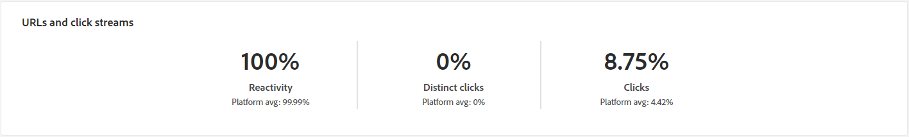

# Informe de envío de correo electrónico {#email-report}

El **Informe de envío de correo electrónico** ofrece información y datos completos específicos del canal de correo electrónico. Proporciona información detallada sobre el rendimiento, la eficacia y los resultados de sus envíos individuales, lo que le proporciona una visión general completa.

## Resumen de envíos {#delivery-summary-email}

>[!CONTEXTUALHELP]
>id="acw_delivery_reporting_sending_email"
>title="Informes que envían"
>abstract="él **Enviando** dentro del informe proporciona una perspectiva detallada de las interacciones de los visitantes con las entregas y cualquier posible error que hayan encontrado."

>[!CONTEXTUALHELP]
>id="acw_delivery_reporting_initial_target"
>title="Widget de población de destino inicial"
>abstract="El **Población de audiencia de destinatario inicial** El gráfico muestra datos relativos a los destinatarios y al éxito de la entrega."

>[!CONTEXTUALHELP]
>id="acw_delivery_reporting_delivery_statistics_summary"
>title="Widget de estadísticas de envío"
>abstract="El **Estadísticas de envío** El gráfico detalla el éxito de su envío y los errores que se han producido."

>[!CONTEXTUALHELP]
>id="acw_delivery_reporting_exclusion"
>title="Widget de estadísticas de envío"
>abstract="El gráfico y la tabla Causas de exclusión muestran el desglose por regla de mensajes rechazados durante la preparación."

* **[!UICONTROL Población de audiencia de destinatario inicial]** El gráfico muestra datos relativos a los destinatarios:

  {align="left" zoomable="yes"}

  +++ Obtenga más información sobre las métricas de informes de envío de correo electrónico.

   * **[!UICONTROL Audiencia inicial]**: Número total de destinatarios objetivo.

   * **[!UICONTROL Para enviar]**: Número total de mensajes que desea enviar después de la preparación de la entrega.

   * **[!UICONTROL Exclusión]**: Número total de mensajes excluidos del destinatario enviado.
+++

* **[!UICONTROL Estadísticas de envío]** el gráfico detalla el éxito de su envío.

  {align="left"}

  +++Obtenga más información sobre las métricas de informes de campañas de correo electrónico.

   * **[!UICONTROL Mensaje enviado]**: Número total de mensajes que desea enviar después de la preparación de la entrega.

   * **[!UICONTROL Correcto]**: Número de mensajes procesados correctamente en relación con el número de mensajes que se van a enviar.

   * **[!UICONTROL Errores]**: Número total de errores acumulados durante los envíos y el procesamiento automático de los rechazos en relación con el número de mensajes que se desea enviar.

   * **[!UICONTROL Nuevas cuarentenas]**: Número total de direcciones en cuarentena después de un envío fallido (usuario desconocido, dominio no válido) en relación con el número de mensajes que se van a enviar.

+++

* **[!UICONTROL Causas de exclusión]** el gráfico y la tabla muestran el desglose por regla de mensajes rechazados durante el análisis.

  {align="center"}

  +++ Obtenga más información sobre las métricas de informes de envío de correo electrónico.

   * **[!UICONTROL Usuario desconocido]**: Tipo de error generado durante la entrega para indicar que la dirección de correo electrónico no es válida.

   * **[!UICONTROL Dominio no válido]**: Tipo de error generado al realizar una entrega para indicar que el dominio de la dirección de correo electrónico es incorrecto o no existe.

   * **[!UICONTROL Buzón lleno]**: Tipo de error generado después de cinco intentos de entrega para indicar que la bandeja de entrada de los destinatarios contiene demasiados mensajes.

   * **[!UICONTROL Cuenta deshabilitada]**: Tipo de error generado al realizar una entrega para indicar que la dirección ya no existe.

   * **[!UICONTROL Rechazado]**: Tipo de error generado cuando el IAP (Proveedor de acceso a Internet) rechaza una dirección, por ejemplo, al aplicar una regla de seguridad (software antispam).

   * **[!UICONTROL Inalcanzable]**: Tipo de error que se produce en la cadena de distribución de mensajes: incidencia en la retransmisión SMTP, dominio temporalmente inaccesible, etc.

   * **[!UICONTROL No conectado]**: Tipo de error que indica que el teléfono móvil de los destinatarios está apagado o desconectado de la red en el momento de la entrega.

+++

## Rendimiento del envío {#delivery-throughtput}

>[!CONTEXTUALHELP]
>id="acw_delivery_reporting_throughput_email"
>title="Widget de rendimiento del envío"
>abstract="El **Rendimiento del envío** Este informe presenta información detallada sobre el rendimiento de entrega de toda la plataforma en un periodo de tiempo especificado."

Este informe presenta información detallada sobre el rendimiento de entrega de toda la plataforma en un periodo de tiempo especificado. La métrica principal utilizada para medir la velocidad de entrega de mensajes es el número de mensajes enviados por hora.

## Estadísticas de difusión {#broadcast-statistics}

>[!CONTEXTUALHELP]
>id="acw_delivery_reporting_broadcast_statistics"
>title="Widget de estadísticas de difusión"
>abstract="El **Estadísticas de difusión** contiene los datos disponibles de los posibles errores encontrados con cada dominio."

* **[!UICONTROL Estadísticas de difusión]** contiene los datos disponibles de los posibles errores encontrados con cada dominio.

  {align="center"}

  +++ Obtenga más información sobre las métricas de informes de envío de correo electrónico.

   * **[!UICONTROL Correos electrónicos procesados]**: Número total de mensajes procesados por el servidor de envío.

   * **[!UICONTROL Entregado]**: porcentaje del número de mensajes procesados correctamente comparado con el número total de mensajes procesados.

   * **[!UICONTROL Rechazos graves]**: porcentaje del número de rechazos &quot;graves&quot; y errores permanentes, como una dirección de correo electrónico incorrecta, comparado con el número total de mensajes procesados.

   * **[!UICONTROL Rechazos leves]**: porcentaje del número de rechazos &quot;leves&quot;, errores temporales como una bandeja de entrada llena, comparado con el número total de mensajes procesados

   * **[!UICONTROL Aperturas]**: porcentaje del número de destinatarios objetivo que abrieron un mensaje al menos una vez comparado con el número de mensajes procesados correctamente.

   * **[!UICONTROL Clics]**: porcentaje del número de personas que hizo clic en una entrega al menos una vez comparado con el número de mensajes procesados correctamente.

   * **[!UICONTROL Baja de suscripciones]**: porcentaje del número de clics en un vínculo de baja de suscripción comparado con el número de mensajes procesados correctamente.
+++

## Rechazos y no entregables {#non-deliverables-email}

>[!CONTEXTUALHELP]
>id="acw_delivery_reporting_error_type"
>title="Desglose de errores por tipo de widget"
>abstract="El **Desglose de errores por tipo** La tabla y el gráfico contienen los datos disponibles para cada tipo de error encontrado."

>[!CONTEXTUALHELP]
>id="acw_delivery_reporting_error_domain"
>title="Desglose de errores por widget de dominio"
>abstract="El **Desglose de errores por dominio** La tabla y el gráfico contienen los datos disponibles para cada tipo de error encontrado según cada dominio."

* **[!UICONTROL Desglose de errores por tipo]** y **[!UICONTROL Desglose de errores por dominio]** Las tablas y los gráficos contienen los datos disponibles para detectar posibles errores encontrados con cada dominio.

  Los errores que se muestran en este informe activan el proceso de cuarentena. Para obtener más información sobre la administración de cuarentena, consulte [Documentación de Campaign v8 (consola de cliente)](https://experienceleague.adobe.com/docs/campaign/campaign-v8/campaigns/send/failures/delivery-failures.html?lang=es){target="_blank"}.

  

  +++ Obtenga más información sobre las métricas de informes de envío de correo electrónico.

   * **[!UICONTROL Usuario desconocido]**: Tipo de error generado durante la entrega para indicar que la dirección de correo electrónico no es válida.

   * **[!UICONTROL Dominio no válido]**: Tipo de error generado al realizar una entrega para indicar que el dominio de la dirección de correo electrónico es incorrecto o no existe.

   * **[!UICONTROL Buzón lleno]**: Tipo de error generado después de cinco intentos de entrega para indicar que la bandeja de entrada de los destinatarios contiene demasiados mensajes.

   * **[!UICONTROL Cuenta deshabilitada]**: Tipo de error generado al realizar una entrega para indicar que la dirección ya no existe.

   * **[!UICONTROL Rechazado]**: Tipo de error generado cuando el IAP (Proveedor de acceso a Internet) rechaza una dirección, por ejemplo, al aplicar una regla de seguridad (software antispam).

   * **[!UICONTROL Inalcanzable]**: Tipo de error que se produce en la cadena de distribución de mensajes: incidencia en la retransmisión SMTP, dominio temporalmente inaccesible, etc.

   * **[!UICONTROL No conectado]**: Tipo de error que indica que el teléfono móvil de los destinatarios está apagado o desconectado de la red en el momento de la entrega.

+++

## Indicadores de seguimiento {#tracking-indicators-email}

>[!CONTEXTUALHELP]
>id="acw_delivery_reporting_tracking_email"
>title="Seguimiento de creación de informes"
>abstract="El **Seguimiento** dentro de su informe ofrece datos valiosos, incluido el comportamiento de los destinatarios por vínculo, el desglose de aperturas y clics, así como información detallada sobre las direcciones URL donde se hace clic con más frecuencia durante una entrega."

>[!CONTEXTUALHELP]
>id="acw_delivery_reporting_delivery_statistics_indicators"
>title=" Widget de estadísticas de envío"
>abstract="El **Estadísticas de envío** El widget proporciona indicadores clave de rendimiento (KPI) que proporcionan información detallada sobre los datos disponibles para los correos electrónicos enviados."

>[!CONTEXTUALHELP]
>id="acw_delivery_reporting_open_clickthrough"
>title="Widget de tasa de apertura y clics"
>abstract="El **Tasa de apertura y clics** La tabla muestra datos relativos a la participación de los destinatarios en el envío."

* **[!UICONTROL Estadísticas de envío]** proporciona indicadores clave de rendimiento (KPI) que proporcionan información detallada sobre los datos disponibles para los correos electrónicos enviados.

  {align="center"}

  +++ Obtenga más información sobre las métricas de informes de envío de correo electrónico.

   * **[!UICONTROL Correcto]**: Número de mensajes procesados correctamente en relación con el número de mensajes que se van a enviar.

   * **[!UICONTROL Aperturas distintas]**: Número total de destinatarios objetivo que abrieron un mensaje al menos una vez.

   * **[!UICONTROL Opens]** : número de destinatarios objetivo diferentes para este dominio que han abierto un mensaje al menos una vez.

   * **[!UICONTROL Clics en el vínculo de no participación]**: Número de clics en el vínculo de baja de suscripción.

   * **[!UICONTROL Clicks on the mirror link]** : número de clics en el vínculo a la página espejo.

   * **[!UICONTROL Estimation of forwards]** : estimación del número de correos electrónicos reenviados por los destinatarios objetivo.
+++

* **[!UICONTROL Tasa de apertura y clics]** La tabla muestra datos relativos a los destinatarios.

  {align="center"}

  +++ Obtenga más información sobre las métricas de informes de envío de correo electrónico.

   * **[!UICONTROL Enviado]**: Número total de mensajes enviados.

   * **[!UICONTROL Complaints]** : número de mensajes de este dominio que el destinatario ha notificado como no deseados.

   * **[!UICONTROL Opens]** : número de destinatarios objetivo diferentes para este dominio que han abierto un mensaje al menos una vez.

   * **[!UICONTROL Clicks]** : número de destinatarios objetivo diferentes que hicieron clic en el mismo entrega al menos una vez.

   * **[!UICONTROL Raw reactivity]** : porcentaje del número de destinatarios que hicieron clic en una entrega al menos una vez comparado con el número de destinatarios que abrieron una entrega al menos una vez.
+++

## URL y flujos de clics {#url-email}

>[!CONTEXTUALHELP]
>id="acw_delivery_reporting_urls_clickstreams"
>title="Widget de URL y flujos de clics"
>abstract="El **URL y flujos de clics** proporciona indicadores clave de rendimiento (KPI) que proporcionan información detallada sobre las direcciones URL en las que más se hizo clic durante una entrega."

* **[!UICONTROL URL y flujos de clics]** proporciona indicadores clave de rendimiento (KPI) que proporcionan información detallada sobre las direcciones URL en las que más se hizo clic durante una entrega.

  {align="center"}

  +++ Obtenga más información sobre las métricas de informes de envío de correo electrónico.

   * **[!UICONTROL Reactivity]** : la proporción del número de destinatarios objetivo que han hecho clic en una entrega en relación con el número estimado de destinatarios objetivo que han abierto una entrega.

   * **[!UICONTROL Clics distintos]**: Número total de destinatarios diferentes que hicieron clic en una entrega al menos una vez.

   * **[!UICONTROL Hacer clic]**: Número total de clics en los vínculos de las entregas.

   * **[!UICONTROL Platform average]** : la tasa promedio, mostrada debajo de cada tasa (reacción, distintos clics y clics acumulados), se calcula para los envíos realizados durante los seis meses anteriores. Solo se tienen en cuenta los envíos con la misma tipología y en el mismo canal. Se excluyen las pruebas.

+++

* **[!UICONTROL Los 10 vínculos más visitados]** el gráfico y la tabla contienen los datos disponibles sobre el comportamiento del destinatario por vínculo.

  {align="center"}

  +++ Obtenga más información sobre las métricas de informes de envío de correo electrónico.

   * **[!UICONTROL Hacer clic]**: Número total de clics en los vínculos de las entregas.

   * **[!UICONTROL Porcentaje]**: porcentaje de usuarios que interactuaron con el envío.

+++

* **[!UICONTROL Desglose de los clics a lo largo del tiempo]** El gráfico contiene los datos disponibles sobre el comportamiento del destinatario por vínculo.

  {align="center"}

## Actividades de usuario {#user-activities-email}

>[!CONTEXTUALHELP]
>id="acw_delivery_reporting_user_activities"
>title="Widget de actividades de usuario"
>abstract="El **Actividades de usuario** El gráfico muestra el desglose de aperturas y clics en forma de gráfico. Puede elegir el periodo de tiempo para los datos de destino: último día, hora o 30 minutos."

* **[!UICONTROL Actividades de usuario]** muestra el desglose de aperturas y clics en forma de gráfico. Puede elegir el periodo de tiempo para los datos de destino: último día, hora o 30 minutos.

  {align="center"}

  +++ Obtenga más información sobre las métricas de informes de envío de correo electrónico.

   * **[!UICONTROL Hacer clic]**: Número total de clics en los vínculos de las entregas.

   * **[!UICONTROL Opens]** : número de destinatarios objetivo diferentes para este dominio que han abierto un mensaje al menos una vez.

+++

## Estadísticas de seguimiento {#tracking-statistics}

>[!CONTEXTUALHELP]
>id="acw_delivery_reporting_statistics"
>title="Widget de estadísticas de seguimiento"
>abstract="El **Estadísticas de seguimiento** El gráfico proporciona estadísticas sobre aperturas y clics. Tiene la opción de seleccionar el lapso de tiempo específico para los datos de destino."

* **[!UICONTROL Estadísticas de seguimiento]** El gráfico proporciona estadísticas sobre aperturas y clics. Tiene la opción de seleccionar el lapso de tiempo específico para los datos de destino.

  {align="center"}

  +++ Obtenga más información sobre las métricas de informes de envío de correo electrónico.

   * **[!UICONTROL Hacer clic]**: Número total de clics en los vínculos de las entregas.

   * **[!UICONTROL Opens]** : número de destinatarios objetivo diferentes para este dominio que han abierto un mensaje al menos una vez.

+++

## Desglose de aperturas {#breakdown-opens}

>[!CONTEXTUALHELP]
>id="acw_delivery_reporting_breakdown_device"
>title="Desglose por dispositivo"
>abstract="El **Desglose por dispositivo** muestra el desglose de aperturas por tipo de dispositivo durante el periodo correspondiente. El primer gráfico muestra estadísticas relacionadas con las aperturas en un equipo y en dispositivos móviles. El segundo muestra estadísticas relacionadas únicamente con las aperturas en dispositivos móviles."

>[!CONTEXTUALHELP]
>id="acw_delivery_reporting_breakdown_os"
>title="Desglose por sistemas operativos"
>abstract="El **Desglose por sistema operativo** muestra el desglose de aperturas por sistema operativo durante el periodo correspondiente. El primer gráfico muestra estadísticas relacionadas con las aperturas en un equipo y en dispositivos móviles. El segundo muestra estadísticas relacionadas únicamente con las aperturas en dispositivos móviles."

Este informe muestra el desglose de aperturas por sistema operativo, dispositivo y navegador durante el periodo correspondiente. Para cada categoría se utilizan dos gráficos. El primero muestra estadísticas relacionadas con las aperturas en un ordenador y en dispositivos móviles. El segundo muestra estadísticas relacionadas únicamente con las aperturas en dispositivos móviles.

Tiene la flexibilidad de cambiar de **[!UICONTROL Corrección y móvil]** para segmentar exclusivamente **[!UICONTROL Solo móvil]** para una segmentación más precisa.

{align="center"}

## Hotclicks {#hotclicks}

>[!CONTEXTUALHELP]
>id="acw_delivery_reporting_hotclicks"
>title="Informe de clics interactivos"
>abstract="El **Hotclicks** presenta el contenido del correo electrónico (HTML o texto) con el porcentaje de clics en los vínculos, por cada vínculo. Los bloques personalizados, los vínculos de baja de suscripción, los vínculos de páginas espejo y los vínculos de ofertas se tienen en cuenta en el total de clics acumulados, pero no se muestran en el informe."

Este informe muestra el contenido del mensaje (HTML o texto) con el porcentaje de clics en los vínculos, por cada vínculo. Los bloques personalizados, los vínculos de baja de suscripción, los vínculos de páginas espejo y los vínculos de ofertas se tienen en cuenta en el total de clics acumulados, pero no se muestran en el informe.

