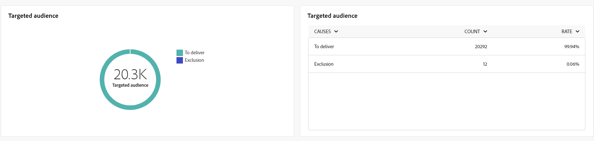

# Informes globales para el canal de correo postal {#global-report-direct}

Los informes globales proporcionan a los usuarios una visión general completa de las métricas de tráfico y participación a nivel de canal.

Vaya a **[!UICONTROL Informes]** menú dentro de **[!UICONTROL Informes]** sección. Puede filtrar los datos según la fecha, la carpeta o las reglas del informe. [Más información](global-reports.md)

## Resumen de envíos {#delivery-summary-direct}

### Información general sobre el envío {#delivery-overview-direct}

El **[!UICONTROL Resumen de entrega]** presenta métricas clave de rendimiento (KPI) que ofrecen información exhaustiva sobre la interacción de los visitantes con cada envío de correo electrónico. Las métricas se describen a continuación.

{align="center"}

+++Más información sobre las Métricas de información general de entrega.

* **[!UICONTROL Mensajes para enviar]**: Número total de mensajes procesados durante la preparación de la entrega.

* **[!UICONTROL Entregado]**: Número de mensajes enviados correctamente en relación con el número total de mensajes enviados.

* **[!UICONTROL Errores]**: Total de errores acumulados durante el envío y el procesamiento automático de devoluciones en relación con el número total de mensajes enviados.

* **[!UICONTROL Cancela la suscripción]**: Número de destinatarios que hicieron clic en las bajas de suscripción.
+++

### Público objetivo {#delivery-summary-direct-initial-target}

La tabla y el gráfico de **[!UICONTROL Audiencia objetivo]** Muestre datos relacionados con sus destinatarios, con las métricas detalladas que se proporcionan a continuación.

{align="center"}

+++Más información sobre las Métricas de audiencia segmentadas.

* **[!UICONTROL Audiencia objetivo]**: Número total de destinatarios objetivo.

* **[!UICONTROL Mensaje para enviar]**: Número total de mensajes que desea enviar después de la preparación de la entrega.

* **[!UICONTROL Exclusión]**: Número total de direcciones ignoradas durante el análisis al aplicar las reglas: direcciones faltantes, en cuarentena, en la lista de bloqueados, etc.

+++

### Estadísticas de envío {#delivery-summary-direct-exec-stats}

El **[!UICONTROL Estadísticas de envío]** proporciona un desglose del éxito de cada envío de correo postal, con las métricas detalladas que se describen a continuación.

{align="center"}

+++Más información sobre las Métricas de estadísticas de envío.

* **[!UICONTROL Mensaje para enviar]**: Número total de mensajes que desea enviar después de la preparación de la entrega.

* **[!UICONTROL Correcto]**: Número de mensajes procesados correctamente en relación con el número de mensajes que se van a enviar.

* **[!UICONTROL Errores/devoluciones]**: Número total de errores acumulados durante los envíos y el procesamiento automático de los rechazos en relación con el número de mensajes que se desea enviar.

* **[!UICONTROL Nuevas cuarentenas]**: Número total de direcciones en cuarentena después de un envío fallido (usuario desconocido, dominio no válido) en relación con el número de mensajes que se van a enviar.

+++

### Causas de exclusión {#causes-exclusion}

{align="center"}

El gráfico y la tabla Exclusiones ilustran los motivos que impidieron que los perfiles de usuario, excluidos de los perfiles de destino, recibieran el mensaje.

## Rendimiento del envío {#delivery-throughput}

Este informe proporciona detalles completos sobre el rendimiento del envío en un periodo de tiempo especificado. La métrica clave utilizada para medir la velocidad de entrega de mensajes es el número de mensajes enviados por hora.

## Envíos que no se pueden entregar {#non-deliverables-direct}

### Desglose de errores por tipo {#delivery-summary-direct-breakdown-per-type}

El **[!UICONTROL Desglose de errores por tipo]** La tabla y el gráfico presentan los datos relacionados con los posibles errores experimentados en varios dominios, con métricas específicas que se proporcionan a continuación.

Los errores que se muestran en este informe activan el proceso de cuarentena. Para obtener más información sobre la administración de cuarentena, consulte [Documentación de Campaign v8 (consola de cliente)](https://experienceleague.adobe.com/docs/campaign/campaign-v8/campaigns/send/failures/delivery-failures.html){target="_blank"}.

+++Obtenga más información sobre el desglose de errores por tipo de métrica.

* **[!UICONTROL Usuario desconocido]**: Tipo de error generado durante el envío para indicar que la dirección no es válida.

* **[!UICONTROL Dominio no válido]**: Tipo de error generado al realizar un envío para indicar que el dominio de la dirección es incorrecto o no existe.

* **[!UICONTROL Buzón lleno]**: Tipo de error generado después de cinco intentos de entrega para indicar que la bandeja de entrada de los destinatarios contiene demasiados mensajes.

* **[!UICONTROL Cuenta deshabilitada]**: Tipo de error generado al realizar un envío para indicar que la dirección ya no existe.

* **[!UICONTROL Rechazado]**: Tipo de error generado cuando el IAP (Proveedor de acceso a Internet) rechaza una dirección, por ejemplo, al aplicar una regla de seguridad (software antispam).

* **[!UICONTROL Inaccesible]**: Tipo de error que se produce en la cadena de distribución de mensajes: incidente en la retransmisión SMTP, dominio temporalmente inaccesible, etc

* **[!UICONTROL Sin conexión]**: Tipo de error que indica que el teléfono móvil de los destinatarios está apagado o desconectado de la red en el momento de la entrega.

+++

### Desglose de errores por dominio {#delivery-summary-email-breakdown-per-domain}

El **[!UICONTROL Desglose de errores por dominio]** La tabla y el gráfico muestran los datos relacionados con posibles errores dentro de cada dominio. Las métricas son comunes en **[!UICONTROL Desglose de errores por tipo]** tabla y gráfico detallados anteriormente.

