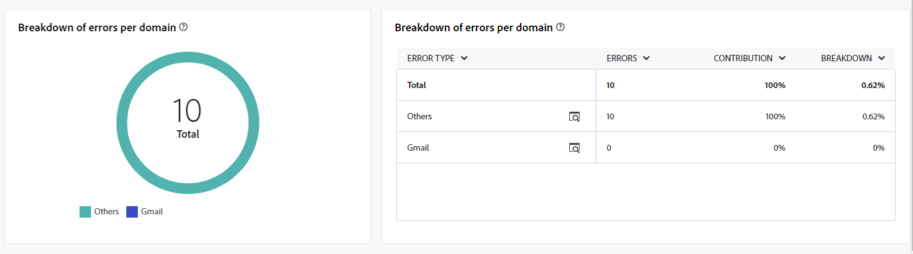
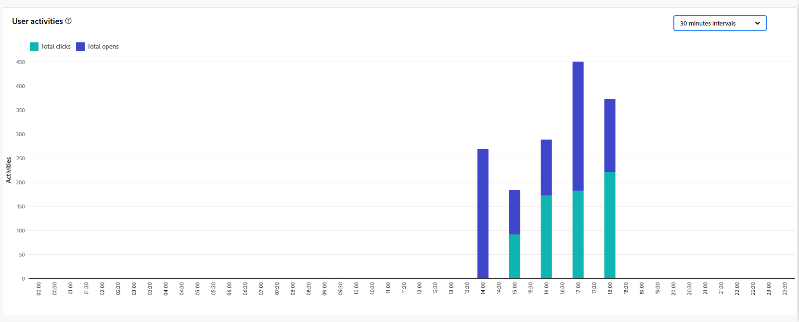

# Informes globales del canal de correo electrónico {#global-report-direct}

Los informes globales proporcionan a los usuarios una visión general completa de las métricas de tráfico y participación a nivel de canal.

Vaya al menú **[!UICONTROL Informes]** dentro de la sección **[!UICONTROL Informes]**. Puede filtrar los datos según la fecha, la carpeta o las reglas del informe. [Más información](global-reports.md)

## Resumen de envíos {#delivery-summary-email}

### Información general sobre el envío {#delivery-overview-email}

>[!CONTEXTUALHELP]
>id="acw_global_reporting_deliveries_overview_email"
>title="Información general sobre el envío"
>abstract="La **información general sobre el envío** proporciona indicadores clave de rendimiento (KPI) que ofrecen información detallada sobre cómo el público interactúa con el envío de correo electrónico y las campañas que envía."

La **[!UICONTROL descripción general de la entrega]** presenta métricas clave de rendimiento (KPI), que ofrecen información detallada sobre la interacción de los visitantes con cada envío de correo electrónico. Las métricas se describen a continuación.

{zoomable="yes"}{align="center"}

+++Más información sobre las Métricas de información general de entrega.

* **[!UICONTROL Mensajes para entregar]**: Número total de mensajes procesados durante la preparación de la entrega.

* **[!UICONTROL Entregado]**: número de mensajes enviados correctamente en relación con el número total de mensajes enviados.

* **[!UICONTROL Total opens]**: Número total de destinatarios objetivo que abrieron un mensaje al menos una vez.

* **[!UICONTROL Clics totales]**: Número total de destinatarios que hicieron clic en una entrega al menos una vez.

* **[!UICONTROL Devoluciones y errores]**: Total de errores acumulados durante el envío y el procesamiento automático de devoluciones en relación con el número total de mensajes enviados.

* **[!UICONTROL Cancelaciones de suscripciones]**: Número de destinatarios que hicieron clic en las cancelaciones de suscripciones.
+++

### Público objetivo {#delivery-summary-email-initial-target}

>[!CONTEXTUALHELP]
>id="acw_global_reporting_target_audience_email"
>title="Estadísticas de público destinatario inicial"
>abstract="La tabla y el gráfico **Público objetivo** ofrecen información detallada sobre la participación de los destinatarios, lo que le ayuda a evaluar la eficacia de sus campañas y envíos."

La tabla y el gráfico de **[!UICONTROL Audiencia objetivo]** muestran datos relacionados con sus destinatarios con métricas detalladas que se proporcionan a continuación.

{zoomable="yes"}{align="center"}

+++Más información sobre las Métricas de audiencia segmentadas.

* **[!UICONTROL Audiencia objetivo]**: Número total de destinatarios objetivo.

* **[!UICONTROL Mensaje para entregar]**: Número total de mensajes que se enviarán después de la preparación del envío.

* **[!UICONTROL Exclusión]**: número total de direcciones omitidas durante el análisis al aplicar reglas, como direcciones que faltan, en cuarentena o en lista de bloqueados de la.

+++

### Estadísticas de envío {#delivery-summary-email-delivery-stats}

>[!CONTEXTUALHELP]
>id="acw_global_reporting_email_delivery_stats"
>title="Estadísticas de envío"
>abstract="El gráfico y la tabla **Estadísticas de envíos** describen las métricas clave, incluidas las entregas correctas, los errores y las nuevas cuarentenas, y ofrecen información general concisa para evaluar el rendimiento de la entrega."

La tabla **[!UICONTROL Estadísticas de envío]** proporciona un desglose del éxito de cada envío de correo electrónico, con las métricas detalladas que se describen a continuación.

{zoomable="yes"}{align="center"}

+++Más información sobre las Métricas de estadísticas de envío.

* **[!UICONTROL Mensaje para entregar]**: Número total de mensajes que se enviarán después de la preparación del envío.

* **[!UICONTROL Éxito]**: número de mensajes procesados correctamente en relación con el número de mensajes que se van a enviar.

* **[!UICONTROL Errores / Devoluciones]**: Número total de errores acumulados durante las entregas y el procesamiento automático de los rechazos en relación con el número de mensajes que se van a enviar.

* **[!UICONTROL Nuevas cuarentenas]**: Número total de direcciones en cuarentena después de una entrega fallido (usuario desconocido, dominio no válido) en relación con el número de mensajes que se van a enviar.

+++

### Causas de exclusión {#causes-exclusion}

>[!CONTEXTUALHELP]
>id="acw_global_reporting_exclusion_email"
>title="Causas de exclusión"
>abstract="El gráfico y la tabla **Causas de exclusión** ilustran los motivos específicos de los rechazos de mensajes durante la preparación de la entrega, con un desglose detallado por regla."

{zoomable="yes"}{align="center"}

El gráfico y la tabla de exclusiones ilustran los motivos que impidieron que los perfiles de usuario, excluidos de los perfiles de destino, recibieran el mensaje.

Los tipos de error de correo electrónico se enumeran en la [documentación de Adobe Campaign v8 (consola de cliente)](https://experienceleague.adobe.com/docs/campaign/campaign-v8/send/failures/delivery-failures.html#email-error-types){target="_blank"}.

## Rendimiento del envío {#delivery-throughput}

>[!CONTEXTUALHELP]
>id="acw_global_reporting_throughput_email"
>title="Rendimiento del envío"
>abstract="El **Rendimiento del envío** ofrece información completa sobre el rendimiento del envío, destacando las tasas de éxito y error dentro de un período de tiempo especificado."

{zoomable="yes"}{align="center"}

El informe Delivery Throughput proporciona una visión detallada de la eficacia del proceso de entrega y presenta una visión general detallada de las tasas de éxito y error dentro de un periodo de tiempo especificado.

+++Obtenga más información sobre las métricas de rendimiento de entrega.

* **[!UICONTROL Éxito]**: número de mensajes procesados correctamente en relación con el número de mensajes que se van a enviar.

* **[!UICONTROL Errores]**: Número total de errores acumulados durante las entregas y el procesamiento automático de los rechazos en relación con el número de mensajes que se van a enviar.

+++

## Envíos que no se pueden entregar {#non-deliverables-email}

### Desglose de errores por tipo {#delivery-summary-email-breakdown-per-type}

>[!CONTEXTUALHELP]
>id="acw_global_reporting_error_type_email"
>title="Desglose de errores por tipo"
>abstract="La tabla y el gráfico que detallan el **Desglose de errores por tipo** incluye información sobre los distintos tipos de errores encontrados durante el proceso, como usuario desconocido, buzón lleno, dominio inválido y otros."

{zoomable="yes"}{align="center"}

La tabla y el gráfico **[!UICONTROL Desglose de errores por tipo]** presentan los datos relacionados con posibles errores experimentados en varios dominios, con métricas específicas que se proporcionan a continuación.

Los errores que se muestran en este informe activan el proceso de cuarentena. Para obtener más información sobre la administración de cuarentena, consulte la [documentación de Campaign v8 (consola de cliente)](https://experienceleague.adobe.com/docs/campaign/campaign-v8/campaigns/send/failures/delivery-failures.html){target="_blank"}.

+++Obtenga más información sobre el desglose de errores por tipo de métrica.

* **[!UICONTROL Usuario desconocido]**: Tipo de error generado durante la entrega para indicar que la dirección de correo electrónico no es válida.

* **[!UICONTROL Dominio no válido]**: Tipo de error generado al realizar una entrega para indicar que el dominio de la dirección de correo electrónico es incorrecto o no existe.

* **[!UICONTROL Buzón lleno]**: Tipo de error generado después de cinco intentos de entrega para indicar que la bandeja de entrada de los destinatarios contiene demasiados mensajes.

* **[!UICONTROL Cuenta deshabilitada]**: Tipo de error generado al realizar una entrega para indicar que la dirección ya no existe.

* **[!UICONTROL Rechazado]**: Tipo de error generado cuando el proveedor de acceso a Internet rechaza una dirección, por ejemplo, al aplicar una regla de seguridad (software antispam).

* **[!UICONTROL Inaccesible]**: Tipo de error que se produce en la cadena de distribución de mensajes, como un incidente en la retransmisión SMTP o un dominio temporalmente inaccesible.

* **[!UICONTROL No conectado]**: Tipo de error que indica que el teléfono móvil de los destinatarios está apagado o desconectado de la red en el momento de la entrega.

+++

### Desglose de errores por dominio {#delivery-summary-email-breakdown-per-domain}

>[!CONTEXTUALHELP]
>id="acw_global_reporting_error_domain_email"
>title="Desglose de errores por dominio"
>abstract="La tabla y el gráfico que ilustran el **Desglose de errores por dominio** presentan los datos correspondientes a cada tipo de error encontrado, clasificados por dominios específicos."

{zoomable="yes"}{align="center"}

La tabla y el gráfico **[!UICONTROL Desglose de errores por dominio]** muestran los datos relacionados con posibles errores dentro de cada dominio. Las métricas son comunes con la tabla **[!UICONTROL Desglose de errores por tipo]** y el gráfico detallado anteriormente.

## Indicadores de seguimiento {#tracking-indicators-email}

### Estadísticas de envío {#delivery-summary-email-statistics}

>[!CONTEXTUALHELP]
>id="acw_global_delivery_statistics_summary_email"
>title="Estadísticas de envío"
>abstract="Los indicadores clave de rendimiento (KPI) **Estadísticas de entrega** proporcionan una visión general del rendimiento de las entregas y las campañas, y ofrecen una perspectiva de las entregas exitosas, los errores encontrados y la participación del usuario."

Las métricas **[!UICONTROL Delivery statistics]** ofrecen indicadores clave de rendimiento (KPI), que proporcionan información detallada sobre los datos asociados con cada envío de correo electrónico. A continuación se proporcionan más detalles sobre estas métricas.

{zoomable="yes"}{align="center"}

+++Más información sobre las Métricas de estadísticas de envío.

* **[!UICONTROL Mensajes para entregar]**: Número total de mensajes procesados durante la preparación de la entrega.

* **[!UICONTROL Éxito]**: número de mensajes procesados correctamente en relación con el número de mensajes que se van a enviar.

* **[!UICONTROL Aperturas únicas]**: Número total de destinatarios objetivo que abrieron un mensaje al menos una vez.

* **[!UICONTROL Total de aperturas]**: Número de destinatarios objetivo diferentes para este dominio que han abierto un mensaje al menos una vez.

* **[!UICONTROL Clics en el vínculo de no participación]**: número de clics en el vínculo de baja de suscripción.

* **[!UICONTROL Clics en el vínculo reflejado]**: número de clics en el vínculo a la página espejo.

* **[!UICONTROL Estimación de reenvíos]**: Estimación del número de correos electrónicos reenviados por los destinatarios objetivo.
+++

### Tasa de clics y de aperturas {#delivery-summary-open-rate}

>[!CONTEXTUALHELP]
>id="acw_global_reporting_open_clickthrough_email"
>title="Tasa de clics y de aperturas"
>abstract="La tabla correspondiente a las **Tasas de clics y de aperturas** revela la participación de los destinatarios en su envío, mostrando datos sobre las tasas de clics y de aperturas para obtener una descripción general rápida y reveladora."

La tabla **[!UICONTROL Tasa de clics y aperturas]** muestra datos relativos a sus destinatarios. Las métricas se detallan a continuación.

{zoomable="yes"}{align="center"}

+++Obtenga más información sobre las métricas de tasa de pulsaciones y aperturas.

* **[!UICONTROL Enviado]**: Número total de mensajes enviados.

* **[!UICONTROL Quejas]**: número y porcentaje de mensajes de este dominio que el destinatario ha notificado como no deseados.

* **[!UICONTROL Aperturas únicas]**: Número y porcentaje de destinatarios objetivo diferentes para este dominio que han abierto un mensaje al menos una vez.

* **[!UICONTROL Clics únicos]**: Número y porcentaje de destinatarios objetivo diferentes que hicieron clic en el mismo envío al menos una vez.

* **[!UICONTROL Reactividad sin procesar]**: porcentaje del número de destinatarios que hicieron clic en una entrega al menos una vez comparado con el número de destinatarios que abrieron una entrega al menos una vez.
+++

## URL y flujos de clics {#url-email}

### Indicadores clave de rendimiento (KPI) de URL y flujos de clics {#url-email-kpis}

>[!CONTEXTUALHELP]
>id="acw_global_reporting_urls_clickstreams_email"
>title="URL y flujos de clics"
>abstract="El informe **URL y flujos de clics** proporciona indicadores clave de rendimiento (KPI) esenciales que brindan información detallada sobre las direcciones URL en las que se hizo clic con mayor frecuencia durante un envío."

El informe **[!UICONTROL URL y flujos de clics]** proporciona indicadores clave de rendimiento (KPI) y ofrece información detallada sobre las URL que recibieron el mayor número de clics durante una entrega. Las métricas se detallan a continuación.

{zoomable="yes"}{align="center"}

+++Obtenga más información sobre las métricas de URL y flujos de clics.

* **[!UICONTROL Reactividad]**: la proporción del número de destinatarios objetivo que han hecho clic en una entrega en relación con el número estimado de destinatarios objetivo que han abierto una entrega.

* **[!UICONTROL Clics únicos]**: Número total de destinatarios diferentes que hicieron clic en un envío al menos una vez.

* **[!UICONTROL Clics totales]**: Número total de clics en los vínculos de los envíos.

* **[!UICONTROL Platform average]**: la tasa promedio, mostrada debajo de cada tasa (reacción, distintos clics y clics acumulados), se calcula para los envíos realizados durante los seis meses anteriores. Solo se tienen en cuenta los envíos con la misma tipología y en el mismo canal. Se excluyen las pruebas.
+++

### Los 10 vínculos más visitados {#top10-global-report-email}

>[!CONTEXTUALHELP]
>id="acw_global_reporting_top10_email"
>title="Los 10 vínculos más visitados"
>abstract="Los **10 vínculos más visitados** presentan datos completos sobre la interacción del destinatario con cada vínculo."

El gráfico y la tabla **[!UICONTROL Los 10 vínculos más visitados]** contienen los datos disponibles sobre el comportamiento del destinatario por vínculo. Las métricas se detallan a continuación.

{zoomable="yes"}{align="center"}

+++Obtenga más información sobre las 10 métricas de vínculos más visitadas.

* **[!UICONTROL Clics totales]**: Número total de clics en los vínculos de los envíos.

* **[!UICONTROL Porcentaje]**: Porcentaje de usuarios que interactuaron con el envío.

+++

### Desglose de los clics con el tiempo {#global-report-email-breakdown-clicks}

>[!CONTEXTUALHELP]
>id="acw_global_reporting_urls_click_breakdown_email"
>title="Desglose de los clics con el tiempo"
>abstract="El gráfico **Desglose de los clics con el tiempo** ofrece una vista completa de cómo interactúan los destinatarios con los vínculos a lo largo del período de tiempo establecido."

El gráfico **[!UICONTROL Desglose de clics a lo largo del tiempo]** contiene los datos disponibles del comportamiento del destinatario por vínculo.

{zoomable="yes"}{align="center"}

## Actividades del usuario {#user-activities-email}

>[!CONTEXTUALHELP]
>id="acw_global_reporting_user_activities_email"
>title="Actividades del usuario"
>abstract="La representación gráfica de **Actividades del usuario** ofrece un desglose detallado de las interacciones de los destinatarios, que presenta las aperturas y los clics a través de un formato de gráfico informativo."

El informe **[!UICONTROL Actividades de usuario]** muestra el desglose de aperturas y clics en forma de gráfico. Las métricas de este informe se detallan a continuación.

{zoomable="yes"}{align="center"}

+++Más información sobre las Métricas de actividades de usuario.

* **[!UICONTROL Clics totales]**: Número total de clics en los vínculos de los envíos.

* **[!UICONTROL Total de aperturas]**: Número total de destinatarios objetivo diferentes para este dominio que han abierto un mensaje al menos una vez.

+++