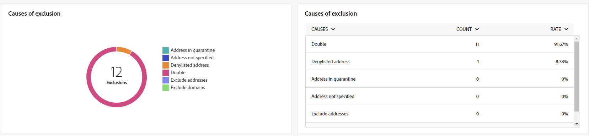

# Informes globales del canal de correo electrónico {#global-report-direct}

Los informes globales proporcionan a los usuarios una visión general completa de las métricas de tráfico y participación a nivel de canal.

Vaya a **[!UICONTROL Informes]** menú dentro de **[!UICONTROL Informes]** sección. Puede filtrar los datos según la fecha, la carpeta o las reglas del informe. [Más información](global-reports.md)

## Resumen de envíos {#delivery-summary-email}

### Información general sobre el envío {#delivery-overview-email}

>[!CONTEXTUALHELP]
>id="acw_global_reporting_deliveries_overview_email"
>title="Información general sobre el envío"
>abstract="El **Resumen de entrega** presenta indicadores clave de rendimiento (KPI) que ofrecen una perspectiva exhaustiva de cómo la audiencia interactúa con los envíos de correo electrónico y las campañas que envía."

El **[!UICONTROL Resumen de entrega]** presenta métricas clave de rendimiento (KPI) que ofrecen información exhaustiva sobre la interacción de los visitantes con cada envío de correo electrónico. Las métricas se describen a continuación.

{align="center"}

+++Más información sobre las Métricas de información general de entrega.

* **[!UICONTROL Mensajes para enviar]**: Número total de mensajes procesados durante la preparación de la entrega.

* **[!UICONTROL Entregado]**: Número de mensajes enviados correctamente en relación con el número total de mensajes enviados.

* **[!UICONTROL Aperturas totales]**: Número total de destinatarios objetivo que abrieron un mensaje al menos una vez.

* **[!UICONTROL Clics totales]**: Número total de destinatarios que hicieron clic en una entrega al menos una vez.

* **[!UICONTROL Devoluciones y errores]**: Total de errores acumulados durante el envío y el procesamiento automático de devoluciones en relación con el número total de mensajes enviados.

* **[!UICONTROL Cancela la suscripción]**: Número de destinatarios que hicieron clic en las bajas de suscripción.
+++

### Público objetivo {#delivery-summary-email-initial-target}

>[!CONTEXTUALHELP]
>id="acw_global_reporting_target_audience_email"
>title="Estadísticas de público destinatario inicial"
>abstract="El **Audiencia objetivo** la tabla y el gráfico ofrecen perspectivas sobre la participación de los destinatarios, lo que le ayuda a evaluar la eficacia de sus campañas y envíos."

La tabla y el gráfico de **[!UICONTROL Audiencia objetivo]** Muestre datos relacionados con sus destinatarios, con las métricas detalladas que se proporcionan a continuación.

{align="center"}

+++Más información sobre las Métricas de audiencia segmentadas.

* **[!UICONTROL Audiencia objetivo]**: Número total de destinatarios objetivo.

* **[!UICONTROL Mensaje para enviar]**: Número total de mensajes que desea enviar después de la preparación de la entrega.

* **[!UICONTROL Exclusión]**: Número total de direcciones ignoradas durante el análisis al aplicar las reglas: direcciones faltantes, en cuarentena, en la lista de bloqueados, etc.

+++

### Estadísticas de envío {#delivery-summary-email-delivery-stats}

>[!CONTEXTUALHELP]
>id="acw_global_reporting_email_delivery_stats"
>title="Estadísticas de envío"
>abstract="El **Estadísticas de envíos** el gráfico y la tabla describen las métricas clave, incluidas las entregas correctas, los errores y las nuevas cuarentenas, y ofrecen una visión general concisa para evaluar el rendimiento de la entrega."

El **[!UICONTROL Estadísticas de envío]** Esta tabla proporciona un desglose del éxito de cada envío de correo electrónico, con las métricas detalladas que se describen a continuación.

{align="center"}

+++Más información sobre las Métricas de estadísticas de envío.

* **[!UICONTROL Mensaje para enviar]**: Número total de mensajes que desea enviar después de la preparación de la entrega.

* **[!UICONTROL Correcto]**: Número de mensajes procesados correctamente en relación con el número de mensajes que se van a enviar.

* **[!UICONTROL Errores/devoluciones]**: Número total de errores acumulados durante los envíos y el procesamiento automático de los rechazos en relación con el número de mensajes que se desea enviar.

* **[!UICONTROL Nuevas cuarentenas]**: Número total de direcciones en cuarentena después de un envío fallido (usuario desconocido, dominio no válido) en relación con el número de mensajes que se van a enviar.

+++

### Causas de exclusión {#causes-exclusion}

>[!CONTEXTUALHELP]
>id="acw_global_reporting_exclusion_email"
>title="Causas de exclusión"
>abstract="El **Causas de exclusión** el gráfico y la tabla ilustran los motivos específicos de los rechazos de mensajes durante la preparación de la entrega, y ofrecen un desglose detallado por regla."

{align="center"}

El gráfico y la tabla Exclusiones ilustran los motivos que impidieron que los perfiles de usuario, excluidos de los perfiles de destino, recibieran el mensaje.

Los tipos de error de correo electrónico se enumeran en la [Documentación de Adobe Campaign v8 (consola de cliente)](https://experienceleague.adobe.com/docs/campaign/campaign-v8/send/failures/delivery-failures.html#email-error-types){target="_blank"}.

## Rendimiento del envío {#delivery-throughput}

>[!CONTEXTUALHELP]
>id="acw_global_reporting_throughput_email"
>title="Rendimiento del envío"
>abstract="Esta **Rendimiento del envío** ofrece información completa sobre el rendimiento del envío, destacando las tasas de éxito y error dentro de un periodo de tiempo especificado."

{align="center"}

El informe Delivery Throughput proporciona una visión detallada de la eficacia del proceso de entrega y presenta una visión general detallada de las tasas de éxito y error dentro de un periodo de tiempo especificado.

+++Obtenga más información sobre las métricas de rendimiento de entrega.

* **[!UICONTROL Correcto]**: Número de mensajes procesados correctamente en relación con el número de mensajes que se van a enviar.

* **[!UICONTROL Errores]**: Número total de errores acumulados durante los envíos y el procesamiento automático de los rechazos en relación con el número de mensajes que se desea enviar.

+++

## Envíos que no se pueden entregar {#non-deliverables-email}

### Desglose de errores por tipo {#delivery-summary-email-breakdown-per-type}

>[!CONTEXTUALHELP]
>id="acw_global_reporting_error_type_email"
>title="Desglose de errores por tipo"
>abstract="La tabla y el gráfico que detallan la variable **Desglose de errores por tipo** incluya información sobre los distintos tipos de error encontrados durante el proceso, como usuario desconocido, buzón lleno, dominio no válido y otros."

{align="center"}

El **[!UICONTROL Desglose de errores por tipo]** La tabla y el gráfico presentan los datos relacionados con los posibles errores experimentados en varios dominios, con métricas específicas que se proporcionan a continuación.

Los errores que se muestran en este informe activan el proceso de cuarentena. Para obtener más información sobre la administración de cuarentena, consulte [Documentación de Campaign v8 (consola de cliente)](https://experienceleague.adobe.com/docs/campaign/campaign-v8/campaigns/send/failures/delivery-failures.html){target="_blank"}.

+++Obtenga más información sobre el desglose de errores por tipo de métrica.

* **[!UICONTROL Usuario desconocido]**: Tipo de error generado durante el envío para indicar que la dirección de correo electrónico no es válida.

* **[!UICONTROL Dominio no válido]**: Tipo de error generado al realizar un envío para indicar que el dominio de la dirección de correo electrónico es incorrecto o no existe.

* **[!UICONTROL Buzón lleno]**: Tipo de error generado después de cinco intentos de entrega para indicar que la bandeja de entrada de los destinatarios contiene demasiados mensajes.

* **[!UICONTROL Cuenta deshabilitada]**: Tipo de error generado al realizar un envío para indicar que la dirección ya no existe.

* **[!UICONTROL Rechazado]**: Tipo de error generado cuando el IAP (Proveedor de acceso a Internet) rechaza una dirección, por ejemplo, al aplicar una regla de seguridad (software antispam).

* **[!UICONTROL Inaccesible]**: Tipo de error que se produce en la cadena de distribución de mensajes: incidente en la retransmisión SMTP, dominio temporalmente inaccesible, etc

* **[!UICONTROL Sin conexión]**: Tipo de error que indica que el teléfono móvil de los destinatarios está apagado o desconectado de la red en el momento de la entrega.

+++

### Desglose de errores por dominio {#delivery-summary-email-breakdown-per-domain}

>[!CONTEXTUALHELP]
>id="acw_global_reporting_error_domain_email"
>title="Desglose de errores por dominio"
>abstract="La tabla y el gráfico que ilustran el **Desglose de errores por dominio** presentar los datos correspondientes a cada tipo de error encontrado, clasificados por dominios específicos."

{align="center"}

El **[!UICONTROL Desglose de errores por dominio]** La tabla y el gráfico muestran los datos relacionados con posibles errores dentro de cada dominio. Las métricas son comunes en **[!UICONTROL Desglose de errores por tipo]** tabla y gráfico detallados anteriormente.

## Indicadores de seguimiento {#tracking-indicators-email}

### Estadísticas de envío {#delivery-summary-email-statistics}

>[!CONTEXTUALHELP]
>id="acw_global_delivery_statistics_summary_email"
>title="Estadísticas de envío"
>abstract="El **Estadísticas de envíos** Los indicadores clave de rendimiento (KPI) proporcionan una visión general del rendimiento de las entregas y las campañas, ofreciendo información sobre las entregas exitosas, los errores encontrados y la participación del usuario."

El **[!UICONTROL Estadísticas de envío]** Las métricas de ofrecen indicadores clave de rendimiento (KPI) que proporcionan información detallada sobre los datos asociados con cada envío de correo electrónico. A continuación se proporcionan más detalles sobre estas métricas.

{align="center"}

+++Más información sobre las Métricas de estadísticas de envío.

* **[!UICONTROL Mensajes para enviar]**: Número total de mensajes procesados durante la preparación de la entrega.

* **[!UICONTROL Correcto]**: Número de mensajes procesados correctamente en relación con el número de mensajes que se van a enviar.

* **[!UICONTROL Aperturas únicas]**: Número total de destinatarios objetivo que abrieron un mensaje al menos una vez.

* **[!UICONTROL Total de aperturas]**: número de destinatarios objetivo diferentes para este dominio que han abierto un mensaje al menos una vez.

* **[!UICONTROL Clics en el vínculo de no participación]**: Número de clics en el vínculo de baja de suscripción.

* **[!UICONTROL Clics en el vínculo reflejado]**: Número de clics en el vínculo a la página espejo.

* **[!UICONTROL Estimación de reenvíos]**: Estimación del número de correos electrónicos reenviados por los destinatarios objetivo.
+++

### Tasa de clics y de aperturas {#delivery-summary-open-rate}

>[!CONTEXTUALHELP]
>id="acw_global_reporting_open_clickthrough_email"
>title="Tasa de clics y de aperturas"
>abstract="La tabla para **Tasas de apertura y clics** revela la participación de los destinatarios en su envío, mostrando datos sobre las tasas abiertas y las tasas de pulsaciones para obtener una descripción general rápida y reveladora."

El **[!UICONTROL Tasa de apertura y clics]** La tabla muestra datos relativos a los destinatarios. Las métricas se detallan a continuación.

{align="center"}

+++Obtenga más información sobre las métricas de tasa de pulsaciones y aperturas.

* **[!UICONTROL Enviado]**: Número total de mensajes enviados.

* **[!UICONTROL Reclamaciones]**: número y porcentaje de mensajes de este dominio que el destinatario ha notificado como no deseados.

* **[!UICONTROL Aperturas únicas]**: número y porcentaje de destinatarios objetivo diferentes para este dominio que han abierto un mensaje al menos una vez.

* **[!UICONTROL Clics únicos]**: número y porcentaje de destinatarios objetivo diferentes que hicieron clic en el mismo envío al menos una vez.

* **[!UICONTROL Reactividad sin procesar]**: porcentaje del número de destinatarios que hicieron clic en una entrega al menos una vez comparado con el número de destinatarios que abrieron una entrega al menos una vez.
+++

## URL y flujos de clics {#url-email}

### KPI de URL y flujos de clics {#url-email-kpis}

>[!CONTEXTUALHELP]
>id="acw_global_reporting_urls_clickstreams_email"
>title="URL y flujos de clics"
>abstract="El **URL y flujos de clics** Este informe proporciona indicadores clave de rendimiento (KPI) esenciales que ofrecen una perspectiva detallada de las direcciones URL en las que se hace más clic durante una entrega."

El **[!UICONTROL URL y flujos de clics]** Este informe proporciona indicadores clave de rendimiento (KPI) que proporcionan una perspectiva detallada de las direcciones URL que recibieron el mayor número de clics durante una entrega. Las métricas se detallan a continuación.

{align="center"}

+++Obtenga más información sobre las métricas de URL y flujos de clics.

* **[!UICONTROL Reactividad]**: la proporción del número de destinatarios objetivo que han hecho clic en una entrega en relación con el número estimado de destinatarios objetivo que han abierto una entrega.

* **[!UICONTROL Clics únicos]**: Número total de destinatarios diferentes que hicieron clic en una entrega al menos una vez.

* **[!UICONTROL Total de clics]**: Número total de clics en los vínculos de los envíos.

* **[!UICONTROL Platform average]** : la tasa promedio, mostrada debajo de cada tasa (reacción, distintos clics y clics acumulados), se calcula para los envíos realizados durante los seis meses anteriores. Solo se tienen en cuenta los envíos con la misma tipología y en el mismo canal. Se excluyen las pruebas.
+++

### Los 10 vínculos más visitados {#top10-global-report-email}

>[!CONTEXTUALHELP]
>id="acw_global_reporting_top10_email"
>title="Los 10 vínculos más visitados"
>abstract="El **Los 10 vínculos más visitados**  Los gráficos y las tablas presentan datos completos sobre la interacción del destinatario con cada vínculo."

El **[!UICONTROL Los 10 vínculos más visitados]** el gráfico y la tabla contienen los datos disponibles sobre el comportamiento del destinatario por vínculo. Las métricas se detallan a continuación.

{align="center"}

+++Obtenga más información sobre las 10 métricas de vínculos más visitadas.

* **[!UICONTROL Total de clics]**: Número total de clics en los vínculos de los envíos.

* **[!UICONTROL Porcentaje]**: porcentaje de usuarios que interactuaron con el envío.

+++

### Desglose de los clics con el tiempo {#global-report-email-breakdown-clicks}

>[!CONTEXTUALHELP]
>id="acw_global_reporting_urls_click_breakdown_email"
>title="Desglose de los clics con el tiempo"
>abstract="El **Desglose de los clics a lo largo del tiempo** El gráfico ofrece una vista completa de cómo los destinatarios interactúan con los vínculos a lo largo del periodo de tiempo designado."

El **[!UICONTROL Desglose de los clics a lo largo del tiempo]** El gráfico contiene los datos disponibles sobre el comportamiento del destinatario por vínculo.

{align="center"}

## Actividades del usuario {#user-activities-email}

>[!CONTEXTUALHELP]
>id="acw_global_reporting_user_activities_email"
>title="Actividades del usuario"
>abstract="La representación gráfica de **Actividades de usuario** ofrece un desglose detallado de las interacciones de los destinatarios, que retrata las aperturas y los clics a través de un formato de gráfico informativo."

El **[!UICONTROL Actividades de usuario]** Este informe muestra el desglose de aperturas y clics en forma de gráfico. Las métricas de este informe se detallan a continuación.

{align="center"}

+++Más información sobre las Métricas de actividades de usuario.

* **[!UICONTROL Total de clics]**: Número total de clics en los vínculos de los envíos.

* **[!UICONTROL Total de aperturas]**: número total de destinatarios objetivo diferentes para este dominio que han abierto un mensaje al menos una vez.

+++
