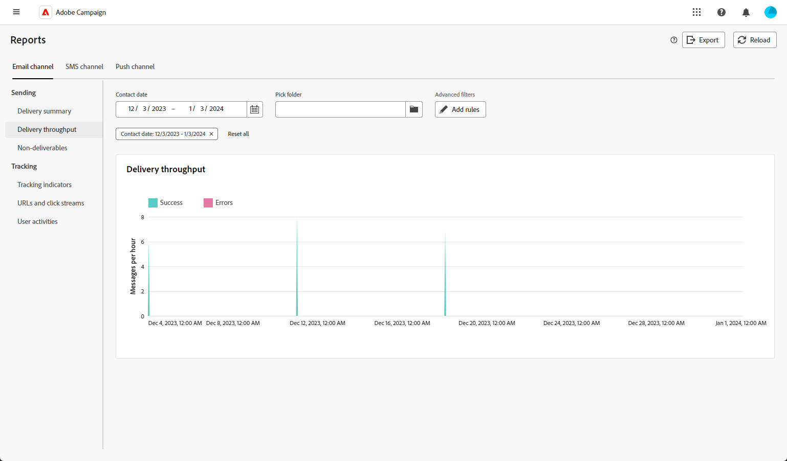

# Informes globales para la canal del correo electrónico {#global-report-direct}

Los informes globales proporcionan a los usuarios una visión general completa de tráfico y métricas de participación a nivel canal.

Navegue hasta el **[!UICONTROL menú Informes]** dentro de la **[!UICONTROL sección Informes]** . Puede filtrar los datos en función de la fecha, la carpeta o las reglas del informe. [Más información](global-reports.md)

## Resumen de envíos {#delivery-summary-email}

### Información general sobre el envío {#delivery-overview-email}

>[!CONTEXTUALHELP]
>id="acw_global_reporting_deliveries_overview_email"
>title="Información general sobre el envío"
>abstract="La **información general sobre el envío** proporciona indicadores clave de rendimiento (KPI) que ofrecen información detallada sobre cómo el público interactúa con el envío de correo electrónico y las campañas que envía."

La **[!UICONTROL descripción general]** de la entrega presenta métricas clave de rendimiento (KPI) que ofrecen información detallada sobre la interacción de los visitantes con cada correo electrónico envío. Las métricas se describen a continuación.

{zoomable="yes"}{align="center"}

+++Más información sobre métricas de información general de entrega.

* **[!UICONTROL Mensajes que se van a enviar]**: número total de mensajes procesados durante la preparación del envío.

* **[!UICONTROL Entregados: número de mensajes enviados correctamente, en relación con el número total de mensajes enviados]**.

* **[!UICONTROL Aperturas totales]**: número total de destinatarios objetivo que abrieron un mensaje al menos una vez.

* **[!UICONTROL Clics totales]**: número total de destinatarios que hicieron clic en un envío al menos una vez.

* **[!UICONTROL Rebotes y errores]**: Total de errores acumulados durante el procesamiento de envío y devolución automática en relación con el número total de mensajes enviados.

* **[!UICONTROL Cancelación de suscripción]**: número de destinatarios que han hecho clic en bajas de suscripción.
+++

### Público objetivo {#delivery-summary-email-initial-target}

>[!CONTEXTUALHELP]
>id="acw_global_reporting_target_audience_email"
>title="Estadísticas de público destinatario inicial"
>abstract="La tabla y el gráfico **Público objetivo** ofrecen información detallada sobre la participación de los destinatarios, lo que le ayuda a evaluar la eficacia de sus campañas y envíos."

La tabla y el gráfico de **[!UICONTROL la audiencia]** objetivo muestran datos relacionados con los destinatarios, con métricas detalladas a continuación.

{zoomable="yes"}{align="center"}

+++Más información sobre las métricas de audiencia objetivo.

* **[!UICONTROL audiencia]** objetivo: número total de destinatarios objetivo.

* **[!UICONTROL Enviar mensaje que se va a enviar]**: número total de mensajes que deben entregarse después de envío preparación.

* **[!UICONTROL Exclusión]**: Número total de direcciones ignoradas durante el análisis al aplicar reglas, como direcciones ausentes, en cuarentena o en lista de denegación.

+++

### Estadísticas de envío {#delivery-summary-email-delivery-stats}

>[!CONTEXTUALHELP]
>id="acw_global_reporting_email_delivery_stats"
>title="Estadísticas de envío"
>abstract="El gráfico y la tabla **Estadísticas de envíos** describen las métricas clave, incluidas las entregas correctas, los errores y las nuevas cuarentenas, y ofrecen información general concisa para evaluar el rendimiento de la entrega."

La **[!UICONTROL tabla de estadísticas]** de entrega proporciona una desglose del éxito de cada correo electrónico envío, con métricas detalladas que se describen a continuación.

{zoomable="yes"}{align="center"}

+++Más información sobre las métricas de estadísticas de entrega.

* **[!UICONTROL Enviar mensaje que se va a enviar]**: número total de mensajes que deben entregarse después de envío preparación.

* **[!UICONTROL Correcto]**: número de mensajes procesados correctamente en relación con el número de mensajes que desea enviar.

* **[!UICONTROL Errores / Devoluciones]**: número total de errores acumulados durante las entregas y el procesamiento automático de rebotes en relación con el número de mensajes a entregar.

* **[!UICONTROL Nuevo cuarentenas]**: número total de direcciones en cuarentena después de un envío fallido (usuario desconocido, dominio inválido) en relación con el número de mensajes que se van a enviar.

+++

### Causas de exclusión {#causes-exclusion}

>[!CONTEXTUALHELP]
>id="acw_global_reporting_exclusion_email"
>title="Causas de exclusión"
>abstract="El gráfico y la tabla **Causas de exclusión** ilustran los motivos específicos de los rechazos de mensajes durante la preparación de la entrega, con un desglose detallado por regla."

{zoomable="yes"}{align="center"}

El gráfico y la tabla de exclusiones ilustran las razones que impidieron que usuario perfiles, excluidos de los perfiles objetivo, recibieran el mensaje.

Los tipos de error de correo electrónico se enumeran en la documentación](https://experienceleague.adobe.com/docs/campaign/campaign-v8/send/failures/delivery-failures.html#email-error-types){target="_blank"} de Adobe Campaign v8 (consola de [cliente).

## Rendimiento del envío {#delivery-throughput}

>[!CONTEXTUALHELP]
>id="acw_global_reporting_throughput_email"
>title="Rendimiento del envío"
>abstract="El **Rendimiento del envío** ofrece información completa sobre el rendimiento del envío, destacando las tasas de éxito y error dentro de un período de tiempo especificado."

{zoomable="yes"}{align="center"}

El informe Rendimiento de entrega proporciona información detallada sobre la eficacia del proceso de envío, presentando una descripción detallada de las tasas de éxito y error dentro de un periodo de tiempo específico.

+++Más información sobre las métricas de rendimiento de envío.

* **[!UICONTROL Correcto]**: número de mensajes procesados correctamente en relación con el número de mensajes que desea enviar.

* **[!UICONTROL Errores]**: número total de errores acumulados durante los envíos y el procesamiento automático de rechazos en relación con el número de mensajes que se van a enviar.

+++

## Envíos que no se pueden entregar {#non-deliverables-email}

### Desglose de errores por tipo {#delivery-summary-email-breakdown-per-type}

>[!CONTEXTUALHELP]
>id="acw_global_reporting_error_type_email"
>title="Desglose de errores por tipo"
>abstract="La tabla y el gráfico que detallan el **Desglose de errores por tipo** incluye información sobre los distintos tipos de errores encontrados durante el proceso, como usuario desconocido, buzón lleno, dominio inválido y otros."

{zoomable="yes"}{align="center"}

La **[!UICONTROL tabla y el gráfico Desglose de errores por tipo]** presentan los datos relacionados con los posibles errores experimentados en varios dominios, con métricas específicas que se proporcionan a continuación.

Los errores que se muestran en este informe activan el proceso de cuarentena. Para obtener más información sobre cuarentena administración, consulte [Campaign documentación](https://experienceleague.adobe.com/docs/campaign/campaign-v8/campaigns/send/failures/delivery-failures.html){target="_blank"} de v8 (consola del cliente).

+++Más información sobre Desglose de errores por tipo métricas.

* **[!UICONTROL Usuario desconocido]**: Error tipo generado durante la envío para indicar que la dirección correo electrónico es no válido.

* **[!UICONTROL Dominio]** no válido: Error tipo generado al enviar un envío para indicar que el dominio de la dirección del correo electrónico es incorrecto o no existe.

* **[!UICONTROL Buzón lleno]**: Error tipo generado después de cinco envío intenta indicar que la bandeja de entrada de los destinatarios contiene demasiados mensajes.

* **[!UICONTROL Cuenta desactivada]**: Error tipo generado al enviar una envío para indicar que la dirección ya no existe.

* **[!UICONTROL Rechazado]**: Error tipo generado cuando una dirección es rechazada por el Proveedor de Acceso a Internet, para instancia siguiendo el aplicación de un regla de seguridad (software antispam).

* **[!UICONTROL Inaccesible]**: Error tipo que se produce en la cadena de distribución de mensajes, como un problema en el relé SMTP o dominio temporalmente inaccesible.

* **[!UICONTROL sin conexión]**: Error tipo para indicar que el teléfono móvil de los destinatarios está apagado o desconectado de la red en el momento del envío.

+++

### Desglose de errores por dominio {#delivery-summary-email-breakdown-per-domain}

>[!CONTEXTUALHELP]
>id="acw_global_reporting_error_domain_email"
>title="Desglose de errores por dominio"
>abstract="La tabla y el gráfico que ilustran el **Desglose de errores por dominio** presentan los datos correspondientes a cada tipo de error encontrado, clasificados por dominios específicos."

{zoomable="yes"}{align="center"}

La **[!UICONTROL tabla y el gráfico Desglose de errores por dominio]** muestran los datos relacionados con posibles errores dentro de cada dominio. Las métricas son comunes con la tabla y el **[!UICONTROL gráfico Desglose de errores por tipo]** detallados anteriormente.

## Indicadores de seguimiento {#tracking-indicators-email}

### Estadísticas de envío {#delivery-summary-email-statistics}

>[!CONTEXTUALHELP]
>id="acw_global_delivery_statistics_summary_email"
>title="Estadísticas de envío"
>abstract="Los **indicadores clave de rendimiento (KPI) de las estadísticas** de entrega proporcionan una visión general completa del rendimiento de las entregas y las campañas, y ofrecen información sobre las entregas exitosas, los errores encontrados y los participación del usuario."

Las **[!UICONTROL métricas de estadísticas]** de entrega oferta indicadores clave de rendimiento (KPI) y proporcionan información detallada sobre los datos asociados con cada correo electrónico envío. A continuación se proporcionan más detalles sobre estas métricas.

{zoomable="yes"}{align="center"}

+++Más información sobre las métricas de estadísticas de entrega.

* **[!UICONTROL Mensajes que se van a enviar]**: número total de mensajes procesados durante la preparación del envío.

* **[!UICONTROL Correcto]**: número de mensajes procesados correctamente en relación con el número de mensajes que desea enviar.

* **[!UICONTROL Aperturas únicas]**: número total de destinatarios objetivo que abrieron un mensaje al menos una vez.

* **[!UICONTROL Aperturas totales]**: número de destinatarios objetivo diferentes para este dominio que han abierto un mensaje al menos una vez.

* **[!UICONTROL Clics en el vínculo de no participación]**: número de clics en el vincular baja.

* **[!UICONTROL Clics en el vincular]** espejo: número de clics en el vincular al página espejo.

* **[!UICONTROL Estimación de reenvíos]**: Estimación del número de correos electrónicos reenviados por los destinatarios objetivo.
+++

### Tasa de clics y de aperturas {#delivery-summary-open-rate}

>[!CONTEXTUALHELP]
>id="acw_global_reporting_open_clickthrough_email"
>title="Tasa de clics y de aperturas"
>abstract="La tabla correspondiente a las **Tasas de clics y de aperturas** revela la participación de los destinatarios en su envío, mostrando datos sobre las tasas de clics y de aperturas para obtener una descripción general rápida y reveladora."

La **[!UICONTROL tabla de tasa de]** clics y de apertura muestra los datos relativos a los destinatarios. Las métricas se detallan a continuación.

{zoomable="yes"}{align="center"}

+++Obtenga más información sobre las métricas de tasa de clics y de apertura.

* **[!UICONTROL Enviados]**: número total de mensajes enviados.

* **[!UICONTROL Quejas]**: número y porcentaje de mensajes para este dominio que han sido reportados como indeseables por el destinatario.

* **[!UICONTROL Aperturas únicas]**: número y porcentaje de destinatarios objetivo distintos para este dominio que han abierto un mensaje al menos una vez.

* **[!UICONTROL Clics únicos]**: número y porcentaje de destinatarios objetivo diferentes que hicieron clic en el mismo envío al menos una vez.

* **[!UICONTROL Reacciones]** sin procesar: porcentaje del número de destinatarios que hicieron clic en un envío al menos una vez en comparación con el número de destinatarios que abrieron un envío al menos una vez.
+++

## URL y flujos de clics {#url-email}

### Indicadores clave de rendimiento (KPI) de URL y flujos de clics {#url-email-kpis}

>[!CONTEXTUALHELP]
>id="acw_global_reporting_urls_clickstreams_email"
>title="URL y flujos de clics"
>abstract="El informe **URL y flujos de clics** proporciona indicadores clave de rendimiento (KPI) esenciales que brindan información detallada sobre las direcciones URL en las que se hizo clic con mayor frecuencia durante un envío."

El **[!UICONTROL informe de URL y flujos de clics]** proporciona indicadores clave de rendimiento (KPI) que ofrecen información detallada sobre las URL que recibieron el mayor número de clics durante un envío. Las métricas se detallan a continuación.

{zoomable="yes"}{align="center"}

+++Obtenga más información sobre las URL y las métricas de flujo de clics.

* **[!UICONTROL Reactividad]**: Proporción del número de destinatarios objetivo que han hecho clic en un envío, en relación con el número estimado de destinatarios objetivo que han abierto un envío.

* **[!UICONTROL Clics únicos]**: número total de destinatarios distintos que hicieron clic en un envío al menos una vez.

* **[!UICONTROL Total de clics: número total de clics en los vínculos de los envíos]**.

* **[!UICONTROL Platform promedio]**: Esta tasa promedio, que se muestra debajo de cada tasa (reactividad, clics distintos y clics acumulados), se calcula para las entregas enviadas durante los seis meses anteriores. Solo se tienen en cuenta los envíos con la misma tipología y en el mismo canal. Se excluyen las pruebas.
+++

### Los 10 vínculos más visitados {#top10-global-report-email}

>[!CONTEXTUALHELP]
>id="acw_global_reporting_top10_email"
>title="Los 10 vínculos más visitados"
>abstract="El gráfico y la **tabla de los 10 enlaces** más visitados presentan datos completos sobre destinatario interacción con cada vincular."

El **[!UICONTROL gráfico y la tabla de los 10 vínculos]** más visitados contienen los datos disponibles para destinatario comportamiento por vincular. Las métricas se detallan a continuación.

{zoomable="yes"}{align="center"}

+++Más información sobre las 10 métricas de los enlaces más visitados.

* **[!UICONTROL Total de clics: número total de clics en los vínculos de los envíos]**.

* **[!UICONTROL Porcentaje]**: porcentaje de usuarios que interactuaron con el envío.

+++

### Desglose de los clics con el tiempo {#global-report-email-breakdown-clicks}

>[!CONTEXTUALHELP]
>id="acw_global_reporting_urls_click_breakdown_email"
>title="Desglose de los clics con el tiempo"
>abstract="El gráfico **Desglose de los clics con el tiempo** ofrece una vista completa de cómo interactúan los destinatarios con los vínculos a lo largo del período de tiempo establecido."

El **[!UICONTROL gráfico Desglose de clics a lo largo del tiempo]** contiene los datos disponibles para destinatario comportamiento por vincular.

{zoomable="yes"}{align="center"}

## Actividades del usuario {#user-activities-email}

>[!CONTEXTUALHELP]
>id="acw_global_reporting_user_activities_email"
>title="Actividades del usuario"
>abstract="La representación gráfica de **Actividades del usuario** ofrece un desglose detallado de las interacciones de los destinatarios, que presenta las aperturas y los clics a través de un formato de gráfico informativo."

El **[!UICONTROL informe Actividades del usuario]** muestra la desglose de aperturas y clics en forma de gráfico. Las métricas de este informe se describen a continuación.

{zoomable="yes"}{align="center"}

+++Más información sobre las métricas de actividades del usuario.

* **[!UICONTROL Total de clics: número total de clics en los vínculos de los envíos]**.

* **[!UICONTROL Aperturas totales]**: número total de destinatarios objetivo diferentes para este dominio que han abierto un mensaje al menos una vez.

+++