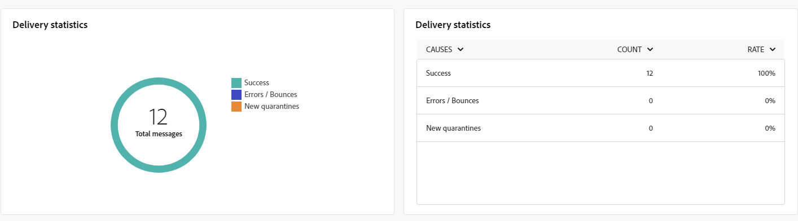

# Informes globales del canal push {#campaign-reports-push}

Los informes globales proporcionan a los usuarios una visión general completa de las métricas de tráfico y participación a nivel de canal.

Vaya al menú **[!UICONTROL Informes]** dentro de la sección **[!UICONTROL Informes]**. Puede filtrar los datos según la fecha, la carpeta o las reglas del informe. [Más información](global-reports.md)

## Resumen de envíos {#delivery-summary-push}

### Información general sobre el envío {#delivery-overview-push}

>[!CONTEXTUALHELP]
>id="acw_push_global_report_overview"
>title="Resumen de envío push"
>abstract="Los indicadores clave de rendimiento (KPI) de la **Información general sobre el envío** push proporcionan un examen exhaustivo de las entregas push, con información detallada y datos específicos. Proporciona detalles completos sobre el rendimiento, la eficacia y los resultados de los envíos."

El informe **[!UICONTROL Información general de entrega]** proporciona indicadores clave de rendimiento (KPI) que proporcionan información detallada sobre cómo los visitantes interactúan con cada envío de notificaciones push. Las métricas se detallan a continuación.

{zoomable="yes"}

+++Más información sobre las Métricas de información general de entrega.

* **[!UICONTROL Mensajes para entregar]**: Número total de mensajes procesados durante la preparación de la entrega.

* **[!UICONTROL Entregado]**: número de mensajes enviados correctamente en relación con el número total de mensajes enviados.

* **[!UICONTROL Clics totales]**: Número total de destinatarios diferentes que hicieron clic en una entrega al menos una vez.

* **[!UICONTROL Errores]**: Total de errores acumulados durante el envío y el procesamiento automático de devoluciones en relación con el número total de mensajes enviados.

+++

### Público objetivo {#delivery-summary-push-initial-target}

>[!CONTEXTUALHELP]
>id="acw_global_reporting_push_targeted_audience"
>title="Población de destino de los mensajes push"
>abstract="El gráfico y la tabla **Población de destino** muestran los datos relativos a su público de mensajería push y presentan información acerca de los mensajes que se van a enviar y las exclusiones."

La tabla y el gráfico de **[!UICONTROL Audiencia objetivo]** presentan datos relacionados con sus destinatarios para cada envío de notificación push enviado. Las métricas se detallan a continuación.

{zoomable="yes"}

+++Más información sobre las Métricas de audiencia segmentadas.

* **[!UICONTROL Audiencia objetivo]**: Número total de destinatarios objetivo.

* **[!UICONTROL Mensaje para entregar]**: Número total de mensajes que se enviarán después de la preparación del envío.

* **[!UICONTROL Exclusión]**: número total de direcciones omitidas durante el análisis al aplicar reglas: dirección que falta, en cuarentena, en lista de bloqueados de la y motivos similares.

+++

### Estadísticas de envío {#delivery-summary-push-exec-stats}

>[!CONTEXTUALHELP]
>id="acw_global_reporting_push_delivery_stats"
>title="Estadísticas de mensajería push"
>abstract="El informe **Estadísticas generales** presenta datos para las notificaciones push enviadas, incuidos sobre éxito, errores y cuarentenas."

La tabla **[!UICONTROL Delivery statistics]** detalla el éxito de cada envío de notificación push. Las métricas se detallan a continuación.

{zoomable="yes"}

+++Más información sobre las Métricas de estadísticas de envío.

* **[!UICONTROL Mensajes totales]**: Número total de mensajes que se enviarán después de la preparación de la entrega.

* **[!UICONTROL Éxito]**: número de mensajes procesados correctamente en relación con el número de mensajes que se van a enviar.

* **[!UICONTROL Errores / Devoluciones]**: Número total de errores acumulados durante las entregas y el procesamiento automático de los rechazos en relación con el número de mensajes que se van a enviar.

* **[!UICONTROL Nuevas cuarentenas]**: Número total de direcciones en cuarentena después de un envío fallido (registro no válido, rechazo de mensaje, error de carga útil y motivos similares) en relación con el número de mensajes que se van a enviar.

  Los tipos de error de notificaciones push se enumeran en [Adobe Campaign v8 (consola de cliente)](https://experienceleague.adobe.com/docs/campaign/campaign-v8/send/failures/delivery-failures.html#push-error-types){target="_blank"}.

+++

### Causas de exclusión {#causes-exclusion}

>[!CONTEXTUALHELP]
>id="acw_global_reporting_push_exclusion"
>title="Causas de exclusión de notificaciones push"
>abstract="El gráfico y la tabla **Causas de exclusión** ilustran los diversos motivos que impidieron que los perfiles de usuario recibieran las notificaciones push."

El gráfico y la tabla **[!UICONTROL Causas de exclusión]** muestran los motivos que impidieron que los perfiles de usuario, que se excluyeron de los perfiles de destino, recibieran el mensaje.

Los tipos de error de notificaciones push se enumeran en [Adobe Campaign v8 (consola de cliente)](https://experienceleague.adobe.com/docs/campaign/campaign-v8/send/failures/delivery-failures.html#push-error-types){target="_blank"}.

## Rendimiento del envío {#delivery-throughput-sms}

>[!CONTEXTUALHELP]
>id="acw_global_reporting_throughput_push"
>title="Informe de rendimiento del envío"
>abstract="El informe **Rendimiento del envío** presenta información detallada sobre el rendimiento del envío de notificaciones push de toda la plataforma dentro de un período de tiempo especificado."

{zoomable="yes"}

El informe **[!UICONTROL Rendimiento de entrega]** ofrece una visión completa de la eficacia del sistema de entrega de notificaciones push, con un resumen detallado de las tasas de éxito y error durante un periodo especificado.