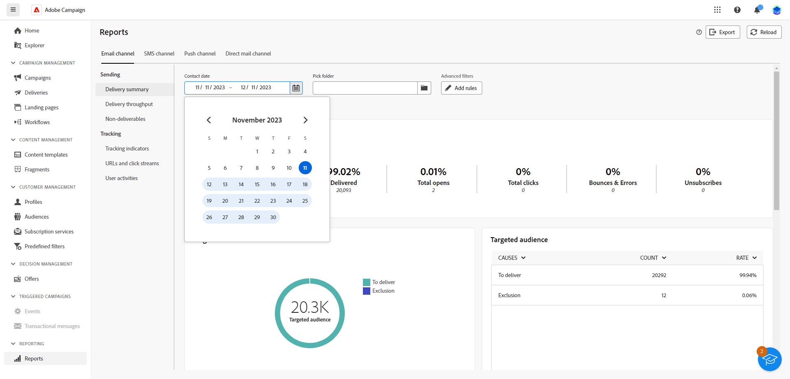

# Introducción a los informes globales {#global-report-gs}

>[!CONTEXTUALHELP]
>id="acw_campaign_reporting_global_report"
>title="Informe global"
>abstract="Los informes globales ofrecen una forma potente y eficaz de analizar el rendimiento de la campaña. Estos informes proporcionan una vista consolidada de las métricas clave de tráfico y participación de cada canal dentro de la campaña."

Los **informes globales** constituyen una herramienta eficaz que ofrece un resumen global consolidado de las métricas de tráfico y participación para cada canal dentro de la instancia de Campaign. Estos informes constan de varios widgets, cada uno de los cuales ofrece una perspectiva distinta sobre el rendimiento de la campaña o el envío.

Los indicadores de rendimiento clave (KPI) se actualizan cada hora, lo que garantiza información actualizada. De forma predeterminada, los datos filtros cubrir los últimos 30 días, lo que ofrece una perspectiva actual y relevante sobre el rendimiento de sus campañas y entregas.

La lista completa de informes y métricas asociadas para cada canal está disponible en las siguientes páginas:

* [Enviar informes globales por correo electrónico](global-report-email.md)
* [Informes globales de SMS](global-report-sms.md)
* [Impulsar informes globales](global-report-push.md)
* [correo postal informes globales](global-report-direct.md)

## Administrar el informe panel {#manage-reports}

Para acceder a los informes globales y administrar ellos, seguir estos pasos:

1. Navegue hasta el **[!UICONTROL menú Informes]** dentro de la **[!UICONTROL sección Informes]** .

1. En el menú de la izquierda, seleccione un informe de la lista y navegue por la pestaña para ver los datos de cada canal.

   {zoomable="yes"}

1. En el panel, elija un Inicio **y**&#x200B;[!UICONTROL &#x200B; una hora &#x200B;]&#x200B;**de** finalización para destino datos específicos.

   {zoomable="yes"}

1. En el **[!UICONTROL campo Seleccionar carpeta]** , seleccione si desea destino envíos o campañas desde una carpeta específica.

   {zoomable="yes"}

1. Haga clic en **[!UICONTROL añadir reglas]** para inicio la generación de consultas para filtrar mejor sistema de informes datos. [Aprenda a utilizar el modelador](../query/query-modeler-overview.md) de consulta.

1. En las URL y las **[!UICONTROL secuencias de clics]**, elija los **[!UICONTROL vínculos]** más visitados o el período **de** tiempo.

   Las **[!UICONTROL opciones Ver por]** permiten filtrar por direcciones URL, etiquetas o categorías.