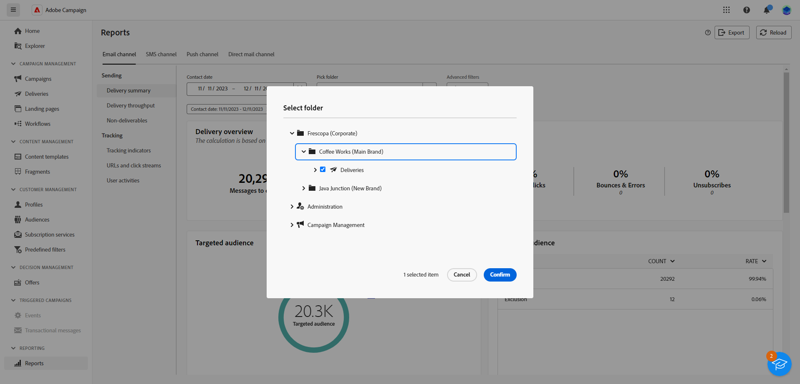

# Introducción a los informes globales {#global-report-gs}

>[!CONTEXTUALHELP]
>id="acw_campaign_reporting_global_report"
>title="Informe global"
>abstract="Los informes globales ofrecen una forma potente y eficaz de analizar el rendimiento de la campaña. Estos informes proporcionan una vista consolidada de las métricas clave de tráfico y participación de cada canal dentro de la campaña."

Los **informes globales** constituyen una herramienta eficaz que ofrece un resumen global consolidado de las métricas de tráfico y participación para cada canal dentro de la instancia de Campaign. Estos informes constan de varios widgets, cada uno de los cuales ofrece una perspectiva distinta sobre el rendimiento de la campaña o el envío.

Los indicadores clave de rendimiento (KPI) se actualizan cada hora, lo que garantiza perspectivas actualizadas. De forma predeterminada, los filtros de datos abarcan los últimos 30 días, lo que ofrece una perspectiva actual y relevante del rendimiento de sus campañas y envíos.

La lista completa de informes y las métricas asociadas para cada canal están disponibles en las siguientes páginas:

* [Informes globales de correo electrónico](global-report-email.md)
* [Informes globales de SMS](global-report-sms.md)
* [Informes globales push](global-report-push.md)
* [Informes globales de correo directo](global-report-direct.md)

## Administrar el tablero de informes {#manage-reports}

Para acceder y administrar sus informes globales, siga estos pasos:

1. Vaya al menú **[!UICONTROL Informes]** dentro de la sección **[!UICONTROL Informes]**.

1. En el menú de la izquierda, seleccione un informe de la lista y navegue por la pestaña para mostrar los datos de cada canal.

   {zoomable="yes"}

1. En el tablero, elija **Inicio** y **[!UICONTROL Hora de finalización]** para segmentar datos específicos.

   {zoomable="yes"}

1. En el campo **[!UICONTROL Seleccionar carpeta]**, seleccione si desea segmentar envíos o campañas desde una carpeta específica.

   {zoomable="yes"}

1. Haga clic en **[!UICONTROL Agregar reglas]** para empezar a crear consultas y filtrar mejor los datos de informes. [Aprenda a utilizar el modelador de consultas](../query/query-modeler-overview.md).

1. Entre las **[!UICONTROL URL y los flujos de clics]**, elija los **[!UICONTROL vínculos más visitados]** o el **[!UICONTROL período de tiempo]**.

   Las opciones de **[!UICONTROL Ver por]** permiten filtrar por direcciones URL, etiquetas o categorías.