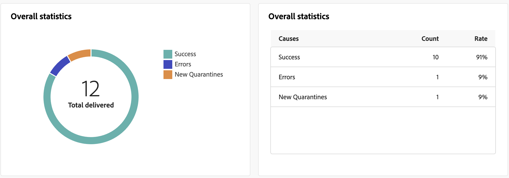

# Informe de envío push {#push-report}

>[!CONTEXTUALHELP]
>id="acw_push_report_overview"
>title="Resumen del informe push"
>abstract="Descubra las métricas de creación de informes de su envío Push."

El **Informe de envío push** ofrece una descripción general completa del canal push, con amplias perspectivas y datos específicos. Ofrece información completa sobre el rendimiento, la eficacia y los resultados de cada envío.

## Resumen de push {#push-summary}

* **[!UICONTROL Resumen del envío]** proporciona indicadores clave de rendimiento (KPI) que proporcionan información detallada sobre cómo los visitantes interactúan con los mensajes push.

  

  +++ Obtenga más información sobre las métricas de informes de envío push.

   * **[!UICONTROL Total enviado]**: Número total de mensajes procesados durante el análisis de envío.

   * **[!UICONTROL Entregado]**: Número de mensajes enviados correctamente en relación con el número total de mensajes enviados.

   * **[!UICONTROL Clics]**: Número total de destinatarios que interactuaron con el mensaje push.

   * **[!UICONTROL Errores]**: Número total de errores que se han producido durante una entrega para evitar que se envíe a los perfiles.

+++

* **Población de destino** los gráficos y las tablas muestran los datos relativos a la audiencia:

  

  +++ Obtenga más información sobre las métricas de informes de envío push.

   * **[!UICONTROL Para enviar]**: Número total de mensajes procesados durante el análisis de envío.

   * **[!UICONTROL Exclusiones]**: Número de perfiles que se han excluido del análisis.

+++

* **Estadísticas generales** presenta datos para las notificaciones push enviadas, lo que incluye:

  

  +++ Obtenga más información sobre las métricas de informes de envío push.

   * **[!UICONTROL Correctos]** : número de mensajes procesados correctamente.

   * **[!UICONTROL Errores]**: Número total de errores que se produjeron durante el envío, lo que impide que los mensajes se envíen a determinados perfiles.

   * **[!UICONTROL Nueva cuarentena]**: Número de perfiles que se han excluido y añadido a la cuarentena.

+++

* **[!UICONTROL Exclusiones]** el gráfico y la tabla muestran los distintos motivos que impidieron que los perfiles de usuario, que se excluyeron de los perfiles de destino, recibieran el mensaje.

  

## Rendimiento del envío {#delivery-throughput}

Este informe presenta información detallada sobre el rendimiento de entrega de toda la plataforma en un periodo de tiempo especificado. La métrica principal utilizada para medir la velocidad de entrega de mensajes es el número de mensajes enviados por hora.

