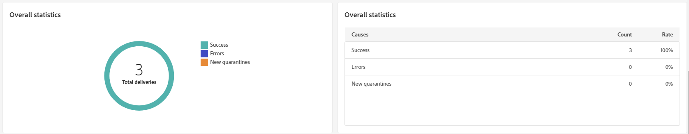

# Informes de envío de SMS {#sms-report}

>[!CONTEXTUALHELP]
>id="acw_delivery_reporting_sending_sms"
>title="Envío de creación de informes"
>abstract="La pestaña **Envío** dentro del informe proporciona una perspectiva detallada de las interacciones de los visitantes con los envíos y cualquier posible error que hayan encontrado."

La **descripción general de la entrega de SMS** proporciona un resumen detallado de su entrega de SMS, con información exhaustiva y datos específicos. Incluye información completa sobre el rendimiento, la eficacia y los resultados de su envío.

## Resumen de envíos {#delivery-summary}

### Información general sobre el envío {#sms-delivery-overview}

>[!CONTEXTUALHELP]
>id="acw_sms_report_overview"
>title="Información general sobre el envío de SMS"
>abstract="La **Información general sobre el envío de SMS** ofrece una amplia descripción general del envío de SMS, que proporciona amplia información y datos específicos. Proporciona información completa sobre el rendimiento, la eficacia y los resultados de su envío."

El informe **[!UICONTROL Resumen de entrega]** proporciona indicadores clave de rendimiento (KPI) que ofrecen información detallada sobre las tasas de éxito y error, así como la forma en que los visitantes interactúan con los mensajes SMS.

{zoomable="yes"}

+++Obtenga más información acerca de las métricas de informes de envío de SMS.

* **[!UICONTROL Total enviado]**: Porcentaje y número total de mensajes procesados durante la preparación de la entrega.

* **[!UICONTROL Éxito]**: porcentaje y número de mensajes enviados correctamente, en relación con el número total de mensajes enviados.

* **[!UICONTROL Tasa de clics]**: porcentaje y cantidad de usuarios que interactuaron con los vínculos incluidos en su envío de SMS.

* **[!UICONTROL Errores]**: porcentaje y número total de errores que se produjeron durante una entrega para evitar que se enviara a los perfiles.

+++

### Población de destino {#sms-delivery-targeted-population}

>[!CONTEXTUALHELP]
>id="acw_delivery_reporting_sms_targeted_population"
>title="Población de destino de SMS"
>abstract="El gráfico y las tablas de la **Población de destino** muestran datos relativos al público de SMS: mensajes a enviar y exclusiones."

El gráfico y la tabla de **población objetivo** muestran datos relacionados con su audiencia. Las métricas se detallan a continuación.

{zoomable="yes"}

+++Obtenga más información acerca de las métricas de informes de envío de SMS.

* **[!UICONTROL Para entregar]**: Número total y porcentaje de mensajes procesados durante la preparación de la entrega.

* **[!UICONTROL Exclusiones]**: número y tasa porcentual de perfiles que se han excluido del análisis.
+++

### Estadísticas generales {#sms-delivery-overall}

>[!CONTEXTUALHELP]
>id="acw_delivery_reporting_sms_overall_stats"
>title="Estadísticas generales de los SMS"
>abstract="El informe **Estadísticas generales** presenta los datos del SMS enviado: éxitos, errores y cuarentenas."

El informe **Estadísticas generales** presenta datos para los mensajes SMS enviados. Las métricas se detallan a continuación.

{zoomable="yes"}

+++Obtenga más información acerca de las métricas de informes de envío de SMS.

* **[!UICONTROL Éxito]**: número y porcentaje de mensajes procesados correctamente.

* **[!UICONTROL Errores]**: Número total y porcentaje de errores que se produjeron durante la entrega, lo que impide que los mensajes se envíen a determinados perfiles.

* **[!UICONTROL Nueva cuarentena]**: número y tasa porcentual de perfiles que se han excluido y agregado a la cuarentena.
+++

### Exclusiones {#sms-delivery-exclusions}

>[!CONTEXTUALHELP]
>id="acw_delivery_reporting_sms_exclusions"
>title="Exclusiones de SMS"
>abstract="El gráfico y la tabla **Exclusiones** muestran los distintos motivos que impedían que los perfiles de usuario, que se excluyeron de los perfiles de destino, recibieran el mensaje."

El gráfico y la tabla **[!UICONTROL Exclusions]** muestran los motivos que impidieron que los perfiles de usuario, que se excluyeron de los perfiles de destino, recibieran el mensaje. Las reglas de exclusión se detallan en la [documentación de Campaign v8 (consola)](https://experienceleague.adobe.com/docs/campaign/campaign-v8/send/failures/delivery-failures.html#sms-quarantines){_blank}.

{zoomable="yes"}

## Rendimiento del envío {#delivery-throughput}

>[!CONTEXTUALHELP]
>id="acw_delivery_reporting_throughput_sms"
>title="Rendimiento del envío de SMS"
>abstract="El informe **Rendimiento del envío** presenta información detallada sobre el rendimiento del envío en un período de tiempo especificado. La métrica principal utilizada para medir la velocidad de envío de mensajes es el número de mensajes enviados por hora."

Este informe proporciona información detallada sobre el rendimiento del envío en un periodo de tiempo especificado. La métrica principal utilizada para medir la velocidad de envío de mensajes es el número de mensajes enviados por hora.

{zoomable="yes"}