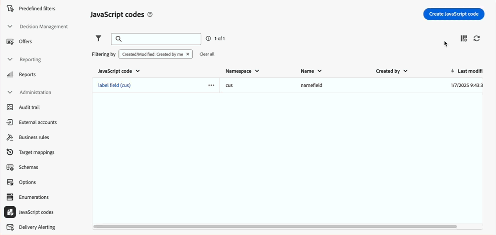

# Notas de la versión preliminar {#e-release}

La interfaz de usuario web de Adobe Campaign ofrece continuamente nuevas funciones, mejoras de las funciones existentes y correcciones de errores. Todos los cambios se consolidan al final de cada mes en las [notas de la versión](release-notes.md).

**Las notas de la versión preliminar que se indican a continuación están sujetas a cambios sin previo aviso hasta la fecha de disponibilidad final de la versión**. Los vínculos, las pantallas y la documentación actualizada se publican en las [notas de la versión](release-notes.md), en la fecha de lanzamiento.

## Versión de enero de 2025 {#25-1-release}

**Fecha de lanzamiento**: 5 de febrero de 2025

Las siguientes funciones y mejoras están disponibles a partir de la versión de enero.

### Funciones {#25-1-features}

<table>
<thead>
<tr>
<th><strong>Crear y utilizar fragmentos visuales</strong> </th>
</tr>
</thead>
<tbody>
<tr>
<td>

Los fragmentos visuales son bloques visuales predefinidos que se pueden reutilizar en varios envíos de correo electrónico o en plantillas de contenido. Esta función ya está disponible para todos los clientes que ejecuten la versión 8.6.4 o superior del servidor.

Para obtener más información, consulte la <a href="../content/use-visual-fragments.md">documentación detallada</a>.

</td>
</tr>
</tbody>
</table>

<table>
<thead>
<tr>
<th><strong>Uso de un sistema de terceros para remitir envíos</strong> </th>
</tr>
</thead>
<tbody>
<tr>
<td>

Ahora puede definir envíos externos y plantillas de envío externo en la interfaz de Campaign Web. En este modo, los mensajes se compilan en un archivo de entrada que se puede compartir con su proveedor externo. De forma predeterminada, el modo de envío externo es el que se utiliza para el canal de correo directo.

</td>
</tr>
</tbody>
</table>

<table>
<thead>
<tr>
<th><strong>Creación de reglas empresariales (reglas de tipología)</strong> </th>
</tr>
</thead>
<tbody>
<tr>
<td>

Ahora puede crear tipologías y reglas de tipología en la interfaz de Adobe Campaign Web. Una tipología es una colección de reglas de tipología que permiten controlar, filtrar y priorizar los envíos. Las tipologías garantizan que los envíos contengan siempre los elementos necesarios (como un vínculo para cancelar la suscripción o una línea de asunto) y apliquen reglas de filtrado para excluir grupos específicos del público destinatario (como los que han cancelado la suscripción, los competidores o los clientes no fidelizados).

Para obtener más información, consulte la <a href="../administration/typologies.md">documentación detallada</a>.

</td>
</tr>
</tbody>
</table>

<table>
<thead>
<tr>
<th><strong>Administrar las enumeraciones</strong> </th>
</tr>
</thead>
<tbody>
<tr>
<td>

Ahora puede crear enumeraciones directamente mediante la interfaz de usuario de Adobe Campaign Web. Una enumeración es una lista de valores sugeridos por el sistema para rellenar los campos. Utilice las enumeraciones para estandarizar los valores de estos campos, facilitar la introducción de datos o utilizarlas en las consultas.

Para obtener más información, consulte la <a href="../administration/enumerations.md">documentación detallada</a>.

</td>
</tr>
</tbody>
</table>

<table>
<thead>
<tr>
<th><strong>Crear opciones personalizadas</strong> </th>
</tr>
</thead>
<tbody>
<tr>
<td>

Ahora puede acceder a las opciones técnicas de la interfaz de usuario de Adobe Campaign Web y crear sus propias opciones personalizadas para adaptarlas a sus necesidades. Esto resulta particularmente útil cuando se trabaja con actividades de flujo de trabajo de código JavaScript para almacenar datos intermedios.

Para obtener más información, consulte la <a href="../administration/options.md">documentación detallada</a>.

</td>
</tr>
</tbody>
</table>

<table>
<thead>
<tr>
<th><strong>Definir y llamar códigos JavaScript</strong> </th>
</tr>
</thead>
<tbody>
<tr>
<td>

Ahora puede crear códigos JavaScript en la interfaz de usuario de Adobe Campaign Web. Esto le permite crear funciones reutilizables que se pueden utilizar en distintos flujos de trabajo, de forma similar a una biblioteca.

Para obtener más información, consulte la <a href="../administration/javascript-codes.md">documentación detallada</a>.

</td>
</tr>
</tbody>
</table>

### Mejoras {#25-1-improvements}

* Personalice la visualización de los campos personalizados en la interfaz:

   * Ahora puede seleccionar campos personalizados adicionales para mostrarlos en la interfaz
   * Ahora puede establecer reglas para mostrar campos personalizados de tipo vínculo, como restringir valores de lista basados en la entrada de otro campo
   * Ahora puede organizar los campos en la interfaz con más flexibilidad: los campos pueden abarcar una sola columna o agruparse en subsecciones para una mejor organización
   * Ahora puede establecer campos específicos como de solo lectura

* Filtros recientes y favoritos: para reutilizar rápidamente atributos que se utilizan con frecuencia, ahora puede añadirlos a favoritos. Esto garantiza que sean fácilmente accesibles para tareas futuras. Además de los favoritos, también puede ver y utilizar los atributos seleccionados más recientemente.

