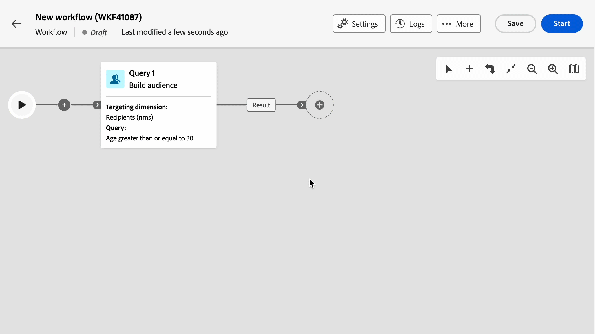

# Notas de la versión 2026 {#2026-release}

Esta página enumera todos los cambios y mejoras disponibles en las **versiones de 2026**. Las notas de la versión más recientes están disponibles en [esta página](release-notes.md).

## Versión de julio de 2026 {#26-7-release}

_28 de julio de 2026_

### Nuevas funciones {#26-7-features}

<table>
<thead>
<tr>
<th><strong>Gestión de ofertas</strong> </th>
</tr>
</thead>
<tbody>
<tr>
<td>

Ahora puede administrar ofertas de extremo a extremo directamente desde la interfaz de usuario web de Campaign. Configure entornos de oferta y espacios de oferta, cree su catálogo de ofertas y categorías, cree ofertas con reglas de idoneidad y pesos de prioridad, y apruébelas e impleméntelas para usarlas en sus entregas. Las configuraciones avanzadas siguen estando disponibles en la consola del cliente.

Para obtener más información, consulte la <a href="../offers/gs-offer-management.md">documentación detallada</a>.

</td>
</tr>
</tbody>
</table>

<table>
<thead>
<tr>
<th><strong>Configuración de marca</strong> </th>
</tr>
</thead>
<tbody>
<tr>
<td>

Los administradores técnicos ahora pueden crear y configurar marcas directamente desde la interfaz de usuario web de Campaign, sin utilizar la consola de cliente. Todas las configuraciones de marca, incluidos los parámetros de identidad, subdominio y protocolos, parámetros de encabezado de correo electrónico y parámetros de seguimiento de URL, ya están disponibles en la interfaz de usuario web.

Para obtener más información, consulte la <a href="../administration/branding/branding-configure.md">documentación detallada</a>.

</td>
</tr>
</tbody>
</table>

<table>
<thead>
<tr>
<th><strong>Recursos públicos en el Designer de correo electrónico</strong> </th>
</tr>
</thead>
<tbody>
<tr>
<td>

Al agregar imágenes a tus correos electrónicos, ahora puedes seleccionar <strong>recursos públicos</strong>. Esto le permite elegir una imagen ya disponible en la instancia de Adobe Campaign, como un archivo previamente importado en el Designer de correo electrónico o un recurso público cargado desde la consola del cliente.

Para obtener más información, consulte la <a href="../email/content-components.md#image">documentación detallada</a>.

</td>
</tr>
</tbody>
</table>

<table>
<thead>
<tr>
<th><strong>Actividad del flujo de trabajo Carga de datos (RDBMS)</strong> </th>
</tr>
</thead>
<tbody>
<tr>
<td>

La actividad <strong>Data loading (RDBMS)</strong> ya está disponible en la interfaz de usuario web de Campaign. Utilice esta actividad para cargar datos directamente desde una base de datos relacional externa en el flujo de trabajo. Los datos extraídos están disponibles en todo el flujo de trabajo y se pueden utilizar para el direccionamiento, el enriquecimiento o el procesamiento posterior de datos.

Para obtener más información, consulte la <a href="../workflows/activities/data-loading-rdbms.md">documentación detallada</a>.

</td>
</tr>
</tbody>
</table>

<table>
<thead>
<tr>
<th><strong>Páginas dinámicas de JavaScript</strong> </th>
</tr>
</thead>
<tbody>
<tr>
<td>

Las páginas dinámicas de JavaScript (JSSP) le permiten crear páginas del lado del servidor que generan contenido dinámico cuando se accede a ellas a través de una dirección URL, como API personalizadas, exportaciones o lógica de aplicación web. Ahora puede crear, modificar, duplicar y eliminar estas páginas directamente desde la interfaz de usuario web de Campaign.

Para obtener más información, consulte la <a href="../administration/dynamic-javascript-pages.md">documentación detallada</a>.

</td>
</tr>
</tbody>
</table>

### Mejoras {#26-7-improvements}

* Se han realizado las siguientes mejoras en la **configuración de esquema personalizada**:
  * La nueva sección **Datos de acción** le permite restringir las acciones disponibles en los registros de un esquema personalizado, independientemente de las reglas de seguridad configuradas en carpetas individuales. [Más información](../administration/schemas-action-data.md)
  * Se han agregado **filtros personalizados** en la sección **Configuración de lista de inventario**. Permiten elegir qué atributos se muestran como campos de acceso rápido en el panel de filtros de la vista de lista. [Más información](../administration/schemas-custom-filters.md)

* Se han realizado las siguientes mejoras en **flujos de trabajo**:
  * La eliminación de una actividad de flujo de trabajo ahora es más flexible: cuando la actividad tiene actividades posteriores, puede elegir eliminarlas todas, eliminar solo la actividad seleccionada o eliminarla mientras mantiene sus actividades posteriores en una nueva rama. [Más información](../workflows/orchestrate-activities.md#delete-activity)
  * Ahora puede desconectar una transición entre dos actividades de flujo de trabajo sin eliminar ninguna de ellas. Esto permite reorganizar un diagrama de flujo de trabajo, por ejemplo, para dejar temporalmente a un lado un grupo de actividades que desee conservar, sin tener que eliminarlas y volver a crearlas. [Más información](../workflows/orchestrate-activities.md#disconnect-transition)
  * Ahora se muestran barras de desplazamiento horizontales y verticales alrededor del lienzo del flujo de trabajo, lo que permite desplazarse por flujos de trabajo grandes arrastrando directamente al área que desea ver. [Más información](../workflows/orchestrate-activities.md)
  * Al guardar o iniciar o reiniciar un flujo de trabajo, ahora se muestra una advertencia si otro usuario ha modificado el flujo de trabajo en la interfaz de usuario web o en la consola del cliente desde que lo abrió. Puede optar por anular los demás cambios con el suyo, volver a cargar el flujo de trabajo para obtener la versión más reciente o cancelar.

* **Dirección de correo electrónico del remitente**: Ahora puede restringir el campo **De correo electrónico** de las entregas a una lista predefinida de direcciones, mediante la opción **NmsDelivery_senderAddressMask**. [Más información](../administration/options.md#restrict-sender-address)
* Se han mejorado **mensajes de error de inicio de sesión**: cuando falla un intento de inicio de sesión, la interfaz de usuario web muestra ahora un mensaje de error más específico para varios escenarios (por ejemplo, cuando el usuario no tiene asignada ninguna zona de seguridad o su dirección IP está restringida).

## Versión de junio de 2026 {#26-6-release}

_16 de junio de 2026_

### Mejoras {#26-6-improvements}

<!--
* Technical administrators can now create and configure brands directly from the Campaign Web User Interface, without using the Client Console. All brand settings, including identity, subdmain and protocols, email header parameters and URL tracking parameters, are now available in the Web UI. <!-- [Learn more](../administration/branding/branding-configure.md)
-->

* Ahora puede exportar datos desde cualquier pantalla de lista, incluidos los registros de seguimiento. Busque la lista y simplemente haga clic en el botón exportar. La exportación incluye las filas cargadas actualmente y tiene en cuenta las columnas mostradas en pantalla y cualquier búsqueda o filtro activos. [Más información](../get-started/list-filters.md)

* Las actividades de flujo de trabajo **Deduplicación** y **Fin** ahora admiten varias transiciones entrantes. Cuando haya más de una transición entrante disponible, use la sección **Conjuntos para unirse** en la actividad
para seleccionar qué transiciones conectar. Obtenga más información en estas páginas: [Deduplicación](../workflows/activities/deduplication.md), [Fin](../workflows/activities/end.md)

* Los parámetros avanzados ahora se exponen en la sección **Datos de enriquecimiento** de las actividades de flujo de trabajo **Generar público** (tipo de consulta) y **Enriquecimiento**. Estos parámetros le permiten ajustar con precisión cómo se generan los datos de enriquecimiento, lo que incluye la agrupación, la deduplicación, la administración de claves principales y los datos de evento entrantes. [Más información](../workflows/activities/enrichment.md)

<!--
* Delivery templates now allow you to define a time zone in the Schedule settings.
-->

## Versión de abril de 2026 {#26-4-release}

_29 de abril de 2026_

### Mejora {#26-4-improvement}

La sección **Datos de enriquecimiento** ya está disponible en la actividad de flujo de trabajo **Generar público** (tipo de consulta). Puede ver, añadir, editar y quitar **datos adicionales** directamente desde la interfaz de usuario web de Campaign. Al igual que en la actividad **Enriquecimiento**, puede añadir atributos de enriquecimiento únicos, vínculos de colección y expresiones.

[Más información](../workflows/activities/build-audience.md)

## Versión de marzo de 2026 {#26-3-release}

_24 de marzo_ de 2026_

### Nuevas funciones {#26-3-features}

<table>
<thead>
<tr>
<th><strong>Creación de esquemas (GA)</strong> </th> 
</tr>
</thead>
<tbody>
<tr>
<td>

La función de creación de esquemas ya está disponible para todos los clientes (GA). Esta capacidad le permite crear y administrar esquemas directamente desde la interfaz de usuario web de Campaign. Puede crear nuevas tablas, ampliar los esquemas existentes y crear formularios personalizados. Puede definir estructuras de datos personalizados para satisfacer sus necesidades empresariales específicas sin necesidad de acceder a la consola del cliente.

Para obtener más información, consulte la <a href="../administration/schemas.md">documentación detallada</a>.

</td>
</tr>
</tbody>
</table>

<table>
<thead>
<tr>
<th><strong>Temas en el Diseñador de correo electrónico (LA)</strong> </th> 
</tr>
</thead>
<tbody>
<tr>
<td>

Los temas proporcionan una experiencia de creación mejorada para los correos electrónicos, ya que le permiten definir estilos de temas reutilizables que se ajusten a las directrices de su marca. Ahora puede utilizar variables de temáticas en fragmentos, lo que garantiza un estilo coherente en todas las plantillas de correo electrónico. Esta función le permite crear correos electrónicos más rápido con módulos predefinidos que abstraen elementos de contenido como títulos, descripciones, imágenes y vínculos, a la vez que mantienen la coherencia de la marca.

Nota: esta funcionalidad solo está disponible para un conjunto de organizaciones (disponibilidad limitada) y se implementará globalmente en una versión futura.

Para obtener más información, consulte la <a href="../email/apply-email-themes.md">documentación detallada</a>.

</td>
</tr>
</tbody>
</table>

<table>
<thead>
<tr>
<th><strong>Integración de modelos de Firefly personalizados y modelos de generación de imágenes de terceros</strong> </th>
</tr>
</thead>
<tbody>
<tr>
<td>

Permita la integración total de modelos de Firefly estándar y personalizados, junto con modelos de imagen de terceros aprobados, para proporcionar mayor flexibilidad, control y alineación de marca al generar imágenes.

Elija el modelo adecuado para sus necesidades:

<ul><li> <strong>Modelo de Adobe</strong> (con tecnología Firefly Image Model 4) para generar imágenes inmediatamente sin necesidad de configuración adicional</li><li> <strong>Modelo de partner</strong> (con tecnología Gemini 2.5 Flash) para funciones especializadas</li><li><strong>Modelos personalizados</strong> (modelos específicos de la marca entrenados en sus propios recursos) para la generación coherente con la marca que se ajuste con precisión a la identidad, estilo y directrices visuales de la marca.</li></ul>

Para obtener más información, consulte la <a href="../content/generative-models.md">documentación detallada</a>.

</td>
</tr>
</tbody>
</table>

<table>
<thead>
<tr>
<th><strong>Actividad de envío automatizado</strong> </th>
</tr>
</thead>
<tbody>
<tr>
<td>

La actividad de flujo de trabajo de <strong>Envío automatizado</strong> ya está disponible en la paleta de flujos de trabajo. Puede utilizarlo para crear o ejecutar acciones de envío (preparar, enviar una prueba, preparar e iniciar, etc.) directamente en el flujo de trabajo. Seleccione un envío existente creado fuera del flujo de trabajo para reutilizarlo en cada ejecución o cree un nuevo envío a partir de una plantilla cada vez que se ejecute la actividad.

Para obtener más información, consulte la <a href="../workflows/activities/automated-delivery.md">documentación detallada.

</td>
</tr>
</tbody>
</table>

<table>
<thead>
<tr>
<th><strong>Varias ramas de flujo de trabajo y Unirse a la actividad</strong> </th>
</tr>
</thead>
<tbody>
<tr>
<td>

Ahora se admiten <strong>varias ramas</strong>. En lugar de usar una <strong>Fork</strong>, puede hacer clic en <strong>Add branch</strong> en la barra de herramientas. La actividad <strong>AND-join</strong> también se ha mejorado. Ahora es una actividad <strong>Join</strong> genérica que le permite elegir entre las opciones de unión AND y OR.

Para obtener más información, consulte las páginas de documentación de <a href="../workflows/orchestrate-activities.md#toolbar">Orquestar actividades</a> y <a href="../workflows/activities/join.md">Unir</a>.

</td>
</tr>
</tbody>
</table>

### Mejoras {#26-3-improvements}

* La actividad de flujo de trabajo **Start** se ha añadido para mejorar la compatibilidad con la consola del cliente. Esta actividad es opcional y no se inserta de forma predeterminada en los nuevos flujos de trabajo. Sin embargo, se añade automáticamente a los flujos de trabajo existentes.
  [Más información](../workflows/activities/about-activities.md#flow-control)
* El campo de selección de zona horaria de la configuración **Programar** de un envío se ha movido debajo del campo **Fecha de contacto**. [Más información](../msg/create-deliveries.md#gs-schedule)

## Versión de febrero de 2026 {#26-2-release}

_17 de febrero de 2026_

### Nuevas funciones {#26-2-features}

<!--
table>
<thead>
<tr>
<th><strong>Delivery scheduling compute process</strong> </th> 
</tr>
</thead>
<tbody>
<tr>
<td>

You can now use a delivery scheduling compute process similar to the one available in Adobe Campaign Standard. This feature allows you to calculate sending dates based on recipient timezones, enabling you to send communications at the optimal time for each recipient. This is particularly useful for organizations operating across multiple timezones, as it allows you to target regions with different timezones using a single delivery configuration.

For more information, refer to the detailed documentation.

</td>
</tr>
</tbody>
</table
-->

<!--
table>
<thead>
<tr>
<th><strong>Themes in the Email Designer (Beta)</strong> </th> 
</tr>
</thead>
<tbody>
<tr>
<td>

Themes provide an improved authoring experience for emails by allowing you to define reusable theme styles that fit your brand guidelines. You can now use theme variables in fragments, ensuring consistent styling across your email templates. This feature enables you to build emails faster with predefined modules that abstract content elements such as titles, descriptions, images, and links, while maintaining brand consistency.

For more information, refer to the detailed documentation.

</td>
</tr>
</tbody>
</table
-->

<table>
<thead>
<tr>
<th><strong>Vista de cronología en el inventario de campañas</strong> </th> 
</tr>
</thead>
<tbody>
<tr>
<td>

El inventario de campañas ahora incluye una vista de Cronología que le permite visualizar y administrar las campañas a lo largo del tiempo: cambie entre una lista y una cronología, navegue por semana, mes o día, utilice el botón Hoy para ir a la fecha actual y abra los detalles de la campaña (estado, flujos de trabajo, envíos) en un panel derecho, con los mismos filtros y búsquedas que la vista de lista.

Para obtener más información, consulte la <a href="../campaigns/manage-campaigns.md#timeline">documentación detallada</a>.

</td>
</tr>
</tbody>
</table>

<table>
<thead>
<tr>
<th><strong>Creación de esquemas (LA)</strong> </th> 
</tr>
</thead>
<tbody>
<tr>
<td>

Ahora puede crear y administrar esquemas directamente desde la interfaz de usuario web de Campaign. Esta función le permite crear nuevas tablas, ampliar esquemas existentes y crear formularios personalizados. Puede definir estructuras de datos personalizados para satisfacer sus necesidades empresariales específicas sin necesidad de acceder a la consola del cliente.

Nota: esta funcionalidad solo está disponible para un conjunto de organizaciones (disponibilidad limitada) y se implementará globalmente en una versión futura.

Para obtener más información, consulte la <a href="../administration/schemas.md">documentación detallada</a>.

</td>
</tr>
</tbody>
</table>

<!--

### Improvement {#26-2-improvements}

* Brand guidelines now include a Colors section that defines standards for your brand's color system, ensuring consistent use of primary, secondary, accent, and neutral colors across all experiences. 
[Learn more](../content/brands-personalize.md)
-->

## Versión de enero de 2026 {#26-1-release}

_27 de enero de 2026_

### Nuevas funciones {#26-1-features}

<table>
<thead>
<tr>
<th><strong>Funciones de envío multilingües (GA)</strong> </th> 
</tr>
</thead>
<tbody>
<tr>
<td>

La función de envío multilingüe ya está disponible para todos los clientes (GA). Esta función le permite enviar varios mensajes en diferentes idiomas en la interfaz de usuario web de Adobe Campaign. Puede elegir el idioma predeterminado de su envío, así como los diferentes idiomas en los que se puede realizar el envío. También puede previsualizar estos envíos en los idiomas que haya elegido. 

Para obtener más información, consulte la <a href="../msg/multilingual.md">documentación detallada</a>.

Se han realizado las siguientes mejoras en las notificaciones push multilingües:

<ul>
<li>Ahora puede rellenar rápidamente todas las variantes de idioma cargando un archivo CSV que contenga su contenido multilingüe. <a href="../msg/multilingual.md#csv-upload">Más información</a>
</li>
<li>Ahora se admiten notificaciones push enriquecidas.</li>
</td>
</tr>
</tbody>
</table>

<table>
<thead>
<tr>
<th><strong>Enriquecimiento del perfil en mensajes transaccionales (GA)</strong> </th> 
</tr>
</thead>
<tbody>
<tr>
<td>

El enriquecimiento de perfil en la capacidad de mensajes transaccionales ya está disponible para todos los clientes (GA). Además de los correos electrónicos, ahora también se admiten notificaciones push y SMS. Esta funcionalidad le permite personalizar mensajes transaccionales vinculando campos de base de datos de Adobe Campaign al contenido del mensaje. Puede seleccionar asignaciones de destinatario, columnas de enriquecimiento y una clave de reconciliación para garantizar una personalización precisa y en tiempo real mientras mantiene los umbrales de rendimiento.

Para obtener más información, consulte la <a href="../transactional-messaging/profile-enrichment.md">documentación detallada</a>.

</td>
</tr>
</tbody>
</table>

<table>
<thead>
<tr>
<th><strong>Copias en tiempo real y de idioma de Adobe Experience Manager</strong> </th> 
</tr>
</thead>
<tbody>
<tr>
<td>

La integración de contenido de Adobe Experience Manager le permite acceder a todas las copias de idiomas y en tiempo real creadas en Adobe Experience Manager directamente en Campaign al crear envíos. Puede actualizar el contenido en tiempo real para recuperar las últimas versiones de Adobe Experience Manager. Esta integración elimina la sincronización manual de contenido entre Adobe Experience Manager y Campaign, lo que optimiza el flujo de trabajo de la campaña en varios idiomas.

Para obtener más información, consulte la <a href="../integrations/aem-multilingual.md">documentación detallada</a>.

</td>
</tr>
</tbody>
</table>

<table>
<thead>
<tr>
<th><strong>Experimentos de contenido: pruebas A/B</strong> </th> 
</tr>
</thead>
<tbody>
<tr>
<td>

Los experimentos de contenido en la web de Adobe Campaign le permiten definir varias variantes de envío de pruebas A/B para medir cuál ofrece el mejor rendimiento para el público destinatario. Puede modificar el contenido, el asunto o el remitente del correo para probar diferentes versiones y determinar cuál de ellas ofrece los mejores resultados. Puede realizar pruebas A/B en varios elementos de correo electrónico, como la línea de asunto, el nombre del remitente y el contenido del cuerpo del correo electrónico.

Para obtener más información, consulte la <a href="../email/ab-testing.md">documentación detallada</a>.

</td>
</tr>
</tbody>
</table>

<table>
<thead>
<tr>
<th><strong>Actividad de envío continuo</strong> </th> 
</tr>
</thead>
<tbody>
<tr>
<td>

La función de envío continuo le permite añadir nuevos destinatarios a un envío ya existente. Este tipo de envío evita tener que crear uno nuevo cada vez, lo que resulta más eficaz para las alertas de bajo volumen o las notificaciones enviadas cuando es necesario. Un envío continuo crea una sola instancia de envío. Todos los registros de envío (broadLog) y los registros de seguimiento hacen referencia a este envío, lo que simplifica la monitorización y la creación de informes.

Para obtener más información, consulte la <a href="../workflows/activities/continuous-delivery.md">documentación detallada</a>.

</td>
</tr>
</tbody>
</table>

<table>
<thead>
<tr>
<th><strong>Administración de aprobación de campañas</strong> </th> 
</tr>
</thead>
<tbody>
<tr>
<td>

El proceso de aprobación ayuda a coordinar varias partes interesadas y garantiza el control de calidad antes de realizar los envíos. Utilice aprobaciones cuando su organización requiera que equipos diferentes lo validen, como administradores de marketing que revisan contenido o analistas de datos que validan públicos destinatarios.

Para obtener más información, consulte la <a href="../campaigns/campaign-approvals.md">documentación detallada</a>.

</td>
</tr>
</tbody>
</table>

### Mejoras {#26-1-improvements}

* Los informes dinámicos ahora admiten notificaciones push y SMS. [Más información](../reporting/dynamic-reporting/get-started-reporting.md)
* Filtros predefinidos: una nueva opción “Filtro compartido” permite poner un filtro predefinido a disposición de otros usuarios de la organización. [Más información](../get-started/predefined-filters.md#share-filter)
* Los campos de personalización creados en Adobe Experience Manager, como Nombre, Correo electrónico, Fecha y Dirección, ahora se incluyen y están disponibles al utilizar la plantilla de contenido.
* La evaluación de la calidad del contenido ahora comprueba los problemas de legibilidad, coherencia y eficacia independientemente de las directrices de marca, identificando mensajes poco claros, tono incoherente o lagunas estructurales. [Más información](../content/brands-score.md)
