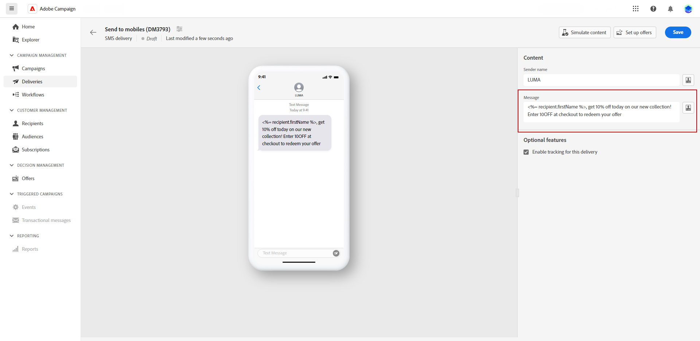

# Diseño de un envío de SMS {#design-sms}

>[!CONTEXTUALHELP]
>id="acw_deliveries_sms_content"
>title="Contenido SMS"
>abstract="Cree el contenido de sus envíos SMS y personalícelo con campos de personalización, bloques de contenido y contenido dinámico."

>[!CONTEXTUALHELP]
>id="acw_sms_preview_option_app_target"
>title="Suscriptores de la aplicación"
>abstract="Obtenga una vista previa y pruebe el mensaje añadiendo suscriptores de la aplicación al destinatario principal."

1. En la página del envío, haga clic en el botón **[!UICONTROL Editar contenido]** para diseñar el contenido del SMS.

1. En la página **[!UICONTROL Editar contenido]**, puede personalizar el nombre del remitente accediendo al **[!UICONTROL Campo del remitente]** e introduciendo el nombre preferido.

   Además, haciendo clic en **[!UICONTROL Abrir diálogo de personalización]**, puede incluir campos de personalización, bloques de contenido y contenido dinámico en el mensaje.

   

1. Escriba el mensaje de texto en el campo **[!UICONTROL Mensaje]** o haga clic en la opción **[!UICONTROL Abrir diálogo de personalización]** para definir contenido y añadir contenido dinámico. [Más información](../personalization/gs-personalization.md)

   

1. De forma predeterminada, el seguimiento está habilitado para los envíos. Puede desactivar esta opción desde **[!UICONTROL Funciones opcionales]**.

1. Acceda a la **[!UICONTROL Simular contenido]** para obtener una vista previa del contenido personalizado. [Más información](send-sms.md#preview-sms)

1. Haga clic en **[!UICONTROL Guardar]** y compruebe el mensaje en la vista previa.

Ahora puede revisar y enviar su mensaje SMS a su audiencia.
