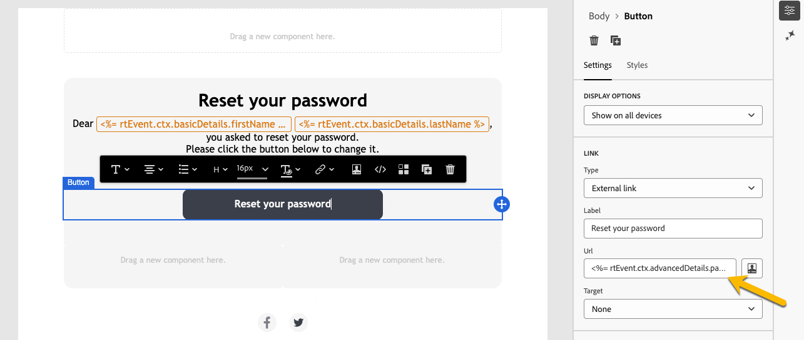
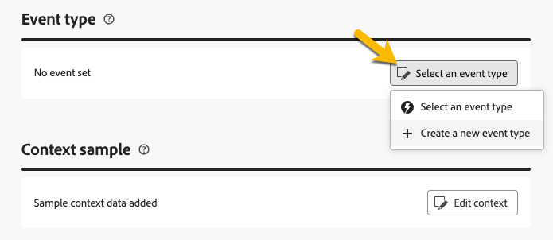

# Creación de mensajes transaccionales

En la mensajería transaccional, un evento déclencheur el envío de un mensaje personalizado. Para habilitar esto, cree una plantilla de mensaje para cada tipo de evento. Estas plantillas contienen toda la información necesaria para personalizar el mensaje transaccional.

## Creación de una plantilla de mensaje transaccional {#transactional-template}

En la interfaz de usuario web de Campaign, el primer paso en la configuración de la mensajería transaccional es la creación de la plantilla o la creación directa del mensaje. Esto difiere de [la configuración de los mensajes transaccionales en la consola del cliente](https://experienceleague.adobe.com/en/docs/campaign/campaign-v8/send/real-time/transactional).

Se puede utilizar una plantilla de mensaje transaccional para previsualizar el contenido de envío recibido por el perfil antes de que llegue a la audiencia final. Por ejemplo, un administrador puede configurar las plantillas, preparándolas para que las utilicen los usuarios de marketing.

Para crear una plantilla de mensaje transaccional, siga los pasos a continuación:

* En la sección **[!UICONTROL Mensajes activados]**, vaya a **[!UICONTROL Mensajes transaccionales]**. En la ficha **[!UICONTROL Plantillas]**, puede ver todas las plantillas de envío de los mensajes transaccionales. Haga clic en el botón **[!UICONTROL Crear plantilla de mensaje transaccional]** para comenzar a crear la plantilla.

  {zoomable="yes"}

* En la nueva página mostrada, elija el canal de la plantilla. Para este ejemplo, seleccione el canal **[!UICONTROL Correo electrónico]**. También puede trabajar desde otra plantilla de mensaje y seleccionarla en la lista de plantillas.

  {zoomable="yes"}

  Vuelva a hacer clic en el botón **[!UICONTROL Crear mensaje transaccional]** para validar la creación de la plantilla en el canal seleccionado.

* Acceda a la configuración de la plantilla de mensaje transaccional.

  {zoomable="yes"}

### Propiedades del mensaje transaccional {#transactional-properties}

>[!CONTEXTUALHELP]
>id="acw_transacmessages_properties"
>title="Propiedades de la mensajería transaccional"
>abstract="Rellene este formulario para configurar las propiedades de la mensajería transaccional."

>[!CONTEXTUALHELP]
>id="acw_transacmessages_email_properties"
>title="Propiedades de correo electrónico de la mensajería transaccional"
>abstract="Complete este formulario para configurar las propiedades del correo electrónico de mensajería transaccional."

>[!CONTEXTUALHELP]
>id="acw_transacmessages_sms_properties"
>title="Propiedades de SMS de la mensajería transaccional"
>abstract="Rellene este formulario para configurar las propiedades del SMS de mensajería transaccional."

>[!CONTEXTUALHELP]
>id="acw_transacmessages_push_properties"
>title="Propiedades de Push de la mensajería transaccional"
>abstract="Rellene este formulario para configurar las propiedades push de la mensajería transaccional."

La sección **[!UICONTROL Propiedades]** de un mensaje transaccional le ayuda a configurar:

* **[!UICONTROL Label]**, que es el nombre mostrado en la lista de mensajes transaccionales. Aclarar para investigación y uso futuro.
* **[!UICONTROL Internal name]**, que es un nombre único que diferencia el mensaje de otros mensajes creados.
* La **[!UICONTROL carpeta]**, donde se crea la plantilla de mensaje transaccional.
* La **[!UICONTROL carpeta de ejecución]**, donde se almacena el mensaje después de la ejecución.
* El **[!UICONTROL código de envío]**, que es un código que ayuda a reconocer el mensaje para la creación de informes, si es necesario.
* La **[!UICONTROL Descripción]**.
* La **[!UICONTROL Naturaleza]**, que es la naturaleza de su entrega, como se muestra en la enumeración *deliveryNature*. [Más información sobre las enumeraciones](https://experienceleague.adobe.com/en/docs/campaign/campaign-v8/config/configuration/ui-settings#enumerations).

{zoomable="yes"}

### Aplicación móvil {#mobile-app}

>[!CONTEXTUALHELP]
>id="acw_transacmessages_mobileapp"
>title="Aplicación móvil de mensajería transaccional"
>abstract="En esta sección, puede seleccionar la aplicación en la que desea insertar el mensaje."

En esta sección, seleccione la aplicación en la que desea insertar el mensaje.

Al hacer clic en el icono de búsqueda, acceda a la lista de aplicaciones móviles de la instancia de Adobe Campaign.

{zoomable="yes"}

### Muestra de contexto {#context-sample}

>[!CONTEXTUALHELP]
>id="acw_transacmessages_context"
>title="Contexto de la mensajería transaccional"
>abstract="La muestra de contexto le permite crear un evento de prueba para obtener una vista previa del mensaje transaccional recibido con la personalización del perfil."

>[!CONTEXTUALHELP]
>id="acw_transacmessages_addcontext"
>title="Contexto de la mensajería transaccional"
>abstract="La muestra de contexto le permite crear un evento de prueba para obtener una vista previa del mensaje transaccional recibido con la personalización del perfil."

La muestra de contexto le permite crear un evento de prueba para obtener una vista previa del mensaje transaccional recibido con la personalización del perfil.

Este paso es opcional. Puede utilizar la plantilla sin el ejemplo de contexto, pero el inconveniente es que no puede obtener una vista previa del contenido personalizado.

En el ejemplo de configuración de la contraseña, el evento envía el nombre, los apellidos y un vínculo personalizado del usuario para restablecer su contraseña. El contexto se puede configurar como se muestra a continuación.

El contenido del contexto depende de la personalización que necesite.

{zoomable="yes"}

### Contenido de la plantilla de mensaje transaccional {#transactional-content}

>[!CONTEXTUALHELP]
>id="acw_transacmessages_content"
>title="Contenido de la mensajería transaccional"
>abstract="Aprenda a crear el contenido de mensajería transaccional."

>[!CONTEXTUALHELP]
>id="acw_transacmessages_personalization"
>title="Personalización de la mensajería transaccional"
>abstract="Aprenda a personalizar el contenido de la mensajería transaccional."

>[!CONTEXTUALHELP]
>id="acw_personalization_editor_event_context"
>title="Contexto del evento"
>abstract="Este menú proporciona variables del evento activador que puede aprovechar para personalizar el contenido del mensaje transaccional."

Trabajar en el contenido de un mensaje transaccional es similar a la creación de contenido de una entrega. Haz clic en **[!UICONTROL Abrir el diseñador de correo electrónico]** o **[!UICONTROL Editar el cuerpo del correo electrónico]** y selecciona un contenido de plantilla o importa el código de HTML.

{zoomable="yes"}

Para personalizar el contenido, haz clic en la sección donde quieras agregarlo y elige el icono **[!UICONTROL Agregar Personalization]**.

{zoomable="yes"}

Acceda a la ventana **[!UICONTROL Editar personalización]**. Para agregar variables desde el evento de déclencheur, haga clic en el icono **[!UICONTROL Contexto de evento]**. Navegue por el contexto que definió para la plantilla ([más información acerca del contexto](#context-sample)) y haga clic en el botón **[!UICONTROL +]** para insertar la variable requerida.

La siguiente imagen muestra cómo añadir personalización para el nombre.

{zoomable="yes"}

En este ejemplo, agrega el nombre y los apellidos y personaliza el vínculo de botón **[!UICONTROL Restablecer la contraseña]**.

{zoomable="yes"}

### Previsualice la plantilla

En esta fase de la creación de la plantilla, previsualice el contenido de la plantilla y compruebe la personalización.

Para ello, rellene la [muestra de contexto](#context-sample) y haga clic en el botón **[!UICONTROL Simular contenido]**.

{zoomable="yes"}

## Creación de un mensaje transaccional {#transactional-message}

Puede crear un mensaje transaccional directamente o mediante una plantilla de mensaje transaccional. [Aprenda a crear una plantilla de mensaje transaccional](#transactional-template).

Para crear un mensaje transaccional, siga los pasos a continuación:

* En la sección **[!UICONTROL Mensajes activados]**, vaya a **[!UICONTROL Mensajes transaccionales]**. En la pestaña **[!UICONTROL Examinar]**, puedes ver todos los mensajes transaccionales creados. Haga clic en el botón **[!UICONTROL Crear mensaje transaccional]** para comenzar a crear su mensaje.

  {zoomable="yes"}

* En la nueva página mostrada, elija el canal del mensaje y seleccione la plantilla con la que desee trabajar. En este ejemplo, elija [la plantilla creada anteriormente](#transactional-template).

  {zoomable="yes"}

  Vuelva a hacer clic en el botón **[!UICONTROL Crear mensaje transaccional]** para validar la creación del mensaje en el canal seleccionado.

* Acceda a la configuración de su mensaje transaccional. El mensaje hereda la configuración de la plantilla. Esta página es casi idéntica a la página de configuración de la plantilla de mensaje transaccional, excepto que también incluye la configuración de tipo de evento.

  {zoomable="yes"}

  Rellene la configuración del mensaje como para una plantilla:
   * [Propiedades del mensaje transaccional](#transactional-properties)
   * [Muestra de contexto](#context-sample)
   * [Contenido del mensaje](#transactional-content)
y [configure el tipo de evento](#event-type) como se detalla a continuación.

* Después de [validar tu mensaje transaccional](validate-transactional.md), haz clic en el botón **[!UICONTROL Revisar y publicar]** para crear y publicar tu mensaje. Los déclencheur ahora pueden insertar el envío del mensaje transaccional.

### Acerca del tipo de evento {#event-type}

>[!CONTEXTUALHELP]
>id="acw_transacmessages_event"
>title="Evento de mensajería transaccional"
>abstract="La configuración del tipo de evento vincula el mensaje al evento de déclencheur."

La configuración del tipo de evento vincula el mensaje al evento de déclencheur.

En la interfaz de usuario web de Campaign, seleccione un tipo de evento ya creado o cree el tipo de evento directamente en esta página de configuración.

{zoomable="yes"}

>[!CAUTION]
>
>Si selecciona un tipo de evento que esté utilizando otro mensaje transaccional, almacenará en déclencheur ambos mensajes. Para obtener prácticas recomendadas, **vincule UN tipo de evento a UN solo mensaje transaccional.**

## Añadir ofertas a los mensajes transaccionales {#transactional-offers}

Puede incluir ofertas en los mensajes transaccionales, lo que le permite presentar propuestas relevantes a los usuarios finales, incluso cuando el mensaje se activa por evento.

Se puede acceder a esta función durante la fase de edición de contenido del mensaje transaccional. Haga clic en el botón **[!UICONTROL Configurar ofertas]** para configurarlo.

El proceso de configuración es idéntico al de configuración de ofertas para envíos estándar. [Aprenda a agregar ofertas a su mensaje](../msg/offers.md).

{zoomable="yes"}