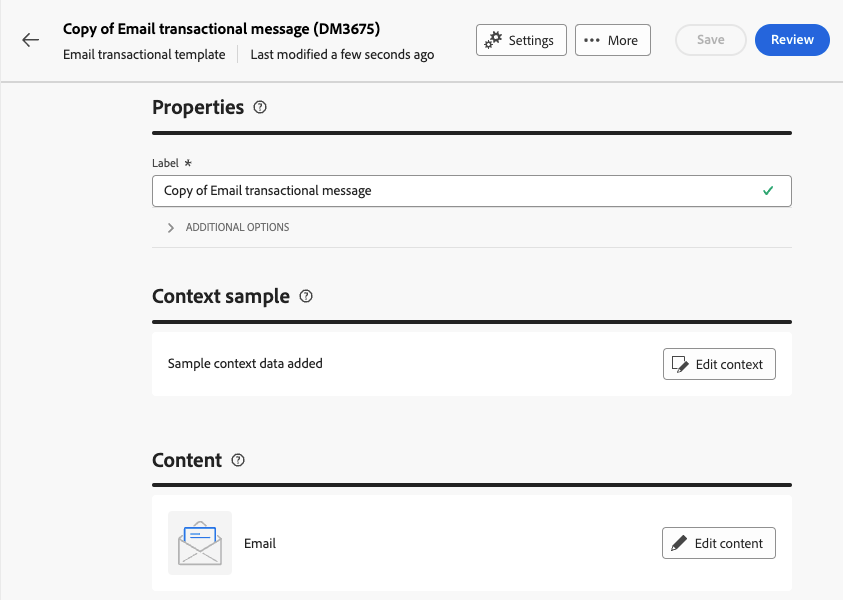

# Creación de mensajes transaccionales

En la mensajería transaccional, un evento déclencheur el envío de un mensaje personalizado.
Para habilitar esto, debe crear una plantilla de mensaje para cada tipo de evento. Estas plantillas contienen toda la información necesaria para personalizar el mensaje transaccional.

## Creación de una plantilla de mensaje transaccional {#transactional-template}

En la interfaz de usuario web de Campaign, el primer paso en la configuración de la mensajería transaccional es la creación de la plantilla o la creación directa del mensaje. Esto difiere con [la configuración de los mensajes transaccionales en la consola del cliente](https://experienceleague.adobe.com/en/docs/campaign/campaign-v8/send/real-time/transactional).

Se puede utilizar una plantilla de mensaje transaccional para previsualizar el contenido de envío recibido por el perfil antes de que llegue a la audiencia final. Por ejemplo, un administrador puede configurar las plantillas, preparándolas para que las utilicen los usuarios de marketing.

Para crear una plantilla de mensaje transaccional, siga los pasos a continuación:

* En la sección **[!UICONTROL Mensajes activados]**, vaya a **[!UICONTROL Mensajes transaccionales]**. En la ficha **[!UICONTROL Plantillas]**, puede ver todas las plantillas de envío de los mensajes transaccionales. Haga clic en el botón **[!UICONTROL Crear plantilla de mensaje transaccional]** para comenzar a crear la plantilla.

  {zoomable="yes"}

* En la nueva página mostrada, elija el canal de la plantilla. Para nuestro ejemplo, seleccionamos el canal **[!UICONTROL Correo electrónico]**. También puede trabajar desde otra plantilla de mensaje y seleccionarla en la lista de plantillas.

  {zoomable="yes"}

  Vuelva a hacer clic en el botón **[!UICONTROL Crear mensaje transaccional]** para validar la creación de la plantilla en el canal seleccionado.

* Ahora tiene acceso a la configuración de la plantilla de mensajes transaccionales.

  {zoomable="yes"}

### Propiedades del mensaje transaccional {#transactional-properties}

>[!CONTEXTUALHELP]
>id="acw_transacmessages_properties"
>title="Propiedades de la mensajería transaccional"
>abstract="Rellene este formulario para configurar las propiedades de la mensajería transaccional"

>[!CONTEXTUALHELP]
>id="acw_transacmessages_email_properties"
>title="Propiedades de correo electrónico de la mensajería transaccional"
>abstract="Rellene este formulario para configurar las propiedades del correo electrónico de la mensajería transaccional"

>[!CONTEXTUALHELP]
>id="acw_transacmessages_sms_properties"
>title="Propiedades de SMS de la mensajería transaccional"
>abstract="Rellene este formulario para configurar las propiedades de SMS de la mensajería transaccional"

>[!CONTEXTUALHELP]
>id="acw_transacmessages_push_properties"
>title="Propiedades de Push de la mensajería transaccional"
>abstract="Rellene este formulario para configurar las propiedades de Push de la mensajería transaccional"

La sección **[!UICONTROL Propiedades]** de un mensaje transaccional le ayudará a configurar:

* **[!UICONTROL Label]** es el nombre que se muestra en la lista de mensajes transaccionales. Aclarar para investigación y uso futuro.
* **[!UICONTROL Internal name]** es un nombre único que diferencia su mensaje de los demás mensajes creados.
* La **[!UICONTROL carpeta]** es donde se crea la plantilla de mensaje transaccional.
* **[!UICONTROL Carpeta de ejecución]** es donde se almacena el mensaje después de la ejecución.
* **[!UICONTROL Código de envío]**: un código que ayuda a reconocer el mensaje para la creación de informes, si es necesario.
* La **[!UICONTROL Descripción]**
* La **[!UICONTROL Naturaleza]** es la naturaleza de su entrega, tal como se indica en la enumeración *deliveryNature*. [Más información sobre las enumeraciones](https://experienceleague.adobe.com/en/docs/campaign/campaign-v8/config/configuration/ui-settings#enumerations)

{zoomable="yes"}

### Aplicación móvil {#mobile-app}

>[!CONTEXTUALHELP]
>id="acw_transacmessages_mobileapp"
>title="Aplicación móvil de mensajería transaccional"
>abstract="En esta sección, puede seleccionar la aplicación en la que desea insertar el mensaje."

En esta sección, puede seleccionar la aplicación en la que desea insertar el mensaje.

Al hacer clic en el icono de búsqueda, accede a una aplicación móvil incluida en la instancia de Adobe Campaign.

{zoomable="yes"}

### Muestra de contexto {#context-sample}

>[!CONTEXTUALHELP]
>id="acw_transacmessages_context"
>title="Contexto de la mensajería transaccional"
>abstract="La muestra de contexto le permite crear un evento de prueba para obtener una vista previa del mensaje transaccional recibido con la personalización del perfil."

>[!CONTEXTUALHELP]
>id="acw_transacmessages_addcontext"
>title="Contexto de la mensajería transaccional"
>abstract="La muestra de contexto le permite crear un evento de prueba para obtener una vista previa del mensaje transaccional recibido con la personalización del perfil. "

La muestra de contexto le permite crear un evento de prueba para obtener una vista previa del mensaje transaccional recibido con la personalización del perfil.

Este paso es opcional. Puede utilizar la plantilla sin el ejemplo de contexto, pero el inconveniente es que no puede obtener una vista previa del contenido personalizado.

En nuestro ejemplo de configuración de la contraseña, el evento enviará el nombre, los apellidos y un vínculo personalizado del usuario para restablecer su contraseña. El contexto se puede configurar como se muestra a continuación.

El contenido del contexto depende de la personalización que necesite.

{zoomable="yes"}

### Contenido de la plantilla de mensaje transaccional {#transactional-content}

>[!CONTEXTUALHELP]
>id="acw_transacmessages_content"
>title="Contenido de la mensajería transaccional"
>abstract="Aprenda a crear el contenido de la mensajería transaccional"

>[!CONTEXTUALHELP]
>id="acw_transacmessages_personalization"
>title="Personalización de la mensajería transaccional"
>abstract="Aprenda a personalizar el contenido de la mensajería transaccional"

Trabajar en el contenido de un mensaje transaccional es como crear contenido en un envío. Haga clic en **[!UICONTROL Abrir el diseñador de correo electrónico]** o **[!UICONTROL Editar el cuerpo del correo electrónico]** y seleccione un contenido de plantilla o importe su código de HTML.

{zoomable="yes"}

Para agregar la personalización en el contenido, haga clic en la sección donde desee agregarla y elija el icono **[!UICONTROL Agregar Personalization]**.

{zoomable="yes"}

Tendrá acceso a la ventana **[!UICONTROL Editar personalización]**.
Para agregar las variables del evento de déclencheur, haga clic en el icono **[!UICONTROL Contexto de evento]**. Puede navegar por el contexto definido para la plantilla ([obtener más información sobre el contexto](#context-sample)) y hacer clic en el botón **[!UICONTROL +]** para insertar la variable necesaria.

Puede ver en la siguiente imagen cómo añadir la personalización del nombre.

{zoomable="yes"}

En nuestro ejemplo, agregamos el nombre, luego el apellido y personalizamos el vínculo de botón **[!UICONTROL Restablecer la contraseña]**.

{zoomable="yes"}

### Previsualice la plantilla

En esta fase de la creación de la plantilla, es posible que desee previsualizar el contenido de la plantilla y comprobar la personalización.

Para ello, rellene el [ejemplo de contexto](#context-sample) y haga clic en el botón **[!UICONTROL Simular contenido]**.

{zoomable="yes"}

## Creación de un mensaje transaccional {#transactional-message}

Puede crear un mensaje transaccional directamente o mediante una plantilla de mensaje transaccional. [Aprenda a crear una plantilla de mensaje transaccional](#transactional-template).

Para crear un mensaje transaccional, siga los pasos a continuación:

* En la sección **[!UICONTROL Mensajes activados]**, vaya a **[!UICONTROL Mensajes transaccionales]**. En la pestaña **[!UICONTROL Examinar]**, puedes ver todos los mensajes transaccionales creados. Haga clic en el botón **[!UICONTROL Crear mensaje transaccional]** para comenzar a crear su mensaje.

  {zoomable="yes"}

* En la nueva página mostrada, elija el canal del mensaje y elija la plantilla con la que desea trabajar. En nuestro ejemplo, elegimos [la plantilla que creamos aquí](#transactional-template).

  {zoomable="yes"}

  Vuelva a hacer clic en el botón **[!UICONTROL Crear mensaje transaccional]** para validar la creación del mensaje en el canal seleccionado.

* Ahora tiene acceso a la configuración del mensaje transaccional. El mensaje hereda la configuración de la plantilla. Esta página es casi idéntica a la página de configuración de la plantilla de mensaje transaccional, excepto que también incluye la configuración de tipo de evento.

  {zoomable="yes"}

  Rellene la configuración del mensaje como para una plantilla:
   * [Las propiedades del mensaje transaccional](#transactional-properties)
   * [El ejemplo de contexto](#context-sample)
   * [Contenido del mensaje](#transactional-content)
y [configure el tipo de evento](#event-type) como se detalla a continuación.

* Después de [validar tu mensaje transaccional](validate-transactional.md), haz clic en el botón **[!UICONTROL Revisar y publicar]** para crear y publicar tu mensaje.
Los déclencheur ahora pueden insertar el envío del mensaje transaccional.

### Acerca del tipo de evento {#event-type}

>[!CONTEXTUALHELP]
>id="acw_transacmessages_event"
>title="Evento de mensajería transaccional"
>abstract="La configuración del tipo de evento vincula el mensaje al evento del activador."

La configuración del tipo de evento vincula el mensaje al evento del activador.

En la interfaz de usuario web de Campaign, puede seleccionar un tipo de evento ya creado o crear directamente el tipo de evento en esta página de configuración.

{zoomable="yes"}

>[!CAUTION]
>
>Si selecciona un tipo de evento que esté utilizando otro mensaje transaccional, almacenará en déclencheur los dos mensajes. Para prácticas recomendadas, **recomendamos enfáticamente vincular UN tipo de evento a UN solo mensaje transaccional.**

## Añadir ofertas a los mensajes transaccionales {#transactional-offers}

Tiene la opción de incluir ofertas en los mensajes transaccionales, lo que le permite presentar propuestas relevantes a los usuarios finales, incluso cuando el mensaje se activa por evento.

Se puede acceder a esta función durante la fase de edición de contenido del mensaje transaccional. Simplemente haz clic en el botón **[!UICONTROL Configurar ofertas]** para configurarlo.

El proceso de configuración es idéntico al de configuración de ofertas para envíos estándar. [Aprenda a agregar ofertas a su mensaje](../msg/offers.md).

{zoomable="yes"}
