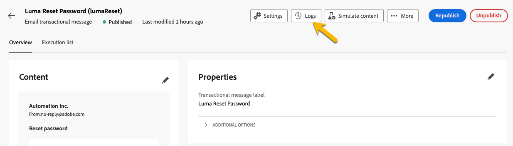
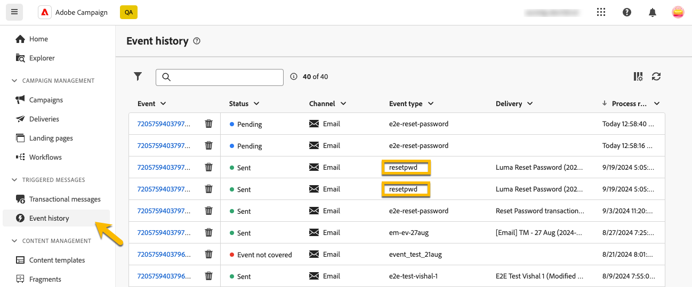

# Supervisión de mensajes transaccionales

Después de la publicación y el envío del mensaje transaccional, puede tener informes y registros sobre él.

## Registros de mensajes transaccionales {#transactional-logs}

Una vez publicado el mensaje, puede revisar su ejecución haciendo clic en el botón **[!UICONTROL Registros]**.

{zoomable="yes"}

Esto le proporciona acceso a registros detallados sobre la publicación del mensaje en la pestaña **[!UICONTROL logs]**.

{zoomable="yes"}

Además, puede ver la lista de **[!UICONTROL Pruebas]** enviadas junto con sus registros en la pestaña correspondiente.

## Historial de mensajes transaccionales {#transactional-history}

En la sección **[!UICONTROL Mensajes activados]**, puede ver detalles sobre todos los mensajes transaccionales que se han ejecutado. Para tener acceso a esto, vaya a **[!UICONTROL Mensajes transaccionales]**. En la pestaña **[!UICONTROL History]**, puede ver la lista de mensajes transaccionales ejecutados junto con su estado y la información adicional.

{zoomable="yes"}

Investigue allí para encontrar su mensaje y haga clic en él.
Puede ver los detalles allí.

{zoomable="yes"}

## Historial de eventos {#event-history}

>[!CONTEXTUALHELP]
>id="acw_transacmessages_eventhistory"
>title="Historial de eventos de mensajería transaccional"
>abstract="Puede obtener una vista de los eventos que almacenan en déclencheur el mensaje transaccional."

>[!CONTEXTUALHELP]
>id="acw_transacmessages_eventhistory_preview"
>title="Previsualización del historial de eventos de mensajería transaccional"
>abstract="Puede obtener una vista de los eventos que almacenan en déclencheur el mensaje transaccional."

También puede obtener una vista de los eventos que almacenan en déclencheur el mensaje transaccional.
Para verlos, vaya a la sección **[!UICONTROL Historial de eventos]**.

Se pueden ver con el nombre del tipo de evento.

{zoomable="yes"}

Para obtener más información, como se muestra a continuación, haga clic en el ID **[!UICONTROL Evento]**:

* La información de contacto
* Todo sobre las fechas del proceso

Incluso puede obtener una vista previa del mensaje enviado con el botón **[!UICONTROL Vista previa]** y ver los datos recibidos que ponen en déclencheur el mensaje con el botón **[!UICONTROL Ver datos]**.

{zoomable="yes"}

El botón **[!UICONTROL Más]** le permite eliminar el historial de eventos.
