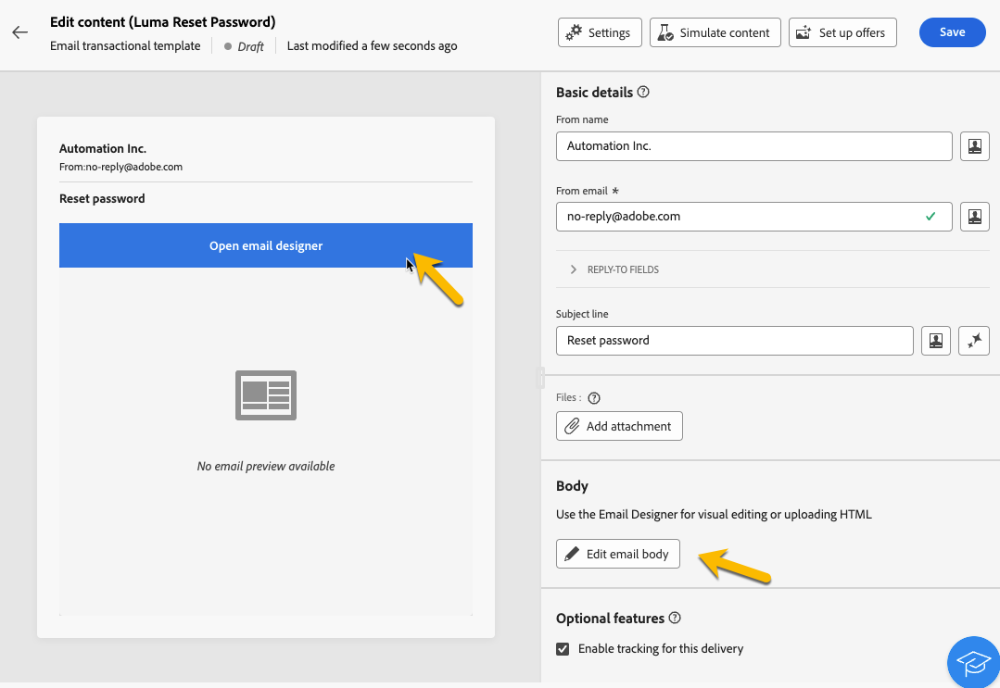

# Enriquecimiento de los mensajes transaccionales con datos de perfil{#profile-enrichment}

>[!CONTEXTUALHELP]
>id="acw_homepage_welcome_rn2"
>title="Enriquecimiento de perfil"
>abstract="Ahora puede personalizar los mensajes transaccionales vinculando los campos de la base de datos de Campaign al contenido. Seleccione asignaciones de destino, columnas de enriquecimiento y claves de reconciliación para una personalización precisa en tiempo real."
>additional-url="https://experienceleague.adobe.com/docs/campaign-web/v8/release-notes/release-notes.html?lang=es" text="Consulte las notas de la versión"

Esta capacidad le permite personalizar mensajes transaccionales vinculando campos de base de datos de Adobe Campaign al contenido del mensaje. Puede seleccionar asignaciones de destinatario, columnas de enriquecimiento y una clave de reconciliación para garantizar una personalización precisa y en tiempo real mientras mantiene los umbrales de rendimiento.

* Los mensajes transaccionales basados en eventos utilizan datos contenidos en el propio evento.
* Los mensajes transaccionales basados en perfiles utilizan datos contenidos en la base de datos de Adobe Campaign.

Para configurar el enriquecimiento de perfil, siga estos pasos principales:

1. Cree el mensaje transaccional, [leer más](#create-enrichment)
1. Defina el tipo de evento [leer más](#event-enrichment)
1. Configure las opciones de enriquecimiento, [leer más](#settings-enrichment)
1. Defina el contenido, [leer más](#content-enrichment)
1. Validar y enviar, [leer más](#send-enrichment)

>[!NOTE]
>
>El servidor debe actualizarse a la versión 8.8.2 o posterior.
>
>Actualmente, esta función solo está disponible para correos electrónicos, SMS y notificaciones push.

## Creación del mensaje transaccional{#create-enrichment}

En primer lugar, debe crear un nuevo mensaje transaccional.

1. En la sección **[!UICONTROL Mensajes activados]**, vaya a **[!UICONTROL Mensajes transaccionales]** y cree un nuevo mensaje transaccional.

   {zoomable="yes"}

1. Elija una plantilla y defina las propiedades. Para obtener más información, consulte [esta página](create-transactional.md#transactional-message).

## Definición del tipo de evento{#event-enrichment}

A continuación, debe definir el evento como basado en perfiles para dirigirse a los datos contenidos en la base de datos de Adobe Campaign.

1. En la sección **Tipo de evento**, seleccione **Seleccionar tipo de evento** y, a continuación, elija si desea usar un tipo de evento existente o crear el suyo propio.

   >[!NOTE]
   >
   >No puede elegir un tipo de evento que ya se esté utilizando en otra plantilla de mensaje transaccional.

   {zoomable="yes"}

1. Introduzca la información del tipo de evento:

   * Para un tipo de evento existente, selecciónelo en la lista.
   * Para una nueva, añada una etiqueta y un nombre.

1. A continuación, elija **Perfil RT** en la lista desplegable **Tipo de evento**.

   {zoomable="yes"}

## Configuración del enriquecimiento{#settings-enrichment}

Ahora, vamos a añadir campos al evento que le permitirán personalizar el mensaje transaccional.

1. En la sección **Datos**, haga clic en **Configuración de enriquecimiento**.

   {zoomable="yes"}

   >[!NOTE]
   >
   >Este botón solo está disponible cuando define un evento basado en perfiles.

1. En la sección **Atributos adicionales**, haga clic en **agregar atributo** y seleccione los campos necesarios.

   {zoomable="yes"}

1. Defina qué atributo se utilizará como clave de reconciliación.

1. Elija lo que debe suceder si la clave no está disponible en la carga útil.

   * El mensaje se envía sin personalización
   * El mensaje no se ha enviado

## Definición del contenido{#content-enrichment}

A continuación, debe definir el contenido del mensaje transaccional.

1. En la sección **Contenido**, haga clic en el botón **Editar contenido** y defina el contenido del mensaje. Consulte [esta página](create-transactional.md#transactional-content).

   {zoomable="yes"}

1. Al utilizar la personalización, en la línea de asunto por ejemplo, use el menú **Enriquecimiento del perfil** para agregar los campos basados en el perfil definidos anteriormente.

   {zoomable="yes"}

## Validación y envío{#send-enrichment}

Finalmente, debe validar y realizar la entrega.

1. Valide la entrega simulando el contenido y enviando pruebas. Consulte [esta página](validate-transactional.md).

1. Haga clic en el botón **[!UICONTROL Revisar y publicar]** para crear y publicar el mensaje. Los déclencheur ahora pueden iniciar el envío del mensaje transaccional.

<!--
When creating the event configuration, select the Profile event targeting dimension (see Creating an event).

Add fields to the event, in order to be able to personalize the transactional message (see Defining the event attributes). You must add at least one field to create an enrichment. You do not need to create other fields such as First name and Last name as you will be able to use personalization fields from the Adobe Campaign database.

Create an enrichment in order to link the event to the Profile resource (see Enriching the event) and select this enrichment as the Targeting enrichment.

IMPORTANT
This step is mandatory for profile-based events.
Preview and publish the event (see Previewing and publishing the event).

When previewing the event, the REST API does not contain an attribute specifying the email address, mobile phone, or push notification specific attributes, as it will be retrieved from the Profile resource.

Once the event has been published, a transactional message linked to the new event is automatically created. In order for the event to trigger sending a transactional message, you must modify and publish the message that was just created…

Integrate the event into your website (see Integrate the event triggering).
-->
