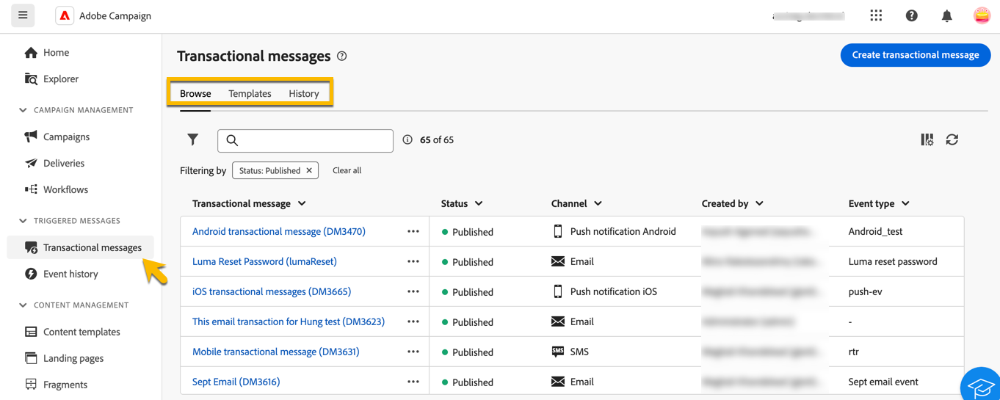

# Acerca de la mensajería transaccional {#transactional-messaging}

>[!CONTEXTUALHELP]
>id="acw_transacmessages"
>title="Mensajería transaccional"
>abstract="La mensajería transaccional es un módulo especializado de Adobe Campaign diseñado para gestionar los mensajes activados."

<!-- >>[!CONTEXTUALHELP]
>id="acw_transacmessages_exclusionlogs"
>title="Transactional messaging exclusion logs"
>abstract="Transactional messaging exclusion logs" -->

La mensajería transaccional es un módulo especializado de Adobe Campaign diseñado para gestionar los mensajes activados. Estos mensajes se generan automáticamente en respuesta a eventos procedentes de sistemas de información. Algunos ejemplos comunes de estos eventos son hacer clic en botones o vínculos, abandonar el carro de compras, solicitar alertas de disponibilidad de productos, crear cuentas o modificar.

Los mensajes transaccionales se utilizan para enviar:

* Notificaciones importantes, como confirmaciones de pedidos o restablecimientos de contraseña,
* Respuestas en tiempo real a acciones del cliente, como la creación de cuentas o la finalización de compras,
* Contenido no promocional que es crítico para las interacciones de los clientes.

El módulo Mensajería transaccional se integra perfectamente con sus sistemas de información. Los eventos, como las acciones de los clientes, se insertan en Adobe Campaign, que envía el mensaje personalizado correspondiente. Estos mensajes se pueden enviar por separado o en lotes a través de varios canales, como correo electrónico, SMS o notificaciones push.

Puede encontrar el módulo **[!UICONTROL Mensaje transaccional]** en la sección **[!UICONTROL Mensajes activados]**.

{zoomable="yes"}

Tiene tres fichas en la página **[!UICONTROL Mensaje transaccional]**:

* **[!UICONTROL Examinar]**, donde tiene la lista de mensajes transaccionales con su estado,
* **[!UICONTROL Plantillas]**, donde encuentra y crea las plantillas de mensajes transaccionales,
* **[!UICONTROL Historial]**, donde se encuentran los detalles de todos los mensajes transaccionales que se han ejecutado.

Obtenga información en esta documentación sobre cómo:

* [Cree mensajes transaccionales](create-transactional.md) con la ayuda de una plantilla y aprenda la configuración necesaria,
* [Valide el contenido de sus mensajes transaccionales](validate-transactional.md) y simule la personalización,
* [Supervisar los mensajes transaccionales](monitor-transactional.md).