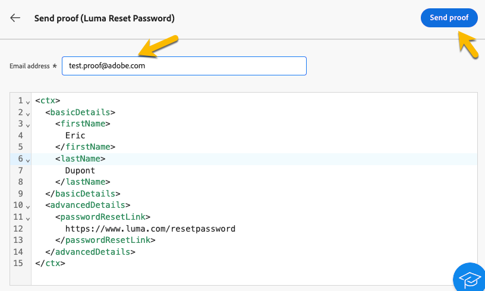

# Validación de mensajes transaccionales

Durante o después de crear el mensaje transaccional, es posible que desee validar el contenido mediante una muestra de datos.

## Simular contenido {#simulate-content}

Siga estos pasos para simular el contenido del mensaje:

* Asegúrese de que la ruta de personalización del contenido del mensaje coincida con el ejemplo de contexto. En el ejemplo siguiente, para mostrar el nombre del perfil de prueba, se utiliza la ruta de acceso *rtEvent.ctx.basicDetails.firstName*

  Puede cambiar el contenido del mensaje o el ejemplo de contexto para que se alineen.

  {zoomable="yes"}

* Haga clic en el botón **[!UICONTROL Simular contenido]** para obtener una vista previa del mensaje transaccional con los datos introducidos en la muestra de contexto.

  {zoomable="yes"}

  Después de revisar el contenido, haz clic en el botón **[!UICONTROL Cerrar]**.

* No olvide hacer clic en el botón **[!UICONTROL Volver a publicar]** si ha realizado cambios en el contenido.

## Enviar prueba

Si desea probar y experimentar el mensaje transaccional tal como se entregaría a través del canal elegido (como correo electrónico, SMS o notificaciones push), puede utilizar la función de prueba.

En la [ventana de contenido de simulación](#simulate-content), haga clic en el botón **[!UICONTROL Enviar revisión]**.

{zoomable="yes"}

En la nueva ventana que aparece, introduzca la dirección de correo electrónico (o el número de teléfono, según el canal) donde desea recibir la prueba. Una vez que hayas ingresado la dirección deseada, haz clic en **[!UICONTROL Enviar revisión]** y en **[!UICONTROL Confirmar]** botones. Esta acción le permite enviar una muestra del mensaje transaccional, asegurándose de que todas las personalizaciones, el contenido dinámico y el formato aparezcan correctamente como lo harían los usuarios finales.

{zoomable="yes"}

Este es un paso esencial para identificar cualquier problema potencial antes de publicar el mensaje transaccional.
