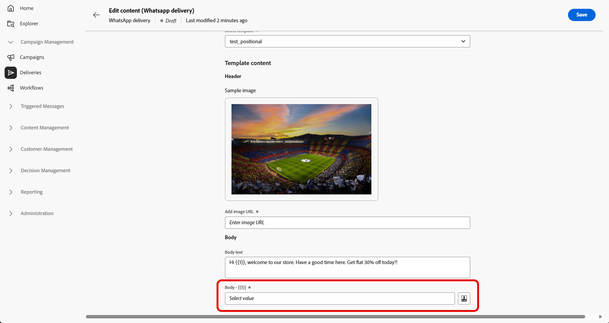

# Crear un mensaje de WhatsApp {#create-whatsapp}

La **interfaz de usuario web de Adobe Campaign** le permite diseñar mensajes de WhatsApp que utilicen plantillas aprobadas por Meta, personalizarlos para cada perfil y probarlos antes de enviarlos.

+++ Obtenga más información sobre los elementos de mensaje admitidos y las llamadas a la acción

WhatsApp admite los siguientes tipos de mensajes:

| Función de mensaje | Descripción |
|-|-|
| Encabezados | Texto opcional que aparece encima del cuerpo del mensaje. |
| Texto | Admite contenido dinámico mediante parámetros. |
| Imagen de encabezado | Imagen opcional que aparece encima del cuerpo del mensaje. |
| Texto independiente | Admite contenido dinámico mediante parámetros. |
| Texto del pie | Admite contenido dinámico mediante parámetros. |

+++

## Creación de una entrega de WhatsApp {#create-whatsapp-journey-campaign}

>[!IMPORTANT]
>
>Los comentarios del mensaje de WhatsApp no son compatibles actualmente.

En la interfaz de usuario web de Adobe Campaign, siga los pasos a continuación para crear una entrega independiente de WhatsApp.

1. Vaya al menú **[!UICONTROL Envíos]** y haga clic en **[!UICONTROL Crear envío]**.

   

1. Elige **[!UICONTROL WhatsApp]** y selecciona una plantilla de envíos. [Más información sobre las plantillas](../msg/delivery-template.md).

   

1. Haga clic en **[!UICONTROL Crear envío]** para confirmar.

1. Haga clic en **[!UICONTROL Configuración]** para ver las opciones avanzadas vinculadas a la plantilla. [Más información](../advanced-settings/delivery-settings.md)

   

1. Escriba una **[!UICONTROL Etiqueta]** para la entrega. Use **[!UICONTROL Opciones adicionales]** si necesita un nombre interno, una carpeta, un código de envío, una descripción o un tipo similar a los de otros canales.

1. Haga clic en **[!UICONTROL Seleccionar audiencia]** para segmentar una audiencia existente o generar una. [Más información sobre las audiencias](../audience/about-recipients.md).

1. Haz clic en **[!UICONTROL Editar contenido]** para abrir el editor de contenido de WhatsApp; consulta [Definir el contenido de WhatsApp](#whatsapp-content)).

   

1. Puede habilitar **[!UICONTROL Habilitar la programación]** para enviar en una fecha y hora específicas. [Más información](../msg/gs-deliveries.md#gs-schedule).

## Definición del contenido de WhatsApp{#whatsapp-content}

>[!BEGINSHADEBOX]

Antes de diseñar el mensaje de WhatsApp en la interfaz de usuario web de Adobe Campaign, cree y envíe la plantilla en Meta. [Más información](https://www.facebook.com/business/help/2055875911147364?id=2129163877102343)

Meta debe aprobar tu plantilla de WhatsApp antes de usarla. La aprobación suele tardar unas horas, pero puede tardar hasta 24 horas. [Más información](https://developers.facebook.com/docs/whatsapp/message-templates/guidelines/#approval-process)

>[!ENDSHADEBOX]

1. En la página de configuración de envío de la interfaz de usuario web de Adobe Campaign, haz clic en **[!UICONTROL Editar contenido]** para configurar el mensaje de WhatsApp.

1. Elija Marketing como su **categoría de plantilla**:

   [Más información sobre las categorías de plantillas](https://developers.facebook.com/docs/whatsapp/updates-to-pricing/new-template-guidelines/#template-category-guidelines)

   

1. En el menú desplegable **Plantilla de WhatsApp**, selecciona la plantilla aprobada por Meta.

   [Más información sobre cómo crear plantillas de WhatsApp](https://www.facebook.com/business/help/2055875911147364?id=2129163877102343)

   

1. Si la plantilla aprobada por Meta incluye una imagen, proporcione **[!UICONTROL URL de imagen]**.

   

1. En el campo **Personalization placeholder**, use el editor de personalización para asignar campos y expresiones de perfil a los parámetros de plantilla. [Más información](../personalization/personalize.md).

   

Cuando el mensaje esté listo:

* **Envío independiente o de campaña**: usa **[!UICONTROL Revisar y enviar]** y **[!UICONTROL Enviar]** en el panel de envío.

* **Flujo de trabajo**: abra la entrega desde la actividad de flujo de trabajo cuando la ejecución lo ponga a disposición y, a continuación, utilice el panel de entrega de la misma manera. [Más información](../workflows/start-monitor-workflows.md)

A continuación, puede realizar un seguimiento de los resultados de la entrega **[!UICONTROL Informes]** puntos de entrada y [informes de entrega](../reporting/delivery-reports.md).
