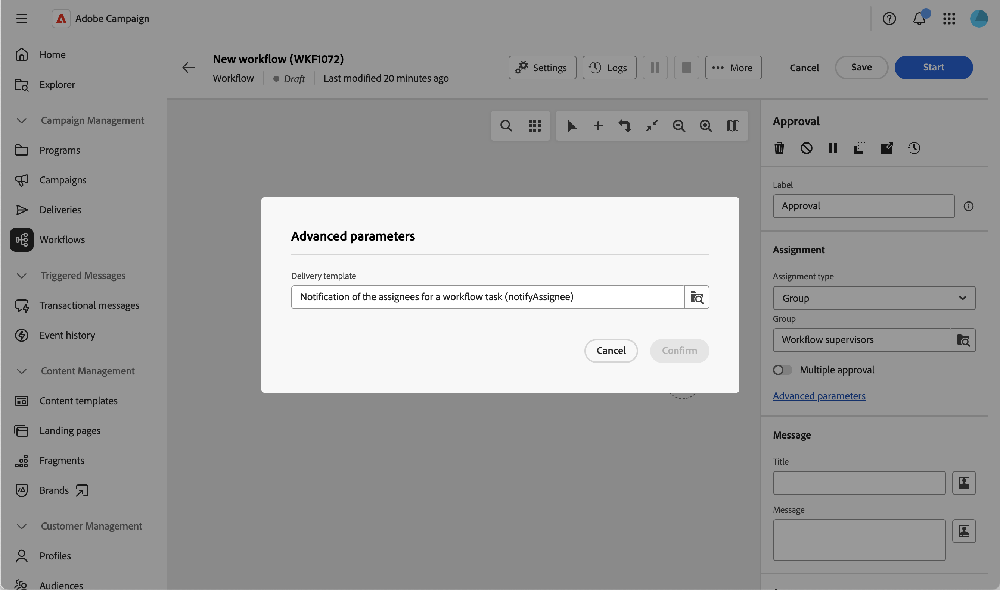
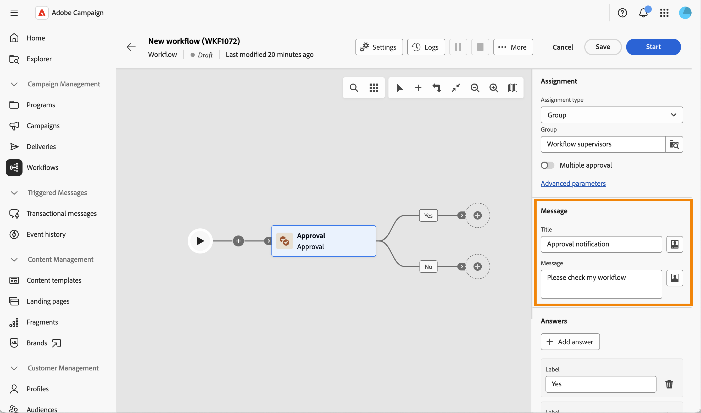

# Aprobación {#approval}

>[!CONTEXTUALHELP]
>id="acw_orchestration_approval"
>title="Actividad de aprobación"
>abstract="La actividad **Approval** requiere la participación de un operador. Asigne la tarea a un grupo o a un operador individual, personalice el título y el mensaje de la notificación y defina las posibles respuestas como ramas de salida."

La actividad del flujo de trabajo **Approval** le permite asignar una tarea a un grupo o a un operador individual, personalizar el título y el mensaje del correo electrónico de notificación y definir las posibles respuestas (por ejemplo, Sí/No) como ramas de salida.

Utilice esta actividad siempre que un paso del flujo de trabajo requiera una decisión humana antes de continuar, por ejemplo, para obtener la aprobación de un presupuesto, una audiencia destinataria o contenido, antes de que el flujo de trabajo continúe.

## Funcionamiento del proceso de aprobación {#process}

Requiere la participación de al menos un operador. Esta actividad no bloquea el flujo de trabajo: otras tareas se pueden ejecutar mientras el flujo de trabajo espera una respuesta.

Mientras espera una respuesta, la actividad se muestra como pendiente en el lienzo. El usuario asignado responde mediante el vínculo incluido en el mensaje de notificación.

Este es el proceso de aprobación de la tarea:

1. Cree un flujo de trabajo y configure una actividad **Approval**.
1. Inicie el flujo de trabajo. Cuando alcanza la actividad **Approval**, se crea una tarea para el usuario asignado.
1. El usuario asignado recibe el mensaje de notificación, hace clic en el vínculo y selecciona una respuesta.
1. Una vez que el usuario asignado responde, el flujo de trabajo continúa con la transición que coincide con su respuesta.

Para configurar esta actividad, siga estos pasos:

1. Asigne la tarea, [leer más](#assignment)
1. Defina el mensaje de notificación, [leer más](#message)
1. Defina las posibles respuestas, [leer más](#answers)
1. Opcionalmente, defina una caducidad, [leer más](#expiration)

## Asignar la tarea {#assignment}

La asignación de la tarea a un grupo o a un operador es obligatoria: se muestra una advertencia hasta que lo haga.

{zoomable="yes"}

Siga estos pasos:

1. En el campo **[!UICONTROL Tipo de asignación]**, elija si la tarea está asignada a un **[!UICONTROL Grupo]** (predeterminado) o a un **[!UICONTROL Operador]**.

1. A continuación, seleccione el **[!UICONTROL Grupo]** (de operadores) o un **[!UICONTROL Operador]** (operador único).

1. Habilite **[!UICONTROL Aprobación múltiple]** si desea que cada usuario asignado responda antes de que continúe el flujo de trabajo. Esta opción está disponible independientemente del tipo de asignación. Cuando está desactivado, el flujo de trabajo continúa en cuanto un usuario asignado responde y esa respuesta es la que se tiene en cuenta.

1. Haga clic en **[!UICONTROL Parámetros avanzados]** para seleccionar la plantilla de envío utilizada para la notificación. De forma predeterminada, se utiliza una plantilla integrada, pero se puede seleccionar cualquier otra plantilla de envío.

   {zoomable="yes"}

## Definición del mensaje de notificación {#message}

Ahora puede definir el mensaje de notificación enviado al usuario asignado.

{zoomable="yes"}

Siga estos pasos:

1. Defina **[!UICONTROL Title]** de la notificación enviada al usuario asignado.

1. Defina **[!UICONTROL Message]** de la notificación enviada al usuario asignado.

Ambos campos admiten la personalización: haga clic en el icono de personalización para insertar variables de evento, como el **[!UICONTROL Operador que ha respondido]** y la **[!UICONTROL Respuesta]**, que puede reutilizar en cualquier otra parte del flujo de trabajo.

{zoomable="yes"}

## Definición de las posibles respuestas {#answers}

La actividad incluye dos respuestas predeterminadas, **[!UICONTROL Yes]** y **[!UICONTROL No]**. Cada respuesta corresponde a una transición de salida en el lienzo.

{zoomable="yes"}

Haga clic en **[!UICONTROL Agregar respuesta]** para definir opciones adicionales.

Cuando el usuario asignado responde, el flujo de trabajo continúa con la transición que coincide con su elección.

## Definir una caducidad {#expiration}

Finalmente, puede definir una caducidad para la tarea de aprobación. Al igual que una respuesta, una caducidad pone en déclencheur su propia transición de salida si el usuario asignado no ha respondido en el plazo.

{zoomable="yes"}

1. Haga clic en **[!UICONTROL Agregar caducidad]**.

1. Defina una **[!UICONTROL Etiqueta]** para la transición de salida correspondiente.

1. En la lista desplegable **[!UICONTROL Tipo de caducidad]**, elija una de las siguientes opciones:

   * **[!UICONTROL Retraso después del inicio de la tarea]**: defina un retraso para esperar después de que se inicie la tarea de aprobación.
   * **[!UICONTROL Retraso después de una fecha]**: defina un retraso para esperar después de una fecha específica.
   * **[!UICONTROL Retraso antes de una fecha]**: defina un retraso para esperar antes de una fecha específica.
   * **[!UICONTROL Caducidad calculada por el script]**: use un script para calcular la caducidad.

1. Habilite **[!UICONTROL No finalice la tarea]** si desea que la transición de caducidad se active sin finalizar la tarea de aprobación, de modo que el usuario asignado pueda seguir respondiendo después.

Puede definir varias caducidades para la misma tarea de aprobación.

A continuación, puede iniciar el flujo de trabajo. Una vez que el usuario asignado responde, el flujo de trabajo continúa con la transición que coincide con su respuesta. [Más información](#process)

## Temas relacionados {#related}

* [Acerca de las actividades de flujo de trabajo](about-activities.md)
* [Configuración y administración del proceso de aprobación](../../campaigns/campaign-approvals.md)
