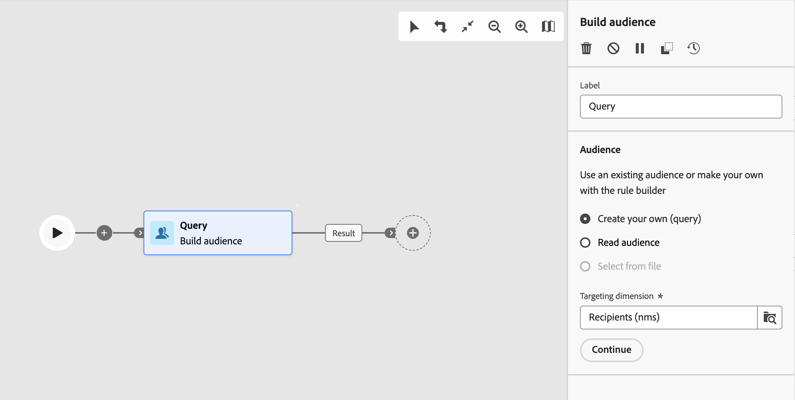

# Generar público destinatario {#build-audience}

>[!CONTEXTUALHELP]
>id="acw_orchestration_build_audience"
>title="Actividad generar público"
>abstract="La actividad **Generar público** le permite definir la actividad que entrará en el flujo de trabajo. Al enviar mensajes en el contexto de un flujo de trabajo, el público del mensaje no se define en la actividad del canal, sino en la actividad **Generar publico**."

La actividad **Generar público destinatario** es una actividad de **Segmentación**. Esta actividad le permite definir el público destinatario que entrará en el flujo de trabajo. Al enviar mensajes en el contexto de un flujo de trabajo, el público del mensaje no se define en la actividad del canal, sino en la actividad **Generar publico**.

Para definir la población del público destinatario, puede hacer lo siguiente:

* Seleccione un público destinatario existente, creado como una lista en la consola del cliente.
* Seleccione un público destinatario de Adobe Experience Platform.
* Cree una nueva audiencia con el generador de modeladores de consultas definiendo y combinando criterios de filtrado.

>[!NOTE]
>
>Las audiencias cargadas desde un archivo no se pueden segmentar con una actividad Generar audiencia. Para ello, necesita usar una actividad **Cargar archivo** seguida de una actividad **Reconciliación**. [Más información](../../audience/about-recipients.md)

<!--
The **Build audience** activity can be placed at the beginning of the workflow or after any other activity. Any activity can be placed after the **Build audience**.
-->

## Configuración de la actividad Generar público {#build-audience-configuration}

>[!CONTEXTUALHELP]
>id="acw_orchestration_build_audience_audienceselector"
>title="Público"
>abstract="Seleccione el público, del mismo modo que utiliza un público a la hora de diseñar un nuevo envío."

Siga estos pasos para configurar la actividad **Generar público destinatario**:

1. Añadir una actividad **Generar público destinatario**.
1. Defina una etiqueta.
1. Defina el tipo de público destinatario: **Crear la suya propia** o **Leer público destinatario**.
1. Configure su audiencia siguiendo los pasos detallados en las pestañas a continuación.

>[!BEGINTABS]

>[!TAB Cree su propia (consulta)]

Para crear su propia consulta, siga estos pasos:

1. Seleccione **Crear su propia (consulta)**.
1. Elija la **Dimensión de segmentación**. La dimensión de segmentación permite definir la población a la que se dirige la operación: destinatarios, beneficiarios de contratos, operadores, suscriptores, etc. De forma predeterminada, el público destinatario se selecciona entre los destinatarios. [Más información sobre las dimensiones de segmentación](../../audience/about-recipients.md#targeting-dimensions)
1. Haga clic en **Continuar**.
1. Utilice el modelador de consultas para definir la consulta, del mismo modo que crea una audiencia al diseñar un nuevo correo electrónico. [Aprenda a trabajar con el modelador de consultas](../../query/query-modeler-overview.md)

>[!TAB Leer audiencia]

Para seleccionar un público destinatario existente, siga estos pasos:

1. Seleccione **Leer público destinatario**.
1. Haga clic en **Continuar**.
1. Seleccione la audiencia, del mismo modo que utiliza una audiencia para diseñar una nueva entrega. Consulte esta [sección](../../audience/add-audience.md).

>[!ENDTABS]

## Ejemplos{#build-audience-examples}

A continuación, se muestra un ejemplo de flujo de trabajo con dos actividades **Generar público destinatario**. El primero se dirige al público de jugadores de póquer, seguido de un envío por correo electrónico. El segundo se dirige al público de clientes VIP, seguido de un envío por SMS.

