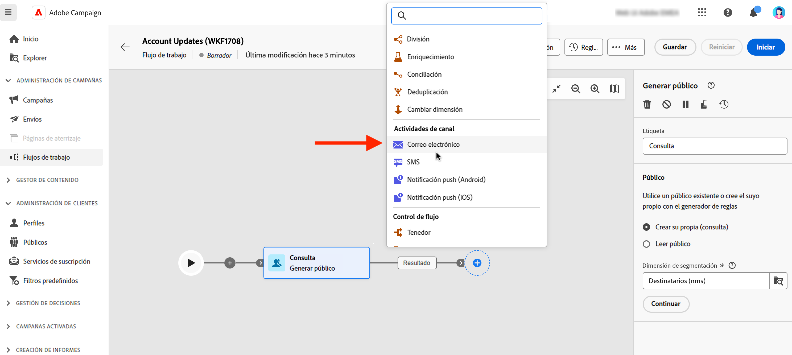

# Correo electrónico, SMS, push {#channel}

La web de Adobe Campaign le permite automatizar y ejecutar campañas de marketing a través de correos electrónicos, SMS y canales de push. Puede combinar actividades del canal en el lienzo del flujo de trabajo para crear flujos de trabajo entre canales que puedan activar acciones basadas en el comportamiento y los datos del cliente.

Por ejemplo, puede crear una campaña de correo electrónico de bienvenida que incluya una serie de mensajes en diferentes canales, como correo electrónico, SMS y push. También puede enviar un correo electrónico de seguimiento a los clientes después de que hayan completado una compra o enviarles un mensaje de cumpleaños personalizado a través de SMS.

Mediante las actividades del canal, puede crear campañas completas y personalizadas que atraigan a los clientes en varios touchpoints e impulsen las conversiones.

Estos son los pasos para añadir una actividad de **Canal** en un flujo de trabajo:

1. Asegúrese de haber añadido una actividad **Generar público destinatario**. El público es el público destinatario principal de su envío: los destinatarios que reciben los mensajes. Al enviar mensajes en el contexto de un flujo de trabajo de campaña, el público del mensaje no se define en la actividad del canal, sino en la actividad **Generar público destinatario**. Consulte [esta sección](build-audience.md).

   

1. Seleccione una actividad de envío: **[!UICONTROL Correo electrónico]**, **[!UICONTROL SMS]**, **[!UICONTROL Notificación push (Android)]** o **[!UICONTROL Notificación push (iOS)]**.

1. Seleccione una **Plantilla** de envío. Las plantillas son opciones de envío preconfigurados específicos de un canal. Hay disponible una plantilla integrada para cada canal, que se rellena previamente de forma predeterminada. [Más información](../../msg/delivery-template.md)

   

   Puede seleccionar otra plantilla en el panel izquierdo de configuración de actividad del canal. Si el público seleccionado anteriormente no es compatible con el canal, no se puede seleccionar una plantilla. Para resolver esto, actualice la actividad **Generar público destinatario** para seleccionar un público destinatario con la asignación de destino correcta. Más información sobre las asignaciones de público destinatario en [Documentación de Adobe Campaign de la versión 8 (consola)](https://experienceleague.adobe.com/docs/campaign/campaign-v8/audience/add-profiles/target-mappings.html?lang=es){target="_blank"}.

1. Haga clic en **Crear envío**. Defina la configuración del mensaje y su contenido del mismo modo que crea un envío independiente. También puede programar y simular el contenido. [Más información](../../msg/gs-messages.md).

1. Vuelva al flujo de trabajo y guarde los cambios.

1. Haga clic en **Iniciar** para iniciar el flujo de trabajo.

   De forma predeterminada, el inicio de un flujo de trabajo activa la fase de preparación de mensajes, sin enviarlos inmediatamente.

1. Abra la actividad de envío para confirmar el envío con el botón **Revisar y enviar**.

1. En el panel de envíos, haga clic en **Enviar**.

## Ejemplo

Este es un ejemplo de flujo de trabajo en canales múltiples con una segmentación y dos envíos. El flujo de trabajo está dirigido a todos los clientes que residen en París y que están interesados en las máquinas de café. Se envía un correo electrónico a los clientes habituales y un SMS a los clientes VIP de esta población.

<!--
description, which use case you can perform (common other activities that you can link before of after the activity)

how to add and configure the activity

example of a configured activity within a workflow
The Email delivery activity allows you to configure the sending an email in a workflow. 

-->

<!-- Scheduled emails available?

This can be a single send email and sent just once, or it can be a recurring email.
* Single send emails are standard emails, sent once.
* Recurring emails allow you to send the same email multiple times to different targets over a defined period. You can aggregate the deliveries per period in order to get reports that correspond to your needs.

When linked to a scheduler, you can define recurring emails.
Email recipients are defined upstream of the activity in the same workflow, via an Audience targeting activity.

-->

<!--The message preparation is triggered according to the workflow execution parameters. From the message dashboard, you can select whether to request or not a manual confirmation to send the message (required by default). You can start the workflow manually or place a scheduler activity in the workflow to automate execution.-->
