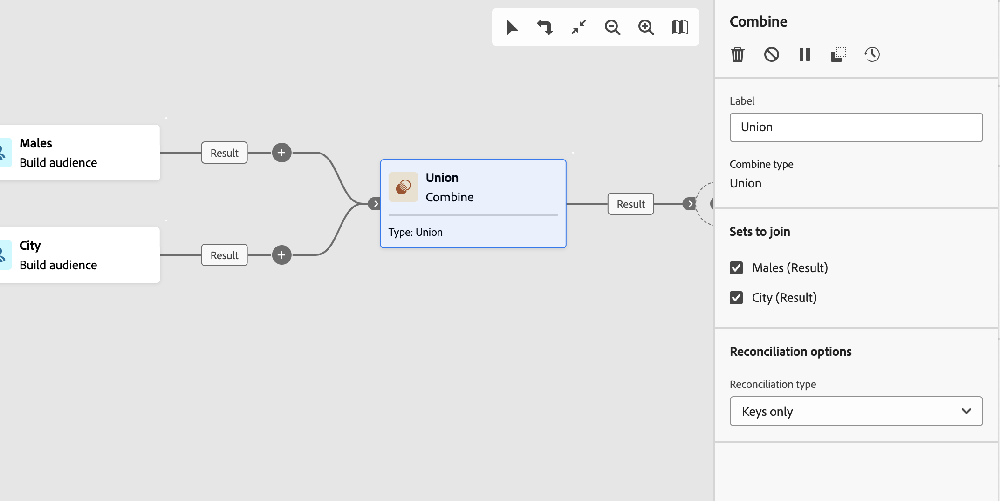

# Combinar {#combine}

>[!CONTEXTUALHELP]
>id="acw_orchestration_combine"
>title="Actividad de combinación"
>abstract="La actividad **Combinar** permite realizar la segmentación de la población entrante. Puede combinar varias poblaciones, excluir parte de ellas o mantener solo los datos comunes a varios objetivos."

La actividad **Combinar** es una actividad **Segmentación**. Esta actividad le permite realizar la segmentación de la población entrante. Puede combinar varias poblaciones, excluir parte de ellas o mantener solo los datos comunes a varios objetivos. Estos son los tipos de segmentación disponibles:

<!--
The **Combine** activity can be placed after any other activity, but not at the beginning of the workflow. Any activity can be placed after the **Combine**.
-->

* **Union** reagrupa el resultado de varias actividades en un solo destino.
* La **intersección** mantiene solamente los elementos comunes a las diferentes poblaciones de entrada de la actividad.
* La **exclusión** excluye elementos de una población según ciertos criterios.

## Configuración de la actividad de combinación {#combine-configuration}

>[!CONTEXTUALHELP]
>id="acw_orchestration_intersection_merging_options"
>title="Opciones de combinación de intersección"
>abstract="La intersección mantiene solo los elementos comunes a las diferentes poblaciones de entrada de la actividad. En la sección Conjuntos para unirse, compruebe todas las actividades anteriores a las que desee unirse."

>[!CONTEXTUALHELP]
>id="acw_orchestration_exclusion_merging_options"
>title="Opciones de combinación de exclusión"
>abstract="La exclusión excluye elementos de una población según determinados criterios. En la sección Conjuntos para unirse, compruebe todas las actividades anteriores a las que desee unirse."

>[!CONTEXTUALHELP]
>id="acw_orchestration_combine_options"
>title="Selección del tipo de segmentación"
>abstract="Seleccione cómo combinar audiencias. **Union** reagrupa el resultado de varias actividades en un solo destino. La **intersección** mantiene solamente los elementos comunes a las diferentes poblaciones de entrada de la actividad. La **exclusión** excluye elementos de una población según ciertos criterios."

Siga estos pasos comunes para configurar la actividad **Combine**:

1. Agregue varias actividades, como **Generar audiencia**, para formar al menos dos ramas de ejecución diferentes.
1. Añada una actividad **Combinar** a cualquiera de las ramas anteriores.
1. Seleccione el tipo de segmentación: [union](#union), [intersection](#intersection) o [exclusion](#exclusion).
1. Haga clic en **Continuar**.
1. En la sección **Conjuntos para unirse**, compruebe todas las actividades anteriores a las que desee unirse.

## Unión {#combine-union}

>[!CONTEXTUALHELP]
>id="acw_orchestration_combine_reconciliation"
>title="Opciones de reconciliación"
>abstract="Seleccione el **Tipo de reconciliación** para definir cómo gestionar duplicados. De manera predeterminada, la opción **Keys** está activada, lo que significa que la actividad mantiene solo un elemento cuando los elementos de las diferentes transiciones de entrada tienen la misma clave. Utilice la opción **Una selección de columnas** para definir la lista de columnas a las que desea aplicar la reconciliación de datos."

En la actividad **Combinar**, configure una **Unión** seleccionando el **tipo de reconciliación** para definir cómo se gestionan los duplicados:

* **Solo claves**: Este es el modo predeterminado. La actividad mantiene solo un elemento cuando los elementos de las diferentes transiciones de entrada tienen la misma clave. Puede usar esta opción solo si las poblaciones entrantes son homogéneas.
* **Una selección de columnas**: seleccione esta opción para definir la lista de columnas a las que desea aplicar la reconciliación de datos. En primer lugar, seleccione el conjunto principal (los datos de origen) y, a continuación, las columnas que se utilizarán para la unión.

## Intersección {#combine-intersection}

>[!CONTEXTUALHELP]
>id="acw_orchestration_intersection_reconciliation_options"
>title="Opciones de reconciliación de intersección"
>abstract="Seleccione el **Tipo de reconciliación** para definir cómo gestionar duplicados. De manera predeterminada, la opción **Keys** está activada, lo que significa que la actividad mantiene solo un elemento cuando los elementos de las diferentes transiciones de entrada tienen la misma clave. Utilice la opción **Una selección de columnas** para definir la lista de columnas a las que desea aplicar la reconciliación de datos."

En la actividad **Combinar**, configure una **intersección** siguiendo estos pasos adicionales:

1. Seleccione el **Tipo de reconciliación** para definir cómo se gestionan los duplicados. Consulte la sección [Unión](#union).
1. Seleccione la opción **Generate complement** si desea procesar la población restante. El complemento contiene la unión de los resultados de todas las actividades entrantes menos la intersección. A continuación, se añade una transición saliente adicional a la actividad.

## Exclusión  {#combine-exclusion}

>[!CONTEXTUALHELP]
>id="acw_orchestration_exclusion_options"
>title="Reglas de inclusión"
>abstract="Si es necesario, manipule las tablas entrantes. Para excluir un objetivo de otra dimensión, devuelva este objetivo a la misma dimensión de objetivo que el objetivo principal. Haga clic en Agregar una regla en la sección Reglas de exclusión y especifique las condiciones del cambio de dimensión. La reconciliación de datos se lleva a cabo mediante un atributo o una unión."

>[!CONTEXTUALHELP]
>id="acw_orchestration_combine_sets"
>title="Selección de conjuntos para combinar"
>abstract="En la sección **Conjuntos que unir**, seleccione el **Conjunto principal** de las transiciones entrantes. Es el conjunto desde el que se excluyen los elementos. Los demás conjuntos coinciden con elementos antes de excluirse del conjunto principal."

>[!CONTEXTUALHELP]
>id="acw_orchestration_combine_exclusion"
>title="Reglas de inclusión"
>abstract="Si es necesario, manipule las tablas entrantes. Para excluir un objetivo de otra dimensión, devuelva este objetivo a la misma dimensión de objetivo que el objetivo principal. Haga clic en Agregar una regla en la sección Reglas de exclusión y especifique las condiciones del cambio de dimensión. La reconciliación de datos se lleva a cabo mediante un atributo o una unión."

>[!CONTEXTUALHELP]
>id="acw_orchestration_combine_complement"
>title="Combinar generar complemento"
>abstract="Active la opción Generar complemento para procesar la población restante en una transición adicional."

En la actividad **Combinar**, configure una **Exclusión** siguiendo estos pasos adicionales:

1. En la sección **Conjuntos que unir**, seleccione el **Conjunto principal** de las transiciones entrantes. Es el conjunto desde el que se excluyen los elementos. Los demás conjuntos coinciden con elementos antes de excluirse del conjunto principal.
1. Si es necesario, manipule las tablas entrantes. Para excluir un objetivo de otra dimensión, devuelva este objetivo a la misma dimensión de objetivo que el objetivo principal. Haga clic en **Agregar una regla** en la sección **Reglas de exclusión** y especifique las condiciones del cambio de dimensión. La reconciliación de datos se lleva a cabo mediante un atributo o una unión.
1. Seleccione la opción **Generate complement** si desea procesar la población restante. Consulte la sección [Intersección](#intersection).

## Ejemplos {#combine-examples}

En el ejemplo siguiente, una actividad **Combine** usa una **Unión** para recuperar todos los perfiles de las dos consultas: personas de entre 18 y 27 años y personas de entre 34 y 40 años.

El ejemplo siguiente muestra la **intersección** entre dos actividades de consulta. Recupera perfiles que tienen entre 18 y 27 años y cuya dirección de correo electrónico se ha proporcionado.

El siguiente ejemplo de **Exclusion** muestra dos consultas configuradas para filtrar perfiles de entre 18 y 27 años que tengan un dominio de correo electrónico de Adobe. Los perfiles con un dominio de correo electrónico de Adobe se excluyen del primer conjunto.

