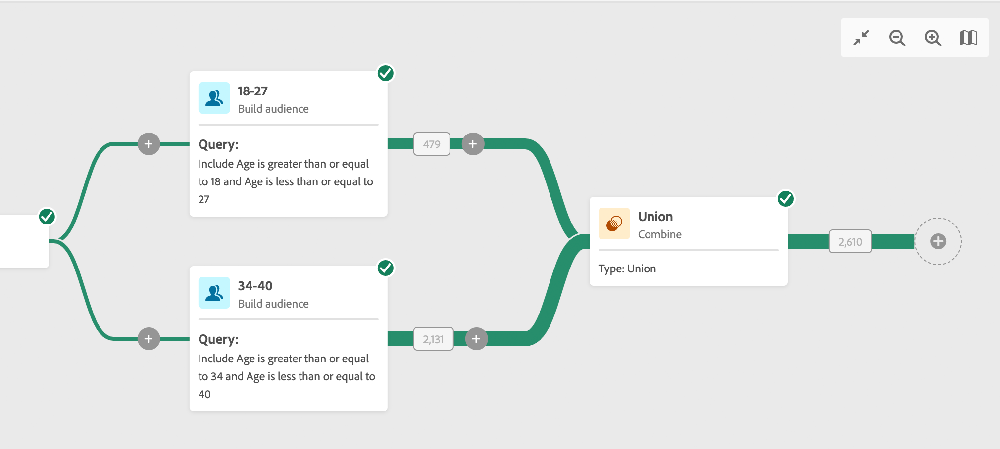
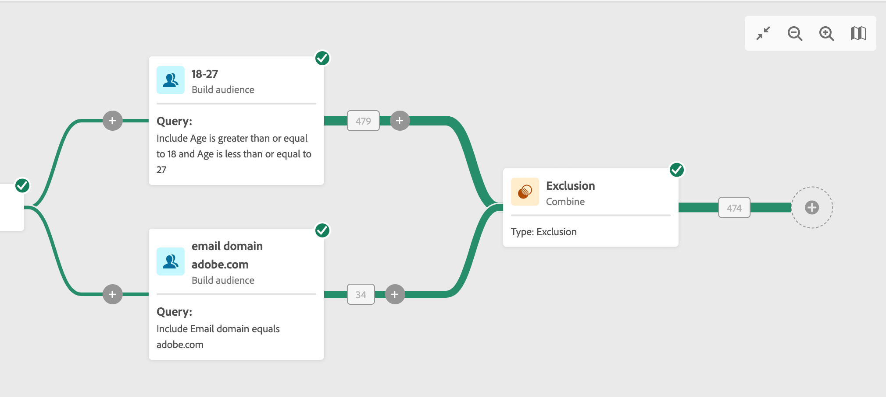

# Combinar {#combine}

Esta actividad le permite procesar conjuntos de datos entrantes. Por lo tanto, puede combinar varias poblaciones, excluir parte de ellas o solo mantener datos comunes para varios objetivos. Estos son los tipos de segmentación disponibles:

<!--
The **Combine** activity can be placed after any other activity, but not at the beginning of the workflow. Any activity can be placed after the **Combine**.
-->

* El **Union** permite agrupar el resultado de varias actividades en un solo destino.
* El **Intersección** permite mantener solo los elementos comunes a las diferentes poblaciones de entrada de la actividad.
* El **Exclusión** permite excluir elementos de una población según determinados criterios.

## Configuración

Siga estos pasos para configurar el **Combinar** actividad:

1. Añada varias actividades, como **Crear audiencia** actividades para formar al menos dos ramas de ejecución diferentes.
1. Añadir un **Combinar** actividad a cualquiera de las transiciones de segmentación anteriores.
1. Seleccione el tipo de segmentación: unión, intersección o exclusión.
1. Haga clic en **Continue**.
1. En el **Configura para unirse** , compruebe todas las actividades anteriores a las que desee unirse.

Para el **Union** y **Intersección**, debe seleccionar la **Tipo de reconciliación** para definir cómo se gestionan los duplicados:

* Keys only: este es el modo predeterminado. La actividad solo mantiene un elemento cuando los elementos de las distintas transiciones de entrada tienen la misma clave. Puede usar esta opción solo si las poblaciones entrantes son homogéneas.
* A selection of columns: seleccione esta opción para definir la lista de columnas a las que desea aplicar la reconciliación de datos. Primero debe seleccionar el conjunto principal (el que contiene los datos de origen) y luego las columnas que se utilizarán para la unión.

Para el **Intersección** y **Exclusión**, puede comprobar las **Generar finalización** si desea procesar la población restante. El complemento contendrá la unión de los resultados de todas las actividades entrantes menos la intersección. A continuación, se agregará una transición saliente adicional a la actividad.

Para el **Exclusión**, seleccione la **Conjunto principal** en las transiciones de entrada, en la variable **Configura para unirse** sección. Es el conjunto desde el que se excluyen los elementos. Los demás conjuntos coinciden con elementos antes de excluirse del conjunto principal.

## Ejemplos

En el siguiente ejemplo, agregamos un **unión** que recupera todos los perfiles de las dos consultas: personas entre 18 y 27 años y personas entre 34 y 40 años.

El siguiente ejemplo muestra el **intersección** entre dos actividades de consulta. Se está utilizando aquí para recuperar perfiles de entre 18 y 27 años y cuya dirección de correo electrónico se ha proporcionado.

Lo siguiente **exclusión** Este ejemplo muestra dos consultas configuradas para filtrar perfiles que tienen entre 18 y 27 años y tienen un dominio de correo electrónico de adobe. Los perfiles con un dominio de correo electrónico de Adobe se excluyen del primer conjunto.

