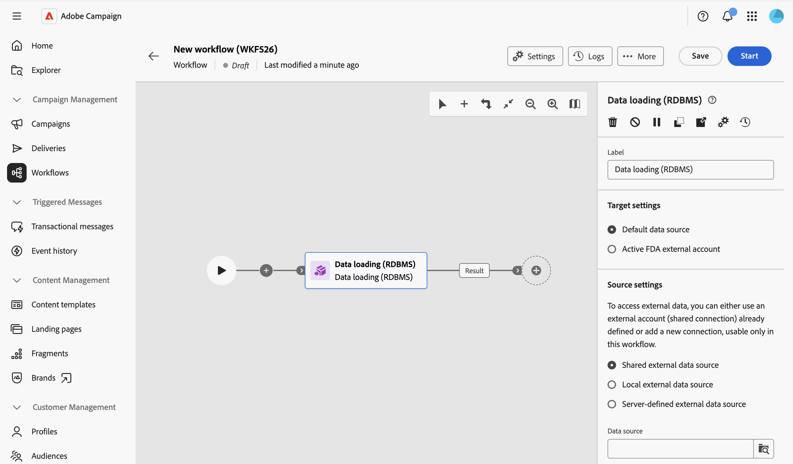

# Carga de datos (RDBMS) {#data-loading-rdbms}

>[!CONTEXTUALHELP]
>id="acw_orchestration_data_loading_rdbms"
>title="Actividad de carga de datos (RDBMS)"
>abstract="La actividad **Carga de datos (RDBMS)** es una actividad **Administración de datos**. Utilice esta actividad para cargar datos directamente desde una base de datos relacional externa en el flujo de trabajo. Los datos extraídos están disponibles en todo el flujo de trabajo y se pueden utilizar para el direccionamiento, el enriquecimiento o el procesamiento posterior de datos."

La actividad **Carga de datos (RDBMS)** es una actividad **Administración de datos**. Utilice esta actividad para cargar datos directamente desde una base de datos relacional externa en el flujo de trabajo. Los datos extraídos están disponibles en todo el flujo de trabajo y se pueden utilizar para el direccionamiento, el enriquecimiento o el procesamiento posterior de datos.

<!--
This activity relies on the [Federated Data Access (FDA)](https://experienceleague.adobe.com/docs/campaign/campaign-v8/connect/fda.html){target="_blank"} option, which lets Adobe Campaign process information stored in one or more external databases without changing the structure of the Adobe Campaign data.
-->

>[!NOTE]
>
>Para mejorar el rendimiento, considere la posibilidad de usar una actividad **[!UICONTROL Generar audiencia]** (tipo de consulta) con datos externos en su lugar, cuando la cantidad de datos que se recopilarán de la base de datos externa lo permita.
>
>Una actividad **[!UICONTROL Data loading (RDBMS)]** debe ser la primera actividad de una rama de flujo de trabajo. No se puede agregar después de otra actividad en el lienzo.

En primer lugar, agregue una actividad **Data loading (RDBMS)** como la primera actividad de una rama de flujo de trabajo.

La actividad se divide en cuatro secciones:

* **[!UICONTROL Configuración de destino]**: elija dónde se almacenan los datos cargados. [Más información](#target-settings)
* **[!UICONTROL Configuración de Source]**: elija cómo obtener acceso a la base de datos externa que contiene los datos que se van a cargar. [Más información](#source-settings)
* **[!UICONTROL Información recopilada]**: defina qué columnas se recopilan de la tabla externa. [Más información](#information-collected)
* **[!UICONTROL Filtro de Source]**: defina un filtro para recopilar solamente parte de los datos de la tabla externa. [Más información](#filter)

Tenga en cuenta que las dos últimas secciones solo aparecen cuando se define la **[!UICONTROL configuración de Source]**.

## Configuración de destinatario {#target-settings}

En la sección **[!UICONTROL Configuración de destino]**, elija dónde se almacenan los datos cargados. Hay dos opciones disponibles: **[!UICONTROL Fuente de datos predeterminada]** y **[!UICONTROL Cuenta externa de FDA activa]**.

### Fuente de datos predeterminada {#default-data-source}

Esta opción está seleccionada de forma predeterminada. Permite almacenar los datos cargados en la base de datos predeterminada de Campaign. Solo tiene que seleccionar la opción.

### Cuenta externa de FDA activa {#active-fda-external-account}

Esta opción permite almacenar los datos cargados en una cuenta externa.

1. Haga clic en el botón situado en la parte derecha del campo **[!UICONTROL Fuente de datos]**.
1. Seleccione la cuenta que desee utilizar.

   

## Configuración de la fuente {#source-settings}

En la sección **[!UICONTROL Configuración de Source]**, elija cómo obtener acceso a la base de datos externa que contiene los datos que se van a cargar. Hay tres opciones disponibles: **[!UICONTROL origen de datos externo compartido]**, **[!UICONTROL origen de datos externo local]** y **[!UICONTROL origen de datos externo definido por el servidor]**.

### Fuente de datos externa compartida {#shared-data-source}

Esta opción está seleccionada de forma predeterminada. Permite utilizar una cuenta externa ya configurada por un administrador de Campaign. [Aprenda a configurar una cuenta externa](../../administration/create-external-account.md).

1. Haga clic en el botón situado en la parte derecha del campo **[!UICONTROL Fuente de datos]** y seleccione la cuenta que desee utilizar.

   

1. Haga clic en el botón **[!UICONTROL Examinar]** situado junto al campo **[!UICONTROL Nombre de tabla]** y seleccione la tabla que contiene los datos que desea cargar.

   

### Fuente de datos local externa {#local-external-data-source}

Esta opción permite definir una conexión con una base de datos externa directamente en la actividad, para uso temporal únicamente dentro de este flujo de trabajo. Esta conexión no se guarda como una cuenta externa.

1. Haga clic en el botón **[!UICONTROL Definir el origen de datos]** y seleccione el motor de base de datos al que desea conectarse.

   

1. Rellene los campos de conexión mostrados para el motor seleccionado.

   

<!--
1. Click **[!UICONTROL Ok]** to confirm. The button is then relabeled **[!UICONTROL Edit data source]**, allowing you to open the dialog again to change the connection settings.
-->

1. Escriba el nombre de la tabla que desea cargar en el campo **[!UICONTROL Nombre de tabla]**.

### Fuente de datos externa definida por el servidor {#server-defined-external-data-source}

Esta opción le permite utilizar una conexión de base de datos ya definida en el nivel de servidor.

1. Escriba el nombre de la conexión que se usará en el campo **[!UICONTROL Nombre de conexión]**.
1. Escriba el nombre de la tabla que desea cargar en el campo **[!UICONTROL Nombre de tabla]**.

   

## Información recopilada {#information-collected}

Una vez establecida la tabla, la sección **[!UICONTROL Información recopilada]** le permite definir qué columnas se recopilan de la tabla externa:

1. Marque la opción **[!UICONTROL Conservar todos los datos de origen]** (predeterminada) si necesita recopilar todas las columnas de la tabla seleccionada.
1. Haga clic en **[!UICONTROL Agregar columna para extraer]** para recopilar columnas específicas en su lugar, o además.

   

<!--
In the **[!UICONTROL Select attribute]** dialog, scoped to the schema of the selected table, pick an attribute and confirm. [Learn how to select attributes and add them to favorites](../../get-started/attributes.md)
-->

1. Seleccione un atributo y confirme. El atributo se agrega como una fila con un campo **[!UICONTROL Column]** y un campo **[!UICONTROL Label]** editable. Utilice el icono Eliminar para eliminarlo.

   

<!--
## Link to another table (optional) {#link}

NOT CONFIRMED — restore and verify before publishing.

Source: transcript of the ACC Web UI - Handsoff 12-06 demo (Herve Phulpin, ~20:49-21:04 mark). At the time of that demo, this part of the activity was explicitly described as unfinished: "the next part is not yet available", "this part is missing", "we are not able to add a link condition". No screenshot of a completed, working flow for this section has been captured since. Two related sub-bugs were still open against NEO-95826 at last check: NEO-97147 ("DBMS activity transition results not shown") and NEO-97148 ("local external data table name is not a picker").

If you need to reconcile the loaded data with an existing table, such as the Recipients table, add a link:

1. Click **Add link**.
1. Select the table to link to. You can browse tables from the Campaign database or from the external data source.
1. Define the join condition between the loaded table and the target table:
   * Simple join: Select the attributes to match between the two tables.
   * Advanced join: Use the query modeler to build the join condition.

[Learn more about link definitions in the Enrichment activity](enrichment.md#create-links).
-->

## Filtrado de Source (opcional) {#filter}

Para recopilar solo parte de los datos de la tabla externa, puede definir un filtro:

1. En la sección **[!UICONTROL Filtrado de Source]**, haga clic en **[!UICONTROL Editar consulta]**.

   

1. El modelador de consultas se abre en una pantalla dedicada, enmarcada en el esquema de la tabla seleccionada. Utilícela para generar una condición basada en los atributos de la tabla. [Aprenda a trabajar con el modelador de consultas](../../query/query-modeler-overview.md)

   

<!--
>[!NOTE]
>
>Some advanced options available for this activity in the client console, such as computing the table name from the inbound transition, are not yet exposed in the Campaign Web User Interface.
-->