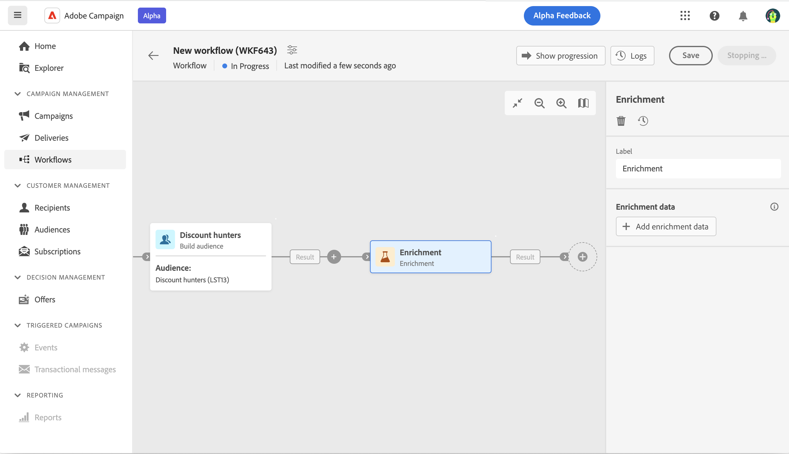
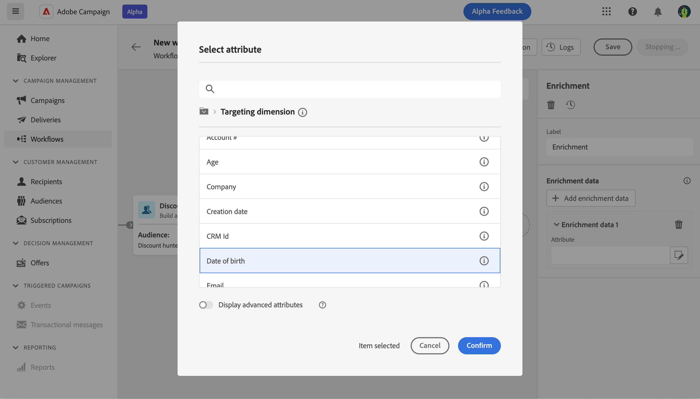

# Enriquecimiento  {#enrichment}

>[!CONTEXTUALHELP]
>id="acw_orchestration_enrichment"
>title="Actividad de enriquecimiento"
>abstract="La actividad **Enriquecimiento** es una actividad de **Segmentación**. La actividad de enriquecimiento permite mejorar los datos segmentados con información adicional de la base de datos. Normalmente se utiliza en un flujo de trabajo después de actividades de segmentación."

>[!CONTEXTUALHELP]
>id="acw_orchestration_enrichment_data"
>title="Actividad de enriquecimiento"
>abstract="La actividad de enriquecimiento permite mejorar los datos segmentados con información adicional de la base de datos. Normalmente, se utiliza en un flujo de trabajo después de las actividades de segmentación. Una vez añadidos los datos de enriquecimiento al flujo de trabajo, estos se pueden utilizar en las actividades añadidas después de la actividad Enriquecimiento para segmentar a los clientes en grupos distintos según sus comportamientos, preferencias y necesidades. También para crear campañas y mensajes de marketing personalizados que tengan más probabilidades de resonar con el público destinatario."

La actividad **Enriquecimiento** es una actividad de **Segmentación**. La actividad de enriquecimiento permite mejorar los datos segmentados con información adicional de la base de datos. Normalmente se utiliza en un flujo de trabajo después de actividades de segmentación.

Los datos de enriquecimiento pueden provenir de los siguientes lugares:

* **La misma tabla de trabajo** que la que tiene como destinatario en el flujo de trabajo:

  *Seleccione como público destinatario a un grupo de clientes y añada el campo “Fecha de nacimiento” a la tabla de trabajo actual*

* **De otra tabla de trabajo**:

  *Seleccione como público destinatario a un grupo de clientes y añada los campos “Cantidad” y “Tipo de producto” procedentes de la tabla “Comprar”*.

Una vez añadidos los datos de enriquecimiento al flujo de trabajo, estos se pueden utilizar en las actividades añadidas después de la actividad **Enriquecimiento** para segmentar a los clientes en grupos distintos según sus comportamientos, preferencias y necesidades. También para crear campañas y mensajes de marketing personalizados que tengan más probabilidades de conectar con el público destinatario.

Por ejemplo, puede añadir a la tabla de trabajo del flujo de trabajo información relacionada con las compras de los clientes y utilizar estos datos para personalizar los correos electrónicos con su última compra o la cantidad gastada en estas compras.

## Configuración general {#general}

Siga estos pasos para configurar la actividad **Enriquecimiento**:

1. Añada actividades como **Generar público destinatario** y **Combinar**.
1. Añada una actividad **Enriquecimiento**
1. Haga clic en **Añadir datos de enriquecimiento**.

Puede seleccionar dos tipos de datos de enriquecimiento: un [atributo de enriquecimiento único](#single-attribute) desde la dimensión de segmentación, o un [vínculo de colección](#collection-link).

## Atributo de enriquecimiento único {#single-attribute}

A continuación, simplemente añadimos un único atributo de enriquecimiento, por ejemplo, la fecha de nacimiento. Siga estos pasos:

1. Haga clic dentro del campo **Atributo**.
1. Seleccione un campo simple de la dimensión de segmentación, en nuestro ejemplo, la fecha de nacimiento.
1. Haga clic en **Confirmar**.

## Vínculo de colección {#collection-link}

En este caso de uso más complejo, seleccionaremos un vínculo de colección, que es un vínculo con una cardinalidad 1-N entre tablas. Vamos a recuperar las tres últimas compras con un importe menor a 100 €. Para ello, debe definir lo siguiente:

* un atributo de enriquecimiento: el campo **Cantidad total**
* número de líneas que se van a recuperar: 3
* un filtro: filtre los artículos que superen los 100 €
* un orden: orden descendente en el campo **Fecha del pedido**.

### Añadir el atributo

Aquí es donde se selecciona el vínculo de colección que se utilizará como datos de enriquecimiento.

1. Haga clic dentro del campo **Atributo**.
1. Haga clic en **Mostrar atributos avanzados**.
1. Seleccione el campo **Cantidad total** de la tabla **Compras**.

### Definir la configuración de la colección

A continuación, defina cómo se recopilan los datos y el número de registros que desea recuperar.

1. Seleccionar **Recopilar datos** en el menú desplegable **Seleccione cómo se recopilan los datos**.
1. Escriba &quot;3&quot; en el campo **Líneas a recuperar (Columnas a crear)**.

Si desea, por ejemplo, obtener la cantidad promedio de compras para un cliente, seleccione **Datos acumulados** en su lugar y seleccione **Promedio** en el menú desplegable **Función de acumulado**.

### Definición de los filtros

Aquí, definimos el valor máximo del atributo de enriquecimiento. Filtramos los artículos que sean superiores a 100 €.

1. Haga clic en **Editar filtros**.
1. Añada los dos filtros siguientes: **Cantidad total** existe Y **Cantidad total** es menor que 100. El primero filtra los valores NULOS, ya que aparecerían como el valor más alto.
1. Haga clic en **Confirmar**.

### Definición de la ordenación

Ahora necesitamos aplicar la ordenación para recuperar las tres **últimas** compras.

1. Active la opción **Habilitar ordenación**.
1. Haga clic dentro del campo **Atributo**.
1. Seleccione el campo **Fecha del pedido**.
1. Haga clic en **Confirmar**.
1. Seleccione **Descendente** desde el menú desplegable **Ordenar**.

<!--

Add other fields
use it in delivery

cardinality between the tables (1-N)
1. select attribute to use as enrichment data

    display advanced fields option
    i button

    note: attributes from the target dimension

1. Select how the data is collected
1. number of records to retrieve if want to retrieve a collection of multiple records
1. Apply filters and build rule

    select an existing filter
    save the filter for reuse
    view results of the filter visually or in code view

1. sort records using an attribute

leverage enrichment data in campaign

where we can use the enrichment data: personalize email, other use cases?

## Example

-->