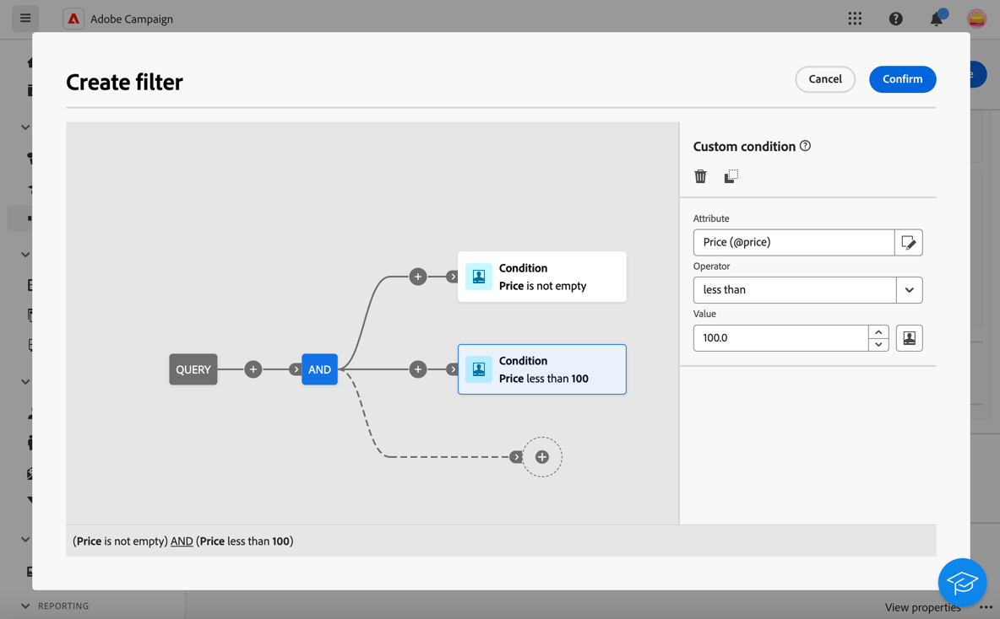

# Enriquecimiento  {#enrichment}

>[!CONTEXTUALHELP]
>id="acw_orchestration_enrichment"
>title="Actividad de enriquecimiento"
>abstract="La actividad de **enriquecimiento** permite mejorar los datos de destino con información adicional de la base de datos. Normalmente se utiliza en un flujo de trabajo después de actividades de segmentación."

La actividad **Enriquecimiento** es una actividad de **Segmentación**. Mejora los datos de destino con información adicional de la base de datos. Normalmente se utiliza en un flujo de trabajo después de actividades de segmentación.

Los datos de enriquecimiento pueden provenir de:

* **La misma tabla de trabajo** que la que se segmentó en el flujo de trabajo:
   * Dirija la actividad a un grupo de clientes y agregue el campo &quot;Fecha de nacimiento&quot; a la tabla de trabajo actual.

* **Otra tabla** de trabajo:
   * Target una grupo de clientes y añada los campos &quot;Importe&quot; y &quot;Tipo de producto&quot; de la tabla &quot;Compra&quot;.

Una vez que los datos enriquecimiento se agregan al flujo de trabajo, se pueden usar en actividades posteriores para segmento a los clientes en grupos distintos en función de sus comportamientos, preferencias y necesidades. También se puede usar para crear mensajes de marketing personalizados y campañas que resuenen con su audiencia destino.

Por ejemplo, puede agregar información relacionada con las compras de los clientes a la tabla flujo de trabajo y usar estos datos para personalizar los correos electrónicos con su última compra o la cantidad gastada en estas compras.

## añadir un actividad de enriquecimiento {#enrichment-configuration}

Siga estos pasos para configurar la actividad **Enriquecimiento**:

1. Añada actividades como **Generar público destinatario** y **Combinar**.
1. Añada una actividad **Enriquecimiento**
1. Si hay varias transiciones configuradas en su flujo de trabajo, utilice el **[!UICONTROL campo Conjunto]** primario para definir qué transición debe utilizarse como el conjunto principal para enriquecimiento.

## Adición de datos de enriquecimiento {#enrichment-add}

>[!CONTEXTUALHELP]
>id="acw_targetdata_personalization_enrichmentdata"
>title="Datos de enriquecimiento"
>abstract="Seleccione los datos que desee utilizar para enriquecer el flujo de trabajo. Puede seleccionar dos tipos de datos de enriquecimiento: un único atributo de enriquecimiento de la dimensión de destino o un vínculo de recopilación, que es un vínculo con una cardinalidad 1-N entre las tablas."

>[!CONTEXTUALHELP]
>id="acw_orchestration_enrichment_data"
>title="Actividad de enriquecimiento"
>abstract="Una vez que enriquecimiento datos se agregan al flujo de trabajo, se pueden usar en actividades posteriores para segmento a los clientes en distintos grupos en función de sus comportamientos, preferencias y necesidades, o para crear mensajes y campañas de marketing personalizados que resuenen con su audiencia destino."

1. Haga clic en **añadir enriquecimiento datos** y seleccione el atributo que desea utilizar para enriquecimiento. [Aprenda a seleccionar atributos y agregarlos a favoritos](../../get-started/attributes.md).

   Puede seleccionar dos tipos de datos de enriquecimiento: un único atributo de enriquecimiento de la dimensión de destino o un vínculo de recopilación. Cada tipo se detalla en los ejemplos siguientes:
   * [Atributo de enriquecimiento único](#single-attribute)
   * [Vínculo de colección](#collection-link)

   >[!NOTE]
   >
   >El **botón Editar expresión** de la pantalla de selección de atributos le permite generar expresiones avanzadas para seleccionar el atributo. [Aprenda a trabajar con el editor de expresiones](../../query/expression-editor.md).

   

## Creación de vínculos entre tablas {#create-links}

>[!CONTEXTUALHELP]
>id="acw_orchestration_enrichment_simplejoin"
>title="Definición de vínculo"
>abstract="Cree un vínculo entre los datos de la tabla de trabajo y la base de datos de Adobe Campaign. Por ejemplo, si carga datos de un archivo que contiene el número de cuenta, el país y el correo electrónico de destinatarios, debe crear un vincular a la tabla de países para actualizar esta información en sus perfiles."

La **[!UICONTROL sección de definición]** de vínculo permite crear una vincular entre los datos de la tabla de trabajo y la base de datos de Adobe Campaign. Por ejemplo, si carga datos de un archivo que contiene el número de cuenta, el país y el correo electrónico de destinatarios, debe crear un vincular a la tabla de países para actualizar esta información en sus perfiles.

Hay varios tipos de enlaces disponibles:

* **[!UICONTROL 1 cardinalidad vincular]** simple: Cada registro del conjunto primario está asociado con uno y solo un registro de los datos vinculados.
* **[!UICONTROL 0 o 1 cardinalidad vincular]** simple: Cada registro del conjunto primario está asociado con 0 o 1 registro de los datos vinculados, pero no más de uno.
* **[!UICONTROL N cardinalidad colección vincular]**: Cada registro del conjunto primario está asociado con 0, 1 o más (N) registros de los datos vinculados.

Para crear una vincular, seguir estos pasos:

1. En la sección **[!UICONTROL Definición de vínculo]**, haga clic en el botón **[!UICONTROL Agregar vínculo]**.

   

1. En la **lista desplegable Tipo de relación** , elija el tipo de vincular que desee crear.

1. Identifique el destino en el que desea vincular el conjunto principal:

   * Para vincular una tabla existente en la base de datos, elija **[!UICONTROL esquema]** base de datos y seleccione la tabla deseada en el **[!UICONTROL campo Target esquema]** .
   * Para vincular con los datos del transición de entrada, elija **Temporal esquema** y seleccione el transición cuyos datos desea utilizar.

1. Defina los criterios de conciliación para que los datos del conjunto primario coincidan con el esquema vinculado. Hay dos tipos de combinaciones disponibles:

   * **Unión** simple: seleccione un atributo específico para hacer coincidir los datos de los dos esquemas. Haga clic en añadir unirse **y seleccione los atributos Origen****y** Destino **que desea utilizar como criterios de reconciliación.**
   * **Avanzadas unirse: Crear una unión usando condiciones avanzadas**. Haga clic en **añadir unión** y haga clic en el **botón condición** Crear para abrir el modelador de consulta.

Encontrará un flujo de trabajo ejemplo de uso de vínculos en la [sección Ejemplos](#link-example) .

## Reconciliación de datos {#reconciliation}

>[!CONTEXTUALHELP]
>id="acw_orchestration_enrichment_reconciliation"
>title="Reconciliación"
>abstract="La actividad **Enriquecimiento** ahora se puede utilizar para reconciliar los datos del esquema de la base de datos de Campaign con los datos de otro esquema o con los datos procedentes de un esquema temporal como, por ejemplo, los datos cargados mediante una actividad Carga de archivo. Este tipo de vínculo define una reconciliación hacia un registro único. Adobe Campaign crea un vínculo a una tabla de destino añadiendo una clave externa en la tabla objetivo para almacenar una referencia al registro único."

La actividad **Enriquecimiento** ahora se puede utilizar para reconciliar los datos del esquema de la base de datos de Campaign con los datos de otro esquema o con los datos procedentes de un esquema temporal como, por ejemplo, los datos cargados mediante una actividad Carga de archivo. Este tipo de vínculo define una reconciliación hacia un registro único. Adobe Campaign crea un vínculo a una tabla de destino añadiendo una clave externa en la tabla objetivo para almacenar una referencia al registro único.

Por ejemplo, puede utilizar esta opción para reconciliar el país de un perfil, especificado en un archivo cargado, con uno de los países disponibles en la tabla dedicada de la base de datos de Campaign.

Siga los pasos para configurar una **actividad de enriquecimiento con una vincular de reconciliación** :

1. Haga clic en la botón añadir **vincular de la** sección Reconciliación ****.
1. Identifique los datos con los que desee crear una vincular de reconciliación.

   * Para crear una vincular de reconciliación con los datos de la base de datos Campaign, seleccione **esquema** base de datos y elija la esquema donde se almacena la destino.
   * Para crear un vínculo de reconciliación con datos procedentes de la transición de entrada, seleccione **Temporary schema** y elija la transición de flujo de trabajo en la que se almacenan los datos de destino.

1. Los campos **Etiqueta** y **Nombre** se rellenan automáticamente en función del esquema de destino seleccionado. Si es necesario, puede cambiar sus valores.

1. En la sección **Criterios de reconciliación**, especifique cómo desea reconciliar los datos de las tablas de origen y destino:

   * **Combinación simple**: concilie un campo específico de la tabla de origen con otro campo de la tabla de destino. Para ello, haga clic en el botón **Agregar unión** y especifique los campos **Source** y **Destino** que se utilizarán para la reconciliación.

     >[!NOTE]
     >
     >Puede utilizar uno o más **criterios simples de unión** , en cuyo caso todos deben verificarse para que los datos puedan vincularse entre sí.

   * **Avanzadas unirse**: Utilice el modelador de consulta para configurar los criterios de conciliación. Para ello, haga clic en la condición **de Crear** botón defina los criterios de conciliación creando sus propios regla mediante las operaciones Y y O.

El ejemplo siguiente muestra un flujo de trabajo configurado para crear un vincular entre la tabla de destinatarios de la base de datos Adobe Campaign y una tabla temporal generada por un **actividad de carga de archivos** . En este ejemplo, el actividad de enriquecimiento reconcilia ambas tablas utilizando la dirección del correo electrónico como criterios de conciliación.

## Añadir ofertas {#add-offers}

>[!CONTEXTUALHELP]
>id="acw_orchestration_enrichment_offer_proposition"
>title="Propuesta de oferta"
>abstract="La actividad Enriquecimiento le permite añadir ofertas para cada perfil."

La **[!UICONTROL actividad de enriquecimiento]** permite añadir ofertas para cada perfil.

Para ello, siga seguir los pasos para configurar una **[!UICONTROL actividad de enriquecimiento]** con un oferta:

1. En la **[!UICONTROL sección Propuesta]** de oferta de la actividad **[!UICONTROL Enriquecimiento]**, haga clic en la **[!UICONTROL añadir oferta]** botón

   

1. La selección oferta tiene dos opciones:

   * **[!UICONTROL Search para la mejor oferta en categoría]** : marque esta opción y especifique los parámetros de llamada al motor de oferta (espacio de ofertas, categoría o tema(s), fecha de contacto, número de ofertas para conservar). El motor calculará las mejores ofertas para agregar según estos parámetros. Se recomienda completar el campo Categoría o el campo Tema, en lugar de ambos al mismo tiempo.

     

   * **[!UICONTROL A predefined offer]**: marque esta opción y especifique un espacio de oferta, una oferta específica y una fecha de contacto para configurar directamente la oferta que desee añadir, sin recurrir al motor de oferta.

     

1. Después de seleccionar su oferta, haga clic en **[!UICONTROL Confirmar]** botón.

Ahora puede utilizar el oferta en el actividad envío.

### Uso de las ofertas de Enrichment actividad

Dentro de un flujo de trabajo, si desea utilizar las ofertas que obtiene de una actividad de enriquecimiento en su envío, siga los pasos a continuación:

1. Abra la actividad envío y vaya en la edición de contenido. Haga clic en el botón **[!UICONTROL Configuración de ofertas]** y seleccione en la lista desplegable el **[!UICONTROL Espacio de ofertas]** correspondiente a su oferta.
Si desea ver solamente ofertas de la actividad de enriquecimiento, establezca el número de **[!UICONTROL Proposiciones]** en 0 y guarde las modificaciones.

   

1. En el diseñador de correo electrónico, al agregar una personalización con ofertas, haga clic en el icono **[!UICONTROL Proposiciones]**, se mostrarán las ofertas que obtenga de la actividad **[!UICONTROL Enriquecimiento]**. Abra la oferta que desee elegir haciendo clic en ella.

   

   Vaya a **[!UICONTROL Funciones de procesamiento]** y elija **[!UICONTROL Procesamiento de HTML]** o **[!UICONTROL Procesamiento de texto]** según sus necesidades.

   

>[!NOTE]
>
>Si elige tener más de un oferta en la **[!UICONTROL actividad de enriquecimiento]** en la **[!UICONTROL opción Número de ofertas para mantener]** , todas las ofertas se muestran al hacer clic en el icono de **[!UICONTROL propuestas]** .

## Ejemplos {#example}

### Atributo de enriquecimiento único {#single-attribute}

A continuación, simplemente añadimos un único atributo de enriquecimiento, por ejemplo, la fecha de nacimiento. Siga estos pasos:

1. Haga clic dentro del campo **Atributo**.
1. Seleccione un campo simple de la dimensión de segmentación, en nuestro ejemplo, la fecha de nacimiento.
1. Haga clic en **Confirmar**.

### Vínculo de colección {#collection-link}

En este caso de uso más complejo, seleccionaremos un vínculo de colección, que es un vínculo con una cardinalidad 1-N entre tablas. Vamos a recuperar las tres últimas compras con un importe menor a 100 €. Para ello, debe definir lo siguiente:

* un atributo enriquecimiento: el **campo Precio**
* número de líneas que se van a recuperar: 3
* un filtro: filtre los artículos que superen los 100 €
* un orden: orden descendente en el campo **Fecha de orden**.

#### Añadir el atributo {#add-attribute}

Aquí es donde se selecciona el vínculo de colección que se utilizará como datos de enriquecimiento.

1. Haga clic dentro del campo **Atributo**.
1. Haga clic en **Mostrar atributos avanzados**.
1. Seleccione el **campo Precio** de la **tabla Compras** .

<!--  -->

#### Definir la configuración de la colección{#collection-settings}

A continuación, defina cómo se recopilan los datos y el número de registros que desea recuperar.

1. Seleccionar **Recopilar datos** en el menú desplegable **Seleccione cómo se recopilan los datos**.
1. Escriba &quot;3&quot; en el campo **Líneas a recuperar (Columnas a crear)**.

Si desea, por ejemplo, obtener la cantidad promedio de compras para un cliente, seleccione **Datos acumulados** en su lugar y seleccione **Promedio** en el menú desplegable **Función de acumulado**.

Utilice los **campos Etiquetar** y **Alias** de su atributo para hacerlo más comprensible, como se muestra a continuación.

#### Definición de los filtros{#collection-filters}

Aquí, definimos el valor máximo del atributo de enriquecimiento. Filtramos los elementos superiores a 100$. [Aprenda a trabajar con el modelador de consultas](../../query/query-modeler-overview.md)

1. Haga clic en **Crear filtros**.
1. añadir los dos filtros siguientes: **El precio** existe Y **el precio** es menor que 100. El primero filtra los valores NULOS, ya que aparecerían como el valor más alto.
1. Haga clic en **Confirmar**.

#### Definición de la ordenación{#collection-sorting}

Ahora necesitamos aplicar la ordenación para recuperar las tres **últimas** compras.

1. Active la opción **Habilitar ordenación**.
1. Haga clic dentro del campo **Atributo**.
1. Seleccione el campo **Fecha del pedido**.
1. Haga clic en **Confirmar**.
1. Seleccione **Descendente** desde el menú desplegable **Ordenar**.

### Enriquecimiento con datos vinculados {#link-example}

El ejemplo siguiente muestra un flujo de trabajo configurado para crear un vincular entre dos transiciones. La primera transición tiene como objetivo perfil datos mediante un **actividad de consulta** , mientras que la segunda transición incluye datos de compra almacenados en un archivo cargado a través de una actividad de carga de archivos.

* La primera **actividad de enriquecimiento vincula** el conjunto primario (datos del actividad de **consulta** ) con el esquema del **actividad del archivo** de carga. Esto nos permite hacer coincidir cada perfil objetivo del consulta con los datos de compra correspondientes.

  

* Se añade una segunda **actividad de enriquecimiento** para enriquecer los datos de la tabla flujo de trabajo con los datos de compra procedentes de la **actividad Cargar archivo** . Esto nos permite utilizar esos datos en otras actividades, por ejemplo, para personalizar los mensajes enviados a los clientes con información sobre su compra.

  

