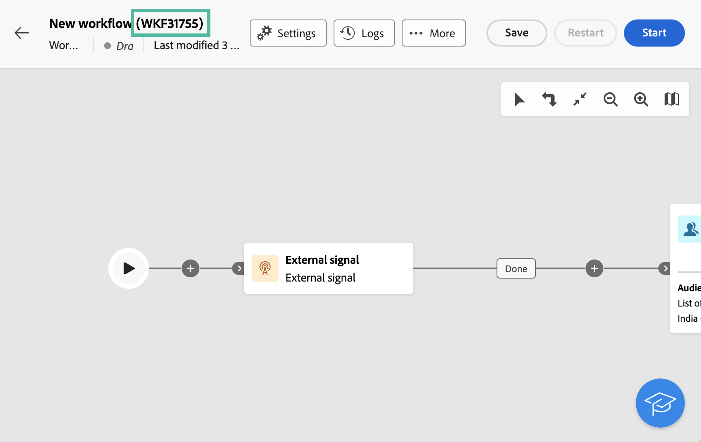

# Señal externa {#external-signal}

<!--External Signal End-->

>[!CONTEXTUALHELP]
>id="acw_orchestration_externalsignal"
>title="Señal externa"
>abstract="El **Señal externa** La actividad permite almacenar en déclencheur la ejecución de un flujo de trabajo desde otro flujo de trabajo o una llamada de API."

>[!CONTEXTUALHELP]
>id="acw_orchestration_externalsignal_parameters"
>title="Parámetros de señal externa"
>abstract="Parámetros de señal externa"

>[!CONTEXTUALHELP]
>id="acw_orchestration_end_trigger"
>title="Activadores finales"
>abstract="Activadores finales"

El **Señal externa** la actividad es una **Control de flujo** actividad. Permite almacenar en déclencheur la ejecución de un flujo de trabajo desde otro flujo de trabajo o desde una llamada de API.

>[!NOTE]
>
>Esta página presenta los pasos principales para configurar una **[!UICONTROL Señal externa]** actividad en la interfaz de usuario web de Campaign y almacenarla en déclencheur desde otro flujo de trabajo o una llamada de API. Encontrará información detallada sobre cómo almacenar en déclencheur un flujo de trabajo y sus prácticas recomendadas, y cómo trabajar con las API de Campaign en [Documentación de Campaign v8 (consola de cliente)](https://experienceleague.adobe.com/en/docs/campaign/automation/workflows/advanced-management/javascript-in-workflows#trigger-example)

Siga estos pasos para configurar el **Señal externa** actividad y déclencheur su ejecución:

1. Añadir un **Señal externa** en el flujo de trabajo.

1. Complete la configuración del flujo de trabajo e inicie su ejecución. El **[!UICONTROL Señal externa]** La actividad se muestra como &quot;Pendiente&quot; a la espera de activarse.

   

1. Recupere la siguiente información:

   * El **nombre interno del flujo de trabajo**, que se muestra junto a su etiqueta.

     +++Ver ejemplo

     

+++

   * El **Nombre de la actividad de señal externa**, que se muestra en el **[!UICONTROL Opciones de ejecución]**.

     +++Ver ejemplo

     

+++

1. Para almacenar en déclencheur el flujo de trabajo, debe ejecutar el `PostEvent` Función JavaScript. Esta función le permite pasar variables con los valores que elija y aprovecharlos en el flujo de trabajo activado.

   El `PostEvent` La función se puede ejecutar desde otro flujo de trabajo o desde una llamada de API.

   * Para almacenar en déclencheur un **[!UICONTROL Señal externa]** desde un flujo de trabajo, ejecute la función PostEvent desde el **[!UICONTROL Script de inicialización]** , a la que se puede acceder desde el panel **[!UICONTROL Opciones de ejecución]**. Para el **[!UICONTROL Código JavaScript]** actividad, ejecute la función desde el script de la actividad.

     La sintaxis es la siguiente:

     ```
     xtk.workflow.PostEvent("<workflow-internal-name>","<signal-activity-name>","",<variables <variable-name>="<value>"/>, false);
     ```

   +++Ver ejemplo

   En este ejemplo, se activa la actividad de señal externa &quot;signal1&quot; que se ha añadido al flujo de trabajo cuyo nombre interno es &quot;WKF12345&quot;. También se ha pasado una variable denominada &quot;customID&quot;, con el valor &quot;123456&quot;.

   

+++

   * Para almacenar en déclencheur un **[!UICONTROL Señal externa]** actividad desde una llamada a la API, siga los pasos detallados en la Documentación de la API de Campaign. [Aprenda a utilizar la función estática `PostEvent` método](https://experienceleague.adobe.com/developer/campaign-api/api/sm-workflow-PostEvent.html?lang=es)
