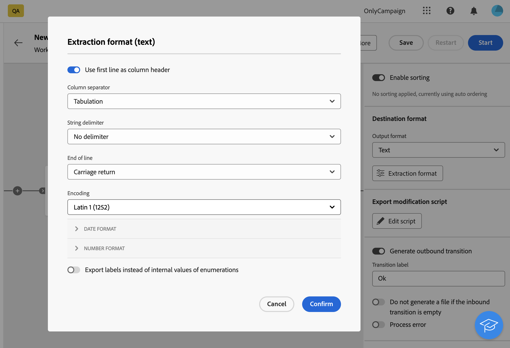
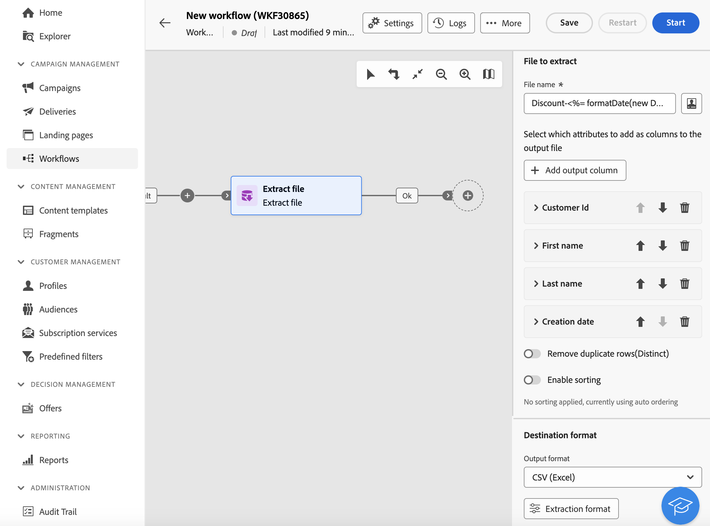

# Extracción de archivos {#extract-file}

>[!CONTEXTUALHELP]
>id="acw_orchestration_extractfile"
>title="Extracción de archivos"
>abstract="La actividad **Extraer archivo** permite exportar datos desde Adobe Campaign en forma de archivo externo. A continuación, los datos se pueden exportar a una ubicación de servidor como SFTP, Cloud Storage o el servidor de Campaign mediante la actividad Transferir archivo."

El **Extraer archivo** la actividad es una **Administración de datos** actividad. Utilice esta actividad para exportar datos desde Adobe Campaign en forma de archivo externo. A continuación, los datos se pueden exportar a una ubicación de servidor como SFTP, Cloud Storage o el servidor de Campaign mediante la actividad Transferir archivo.

Para configurar la variable **Extraer archivo** actividad, añadir una **Extraer archivo** en el flujo de trabajo y, a continuación, siga los pasos a continuación.

## Configurar el archivo que va a extraer {#extract-configuration}

>[!CONTEXTUALHELP]
>id="acw_orchestration_extractfile_file"
>title="Archivo que extraer"
>abstract="Seleccione el archivo que va a extraer."

El **[!UICONTROL Archivo para extraer]** permite configurar las propiedades del archivo y los datos que se van a incluir.

1. En el **[!UICONTROL Nombre de archivo]** , introduzca el nombre que desee para el archivo que desea extraer.

   Puede personalizar el nombre del archivo mediante variables de evento, condiciones y funciones de fecha y hora. Para ello, haga clic en el **[!UICONTROL Abrir diálogo de personalización]** para abrir el editor de expresiones. [Aprenda a trabajar con variables de eventos y el editor de expresiones](../event-variables.md)

1. Especifique las columnas que desea presentar en el archivo extraído. Para ello, siga estos pasos:

   1. Haga clic en **[!UICONTROL Añadir columna de salida]**.
   1. Seleccione el atributo que se mostrará en la columna y confirme la acción. Los atributos disponibles dependen de la dimensión objetivo del flujo de trabajo.
   1. Una vez añadida la columna, puede cambiar su **[!UICONTROL Etiqueta]** y modificar el asociado **[!UICONTROL Atributo]**.
   1. Si desea aplicar una transformación a los valores de la columna, selecciónela en la lista desplegable. Por ejemplo, puede cambiar todos los valores de la columna seleccionada a mayúsculas.

1. Repita estos pasos para agregar tantas columnas como sea necesario en el archivo de extracción. Para cambiar la posición de una columna, utilice las flechas arriba y abajo.

1. Para quitar todas las filas duplicadas del archivo extraído, active la opción **[!UICONTROL Quitar filas duplicadas (lista)]** opción.

1. Para ordenar el archivo extraído en función de un atributo, active la opción **[!UICONTROL Habilitar ordenación]** a continuación, elija el atributo por el que desea ordenar el archivo, junto con el método de clasificación deseado (ascendente o descendente). Puede ordenar cualquier atributo de la dimensión de segmentación actual, independientemente de si se ha agregado o no a las columnas del archivo.

## Configurar el formato del archivo extraído {#file}

>[!CONTEXTUALHELP]
>id="acw_orchestration_extractfile_destinationformat"
>title="Formato de destino"
>abstract="Seleccione las distintas opciones para configurar el formato del archivo extraído."

El **[!UICONTROL Destino]** Esta sección permite configurar el formato del archivo extraído.

1. Elija la **[!UICONTROL Formato de salida]** para el archivo extraído: **Texto**, **Texto con ancho fijo con columnas**, **CSV (Excel)** o **XML**.

1. Haga clic en **[!UICONTROL Formato de extracción]** para acceder a opciones específicas relacionadas con el formato seleccionado. Expanda la sección para obtener más información.

+++ Opciones de formato de extracción disponibles

   * **[!UICONTROL Usar primera línea como encabezado de columna]** (Formato texto/CSV (Excel)): active esta opción para utilizar la primera columna como encabezado.
   * **[!UICONTROL Separador de columnas]** (Formato de texto): especifique el carácter que se utilizará como separador de columnas en el archivo de salida.
   * **[!UICONTROL Delimitador de cadenas]** (Formato de texto): especifica cómo delimitar cadenas en el archivo de salida.
   * **[!UICONTROL Final de línea]** (Formato de texto): especifica cómo delimitar el final de las líneas en el archivo de salida.
   * **[!UICONTROL Codificación]**: elija la codificación del archivo de salida.
   * **[!UICONTROL Formato de fecha y separadores]**: especifica cómo se debe dar formato a las fechas en el archivo de salida.
   * **[!UICONTROL Formato de número]**: especifica cómo se debe dar formato a los números en el archivo de salida.
   * **[!UICONTROL Exportar etiquetas en lugar de valores internos de enumeraciones]**: Active esta opción en caso de que exporte valores de enumeración y desee recuperar etiquetas de columnas, que son más fáciles de entender, en lugar de ID internos.

+++

   

## Añadir una fase posprocessamiento {#script}

>[!CONTEXTUALHELP]
>id="acw_orchestration_extractfile_postprocessing"
>title="Posprocesamiento"
>abstract="Defina un paso de postprocesamiento para aplicar, como comprimir o encriptar."

El **[!UICONTROL Exportar script de modificación]** permite aplicar una fase de procesamiento para ejecutarla durante la extracción de datos, como compresión o encriptado. Para ello, haga clic en el **[!UICONTROL Editar script]** botón.

Se abre el editor de expresiones, que permite introducir el comando que se aplicará al archivo. El panel izquierdo proporciona sintaxis predefinida que puede aprovechar para crear el script. [Aprenda a trabajar con variables de eventos y el editor de expresiones](../event-variables.md)

## Opciones adicionales {#additiona-options}

>[!CONTEXTUALHELP]
>id="acw_orchestration_extractfile_outbound"
>title="Transición saliente"
>abstract="Alternar la opción **Generar una transición saliente** para añadir una transición saliente después de la actividad actual."

>[!CONTEXTUALHELP]
>id="acw_orchestration_extractfile_error"
>title="Errores de proceso"
>abstract="Alternar la opción **Errores de proceso** para añadir una transición saliente que contenga errores."

Una vez configurada la extracción del archivo de salida, hay disponibles opciones adicionales relacionadas con las transiciones y la administración de errores:

* **[!UICONTROL Generar transición saliente]**: Active esta opción para añadir una transición saliente y configurar su etiqueta.
* **[!UICONTROL No generar un archivo si la transición entrante está vacía]**: Active esta opción para omitir la extracción de archivos si la transición entrante no contiene datos.
* **[!UICONTROL Error de proceso]**: Active esta opción para añadir una transición saliente en caso de que se encuentre algún error durante la extracción del archivo.

## Ejemplo {#example}

En el siguiente ejemplo, se utiliza un **Crear audiencia** actividad seguida de un **Extraer archivo** actividad para extraer todos los perfiles de destino en un archivo CSV.

* El **[!UICONTROL Nombre de archivo]** El campo está configurado para incluir la fecha de la extracción.

  

* Las columnas se agregan para mostrar el nombre y los apellidos de los perfiles, sus ID de cliente y las fechas de creación en la base de datos.

  
