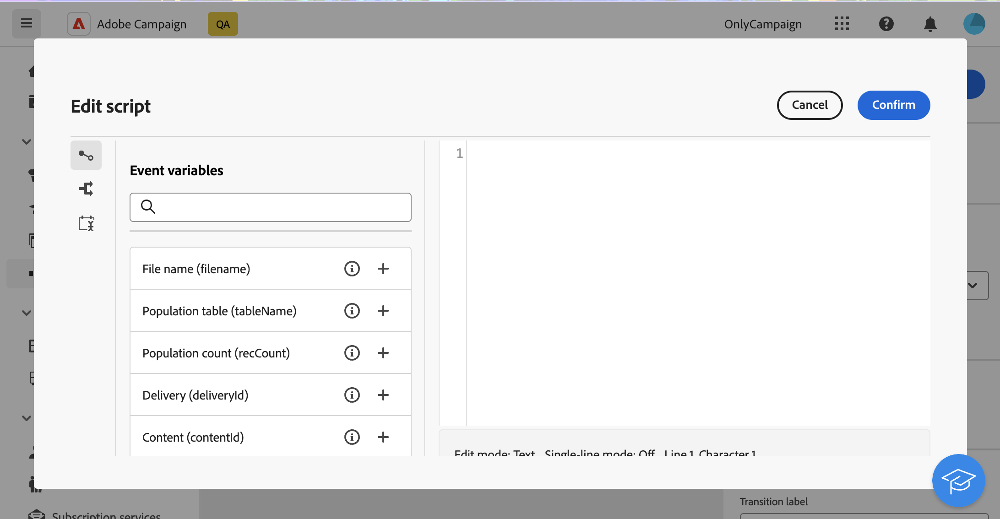

# Extracción de archivos {#extract-file}

>[!CONTEXTUALHELP]
>id="acw_orchestration_extractfile"
>title="Extracción de archivos"
>abstract="La actividad **Extraer archivo** permite exportar datos desde Adobe Campaign en forma de archivo externo. A continuación, los datos se pueden exportar a una ubicación de servidor como SFTP, Cloud Storage o el servidor de Campaign mediante la actividad Transferir archivo."

La actividad **Extraer archivo** es una actividad **Administración de datos**. Utilice esta actividad para exportar datos desde Adobe Campaign en forma de archivo externo. A continuación, los datos se pueden exportar a una ubicación de servidor como SFTP, Cloud Storage o el servidor de Campaign mediante la actividad Transferir archivo.

Para configurar la actividad **Extraer archivo**, agregue una actividad **Extraer archivo** al flujo de trabajo y luego siga los pasos a continuación.

## Configurar el archivo que va a extraer {#extract-configuration}

>[!CONTEXTUALHELP]
>id="acw_orchestration_extractfile_file"
>title="Archivo que extraer"
>abstract="Seleccione el archivo que va a extraer."

La sección **[!UICONTROL Archivo para extraer]** le permite configurar las propiedades del archivo y los datos que desea incluir.

1. En el campo **[!UICONTROL Nombre de archivo]**, escriba el nombre que desee para extraer el archivo.

   Puede personalizar el nombre del archivo mediante variables de evento, condiciones y funciones de fecha y hora. Para ello, haga clic en el icono **[!UICONTROL Abrir cuadro de diálogo de personalización]** para abrir el editor de expresiones. [Aprenda a trabajar con variables de eventos y el editor de expresiones](../event-variables.md).

1. Especifique las columnas que desea presentar en el archivo extraído. Para ello, siga estos pasos:

   1. Haga clic en **[!UICONTROL Agregar columna de salida]**.
   1. Seleccione el atributo que desea mostrar en la columna y, a continuación, confirme la selección. Los atributos disponibles dependen de la dimensión objetivo del flujo de trabajo. [Aprenda a seleccionar atributos y agregarlos a favoritos](../../get-started/attributes.md).
   1. Una vez agregada la columna, puede cambiar su **[!UICONTROL Etiqueta]** y modificar el **[!UICONTROL Atributo]** asociado.
   1. Si desea aplicar una transformación a los valores de la columna, selecciónela en la lista desplegable. Por ejemplo, puede cambiar todos los valores de la columna seleccionada a mayúsculas.

1. Repita estos pasos para agregar tantas columnas como sea necesario en el archivo de extracción. Para cambiar la posición de una columna, utilice las flechas arriba y abajo.

1. Para quitar todas las filas duplicadas del archivo extraído, active la opción **[!UICONTROL Quitar filas duplicadas (Lista)]**.

1. Para ordenar el archivo extraído según un atributo, active la opción **[!UICONTROL Habilitar ordenación]** y, a continuación, elija el atributo por el que desea ordenar el archivo, junto con el método de ordenación deseado (ascendente o descendente). Puede ordenar cualquier atributo de la dimensión de segmentación actual, independientemente de si se ha agregado o no a las columnas del archivo.

## Configurar el formato del archivo extraído {#file}

>[!CONTEXTUALHELP]
>id="acw_orchestration_extractfile_destinationformat"
>title="Formato de destino"
>abstract="Seleccione las distintas opciones para configurar el formato del archivo extraído."

La sección de formato **[!UICONTROL Destino]** le permite configurar el formato del archivo extraído.

1. Elija **[!UICONTROL Formato de salida]** para el archivo extraído: **Texto**, **Texto con columnas de ancho fijo**, **CSV (Excel)** o **XML**.

1. Haga clic en el botón **[!UICONTROL Formato de extracción]** para acceder a opciones específicas relacionadas con el formato seleccionado. Expanda la sección siguiente para obtener más información.

+++ Opciones de formato de extracción disponibles

   * **[!UICONTROL Usar primera línea como encabezado de columna]** (formato de texto/CSV (Excel)): Active esta opción para usar la primera columna como encabezado.
   * **[!UICONTROL Separador de columnas]** (formato de texto): especifique el carácter que se va a utilizar como separador de columnas en el archivo de salida.
   * **[!UICONTROL Delimitador de cadenas]** (formato de texto): especifique cómo delimitar cadenas en el archivo de salida.
   * **[!UICONTROL Fin de línea]** (formato de texto): especifique cómo delimitar el final de líneas en el archivo de salida.
   * **[!UICONTROL Codificación]**: elija la codificación del archivo de salida.
   * **[!UICONTROL Separadores y formato de fecha]**: especifique el formato de las fechas en el archivo de salida.
   * **[!UICONTROL Formato de número]**: especifique el formato de los números en el archivo de salida.
   * **[!UICONTROL Exportar etiquetas en lugar de valores internos de enumeraciones]**: Active esta opción si exporta valores de enumeración y desea recuperar etiquetas de columna, que son más fáciles de entender, en lugar de identificadores internos.

+++

   

## Añadir una fase posprocessamiento {#script}

>[!CONTEXTUALHELP]
>id="acw_orchestration_extractfile_postprocessing"
>title="Posprocesamiento"
>abstract="Defina un paso de posprocesamiento para aplicar, como compresión o encriptado."

El **[!UICONTROL script de modificación de exportación]** le permite aplicar una fase de procesamiento para ejecutarla durante la extracción de datos, como el cifrado o el comprimir. Para ello, haga clic en el botón **[!UICONTROL Editar script]**.

Se abre el editor de expresiones, que permite introducir el comando que se aplicará al archivo. El panel lateral izquierdo proporciona sintaxis predefinida que puede aprovechar para crear el script. [Aprenda a trabajar con variables de eventos y el editor de expresiones](../event-variables.md).

## Opciones adicionales {#additiona-options}

>[!CONTEXTUALHELP]
>id="acw_orchestration_extractfile_outbound"
>title="Transición saliente"
>abstract="Alternar la opción **Generar una transición saliente** para añadir una transición saliente después de la actividad actual."

>[!CONTEXTUALHELP]
>id="acw_orchestration_extractfile_error"
>title="Errores de proceso"
>abstract="Alternar la opción **Errores de proceso** para añadir una transición saliente que contenga errores."

Una vez configurada la extracción del archivo de salida, hay disponibles opciones adicionales relacionadas con las transiciones y la administración de errores:

* **[!UICONTROL Generar transición saliente]**: Active esta opción para agregar una transición saliente y configurar su etiqueta.
* **[!UICONTROL No generar un archivo si la transición entrante está vacía]**: active esta opción para omitir la extracción de archivos si la transición entrante no contiene datos.
* **[!UICONTROL Error de proceso]**: Active esta opción para agregar una transición saliente si se encuentra algún error durante la extracción de archivos.

## Ejemplo {#example}

En el ejemplo siguiente, una actividad **Generar audiencia** va seguida de una actividad **Extraer archivo** para extraer todos los perfiles de destino en un archivo CSV.

* El campo **[!UICONTROL Nombre de archivo]** está configurado para incluir la fecha de la extracción.

  

* Las columnas se agregan para mostrar el nombre y los apellidos de los perfiles, sus ID de cliente y las fechas de creación en la base de datos.

  