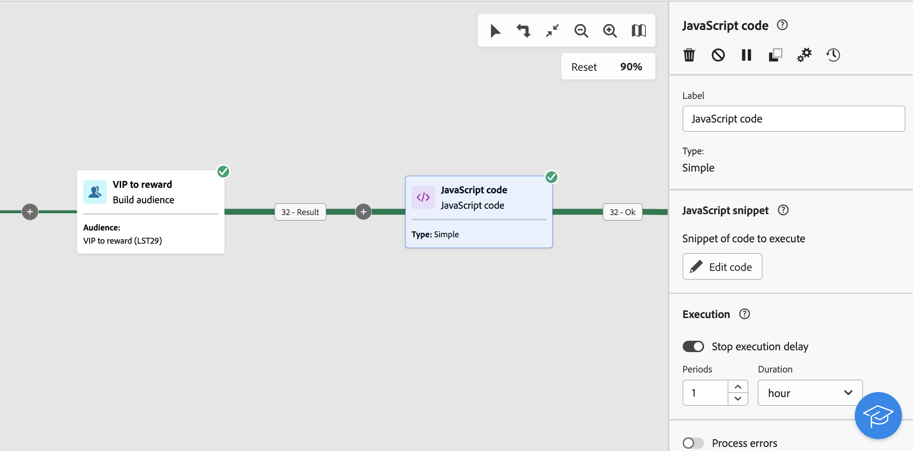

# Código JavaScript {#javascript-code}

>[!CONTEXTUALHELP]
>id="acw_orchestration_javascript"
>title="Código JavaScript"
>abstract="La actividad de **Código JavaScript** le permite ejecutar una secuencia de comandos JavaScript en el contexto de un flujo de trabajo. Esto le permite realizar acciones o recopilar información de la base de datos. Utilice actividades de código JavaScript **sencillo** para ejecutar un fragmento de código en la ejecución del flujo de trabajo. **Avanzadas** Las actividades de código JavaScript permiten realizar operaciones más complejas ejecutando dos fragmentos de código diferentes en orden secuencial. La primera vez que se inicia el flujo de trabajo, se ejecuta la primera llamada. Cada vez que se vuelve a ejecutar el flujo de trabajo, se ejecuta el código definido en la segunda llamada."

>[!CONTEXTUALHELP]
>id="acw_orchestration_javascript_snippet"
>title="Fragmento de JavaScript"
>abstract="Defina la secuencia de comandos que se ejecutará al ejecutar la actividad. Si está configurando una actividad de JavaScript **avanzada**, es necesario editar dos fragmentos de código: el primer código de llamada que se ejecuta en la primera ejecución del flujo de trabajo y el siguiente código de llamada que se ejecuta en las siguientes llamadas del flujo de trabajo."

>[!CONTEXTUALHELP]
>id="acw_orchestration_javascript_execution"
>title="Ejecución de Javascript"
>abstract="Configure el retraso de ejecución para detener la actividad después de un periodo de ejecución. De forma predeterminada, la fase de ejecución no puede exceder de 1 hora. Tras este retraso, el proceso se anula con un mensaje de error y la ejecución de la actividad falla. Para omitir este límite, establezca el valor en 0."

>[!CONTEXTUALHELP]
>id="acw_orchestration_javascript_transition"
>title="Transición de JavaScript"
>abstract="Si desea añadir varias transiciones de salida, haga clic en el botón **[!UICONTROL Añadir transiciones]**. Esto le permite, por ejemplo, activar una transición específica basada en una condición específica definida en la actividad del código JavaScript. Esta opción solo está disponible en las actividades de código JavaScript **avanzadas**."

El **Código JavaScript** la actividad es una **Administración de datos** actividad. Utilice esta actividad para ejecutar un script JavaScript en el contexto de un flujo de trabajo. Esto le permite recopilar información de la base de datos o realizar otras operaciones complejas.

## Configuración de la actividad JavaScript code {#javascript-code-configuration}

Siga estos pasos para configurar el **Código JavaScript** actividad:

1. Añadir un **Código JavaScript** en el flujo de trabajo.

1. Elija el tipo de actividad que desea crear:

   * **Sencilla**: ejecute un fragmento de código.
   * **Avanzadas**: Esta opción le permite realizar operaciones más avanzadas ejecutando dos fragmentos de código diferentes. [Obtenga información sobre cómo configurar una actividad de JavaScript avanzada](#advanced)

   >[!NOTE]
   >
   >Con la interfaz de usuario web de Campaign, hemos consolidado dos actividades en una al combinar ambas **Sencilla** y **Avanzadas** Funciones del código JavaScript. Esta consolidación no afecta a la funcionalidad de la actividad de ninguna manera.

1. Confirme y haga clic en **[!UICONTROL Editar código]** para abrir el editor de expresiones. El panel izquierdo proporciona sintaxis predefinida que puede aprovechar para crear su código, incluidas variables de evento. [Aprenda a trabajar con variables de eventos y el editor de expresiones](../event-variables.md)

   

1. En el **[!UICONTROL Ejecución]** , configure el retraso para detener la actividad después de un periodo de ejecución. De forma predeterminada, la fase de ejecución no puede exceder de 1 hora. Tras este retraso, el proceso se anula con un mensaje de error y la ejecución de la actividad falla. Para omitir este límite, establezca el valor en 0.

   

1. Alternar en **[!UICONTROL Errores de proceso]** opción para mantener los errores que se producen durante la ejecución del script en una transición de salida adicional.

## Actividades de código JavaScript avanzado {#advanced}

Las actividades avanzadas de JavaScript le permiten realizar operaciones complejas. Le permite hacer lo siguiente:

* Ejecute dos fragmentos de código diferentes. El primer fragmento de código se ejecuta la primera vez que se inicia el flujo de trabajo. Cada vez que se vuelve a ejecutar el flujo de trabajo, se ejecuta el fragmento de código definido en la segunda llamada.
* Añada varias transiciones de salida con las que pueda interactuar dinámicamente mediante una secuencia de comandos.

Para configurar una actividad de Advanced JavaScript code, siga estos pasos:

1. Seleccione el **Avanzadas** escriba y, a continuación, configure los fragmentos de código para ejecutar:

   * Clic **[!UICONTROL Editar el código de la primera llamada]** para definir la secuencia de comandos que se ejecutará durante la primera llamada.
   * Clic **[!UICONTROL Editar código de llamada siguiente]** para definir la secuencia de comandos que se ejecutará durante las siguientes llamadas del flujo de trabajo. (opcional)

1. Para añadir una o varias transiciones de salida, haga clic en **[!UICONTROL Añadir transiciones]** y especifique una etiqueta y un nombre interno para cada transición.

   En este ejemplo hemos configurado dos transiciones activadas por la secuencia de comandos en el fragmento de código en función de condiciones específicas.

   

1. Complete la configuración de la actividad e inicie el flujo de trabajo.

## Ejemplo {#javascript-code-example}

### Inicializar variables según la población entrante {#example1}

Este ejemplo muestra cómo inicializar una variable en función del número de perfiles objetivo por un flujo de trabajo.



VIP A continuación, se muestran perfiles de segmentación de perfiles de la base de datos de. Queremos crear una variable denominada &quot;canal&quot; con un valor que dependa del número de perfiles objetivo por la actividad Generar audiencia:

* Si hay más de 1000 perfiles objetivo, inicialice la variable con el valor &quot;email&quot;.
* De lo contrario, inícielo con el valor &quot;sms&quot;.

Para ello, siga estos pasos:

1. Añadir un **Código JavaScript** actividad con el tipo **Sencilla** después de **Crear audiencia** actividad.

1. Clic **Editar código** y configure el fragmento de código como se muestra a continuación:

   ```
   if (vars.recCount > 1000)
       vars.channel ="email"
   else
       vars.channel = "sms"
   ```

1. Inicie el flujo de trabajo. La variable &quot;channel&quot; se crea con el valor &quot;email&quot; o &quot;sms&quot;, según el número de perfiles objetivo del **Crear audiencia** actividad.

### Déclencheur transiciones basadas en el valor de una variable {#example2}

Este ejemplo muestra cómo almacenar en déclencheur una transición en función del valor de una variable.


En este caso, el flujo de trabajo comienza con una **Señal externa** actividad, en la que una variable (`interest`) se pasa desde otro flujo de trabajo. El valor de la variable es &quot;running&quot; o &quot;yoga&quot;, según las operaciones de filtrado realizadas en el flujo de trabajo inicial.

Queremos almacenar en déclencheur diferentes transiciones en el flujo de trabajo, en función del valor de la variable.

Para ello, siga estos pasos:

1. Añadir un **Código JavaScript** actividad después de la actividad Señal externa con el tipo **Avanzadas**.

1. Añada dos transiciones: una para cada valor de variable posible (&quot;running&quot;, &quot;yoga&quot;).

1. Clic **Editar el código de la primera llamada** y configure el fragmento de código como se muestra a continuación:

   ```
   if (vars.interest=="running")
       task.postEvent(task.transitionByName("running"));
   else
       task.postEvent(task.transitionByName("yoga"));
   ```

1. Complete la configuración de cada transición para adaptarla a sus necesidades e inicie el flujo de trabajo. Se activa una de las dos transiciones de salida, en función del valor de `interest` que se ha pasado a través de **Señal externa** actividad.
