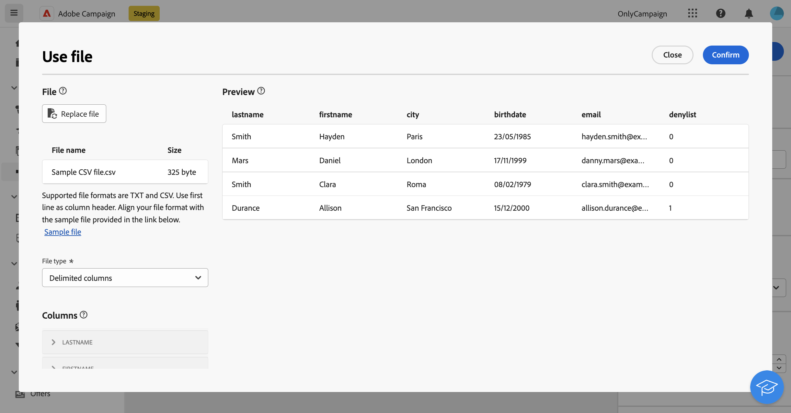

# Carga de archivo {#load-file}

>[!CONTEXTUALHELP]
>id="acw_orchestration_loadfile"
>title="Actividad Cargar archivo"
>abstract="La actividad **Cargar archivo** es una actividad de **Administración de datos**. Utilice esta actividad para trabajar con los datos almacenados en un archivo externo. Los perfiles y los datos no se añaden a la base de datos, pero todos los campos del archivo de entrada están disponibles para la personalización, o para actualizar perfiles o cualquier otra tabla. "

>[!CONTEXTUALHELP]
>id="acw_orchestration_loadfile_outboundtransition"
>title="Rechazar transición de salida de administración"
>abstract="Rechazar transición de salida de administración"

>[!CONTEXTUALHELP]
>id="acw_orchestration_loadfile_outboundtransition_reject"
>title="Rechazar transición de salida de administración para rechazos"
>abstract="Rechazar transición de salida de administración para rechazos"

La actividad **Cargar archivo** es una actividad de **Administración de datos**. Utilice esta actividad para trabajar con perfiles y datos almacenados en un archivo externo. Los perfiles y los datos no se añaden a la base de datos, pero todos los campos del archivo de entrada están disponibles para [personalización](../../personalization/gs-personalization.md), o para actualizar perfiles o cualquier otra tabla.

>[!NOTE]
>Los formatos de archivo admitidos son: texto (TXT) y valor separado por comas (CSV). Puede cargar archivos con un tamaño máximo de 50 MB.

Esta actividad se puede utilizar con un [Reconciliación](reconciliation.md) actividad para vincular datos no identificados a recursos existentes. Por ejemplo, la variable **Cargar archivo** la actividad se puede colocar antes de una **Reconciliación** actividad si importa datos no estándar en la base de datos.

## Configuración de la actividad Cargar archivo {#load-configuration}

El **Cargar archivo** la configuración de actividad incluye dos pasos. En primer lugar, debe definir la estructura de archivos esperada cargando un archivo de muestra. Una vez hecho esto, puede especificar el origen del archivo cuyos datos se importarán. Siga los pasos a continuación para configurar la actividad.

### Configurar el archivo de muestra {#sample}

>[!CONTEXTUALHELP]
>id="acw_orchestration_loadfile_samplefile"
>title="Archivo de muestra"
>abstract="Para seleccionar la estructura de archivo prevista cargue un archivo de muestra. "

>[!CONTEXTUALHELP]
>id="acw_orchestration_loadfile_formatting"
>title="Formato para la actividad Cargar archivo"
>abstract="En la sección **Formato**, especifique cómo se formatea el archivo para garantizar que los datos se importen correctamente."

>[!CONTEXTUALHELP]
>id="acw_orchestration_loadfile_valueremapping"
>title="Reasignación de valores para la actividad Carga de archivo"
>abstract="Utilice esta opción para asignar valores específicos de los archivos cargados con valores nuevos. Por ejemplo, si la columna contiene valores &quot;True&quot;/&quot;False&quot;, puede añadir una asignación para reemplazar automáticamente esos valores por los caracteres &quot;0&quot;/&quot;1&quot;."

Siga estos pasos para configurar el archivo de muestra utilizado para definir la estructura de archivos esperada:

1. Añadir un **Cargar archivo** en el flujo de trabajo.

1. Seleccione el archivo de muestra que se utilizará para definir la estructura de archivos esperada. Para ello, haga clic en el **Seleccionar archivo** botón en el **[!UICONTROL Archivo de muestra]** y seleccione el archivo local que desea utilizar.

   >[!NOTE]
   >
   >Los datos del archivo de muestra se utilizan para configurar la actividad, pero no se importan. Se recomienda utilizar un archivo de muestra que contenga pocos datos. El formato de archivo debe estar alineado con esto [archivo de muestra](../../audience/file-audience.md#sample-file).

1. Se muestra una vista previa del archivo de muestra, que muestra un máximo de 30 líneas.

1. En el **[!UICONTROL Tipo de archivo]** , especifique si el archivo utiliza columnas delimitadas o de ancho fijo.

   

1. Para los tipos de archivo de columnas delimitadas, utilice la variable **Columnas** para configurar las propiedades de cada columna.

   +++Opciones disponibles para columnas de archivo

   * **[!UICONTROL Etiqueta]**: etiqueta que se mostrará para la columna.
   * **[!UICONTROL Tipo de datos]**: tipo de datos contenidos en la columna.
   * **[!UICONTROL Ancho]** (tipo de datos de cadena): Número máximo de caracteres que se mostrarán en la columna.
   * **[!UICONTROL Transformación de datos]** (tipo de datos de cadena): aplica transformación a los valores contenidos en la columna.
   * **[!UICONTROL Gestión de espacios en blanco]** (tipo de datos de cadena): especifique cómo administrar los espacios contenidos en la columna.
   * **[!UICONTROL Separadores]** (tipos de datos fecha, hora, entero y número)*: especifique los caracteres que se utilizarán como separadores.
   * **[!UICONTROL Permitir valores NULL]**: especifique cómo administrar los valores vacíos en la columna. La opción &quot;Adobe Campaign default&quot; generará un error si hay un valor vacío.
   * **[!UICONTROL Error de procesamiento]** (tipo de datos de cadena): especifique el comportamiento en caso de errores en una de las líneas.
   * **[!UICONTROL Reasignación de valores]**: Esta opción le permite asignar valores específicos con valores nuevos. Por ejemplo, si la columna contiene valores &quot;True&quot;/&quot;False&quot;, puede añadir una asignación para reemplazar automáticamente esos valores por los caracteres &quot;0&quot;/&quot;1&quot;.

+++

1. En la sección **Formato**, especifique cómo se formatea el archivo para garantizar que los datos se importen correctamente.

### Definición del archivo de destino para cargar {#target}

>[!CONTEXTUALHELP]
>id="acw_orchestration_loadfile_targetfile"
>title="Archivo de destino para la actividad Cargar archivo"
>abstract="En la sección **[!UICONTROL Archivo de destino]**, especifique cómo recuperar el archivo para cargarlo en el servidor."

>[!CONTEXTUALHELP]
>id="acw_orchestration_loadfile_nameofthefile"
>title="Nombre del archivo"
>abstract="Especifique el nombre del campo que se va a cargar en el servidor. Haga clic en el icono de **[!UICONTROL Abrir cuadro de diálogo de personalización]** para utilizar el editor de expresiones, incluidas las variables de evento, para calcular el nombre del archivo."

>[!CONTEXTUALHELP]
>id="acw_orchestration_loadfile_targetdb"
>title="Base de datos de destino"
>abstract="Si accede a una actividad **[!UICONTROL Cargar archivo]** que ya se ha configurado en la consola del cliente, hay disponible una sección adicional **[!UICONTROL Base de datos de destino]** si ha configurado la actividad para cargar el archivo en una base de datos externa."

>[!CONTEXTUALHELP]
>id="acw_orchestration_loadfile_command"
>title="Comando Cargar archivo"
>abstract="Permitir el comando arbitrario para el preprocesamiento es un problema de seguridad. Deshabilite la opción de seguridad XtkSecurity_Disable_Preproc para forzar el uso de una lista predefinida de comandos."

>[!CAUTION]
>
>Antes de cargar el archivo de destino, asegúrese de que se adhiera al formato del archivo de muestra. Cualquier discrepancia en el formato de archivo, la estructura de columnas o el número de columnas puede provocar errores durante la ejecución del flujo de trabajo.

Para definir el archivo de destino que se va a cargar, siga estos pasos:

1. En el **[!UICONTROL Archivo de destino]** , especifique la acción que se realizará al recuperar el archivo que se va a cargar en el servidor.

   * **[!UICONTROL Cargar archivo desde el equipo local]**: seleccione el archivo que desea cargar desde el equipo.

   * **[!UICONTROL Especificado en la transición]**: cargue el archivo especificado en la transición entrante procedente de una actividad anterior como **[!UICONTROL Transferir archivo]**.

   * **[!UICONTROL Preprocesar el archivo]**: cargue el archivo especificado en la transición anterior y aplíquele un comando de preprocesamiento como **[!UICONTROL Descompresión]** o **[!UICONTROL Descifrar]**.

   * **[!UICONTROL Calculado]**: Cargue el archivo cuyo nombre se especifica en la variable **[!UICONTROL Nombre de archivo]** field. Haga clic en el icono de **[!UICONTROL Abrir cuadro de diálogo de personalización]** para utilizar el editor de expresiones, incluidas las variables de evento, para calcular el nombre del archivo.

   

   >[!NOTE]
   >
   >Si accede a un **[!UICONTROL Cargar archivo]** actividad de que ya se ha configurado en la consola del cliente, una actividad de **[!UICONTROL Base de datos Target]** Esta sección muestra si ha configurado la actividad para cargar el archivo en una base de datos externa. Permite especificar si desea cargar el archivo en el servidor de Campaign o en la base de datos externa.

### Opciones adicionales {#options}

>[!CONTEXTUALHELP]
>id="acw_orchestration_loadfile_rejectmgt"
>title="Gestión de rechazo para la actividad Cargar archivo"
>abstract="En la sección **Rechazar administración**, especifique cómo debe comportarse la actividad en caso de errores. Puede definir el número máximo de errores que desea permitir y activar la opción **[!UICONTROL Mantener rechazos en un archivo]** para descargar en el servidor un archivo que contenga los errores producidos durante la importación."

>[!CONTEXTUALHELP]
>id="acw_orchestration_loadfile_delete"
>title="Eliminar archivo tras la importación"
>abstract="Active **Eliminar el archivo tras la importación** para eliminar el archivo original del servidor después de importar el archivo."

1. En el **Rechazar administración** , especifique cómo debe comportarse la actividad en caso de errores:

   * En el **[!UICONTROL Número de errores permitidos]** , especifique el número máximo de errores autorizados al procesar el archivo que se va a cargar. Por ejemplo, si el valor se establece en &quot;20&quot;, la ejecución del flujo de trabajo fallará si hay más de 20 errores al cargar el archivo.

   * Para conservar los errores que se produjeron al cargar el archivo, cambie el **[!UICONTROL Mantener rechazos en un archivo]** y especifique el nombre que desee para el archivo en la **[!UICONTROL Archivo de rechazo]** field.

     Después de activar esta opción, se agrega una transición de salida adicional denominada &quot;Complemento&quot; después de la actividad. Cualquier error que se produzca durante la importación se almacenará en el archivo especificado del servidor.

1. Para eliminar el archivo cargado del servidor después de ejecutar el flujo de trabajo, alterne el **[!UICONTROL Eliminar archivo tras importar]** opción.

   

1. Haga clic en **Confirmar** una vez que la configuración sea correcta.

## Ejemplo {#load-example}

Un ejemplo de carga de archivo externo utilizado con el **Reconciliación** la actividad está disponible en [esta sección](reconciliation.md#reconciliation-example).
