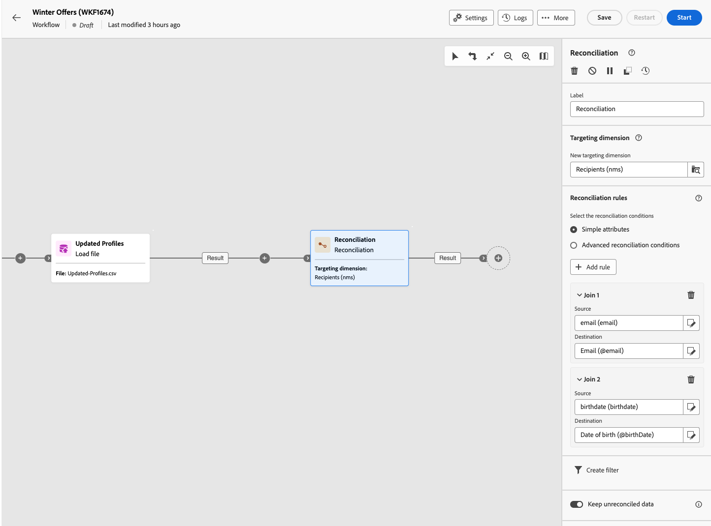

# Reconciliación {#reconciliation}

>[!CONTEXTUALHELP]
>id="acw_orchestration_reconciliation"
>title="Actividad de reconciliación"
>abstract="El **Reconciliación** la actividad es una **Segmentación** actividad que le permite vincular datos no identificados a datos de Campaign existentes. Por ejemplo, la variable **Reconciliación** la actividad se puede colocar después de **Cargar audiencia** actividad para importar datos no estándar en la base de datos. En este caso, la variable **Reconciliación** La actividad permite definir el vínculo entre los datos de la base de datos de Adobe Campaign y los de la tabla externa."


>[!CONTEXTUALHELP]
>id="acw_orchestration_reconciliation_field"
>title="Campo de selección de reconciliación"
>abstract="Campo de selección de reconciliación"


>[!CONTEXTUALHELP]
>id="acw_orchestration_reconciliation_condition"
>title="Condición de creación de reconciliación"
>abstract="Condición de creación de reconciliación"

>[!CONTEXTUALHELP]
>id="acw_orchestration_reconciliation_complement"
>title="Complemento de generación de reconciliación"
>abstract="Complemento de generación de reconciliación"


El **Reconciliación** la actividad es una **Segmentación** actividad que le permite vincular datos no identificados a recursos existentes. Por ejemplo, la variable **Reconciliación** la actividad se puede colocar después de **Cargar audiencia** actividad para importar datos no estándar en la base de datos. En este caso, la variable **Reconciliación** La actividad permite definir el vínculo entre los datos de la base de datos de Adobe Campaign y los de la tabla de trabajo.


## Prácticas recomendadas {#reconciliation-best-practices}

Mientras que el **Enriquecimiento** La actividad de le permite definir datos adicionales para procesarlos en el flujo de trabajo (puede utilizar un **Enriquecimiento** actividad para combinar datos procedentes de varios conjuntos o para crear vínculos a un recurso temporal), **Reconciliación** La actividad le permite vincular datos no identificados a recursos existentes.

>[!NOTE]
>La operación de reconciliación implica que los datos de las dimensiones vinculadas ya están en la base de datos.  Por ejemplo, si importa un archivo de compras que muestre qué producto se compró, a qué hora, por qué cliente, etc., el producto y el cliente ya deben existir en la base de datos.
>

## Configuración de la actividad de reconciliación {#reconciliation-configuration}


>[!CONTEXTUALHELP]
>id="acw_orchestration_reconciliation_targeting"
>title="Dimensión de segmentación"
>abstract="Seleccione la nueva dimensión objetivo. Una dimensión permite definir la población objetivo: destinatarios, suscriptores de la aplicación, operadores, suscriptores, etc. De forma predeterminada, está seleccionada la dimensión de segmentación actual."

>[!CONTEXTUALHELP]
>id="acw_orchestration_reconciliation_rules"
>title="Reglas de reconciliación"
>abstract="Seleccione los campos de reconciliación que desee utilizar para la anulación de duplicación. Se pueden utilizar uno o más criterios de reconciliación."

>[!CONTEXTUALHELP]
>id="acw_orchestration_reconciliation_targeting_selection"
>title="Seleccionar la dimensión de segmentación"
>abstract="Seleccione la dimensión de segmentación con la que se reconciliarán los datos de entrada."
>additional-url="https://experienceleague.adobe.com/docs/campaign-web/v8/audiences/about-recipients.html?lang=en#targeting-dimensions" text="Dimensiones de segmentación"

>[!CONTEXTUALHELP]
>id="acw_orchestration_keep_unreconciled_data"
>title="Mantener datos no reconciliados"
>abstract="De forma predeterminada, los datos no reconciliados se mantienen en la transición saliente y están disponibles en la tabla de trabajo para su uso futuro. Para eliminar los datos no reconciliados, desactive la **Mantener datos no reconciliados** opción."


>[!CONTEXTUALHELP]
>id="acw_orchestration_reconciliation_attribute"
>title="Atributo de reconciliación"
>abstract="Seleccione el atributo que desea utilizar para conciliar los datos y haga clic en Confirmar."

Siga estos pasos para configurar el **Reconciliación** actividad:

1. Arrastrar y soltar una **Reconciliación** en el flujo de trabajo. Esta actividad debe añadirse después de una transición que contenga una población cuya dimensión de segmentación no provenga directamente de Adobe Campaign.

1. Seleccione la nueva dimensión objetivo. Una dimensión permite definir la población objetivo: destinatarios, suscriptores de la aplicación, operadores, suscriptores, etc. Obtenga más información acerca de las dimensiones de segmentación en [esta página](../../audience/about-recipients.md#targeting-dimensions).

1. Seleccione los campos de reconciliación que desee utilizar para la anulación de duplicación. Se pueden utilizar uno o más criterios de reconciliación.

   1. Para utilizar atributos para reconciliar datos, seleccione **Atributos simples** opción. El **Origen** field enumera los campos disponibles en la transición de entrada que se van a conciliar. El **Destino** field corresponde a los campos de la dimensión de segmentación seleccionada. Los datos se concilian cuando el origen y el destino son iguales. Por ejemplo, seleccione la opción **Correo electrónico** para deduplicar perfiles en función de su dirección de correo electrónico.

      Para añadir otros criterios de reconciliación, haga clic en **Añadir regla** botón. Si se especifican varias condiciones de vínculo, todas deben verificarse para que los datos puedan vincularse.

      

   1. Para utilizar otros atributos para reconciliar datos, seleccione la opción **Condiciones de reconciliación avanzadas** opción. A continuación, puede crear su propia condición de reconciliación utilizando el modelador de consultas. Aprenda a utilizar el modelador de consultas en [esta sección](../../query/query-modeler-overview.md).

1. Puede filtrar los datos para conciliarlos mediante el **Crear filtro** botón. Esto permite crear una condición personalizada utilizando [modelador de consultas](../../query/query-modeler-overview.md).

De forma predeterminada, los datos no conciliados se mantienen en la transición saliente y están disponibles en la tabla de trabajo para su uso futuro. Para eliminar los datos no reconciliados, desactive la **Mantener datos no reconciliados** opción.

## Ejemplo {#reconciliation-example}

En el siguiente ejemplo se muestra un flujo de trabajo que crea una audiencia de perfiles directamente desde un archivo importado que contiene nuevos clientes. Se compone de las siguientes actividades:

El flujo de trabajo está diseñado de la siguiente manera:


Se crea con las siguientes actividades:

* Una actividad de [Cargar archivos](load-file.md) carga un archivo que contiene datos de perfiles extraídos de una herramienta externa.

  Por ejemplo:

  ```
  lastname;firstname;email;birthdate;
  JACKMAN;Megan;megan.jackman@testmail.com;07/08/1975;
  PHILLIPS;Edward;phillips@testmail.com;09/03/1986;
  WEAVER;Justin;justin_w@testmail.com;11/15/1990;
  MARTIN;Babe;babeth_martin@testmail.net;11/25/1964;
  REESE;Richard;rreese@testmail.com;02/08/1987;
  ```

* A **Reconciliación** actividad que identifica los datos entrantes como perfiles, utilizando el **email** y **Fecha de nacimiento** como criterios de reconciliación.

  

* A [Guardar audiencia](save-audience.md) actividad para crear una nueva audiencia basada en estas actualizaciones. También puede reemplazar el **Guardar audiencia** actividad de un **Fin** actividad si no es necesario crear o actualizar una audiencia específica. Los perfiles de destinatario se actualizan en cualquier caso al ejecutar el flujo de trabajo.


## Compatibilidad {#reconciliation-compat}

El **Reconciliación** La actividad no existe en la consola del cliente. Todo **Enriquecimientos** las actividades creadas en la consola de cliente con las opciones de reconciliación habilitadas se muestran como **Reconciliación** actividades en la IU web de Campaign.
