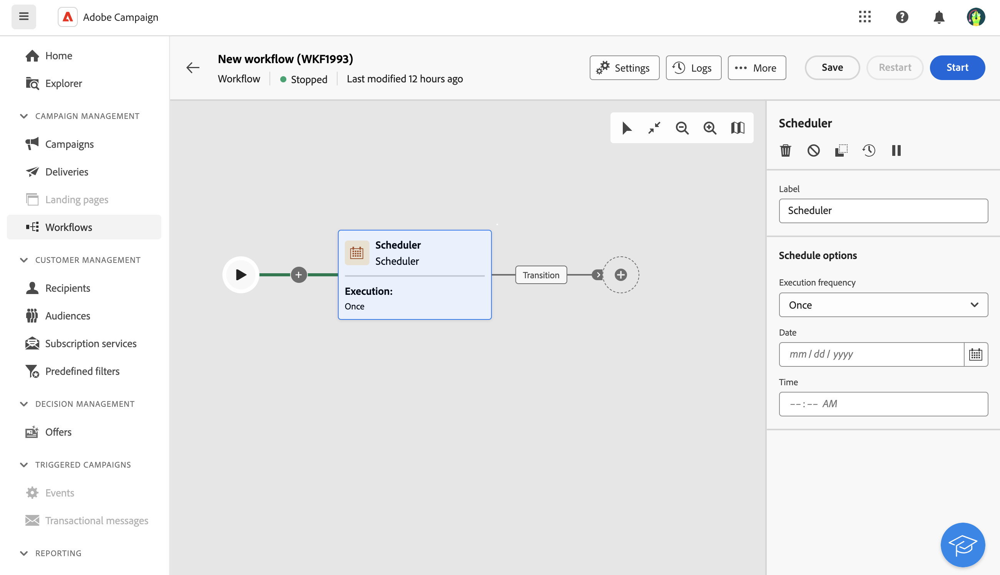

# Planificador {#scheduler}

>[!CONTEXTUALHELP]
>id="acw_orchestration_schedule_options"
>title="Actividad del planificador"
>abstract="El **Planificador** la actividad es una **Control de flujo** actividad. Permite programar cuándo se inicia el flujo de trabajo. Esta actividad debe considerarse como un inicio programado. Solo se puede utilizar como primera actividad del flujo de trabajo."

El **Planificador** la actividad es una **Control de flujo** actividad. Permite programar cuándo se inicia el flujo de trabajo. Esta actividad debe considerarse como un inicio programado. Solo se puede utilizar como primera actividad del flujo de trabajo.

## Prácticas recomendadas

* No planifique un flujo de trabajo para que se ejecute durante más de 15 minutos, ya que podría limitar el rendimiento general del sistema y crear bloques en la base de datos.
* Si desea realizar una entrega con una sola toma en el flujo de trabajo, puede añadir una actividad de planificador y configurarla para que se ejecute **Una**. También puede definir la variable **Programación** en la configuración de la entrega.
* Si desea realizar una entrega recurrente en el flujo de trabajo, debe utilizar un **Planificador** y establezca la frecuencia de ejecución. La actividad de entrega recurrente no permite definir una programación.

## Configuración

Siga estos pasos para configurar el **Planificador** actividad:

1. Añadir un **Planificador** a su flujo de trabajo.

   

1. Configure las variables **Frecuencia de ejecución**:

   * **Una**: el flujo de trabajo se ejecuta una sola vez.

   * **Diario**: el flujo de trabajo se ejecuta a una hora específica una vez al día.

   * **Varias veces al día:** el flujo de trabajo se ejecuta regularmente varias veces al día. Puede configurar ejecuciones en momentos específicos o de forma periódica.

   * **Semanalmente**: el flujo de trabajo se ejecuta en un momento determinado una o varias veces a la semana.

   * **Mensual**: el flujo de trabajo se ejecuta en un momento determinado una o varias veces al mes. Puede seleccionar meses cuando necesite que se ejecute el flujo de trabajo. También puede configurar ejecuciones en días de semana del mes específicos, como el segundo martes de mes.

1. Defina los detalles de ejecución según la frecuencia seleccionada. Los campos de detalle pueden variar según la frecuencia utilizada (tiempo, frecuencia de repetición, días especificados, etc.).

1. Clic **Previsualizar tiempos de lanzamiento** para comprobar la programación de las siguientes diez ejecuciones del flujo de trabajo.

1. Defina el periodo de validez del planificador:

   * **Permanente (nunca caduca)**: el flujo de trabajo se ejecuta según la frecuencia especificada, sin límites en el lapso de tiempo ni número de iteraciones.

   * **Período de validez**: el flujo de trabajo se ejecuta según la frecuencia especificada, hasta una fecha específica. Debe especificar las fechas de inicio y finalización.

>[!NOTE]
>
>Si desea iniciar el flujo de trabajo de inmediato, puede hacer clic en el **Ejecutar tarea pendiente** en la barra de acciones superior del planificador. Este botón solo está disponible cuando se ha iniciado el flujo de trabajo.

Notas:

## Ejemplo

En el siguiente ejemplo, la actividad está configurada para que el flujo de trabajo se ejecute varias veces al día a las 9 y las 12 de la mañana, todos los días de la semana del 1 de octubre de 2023 al 1 de enero de 2024.

